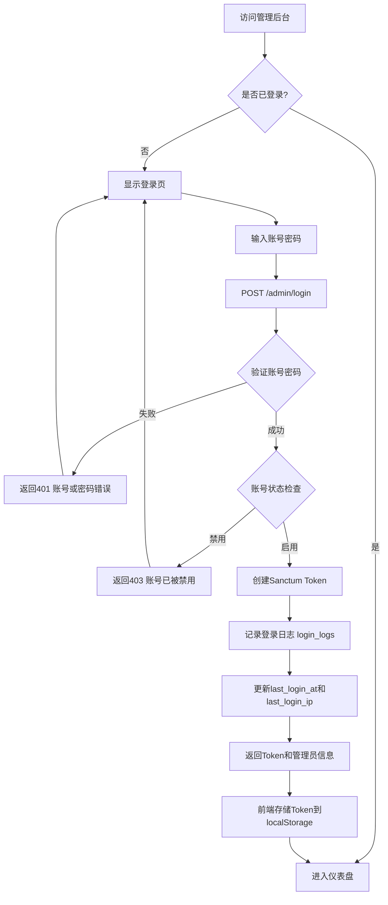
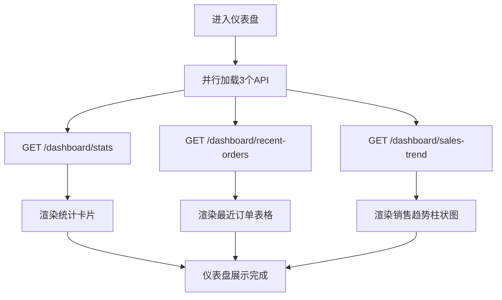
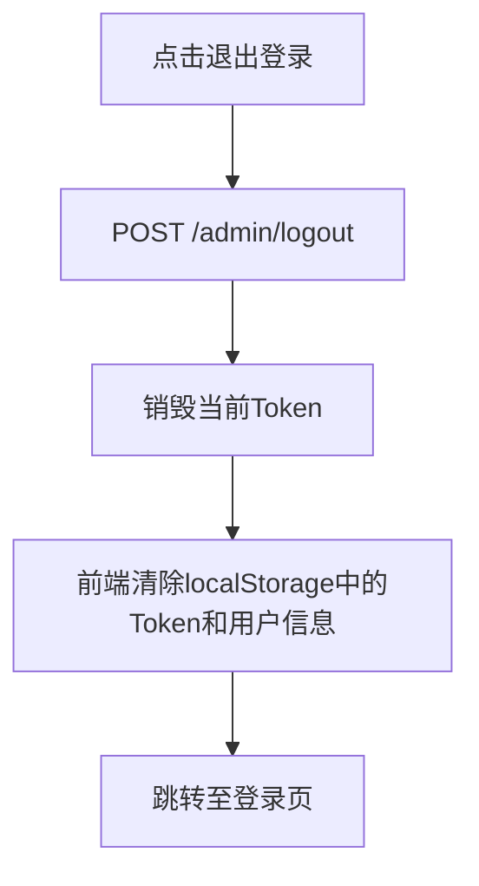

# 管理员认证与仪表盘

## 1. 页面概述

管理员认证与仪表盘模块是TLLOS商城管理后台的入口模块，包含管理员登录认证、个人信息管理、退出登录，以及管理后台首页的数据统计仪表盘。

### 核心功能
- 管理员账号密码登录，返回Sanctum Token
- 获取当前登录管理员信息
- 退出登录，销毁Token
- 仪表盘统计数据（用户/订单/商品/商家/销售额）
- 最近订单列表
- 近7天销售趋势图表
- 待处理事项快捷入口

### 使用场景
1. 管理员访问管理后台，输入账号密码登录
2. 登录成功后进入仪表盘，查看商城整体运营数据
3. 通过待处理事项快速跳转至对应模块处理业务
4. 查看销售趋势，了解近期销售情况
5. 退出登录，确保账号安全

### 前端页面
| 页面 | 路由 | 说明 |
|------|------|------|
| 登录页 | /login | 管理员账号密码登录表单 |
| 仪表盘 | /dashboard | 数据统计仪表盘首页 |

## 2. API接口清单

| 方法 | 路径 | 控制器方法 | 说明 |
|------|------|-----------|------|
| POST | /api/v1/admin/login | AuthController@login | 管理员登录 |
| GET | /api/v1/admin/profile | AuthController@profile | 获取管理员信息 |
| POST | /api/v1/admin/logout | AuthController@logout | 退出登录 |
| GET | /api/v1/admin/dashboard/stats | DashboardController@stats | 仪表盘统计数据 |
| GET | /api/v1/admin/dashboard/recent-orders | DashboardController@recentOrders | 最近订单列表 |
| GET | /api/v1/admin/dashboard/sales-trend | DashboardController@salesTrend | 近7天销售趋势 |

## 3. 请求参数

### 管理员登录
| 参数 | 类型 | 必填 | 说明 |
|------|------|------|------|
| username | string | 是 | 管理员账号 |
| password | string | 是 | 管理员密码 |

### 仪表盘统计
无请求参数

### 最近订单
无请求参数（默认返回最近10条订单）

### 销售趋势
无请求参数（默认返回近7天数据）

## 4. 返回示例

### 登录成功
```json
{
  "code": 200,
  "message": "登录成功",
  "data": {
    "token": "233|67ZDBtHjeCymkhG2GmbcWNr8msHv7TqBBcrm4e3m706d6779",
    "admin": {
      "id": 1,
      "username": "admin",
      "nickname": "超级管理员",
      "avatar": null,
      "role_id": 1
    }
  },
  "timestamp": 1788336086
}
```

### 登录失败
```json
{
  "code": 401,
  "message": "账号或密码错误",
  "data": null
}
```

### 管理员信息
```json
{
  "code": 200,
  "message": "success",
  "data": {
    "id": 1,
    "username": "admin",
    "nickname": "超级管理员",
    "avatar": null,
    "mobile": null,
    "email": null,
    "role_id": 1
  },
  "timestamp": 1788336086
}
```

### 仪表盘统计
```json
{
  "code": 200,
  "message": "success",
  "data": {
    "total_users": 12,
    "total_orders": 4,
    "total_products": 18,
    "total_merchants": 1,
    "total_sales": "28497.00",
    "today_orders": 0,
    "today_sales": 0,
    "today_new_users": 0,
    "yesterday_orders": 4,
    "yesterday_sales": "28497.00",
    "month_orders": 4,
    "month_sales": "28497.00",
    "pending_orders": 0,
    "pending_after_sales": 0,
    "pending_merchants": 0,
    "pending_withdraws": 1,
    "stock_warning_count": 0
  },
  "timestamp": 1788336086
}
```

### 最近订单
```json
{
  "code": 200,
  "message": "success",
  "data": {
    "list": [
      {
        "id": 9,
        "order_no": "ORD20260901004",
        "total_amount": "14999.00",
        "status": 6,
        "created_at": "2026-09-01 12:56:59",
        "nickname": "测试用户4",
        "mobile": "133001330004",
        "status_text": "已退款",
        "status_type": "danger",
        "customer": "测试用户4"
      }
    ]
  },
  "timestamp": 1788336086
}
```

### 销售趋势
```json
{
  "code": 200,
  "message": "success",
  "data": {
    "days": ["2026-08-27", "2026-08-28", "2026-08-29", "2026-08-30", "2026-08-31", "2026-09-01", "2026-09-02"],
    "sales": [0, 0, 0, 0, 0, "28497.00", 0],
    "orders": [0, 0, 0, 0, 0, 4, 0]
  },
  "timestamp": 1788336086
}
```

### 退出登录
```json
{
  "code": 200,
  "message": "退出成功",
  "data": null
}
```

## 5. HTTP状态码

| 状态码 | 说明 |
|--------|------|
| 200 | 请求成功 |
| 401 | 未认证或Token无效 |
| 403 | 账号已被禁用 |
| 422 | 请求参数验证失败 |

## 6. 字段映射表

### admins表（15字段）
| 字段 | 类型 | 说明 |
|------|------|------|
| id | bigint(20) unsigned | 主键，自增 |
| username | varchar(50) | 管理员账号（唯一） |
| password | varchar(255) | 密码（bcrypt加密） |
| nickname | varchar(50) | 昵称 |
| avatar | varchar(255) | 头像URL |
| mobile | varchar(20) | 手机号 |
| email | varchar(100) | 邮箱 |
| role_id | bigint(20) unsigned | 角色ID |
| status | tinyint(4) | 状态：1启用，0禁用 |
| last_login_at | timestamp | 最后登录时间 |
| last_login_ip | varchar(50) | 最后登录IP |
| remember_token | varchar(100) | 记住我Token |
| created_at | timestamp | 创建时间 |
| updated_at | timestamp | 更新时间 |
| deleted_at | timestamp | 软删除时间 |

### login_logs表（登录日志）
| 字段 | 类型 | 说明 |
|------|------|------|
| id | bigint | 主键 |
| username | varchar(50) | 登录账号 |
| ip | varchar(50) | 登录IP |
| user_agent | varchar(255) | 浏览器UA |
| status | tinyint | 状态：1成功，0失败 |
| type | varchar(20) | 类型：admin/merchant/user |
| created_at | timestamp | 登录时间 |

### 仪表盘统计字段映射
| 展示字段 | 数据来源 | 计算方式 |
|---------|---------|---------|
| total_users | users | COUNT(*) |
| total_orders | orders | COUNT(*) |
| total_products | products | COUNT(*) |
| total_merchants | merchants | COUNT(*) |
| total_sales | orders | SUM(pay_amount) WHERE status>=3 |
| today_orders | orders | COUNT(*) WHERE DATE(created_at)=CURDATE() |
| today_sales | orders | SUM(pay_amount) WHERE DATE(created_at)=CURDATE() |
| today_new_users | users | COUNT(*) WHERE DATE(created_at)=CURDATE() |
| pending_orders | orders | COUNT(*) WHERE status=1 |
| pending_after_sales | order_after_sales | COUNT(*) WHERE status=0 |
| pending_merchants | merchants | COUNT(*) WHERE status=0 |
| pending_withdraws | withdraws | COUNT(*) WHERE status=0 |
| stock_warning_count | products | COUNT(*) WHERE stock <= warning_stock |

## 7. 操作流程

### 管理员登录流程


### 仪表盘数据加载流程


### 退出登录流程


## 8. 权限控制

- 认证方式：Sanctum Token认证
- 路由中间件：auth:sanctum（登录、退出、仪表盘接口均需认证）
- 登录接口：无需认证，公开访问
- 当前权限模型：登录管理员可访问所有管理后台功能
- 无细粒度权限点（permissions表不存在）
- 账号状态控制：status=0的管理员无法登录，返回403

### Token存储
- 前端localStorage key：`tllos_admin_token`
- 用户信息key：`tllos_admin_user`
- 请求头：`Authorization: Bearer {token}`

## 9. 关联模块

### 依赖模块
| 模块 | 依赖内容 | 关联字段 |
|------|---------|---------|
| 用户管理 | 用户总数统计 | users COUNT |
| 订单管理 | 订单总数/销售额/最近订单 | orders |
| 商品管理 | 商品总数/库存预警 | products |
| 商家管理 | 商家总数/待审核商家 | merchants |
| 售后管理 | 待处理售后 | order_after_sales |
| 财务管理 | 待处理提现 | withdraws |

### 被依赖模块
| 模块 | 使用方式 |
|------|---------|
| 所有管理后台模块 | 管理员登录认证是访问所有模块的前提 |
| 系统配置 | system-info接口提供系统信息展示 |

## 10. 验收清单

### 功能验收
- [x] 管理员登录接口正常（POST /admin/login）
- [x] 登录成功返回Token和管理员信息
- [x] 登录失败返回401错误
- [x] 禁用账号登录返回403错误
- [x] 获取管理员信息接口正常（GET /admin/profile）
- [x] 退出登录接口正常（POST /admin/logout）
- [x] 仪表盘统计接口正常（GET /admin/dashboard/stats）
- [x] 最近订单接口正常（GET /admin/dashboard/recent-orders）
- [x] 销售趋势接口正常（GET /admin/dashboard/sales-trend）
- [x] 登录日志记录正常（login_logs表）
- [x] 最后登录时间和IP更新正常

### 前端验收
- [x] 登录页正常展示（左右分栏设计）
- [x] 登录表单验证（账号/密码必填）
- [x] 登录成功跳转仪表盘
- [x] 登录失败显示错误提示
- [x] 仪表盘统计卡片正常渲染（4个卡片）
- [x] 待处理事项正常渲染（6个快捷入口）
- [x] 最近订单表格正常渲染
- [x] 销售趋势柱状图正常渲染（已修复补充）
- [x] 系统信息正常展示
- [x] 未登录访问自动跳转登录页
- [x] 退出登录清除Token并跳转登录页

### 数据验收
- [x] admins表结构完整（15字段）
- [x] admins表有默认管理员账号（admin/admin123）
- [x] login_logs表正常记录登录日志
- [x] 仪表盘统计数据与各模块表数据一致

### 权限验收
- [x] 登录接口无需认证
- [x] 其他接口需auth:sanctum认证
- [x] 无效Token返回401
- [x] 禁用账号无法登录

## 11. 常见问题

| 问题 | 原因 | 解决方案 |
|------|------|----------|
| 登录提示"账号或密码错误" | 账号或密码不正确 | 确认账号密码，默认账号admin/admin123 |
| 登录提示"账号已被禁用" | 管理员status=0 | 在数据库中更新admins.status=1 |
| 访问仪表盘跳转登录页 | Token不存在或已失效 | 重新登录获取Token |
| 仪表盘数据不更新 | 前端缓存或后端缓存 | 清理浏览器缓存，执行php artisan cache:clear |
| 销售趋势图表不显示 | 前端未调用sales-trend接口 | 已修复，仪表盘已添加销售趋势图表 |
| 系统信息显示"H5" | 描述未更新 | 已修复，更新为"PC响应式 / 小程序 / Flutter APK" |
| 登录日志IP显示127.0.0.1 | 服务器内部请求 | 正常现象，外部请求会显示真实IP |
| Token过期时间 | Sanctum Token默认不过期 | 如需设置过期时间，在Sanctum配置中设置expiration |
