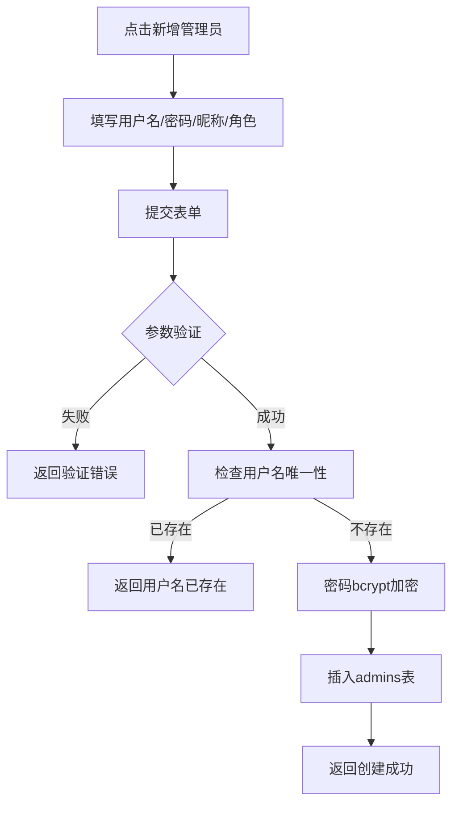
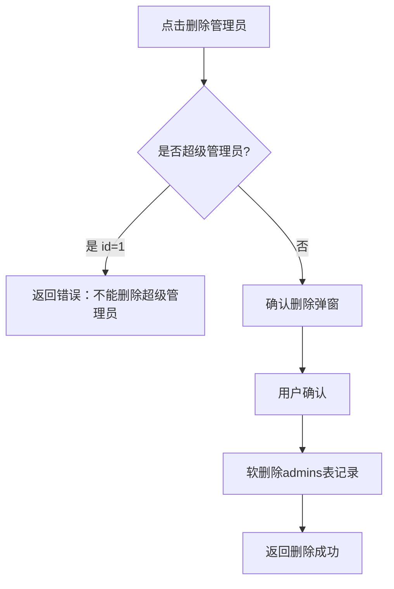
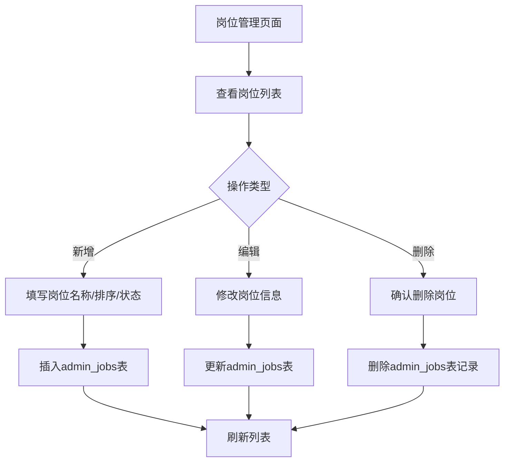

# 管理员与岗位管理

## 1. 页面概述

管理员与岗位管理模块用于管理后台系统的管理员账号和岗位设置。管理员可创建、编辑、删除后台管理员账号，分配角色，设置状态；岗位管理用于定义组织架构中的岗位名称和排序。

### 核心功能
- 管理员账号的增删改查
- 管理员角色分配
- 管理员状态启用/禁用
- 超级管理员删除保护
- 岗位的增删改查
- 岗位排序和状态管理

### 使用场景
1. 平台运营需要新增运营人员账号
2. 管理员离职时禁用或删除账号
3. 组织架构调整时新增或修改岗位
4. 分配不同角色给不同管理员

### 前端页面
| 页面 | 路由 | 说明 |
|------|------|------|
| 管理员管理 | /permission/admin | 管理员账号列表和CRUD |
| 岗位管理 | /permission/job | 岗位列表和CRUD |

## 2. API接口清单

### 管理员管理
| 方法 | 路径 | 控制器方法 | 说明 |
|------|------|-----------|------|
| GET | /api/v1/admin/admin-manage | AdminManageController@index | 管理员列表（分页+搜索+角色关联） |
| POST | /api/v1/admin/admin-manage | AdminManageController@store | 新增管理员 |
| PUT | /api/v1/admin/admin-manage/{id} | AdminManageController@update | 编辑管理员 |
| DELETE | /api/v1/admin/admin-manage/{id} | AdminManageController@destroy | 删除管理员（超级管理员不可删除） |

### 岗位管理
| 方法 | 路径 | 控制器方法 | 说明 |
|------|------|-----------|------|
| GET | /api/v1/admin/jobs | JobController@index | 岗位列表 |
| GET | /api/v1/admin/jobs/all | JobController@all | 全部启用岗位（下拉选择用） |
| POST | /api/v1/admin/jobs | JobController@store | 新增岗位 |
| PUT | /api/v1/admin/jobs/{id} | JobController@update | 编辑岗位 |
| DELETE | /api/v1/admin/jobs/{id} | JobController@destroy | 删除岗位 |

## 3. 请求参数

### 管理员列表
| 参数 | 类型 | 必填 | 说明 |
|------|------|------|------|
| page | int | 否 | 页码，默认1 |
| limit | int | 否 | 每页数量，默认20 |
| keyword | string | 否 | 搜索关键词（用户名/昵称） |

### 新增管理员
| 参数 | 类型 | 必填 | 说明 |
|------|------|------|------|
| username | string | 是 | 用户名（唯一） |
| password | string | 是 | 密码（最少6位） |
| nickname | string | 否 | 昵称 |
| role_id | int | 否 | 角色ID |
| status | int | 否 | 状态：1启用，0禁用 |

### 编辑管理员
| 参数 | 类型 | 必填 | 说明 |
|------|------|------|------|
| nickname | string | 否 | 昵称 |
| role_id | int | 否 | 角色ID |
| status | int | 否 | 状态：1启用，0禁用 |
| password | string | 否 | 新密码（不修改留空） |

### 新增岗位
| 参数 | 类型 | 必填 | 说明 |
|------|------|------|------|
| name | string | 是 | 岗位名称 |
| dept_id | int | 否 | 部门ID |
| sort | int | 否 | 排序，默认0 |
| status | int | 否 | 状态：1启用，0禁用 |

### 编辑岗位
| 参数 | 类型 | 必填 | 说明 |
|------|------|------|------|
| name | string | 否 | 岗位名称 |
| sort | int | 否 | 排序 |
| status | int | 否 | 状态：1启用，0禁用 |

## 4. 返回示例

### 管理员列表
```json
{
  "code": 200,
  "message": "success",
  "data": {
    "list": [
      {
        "id": 1,
        "username": "admin",
        "nickname": "超级管理员",
        "avatar": null,
        "mobile": null,
        "email": null,
        "role_id": 1,
        "status": 1,
        "last_login_at": null,
        "last_login_ip": null,
        "created_at": "2026-09-01 03:42:30",
        "updated_at": "2026-09-01 03:42:30",
        "role_name": "超级管理员"
      }
    ],
    "total": 1,
    "page": 1,
    "limit": 20
  },
  "timestamp": 1788338491
}
```

### 新增管理员成功
```json
{
  "code": 200,
  "message": "创建成功",
  "data": { "id": 2 },
  "timestamp": 1788338492
}
```

### 删除超级管理员失败
```json
{
  "code": 400,
  "message": "不能删除超级管理员",
  "data": null,
  "timestamp": 1788338493
}
```

### 岗位列表
```json
{
  "code": 200,
  "message": "success",
  "data": {
    "list": [
      { "id": 1, "name": "超级管理员", "dept_id": null, "sort": 1, "status": 1, "created_at": "2026-09-02 16:40:11", "updated_at": "2026-09-02 16:40:11" },
      { "id": 2, "name": "运营经理", "dept_id": null, "sort": 2, "status": 1, "created_at": "2026-09-02 16:40:11", "updated_at": "2026-09-02 16:40:11" },
      { "id": 3, "name": "商品管理员", "dept_id": null, "sort": 3, "status": 1, "created_at": "2026-09-02 16:40:11", "updated_at": "2026-09-02 16:40:11" }
    ],
    "total": 6
  },
  "timestamp": 1788338492
}
```

## 5. HTTP状态码

| 状态码 | 说明 |
|--------|------|
| 200 | 请求成功 |
| 400 | 业务错误（如不能删除超级管理员） |
| 401 | 未认证 |
| 422 | 请求参数验证失败 |

## 6. 字段映射表

### admins表（15字段）
| 字段 | 类型 | 说明 |
|------|------|------|
| id | bigint(20) unsigned | 主键，自增 |
| username | varchar(50) | 用户名（唯一） |
| password | varchar(255) | 密码（bcrypt加密，列表接口不返回） |
| nickname | varchar(50) | 昵称 |
| avatar | varchar(255) | 头像URL |
| mobile | varchar(20) | 手机号 |
| email | varchar(100) | 邮箱 |
| role_id | bigint(20) unsigned | 角色ID |
| status | tinyint(4) | 状态：1启用，0禁用 |
| last_login_at | timestamp | 最后登录时间 |
| last_login_ip | varchar(50) | 最后登录IP |
| remember_token | varchar(100) | 记住我Token |
| created_at | timestamp | 创建时间 |
| updated_at | timestamp | 更新时间 |
| deleted_at | timestamp | 软删除时间 |

### admin_jobs表（7字段）
| 字段 | 类型 | 说明 |
|------|------|------|
| id | bigint(20) unsigned | 主键，自增 |
| name | varchar(50) | 岗位名称 |
| dept_id | bigint(20) unsigned | 部门ID |
| sort | int(11) | 排序（升序） |
| status | tinyint(4) | 状态：1启用，0禁用 |
| created_at | timestamp | 创建时间 |
| updated_at | timestamp | 更新时间 |

### admin_roles表（7字段）
| 字段 | 类型 | 说明 |
|------|------|------|
| id | bigint(20) unsigned | 主键，自增 |
| name | varchar(50) | 角色名称（唯一） |
| description | varchar(255) | 角色描述 |
| permissions | longtext | 权限配置（JSON） |
| status | tinyint(4) | 状态：1启用，0禁用 |
| created_at | timestamp | 创建时间 |
| updated_at | timestamp | 更新时间 |

### 关联查询字段
| 展示字段 | 数据来源 | 说明 |
|---------|---------|------|
| role_name | admin_roles.name | 角色名称（LEFT JOIN） |

## 7. 操作流程

### 新增管理员流程


### 删除管理员流程


### 岗位管理流程


## 8. 权限控制

- 认证方式：Sanctum Token认证
- 路由中间件：auth:sanctum
- 当前权限模型：登录管理员可访问所有管理功能
- 无细粒度权限点（permissions表不存在）
- 超级管理员保护：id=1的管理员不可删除
- 密码安全：密码使用bcrypt加密存储，列表接口不返回password字段

## 9. 关联模块

### 依赖模块
| 模块 | 依赖内容 | 关联字段 |
|------|---------|---------|
| 权限管理 | 角色列表 | admins.role_id → admin_roles.id |
| 管理员认证 | 登录认证 | admins表 |

### 被依赖模块
| 模块 | 使用方式 |
|------|---------|
| 所有管理后台模块 | 管理员登录认证是访问所有模块的前提 |
| 登录日志 | 记录管理员登录信息 |

## 10. 验收清单

### 功能验收
- [x] 管理员列表接口正常（GET /admin/admin-manage）
- [x] 管理员列表支持分页（page/limit）
- [x] 管理员列表支持关键词搜索（keyword）
- [x] 管理员列表关联角色名称（role_name）
- [x] 管理员列表不返回password字段（安全修复）
- [x] 新增管理员接口正常（POST /admin/admin-manage）
- [x] 新增管理员用户名唯一性验证
- [x] 新增管理员密码bcrypt加密
- [x] 编辑管理员接口正常（PUT /admin/admin-manage/{id}）
- [x] 编辑管理员支持修改密码（留空不修改）
- [x] 删除管理员接口正常（DELETE /admin/admin-manage/{id}）
- [x] 超级管理员删除保护（id=1不可删除）
- [x] 岗位列表接口正常（GET /admin/jobs）
- [x] 全部启用岗位接口正常（GET /admin/jobs/all）
- [x] 新增岗位接口正常（POST /admin/jobs）
- [x] 编辑岗位接口正常（PUT /admin/jobs/{id}）
- [x] 删除岗位接口正常（DELETE /admin/jobs/{id}）

### 前端验收
- [x] 管理员管理页面正常展示（列表+新增+编辑+删除）
- [x] 管理员表单包含用户名/密码/昵称/角色/状态
- [x] 管理员编辑时用户名禁用
- [x] 管理员编辑时密码留空不修改
- [x] 超级管理员不显示删除按钮
- [x] 岗位管理页面正常展示（列表+新增+编辑+删除）
- [x] 岗位表单包含名称/排序/状态
- [x] 删除操作有确认弹窗

### 数据验收
- [x] admins表结构完整（15字段）
- [x] admin_jobs表已创建（7字段，修复Laravel队列表冲突问题）
- [x] admin_roles表结构完整（7字段）
- [x] 默认管理员账号存在（admin/admin123）
- [x] 默认岗位数据已插入（6条：超级管理员/运营经理/商品管理员/订单管理员/财务管理员/客服专员）

### 安全验收
- [x] 密码bcrypt加密存储
- [x] 列表接口不返回password字段
- [x] 超级管理员不可删除
- [x] 所有接口需auth:sanctum认证

## 11. 常见问题

| 问题 | 原因 | 解决方案 |
|------|------|----------|
| 岗位管理操作报错 | JobController原操作Laravel队列jobs表 | 已修复，创建独立admin_jobs表，修改控制器操作表名 |
| 管理员列表返回password | index方法select('a.*')包含password | 已修复，显式指定字段列表，排除password |
| 不能删除超级管理员 | 系统保护机制 | 正常设计，id=1的超级管理员不可删除 |
| 编辑管理员密码未修改 | 留空时不更新password | 正常设计，只有填写新密码时才更新 |
| 新增管理员用户名已存在 | username唯一约束 | 返回验证错误，提示用户名已存在 |
| 岗位列表为空 | admin_jobs表无数据 | 已插入6条默认岗位数据 |
| 角色下拉为空 | admin_roles表无数据 | 需先在角色管理中创建角色 |
