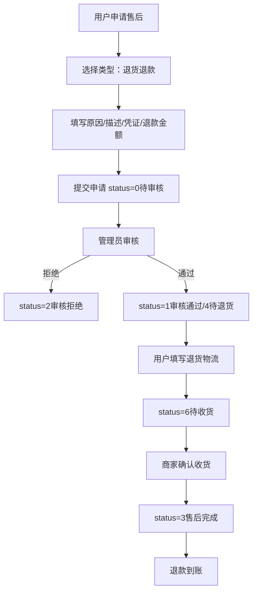
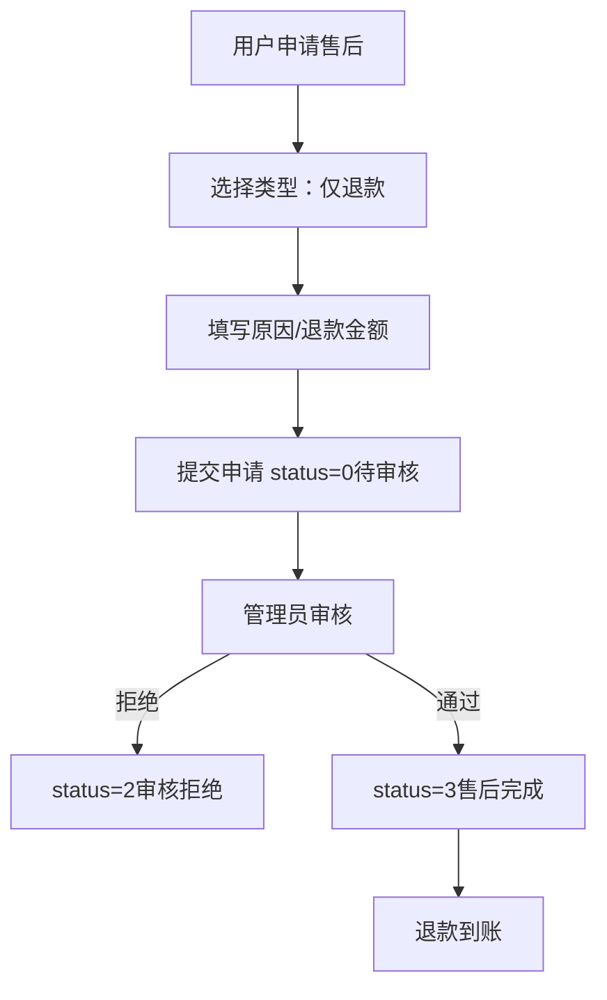
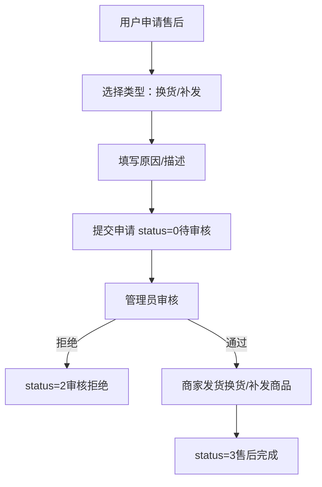
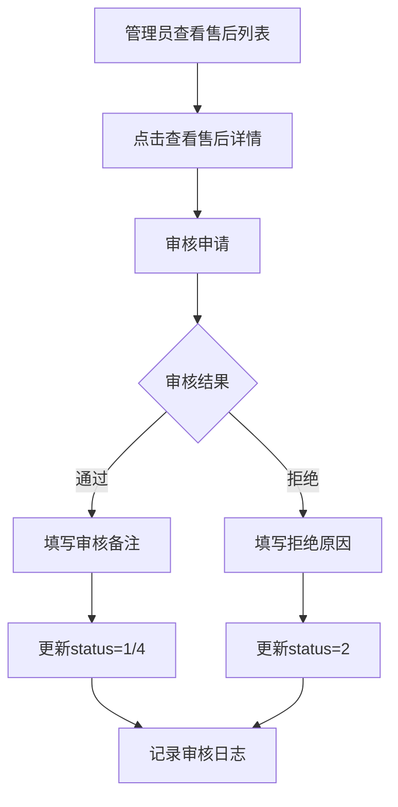

# 售后管理

## 1. 页面概述

售后管理模块用于处理用户的售后申请，包括退货退款、仅退款、换货、补发四种类型。管理员可查看售后列表、审核申请、确认收货、完成售后。用户端可申请售后、填写退货物流、取消售后。

### 核心功能
- 售后申请的审核（通过/拒绝）
- 退货物流确认（用户填写退货单号，商家确认收货）
- 售后完成（退款到账）
- 四种售后类型：退货退款、仅退款、换货、补发
- 完整状态机：待审核→审核通过→待退货→待收货→已完成
- 售后日志记录

### 售后类型
| type | 类型 | 说明 |
|------|------|------|
| 1 | 退货退款 | 用户退回商品，商家退款 |
| 2 | 仅退款 | 用户不退货，商家直接退款 |
| 3 | 换货 | 用户退回商品，商家更换商品 |
| 4 | 补发 | 商家补发商品（不退货） |

### 售后状态
| status | 状态 | 说明 |
|--------|------|------|
| 0 | 待审核 | 用户提交申请，等待管理员审核 |
| 1 | 审核通过 | 管理员审核通过，等待用户退货（退货退款类型） |
| 2 | 审核拒绝 | 管理员审核拒绝，售后关闭 |
| 3 | 售后完成 | 退款完成，售后关闭 |
| 4 | 待退货 | 审核通过，等待用户填写退货物流 |
| 5 | 已取消 | 用户取消售后申请 |
| 6 | 待收货 | 用户已填写退货物流，等待商家确认收货 |

### 使用场景
1. 用户收到商品后申请退货退款
2. 商品有质量问题，用户申请仅退款
3. 商家发错货，用户申请换货
4. 商品漏发，用户申请补发
5. 管理员审核售后申请
6. 商家确认收到退货
7. 退款到账，售后完成

## 2. API接口清单

### 管理端API
| 方法 | 路径 | 控制器方法 | 说明 |
|------|------|-----------|------|
| GET | /api/v1/admin/after-sale | AfterSaleController@index | 售后列表（分页+筛选+统计） |
| GET | /api/v1/admin/after-sale/{id} | AfterSaleController@show | 售后详情 |
| POST | /api/v1/admin/after-sale/{id}/audit | AfterSaleController@audit | 审核售后（通过/拒绝） |
| POST | /api/v1/admin/after-sale/{id}/receive | AfterSaleController@receive | 确认收货 |
| POST | /api/v1/admin/after-sale/{id}/complete | AfterSaleController@complete | 完成售后（退款） |

### 用户端API
| 方法 | 路径 | 控制器方法 | 说明 |
|------|------|-----------|------|
| GET | /api/v1/user/after-sale | UserAfterSaleController@lists | 用户售后列表（需登录） |
| POST | /api/v1/user/after-sale | UserAfterSaleController@add | 申请售后（需登录） |
| GET | /api/v1/user/after-sale/{id} | UserAfterSaleController@detail | 售后详情（需登录） |
| POST | /api/v1/user/after-sale/{id}/cancel | UserAfterSaleController@cancel | 取消售后（需登录） |
| POST | /api/v1/user/after-sale/{id}/return-ship | UserAfterSaleController@returnShip | 填写退货物流（需登录） |
| GET | /api/v1/user/after-sale/reasons/list | UserAfterSaleController@reasons | 售后原因列表（公开） |

## 3. 请求参数

### 管理端售后列表
| 参数 | 类型 | 必填 | 说明 |
|------|------|------|------|
| page | int | 否 | 页码，默认1 |
| limit | int | 否 | 每页数量，默认20 |
| status | int | 否 | 按状态筛选 |
| type | int | 否 | 按类型筛选 |
| keyword | string | 否 | 搜索关键词（订单号） |

### 审核售后
| 参数 | 类型 | 必填 | 说明 |
|------|------|------|------|
| id | int | 是 | 售后ID（URL路径参数） |
| status | int | 是 | 审核结果：1通过，2拒绝 |
| audit_remark | string | 否 | 审核备注 |

### 确认收货
| 参数 | 类型 | 必填 | 说明 |
|------|------|------|------|
| id | int | 是 | 售后ID（URL路径参数） |

### 完成售后
| 参数 | 类型 | 必填 | 说明 |
|------|------|------|------|
| id | int | 是 | 售后ID（URL路径参数） |

### 用户申请售后
| 参数 | 类型 | 必填 | 说明 |
|------|------|------|------|
| order_id | int | 是 | 订单ID |
| order_item_id | int | 否 | 订单商品项ID |
| type | int | 是 | 售后类型：1退货退款，2仅退款，3换货，4补发 |
| reason | string | 是 | 售后原因 |
| description | string | 否 | 问题描述 |
| images | string | 否 | 凭证图片（JSON数组） |
| refund_amount | decimal | 否 | 退款金额 |

### 用户填写退货物流
| 参数 | 类型 | 必填 | 说明 |
|------|------|------|------|
| id | int | 是 | 售后ID（URL路径参数） |
| return_express_company | string | 是 | 退货物流公司 |
| return_express_no | string | 是 | 退货物流单号 |

## 4. 返回示例

### 管理端售后列表
```json
{
  "code": 200,
  "message": "success",
  "data": {
    "list": [
      {
        "id": 2,
        "order_id": 7,
        "order_no": "ORD20260901002",
        "order_item_id": 3,
        "user_id": 3,
        "merchant_id": 1,
        "type": 1,
        "reason": "质量问题",
        "description": "商品表面有划痕，申请退货退款",
        "images": null,
        "refund_amount": "6999.00",
        "status": 3,
        "audit_remark": "同意退货",
        "audit_at": "2026-09-01 13:40:39",
        "completed_at": "2026-09-01 14:00:00",
        "return_express_company": "顺丰速运",
        "return_express_no": "SF1234567890",
        "return_ship_time": "2026-09-01 15:00:00",
        "receive_time": "2026-09-01 16:00:00",
        "refund_time": "2026-09-01 16:30:00",
        "created_at": "2026-09-01 21:40:38",
        "updated_at": "2026-09-01 21:40:38"
      }
    ],
    "total": 3,
    "page": 1,
    "limit": 20
  },
  "timestamp": 1788339209
}
```

### 售后原因列表（公开）
```json
{
  "code": 200,
  "message": "success",
  "data": {
    "reasons": [
      "质量问题",
      "发错货",
      "不想要了",
      "尺寸不合适",
      "描述不符",
      "物流问题",
      "商品损坏",
      "其他原因"
    ]
  },
  "timestamp": 1788339209
}
```

### 审核通过
```json
{
  "code": 200,
  "message": "审核通过",
  "data": null,
  "timestamp": 1788339210
}
```

## 5. HTTP状态码

| 状态码 | 说明 |
|--------|------|
| 200 | 请求成功 |
| 400 | 业务错误（如重复审核、订单状态不允许售后） |
| 401 | 未认证（用户端API需登录） |
| 422 | 请求参数验证失败 |

## 6. 字段映射表

### order_after_sales表（25字段）
| 字段 | 类型 | 说明 |
|------|------|------|
| id | bigint(20) unsigned | 主键，自增 |
| order_id | bigint(20) unsigned | 订单ID |
| order_no | varchar(50) | 订单号（冗余） |
| order_item_id | bigint(20) unsigned | 订单商品项ID |
| user_id | bigint(20) unsigned | 用户ID |
| merchant_id | bigint(20) unsigned | 商家ID |
| type | tinyint(4) | 售后类型：1退货退款，2仅退款，3换货，4补发 |
| reason | varchar(255) | 售后原因 |
| description | text | 问题描述 |
| images | text | 凭证图片（JSON数组） |
| refund_amount | decimal(12,2) | 退款金额 |
| status | tinyint(4) | 状态：0待审核，1审核通过，2审核拒绝，3已完成，4待退货，5已取消，6待收货 |
| audit_remark | varchar(255) | 审核备注 |
| audit_at | timestamp | 审核时间 |
| completed_at | timestamp | 完成时间 |
| return_express_company | varchar(50) | 退货物流公司 |
| return_express_no | varchar(50) | 退货物流单号 |
| return_ship_time | timestamp | 退货发货时间 |
| receive_time | timestamp | 商家收货时间 |
| refund_time | timestamp | 退款时间 |
| created_at | timestamp | 创建时间 |
| updated_at | timestamp | 更新时间 |

### after_sale_logs表（6字段）
| 字段 | 类型 | 说明 |
|------|------|------|
| id | int(11) | 主键，自增 |
| after_sale_id | int(11) | 售后ID |
| admin_id | int(11) | 操作管理员ID |
| action | varchar(50) | 操作类型（audit/receive/complete等） |
| remark | varchar(255) | 操作备注 |
| created_at | timestamp | 操作时间 |

## 7. 操作流程

### 退货退款完整流程


### 仅退款流程


### 换货/补发流程


### 管理员审核流程


## 8. 权限控制

- 管理端认证：Sanctum Token认证
- 管理端路由中间件：auth:sanctum
- 用户端认证：Sanctum Token认证（除售后原因列表外）
- 用户端路由中间件：auth:sanctum（售后原因列表为公开访问）
- 当前权限模型：登录管理员可处理所有售后
- 无细粒度权限点（permissions表不存在）

## 9. 关联模块

### 依赖模块
| 模块 | 依赖内容 | 关联字段 |
|------|---------|---------|
| 订单管理 | 订单信息 | order_after_sales.order_id → orders.id |
| 用户管理 | 用户信息 | order_after_sales.user_id → users.id |
| 商家管理 | 商家信息 | order_after_sales.merchant_id → merchants.id |
| 退款管理 | 退款记录 | order_after_sales.id → order_refunds.after_sale_id |

### 被依赖模块
| 模块 | 使用方式 |
|------|---------|
| 订单管理 | 订单详情中展示售后记录 |
| 用户中心 | 用户查看自己的售后记录 |
| 商家后台 | 商家查看店铺的售后记录 |

## 10. 验收清单

### 功能验收
- [x] 管理端售后列表接口正常（GET /admin/after-sale）
- [x] 管理端售后详情接口正常（GET /admin/after-sale/{id}）
- [x] 管理端审核售后接口正常（POST /admin/after-sale/{id}/audit）
- [x] 管理端确认收货接口正常（POST /admin/after-sale/{id}/receive）
- [x] 管理端完成售后接口正常（POST /admin/after-sale/{id}/complete）
- [x] 用户端售后列表接口正常（GET /user/after-sale，需登录）
- [x] 用户端申请售后接口正常（POST /user/after-sale，需登录）
- [x] 用户端售后详情接口正常（GET /user/after-sale/{id}，需登录）
- [x] 用户端取消售后接口正常（POST /user/after-sale/{id}/cancel，需登录）
- [x] 用户端填写退货物流接口正常（POST /user/after-sale/{id}/return-ship，需登录）
- [x] 用户端售后原因列表接口正常（GET /user/after-sale/reasons/list，公开访问）
- [x] 售后原因列表返回8个原因（质量问题/发错货/不想要了/尺寸不合适/描述不符/物流问题/商品损坏/其他原因）
- [x] 四种售后类型支持（1退货退款/2仅退款/3换货/4补发）
- [x] 完整状态机（0待审核/1审核通过/2审核拒绝/3已完成/4待退货/5已取消/6待收货）

### 数据验收
- [x] order_after_sales表结构完整（25字段）
- [x] after_sale_logs表结构完整（6字段）
- [x] 测试数据存在（3条售后记录，包含不同类型和状态）
- [x] 退货物流字段完整（return_express_company/return_express_no/return_ship_time）
- [x] 收货和退款时间字段完整（receive_time/refund_time）

### 安全验收
- [x] 管理端所有接口需auth:sanctum认证
- [x] 用户端敏感接口需auth:sanctum认证
- [x] 售后原因列表为公开访问（修复500错误）
- [x] 订单状态校验（只有待收货/已完成订单可申请售后）
- [x] 用户只能查看自己的售后记录

### 修复记录
- [x] 修复售后原因列表API 500错误（原在auth:sanctum路由组内，未登录时Laravel尝试重定向到不存在的login路由导致500，已移到路由组外面变为公开访问）
- [x] 修复路由文件语法错误（sed导致reasons/list多了一个单引号）

## 11. 常见问题

| 问题 | 原因 | 解决方案 |
|------|------|----------|
| 售后原因列表返回500 | API在auth:sanctum路由组内，未登录时Laravel重定向到不存在的login路由 | 已修复，将reasons API移到路由组外面，变为公开访问 |
| 申请售后提示"当前订单状态不能申请售后" | 订单状态不是待收货或已完成 | 只有待收货（status=2）和已完成（status=3）的订单可申请售后 |
| 审核售后提示"该售后已审核" | 重复审核 | 只有status=0（待审核）的售后可被审核 |
| 确认收货提示"状态不正确" | 售后状态不是待收货 | 只有status=6（待收货）的售后可确认收货 |
| 完成售后提示"状态不正确" | 售后状态不是审核通过或待收货 | 只有status=1（审核通过）或status=6（待收货）的售后可完成 |
| 退款金额为0 | 申请时未填写退款金额 | 仅退款和退货退款类型需要填写退款金额 |
| 换货/补发不需要退款 | 换货和补发类型不涉及退款 | 换货和补发类型refund_amount可为0 |
| 用户取消售后 | 只有待审核状态可取消 | status=0（待审核）的售后用户可取消，取消后status=5 |
