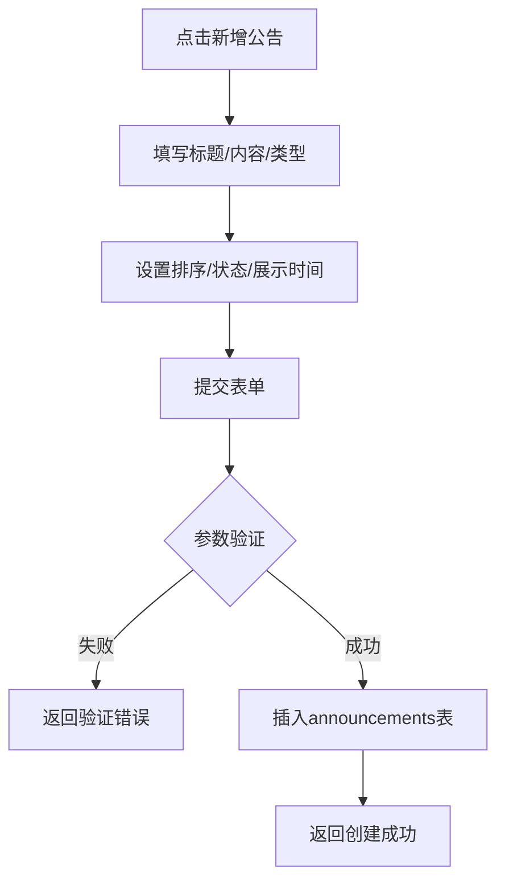
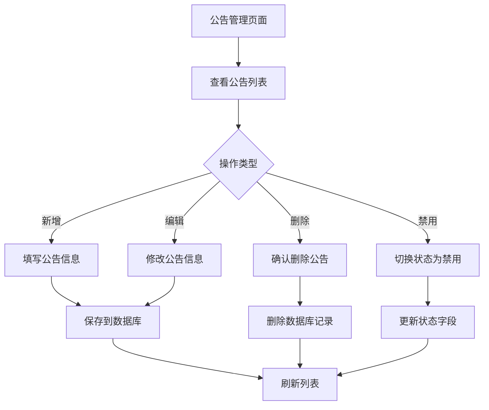

# 公告管理

## 1. 页面概述

公告管理模块用于管理平台公告和通知，管理员可创建、编辑、删除公告，设置公告类型、排序、展示时间和状态。公告在用户端首页或消息中心展示。

### 核心功能
- 公告的增删改查
- 公告类型管理（通知/活动等）
- 公告排序
- 公告状态启用/禁用
- 公告展示时间设置（开始/结束时间）

### 公告类型
| type | 类型 | 说明 |
|------|------|------|
| notice | 通知 | 平台通知公告 |
| activity | 活动 | 营销活动公告 |

### 使用场景
1. 发布平台通知（如系统升级、维护公告）
2. 发布营销活动公告（如双11大促、新用户优惠）
3. 管理公告展示顺序
4. 设置公告展示时间段
5. 禁用过期公告

## 2. API接口清单

### 主路由（推荐使用）
| 方法 | 路径 | 控制器方法 | 说明 |
|------|------|-----------|------|
| GET | /api/v1/admin/announcement | AnnouncementController@index | 公告列表（分页+搜索+筛选） |
| POST | /api/v1/admin/announcement | AnnouncementController@store | 新增公告 |
| PUT | /api/v1/admin/announcement/{id} | AnnouncementController@update | 编辑公告 |
| DELETE | /api/v1/admin/announcement/{id} | AnnouncementController@destroy | 删除公告 |

### 兼容路由（复数形式）
| 方法 | 路径 | 控制器方法 | 说明 |
|------|------|-----------|------|
| GET | /api/v1/admin/announcements | AnnouncementController@index | 公告列表（兼容） |
| POST | /api/v1/admin/announcements | AnnouncementController@store | 新增公告（兼容） |

## 3. 请求参数

### 公告列表
| 参数 | 类型 | 必填 | 说明 |
|------|------|------|------|
| page | int | 否 | 页码，默认1 |
| limit | int | 否 | 每页数量，默认20 |
| keyword | string | 否 | 搜索关键词（标题） |
| type | string | 否 | 按类型筛选（notice/activity） |

### 新增公告
| 参数 | 类型 | 必填 | 说明 |
|------|------|------|------|
| title | string | 是 | 公告标题 |
| content | string | 否 | 公告内容 |
| type | string | 否 | 公告类型（notice/activity），默认notice |
| sort | int | 否 | 排序，默认0（升序） |
| status | int | 否 | 状态：1启用，0禁用，默认1 |

### 编辑公告
| 参数 | 类型 | 必填 | 说明 |
|------|------|------|------|
| title | string | 否 | 公告标题 |
| content | string | 否 | 公告内容 |
| sort | int | 否 | 排序 |
| status | int | 否 | 状态：1启用，0禁用 |

## 4. 返回示例

### 公告列表
```json
{
  "code": 200,
  "message": "success",
  "data": {
    "list": [
      {
        "id": 1,
        "title": "欢迎使用TLLOS商城",
        "content": "TLLOS商城是一个全新架构的多商户电商平台，支持PC响应式、小程序和APP。",
        "type": "notice",
        "status": 1,
        "sort": 0,
        "start_at": null,
        "end_at": null,
        "created_at": null,
        "updated_at": null
      },
      {
        "id": 2,
        "title": "新用户注册送优惠券",
        "content": "新用户注册即送100元优惠券礼包，限时活动。",
        "type": "activity",
        "status": 1,
        "sort": 1,
        "start_at": null,
        "end_at": null,
        "created_at": null,
        "updated_at": null
      }
    ],
    "total": 2,
    "page": 1,
    "limit": 20
  },
  "timestamp": 1788339209
}
```

### 新增公告成功
```json
{
  "code": 200,
  "message": "创建成功",
  "data": { "id": 3 },
  "timestamp": 1788339210
}
```

## 5. HTTP状态码

| 状态码 | 说明 |
|--------|------|
| 200 | 请求成功 |
| 401 | 未认证 |
| 422 | 请求参数验证失败 |

## 6. 字段映射表

### announcements表（11字段）
| 字段 | 类型 | 说明 |
|------|------|------|
| id | bigint(20) unsigned | 主键，自增 |
| title | varchar(200) | 公告标题 |
| content | text | 公告内容 |
| type | varchar(50) | 公告类型（notice通知/activity活动），默认notice |
| status | tinyint(4) | 状态：1启用，0禁用，默认1 |
| sort | int(11) | 排序（升序），默认0 |
| start_at | timestamp | 展示开始时间 |
| end_at | timestamp | 展示结束时间 |
| created_at | timestamp | 创建时间 |
| updated_at | timestamp | 更新时间 |

## 7. 操作流程

### 新增公告流程


### 公告管理流程


## 8. 权限控制

- 认证方式：Sanctum Token认证
- 路由中间件：auth:sanctum
- 当前权限模型：登录管理员可管理所有公告
- 无细粒度权限点（permissions表不存在）

## 9. 关联模块

### 依赖模块
| 模块 | 依赖内容 | 说明 |
|------|---------|------|
| 管理员认证 | 登录认证 | 所有接口需auth:sanctum |

### 被依赖模块
| 模块 | 使用方式 |
|------|---------|
| 用户端首页 | 展示启用的公告列表 |
| 用户端消息中心 | 展示公告详情 |
| 商家端 | 展示平台公告 |

## 10. 验收清单

### 功能验收
- [x] 公告列表接口正常（GET /admin/announcement）
- [x] 公告列表支持分页（page/limit）
- [x] 公告列表支持关键词搜索（keyword，按标题）
- [x] 公告列表支持按类型筛选（type）
- [x] 公告列表按sort升序、id降序排序
- [x] 新增公告接口正常（POST /admin/announcement）
- [x] 新增公告title必填验证
- [x] 新增公告type支持字符串（notice/activity）
- [x] 编辑公告接口正常（PUT /admin/announcement/{id}）
- [x] 删除公告接口正常（DELETE /admin/announcement/{id}）
- [x] 兼容路由正常（/admin/announcements）

### 数据验收
- [x] announcements表结构完整（11字段）
- [x] 测试数据存在（2条公告：欢迎使用TLLOS商城/新用户注册送优惠券）
- [x] type字段为varchar类型，支持notice/activity字符串
- [x] sort字段支持排序
- [x] status字段支持启用/禁用

### 安全验收
- [x] 所有接口需auth:sanctum认证
- [x] title必填验证
- [x] 参数类型验证

### 修复记录
- [x] 修复store方法type验证规则错误（原integer，表结构为varchar，实际数据为notice/activity字符串，已改为string）

## 11. 常见问题

| 问题 | 原因 | 解决方案 |
|------|------|----------|
| 新增公告type验证失败 | 原验证规则为integer，但type是字符串 | 已修复，验证规则改为string |
| 公告不显示 | status=0禁用，或不在展示时间范围内 | 检查status和start_at/end_at |
| 公告排序不正确 | sort字段值设置 | sort越小越靠前（升序），相同sort按id降序 |
| 兼容路由和主路由区别 | /announcement（单数）和/announcements（复数） | 功能相同，推荐使用单数主路由，复数为兼容旧前端 |
| 公告内容支持HTML | content是text类型 | 可存储HTML内容，前端渲染时注意XSS防护 |
| 公告展示时间 | start_at/end_at字段 | 设置后只在时间段内展示，null表示不限制 |
