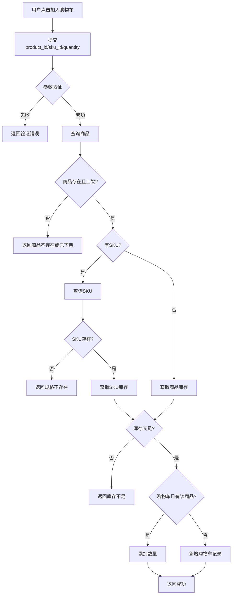
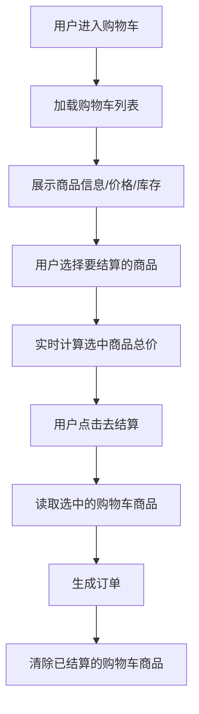

# 购物车

## 1. 页面概述

购物车模块用于管理用户的购物车商品，用户可添加商品、修改数量、选择/取消选择、删除商品、清空购物车。购物车数据与商品和SKU关联，实时计算价格和库存。

### 核心功能
- 添加商品到购物车（支持SKU）
- 查看购物车列表（含商品信息、SKU、价格、库存）
- 修改商品数量
- 选择/取消选择商品（全选/单选）
- 删除购物车商品
- 清空购物车
- 购物车商品数量统计
- 实时计算选中商品总价

### 使用场景
1. 用户浏览商品时添加到购物车
2. 用户在购物车中修改商品数量
3. 用户选择要结算的商品
4. 用户删除不需要的商品
5. 用户清空购物车
6. 结算时读取选中的购物车商品

## 2. API接口清单

| 方法 | 路径 | 控制器方法 | 说明 |
|------|------|-----------|------|
| GET | /api/v1/cart | CartController@index | 购物车列表（含商品信息、选中统计、总价） |
| POST | /api/v1/cart | CartController@store | 添加商品到购物车 |
| PUT | /api/v1/cart/{id} | CartController@update | 修改购物车商品数量 |
| DELETE | /api/v1/cart/{id} | CartController@destroy | 删除购物车商品 |
| POST | /api/v1/cart/clear | CartController@clear | 清空购物车 |
| POST | /api/v1/cart/select-all | CartController@selectAll | 全选/取消全选 |
| GET | /api/v1/cart/count | CartController@count | 购物车商品总数 |

## 3. 请求参数

### 添加商品到购物车
| 参数 | 类型 | 必填 | 说明 |
|------|------|------|------|
| product_id | int | 是 | 商品ID |
| sku_id | int | 否 | SKU ID，0表示无SKU |
| quantity | int | 是 | 数量，最小1 |

### 修改购物车商品数量
| 参数 | 类型 | 必填 | 说明 |
|------|------|------|------|
| id | int | 是 | 购物车记录ID（URL路径参数） |
| quantity | int | 是 | 新数量，最小1 |

### 全选/取消全选
| 参数 | 类型 | 必填 | 说明 |
|------|------|------|------|
| selected | boolean | 是 | true=全选，false=取消全选 |

## 4. 返回示例

### 购物车列表
```json
{
  "code": 200,
  "message": "success",
  "data": {
    "list": [
      {
        "id": 1,
        "product_id": 2,
        "sku_id": 0,
        "name": "iPhone 15 Pro Max 256G 原色钛金属",
        "image": "https://picsum.photos/seed/iPhone/800/800.jpg",
        "spec_text": "",
        "price": "9999.00",
        "stock": 500,
        "quantity": 2,
        "selected": 1,
        "available": true,
        "subtotal": "19998.00"
      }
    ],
    "selected_count": 2,
    "total_amount": 19998,
    "all_selected": true
  },
  "timestamp": 1788340075
}
```

### 添加商品成功
```json
{
  "code": 200,
  "message": "已加入购物车",
  "data": { "cart_count": "2" },
  "timestamp": 1788340075
}
```

### 购物车数量
```json
{
  "code": 200,
  "message": "success",
  "data": { "count": "2" },
  "timestamp": 1788340075
}
```

## 5. HTTP状态码

| 状态码 | 说明 |
|--------|------|
| 200 | 请求成功 |
| 400 | 业务错误（商品不存在/已下架、库存不足、规格不存在） |
| 401 | 未认证 |

## 6. 字段映射表

### carts表（9字段）
| 字段 | 类型 | 说明 |
|------|------|------|
| id | bigint(20) unsigned | 主键，自增 |
| user_id | bigint(20) unsigned | 用户ID |
| product_id | bigint(20) unsigned | 商品ID |
| sku_id | bigint(20) unsigned | SKU ID，0表示无SKU |
| quantity | int(11) | 商品数量，默认1 |
| selected | tinyint(4) | 是否选中：1选中，0未选中，默认1 |
| created_at | timestamp | 创建时间 |
| updated_at | timestamp | 更新时间 |

### 关联查询字段
| 展示字段 | 数据来源 | 说明 |
|---------|---------|------|
| name | products.name | 商品名称 |
| image | product_skus.image 或 products.main_image | 商品图片 |
| spec_text | product_skus.spec_text | SKU规格描述 |
| price | product_skus.price 或 products.price | 商品价格（SKU优先） |
| stock | product_skus.stock 或 products.stock | 商品库存（SKU优先） |
| available | 计算字段 | 商品是否可用（status=1且库存>0） |
| subtotal | 计算字段 | 小计 = price × quantity |

### 统计字段
| 统计项 | 计算方式 |
|--------|---------|
| selected_count | 选中商品的quantity之和 |
| total_amount | 选中商品的subtotal之和 |
| all_selected | 购物车非空且所有商品都选中 |

## 7. 操作流程

### 添加商品到购物车流程


### 购物车结算流程


## 8. 权限控制

- 认证方式：Sanctum Token认证
- 路由中间件：auth:sanctum
- 所有接口需用户登录
- 用户只能操作自己的购物车数据（通过$request->user()->id过滤）

## 9. 关联模块

### 依赖模块
| 模块 | 依赖内容 | 关联字段 |
|------|---------|---------|
| 商品管理 | 商品信息 | carts.product_id → products.id |
| 商品SKU | SKU信息 | carts.sku_id → product_skus.id |
| 用户认证 | 用户登录 | carts.user_id → users.id |

### 被依赖模块
| 模块 | 使用方式 |
|------|---------|
| 订单管理 | 结算时读取选中的购物车商品生成订单 |
| 用户中心 | 展示购物车数量角标 |

## 10. 验收清单

### 功能验收
- [x] 购物车列表接口正常（GET /cart）
- [x] 购物车列表关联商品信息（名称/图片/价格/库存）
- [x] 购物车列表关联SKU信息（规格/价格/库存）
- [x] 购物车列表计算选中商品总价（total_amount）
- [x] 购物车列表计算选中商品数量（selected_count）
- [x] 购物车列表判断是否全选（all_selected）
- [x] 添加商品到购物车接口正常（POST /cart）
- [x] 添加商品时验证商品存在且上架
- [x] 添加商品时验证SKU存在
- [x] 添加商品时验证库存充足
- [x] 同一商品重复添加时累加数量
- [x] 修改购物车商品数量接口正常（PUT /cart/{id}）
- [x] 删除购物车商品接口正常（DELETE /cart/{id}）
- [x] 清空购物车接口正常（POST /cart/clear）
- [x] 全选/取消全选接口正常（POST /cart/select-all）
- [x] 购物车数量统计接口正常（GET /cart/count）

### 数据验收
- [x] carts表结构完整（9字段）
- [x] user_id/product_id/sku_id联合唯一（同一用户同一商品同一SKU只有一条记录）
- [x] quantity默认1
- [x] selected默认1（选中）
- [x] 软删除商品不显示在购物车（Product模型使用SoftDeletes）

### 安全验收
- [x] 所有接口需auth:sanctum认证
- [x] 用户只能操作自己的购物车（通过user_id过滤）
- [x] 商品库存校验（防止超卖）
- [x] 商品上架状态校验（已下架商品不可添加）

## 11. 常见问题

| 问题 | 原因 | 解决方案 |
|------|------|----------|
| 添加商品提示"商品不存在或已下架" | 商品被软删除或status=0 | 检查products表的deleted_at和status字段，使用未删除且上架的商品 |
| 添加商品提示"规格不存在" | sku_id错误或不属于该商品 | 检查product_skus表，确保sku_id和product_id匹配 |
| 添加商品提示"库存不足" | 商品库存小于要添加的数量 | 检查商品或SKU的stock字段 |
| 购物车列表商品显示"商品已下架" | 商品被软删除或下架 | 正常逻辑，available=false表示商品不可用 |
| 购物车价格不正确 | SKU价格优先于商品价格 | 正常逻辑，有SKU时使用SKU价格，无SKU时使用商品价格 |
| 购物车数量角标不更新 | 前端未调用/cart/count接口 | 页面加载时调用/cart/count获取最新数量 |
| 结算后购物车商品未清除 | 订单生成后未删除购物车记录 | 订单生成成功后应删除已结算的购物车商品 |
