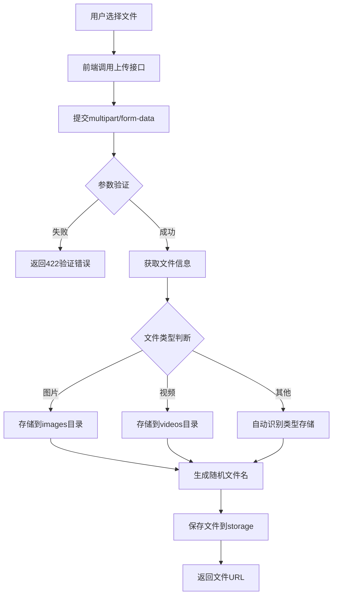

# 文件上传

## 1. 页面概述

文件上传模块提供通用的文件上传能力，支持图片、视频和普通文件上传。上传的文件存储在服务器storage目录，通过/storage/路径访问。各业务模块（商品、文章、用户头像等）调用本接口上传文件。

### 核心功能
- 通用文件上传（自动识别图片/视频类型）
- 图片上传（限制图片格式和大小）
- 视频上传（限制视频格式和大小）
- 文件按日期分目录存储
- 随机文件名避免冲突

### 文件存储规则
| 文件类型 | 存储目录 | 访问路径 | 大小限制 |
|---------|---------|---------|---------|
| 图片 | storage/app/public/uploads/images/YYYYMMDD/ | /storage/uploads/images/... | 最大10MB |
| 视频 | storage/app/public/uploads/videos/YYYYMMDD/ | /storage/uploads/videos/... | 最大100MB |
| 普通文件 | 自动识别类型，图片存images，视频存videos | /storage/uploads/... | 最大100MB |

### 使用场景
1. 商品图片上传
2. 商品详情富文本图片上传
3. 用户头像上传
4. 文章封面图上传
5. 售后凭证图片/视频上传
6. 商家资质图片上传

## 2. API接口清单

| 方法 | 路径 | 控制器方法 | 说明 |
|------|------|-----------|------|
| POST | /api/v1/upload | UploadController@upload | 通用文件上传（自动识别类型） |
| POST | /api/v1/upload/image | UploadController@uploadImage | 图片上传（仅图片格式） |
| POST | /api/v1/upload/video | UploadController@uploadVideo | 视频上传（仅视频格式） |

## 3. 请求参数

### 通用文件上传
| 参数 | 类型 | 必填 | 说明 |
|------|------|------|------|
| file | file | 是 | 上传文件（multipart/form-data），最大100MB |

### 图片上传
| 参数 | 类型 | 必填 | 说明 |
|------|------|------|------|
| file | file | 是 | 图片文件（multipart/form-data），仅支持图片格式，最大10MB |

### 视频上传
| 参数 | 类型 | 必填 | 说明 |
|------|------|------|------|
| file | file | 是 | 视频文件（multipart/form-data），支持mp4/avi/mov/wmv，最大100MB |

## 4. 返回示例

### 通用文件上传成功
```json
{
  "code": 200,
  "message": "success",
  "data": {
    "url": "/storage/uploads/images/20260902/abc123def456.jpg",
    "full_url": "https://mall.tllos.com/storage/uploads/images/20260902/abc123def456.jpg",
    "name": "product.jpg",
    "size": 102400,
    "type": "image/jpeg"
  },
  "timestamp": 1788340314
}
```

### 图片上传成功
```json
{
  "code": 200,
  "message": "success",
  "data": {
    "url": "/storage/uploads/images/20260902/abc123def456.png",
    "full_url": "https://mall.tllos.com/storage/uploads/images/20260902/abc123def456.png"
  },
  "timestamp": 1788340314
}
```

### 视频上传成功
```json
{
  "code": 200,
  "message": "success",
  "data": {
    "url": "/storage/uploads/videos/20260902/abc123def456.mp4",
    "full_url": "https://mall.tllos.com/storage/uploads/videos/20260902/abc123def456.mp4"
  },
  "timestamp": 1788340314
}
```

## 5. HTTP状态码

| 状态码 | 说明 |
|--------|------|
| 200 | 上传成功 |
| 401 | 未认证 |
| 422 | 请求参数验证失败（文件格式错误/超过大小限制） |

## 6. 字段映射表

### 返回字段
| 字段 | 类型 | 说明 |
|------|------|------|
| url | string | 文件相对路径（用于数据库存储） |
| full_url | string | 文件完整URL（用于前端展示） |
| name | string | 原始文件名（仅通用上传接口返回） |
| size | int | 文件大小（字节，仅通用上传接口返回） |
| type | string | 文件MIME类型（仅通用上传接口返回） |

### 存储规则
| 规则 | 说明 |
|------|------|
| 目录结构 | 按日期分目录：YYYYMMDD/ |
| 文件名 | 20位随机字符串 + 原始扩展名 |
| 存储驱动 | Laravel Storage public disk |
| 访问路径 | /storage/uploads/...（Nginx配置storage软链接） |

## 7. 操作流程

### 文件上传流程


## 8. 权限控制

- 认证方式：Sanctum Token认证
- 路由中间件：auth:sanctum
- 所有上传接口需登录认证
- 上传的文件归上传用户所有（但接口不限制用户访问已上传文件）

## 9. 关联模块

### 被依赖模块
| 模块 | 使用方式 |
|------|---------|
| 商品管理 | 商品主图、附图、详情富文本图片上传 |
| 用户管理 | 用户头像上传 |
| 商家管理 | 商家资质、营业执照图片上传 |
| 售后管理 | 售后凭证图片/视频上传 |
| 文章管理 | 文章封面图、内容图片上传 |
| 评价管理 | 评价图片上传 |

## 10. 验收清单

### 功能验收
- [x] 通用文件上传接口正常（POST /upload）
- [x] 图片上传接口正常（POST /upload/image）
- [x] 视频上传接口正常（POST /upload/video）
- [x] 文件按日期分目录存储
- [x] 随机文件名避免冲突
- [x] 图片格式验证（仅支持图片格式）
- [x] 视频格式验证（支持mp4/avi/mov/wmv）
- [x] 文件大小限制（图片10MB，视频100MB）
- [x] 返回文件相对路径和完整URL

### 安全验收
- [x] 所有接口需auth:sanctum认证
- [x] 文件格式验证（防止上传恶意文件）
- [x] 文件大小限制（防止超大文件）
- [x] 随机文件名（防止路径遍历和文件名冲突）

## 11. 常见问题

| 问题 | 原因 | 解决方案 |
|------|------|----------|
| 上传文件返回422 | 文件格式错误或超过大小限制 | 检查文件格式和大小，图片最大10MB，视频最大100MB |
| 上传文件返回401 | 未登录或Token过期 | 先登录获取Token，请求时携带Authorization: Bearer {token} |
| 文件上传成功但访问404 | storage软链接未配置 | 执行php artisan storage:link创建软链接 |
| 上传图片被压缩 | 接口未做压缩，原始存储 | 正常行为，如需压缩需前端处理或后端添加压缩逻辑 |
| 上传视频无法播放 | 视频格式不支持或编码问题 | 确保视频格式为mp4/avi/mov/wmv，建议使用H.264编码的mp4 |
| full_url域名不正确 | config('app.url')配置错误 | 检查.env文件中的APP_URL配置 |
| 大文件上传失败 | PHP upload_max_filesize或post_max_size限制 | 检查php.ini配置，确保upload_max_filesize和post_max_size大于100MB |
