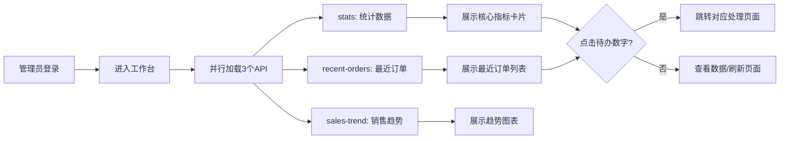

# 工作台

## 1. 页面概述
### 功能描述
工作台是管理员登录系统后看到的首页，用于快速了解商城整体运营状况。页面展示核心数据指标（用户/商品/订单/商家/销售额）、今日/昨日/本月对比数据、待办事项提醒（待发货/售后/入驻/提现/库存预警）、最近订单列表和近7天销售趋势图。

### 核心指标
| 指标 | 含义 | 业务价值 |
|------|------|----------|
| 用户总数 | 商城注册用户数量 | 衡量用户规模 |
| 商品总数 | 商城商品数量 | 衡量商品丰富度 |
| 订单总数 | 历史订单总量 | 衡量交易活跃度 |
| 商家总数 | 入驻商家数量（shops表） | 衡量平台规模 |
| 销售总额 | 已支付订单总金额 | 衡量平台营收 |
| 今日订单 | 今日创建订单数 | 衡量当日活跃度 |
| 今日销售额 | 今日已支付订单金额 | 衡量当日营收 |
| 待发货订单 | status=1的订单数 | 及时发货提醒 |
| 待处理售后 | order_after_sales表status=0 | 及时处理售后 |
| 待审核入驻 | shops表status=0 | 及时审核商家 |
| 待处理提现 | merchant_withdraws表status=0 | 及时处理提现 |
| 库存预警 | products表stock <= warning_stock | 及时补货提醒 |

### 使用场景
1. 日常监控：登录后查看整体数据，发现异常及时处理
2. 待办处理：点击待办数字快速跳转到对应处理页面
3. 趋势查看：查看近7天销售和订单走势
4. 业绩对比：对比今日/昨日/本月数据

---

## 2. API接口清单（基于真实控制器实现）
| 方法 | 路径 | 控制器方法 | 说明 | 权限要求 |
|------|------|-----------|------|----------|
| GET | /api/v1/admin/dashboard/stats | DashboardController@stats | 获取统计数据 | 仅需登录认证 |
| GET | /api/v1/admin/dashboard/recent-orders | DashboardController@recentOrders | 获取最近订单（10条） | 仅需登录认证 |
| GET | /api/v1/admin/dashboard/sales-trend | DashboardController@salesTrend | 获取近7天销售趋势 | 仅需登录认证 |

### 请求参数
| 参数 | 类型 | 必填 | 适用接口 | 说明 |
|------|------|------|----------|------|
| 无 | - | - | stats | 无参数，返回全部统计数据 |
| 无 | - | - | recent-orders | 无参数，固定返回最近10条 |
| 无 | - | - | sales-trend | 无参数，固定返回近7天数据 |

### 返回示例（stats）
```json
{
  "code": 0,
  "message": "success",
  "data": {
    "total_users": 11,
    "total_orders": 23,
    "total_products": 16,
    "total_merchants": 1,
    "total_sales": 12580.00,
    "today_orders": 3,
    "today_sales": 899.00,
    "today_new_users": 1,
    "yesterday_orders": 5,
    "yesterday_sales": 1560.00,
    "month_orders": 45,
    "month_sales": 28900.00,
    "pending_orders": 3,
    "pending_after_sales": 0,
    "pending_merchants": 0,
    "pending_withdraws": 1,
    "stock_warning_count": 2
  },
  "timestamp": 1756700000
}
```

### 返回示例（recent-orders）
```json
{
  "code": 0,
  "message": "success",
  "data": {
    "list": [
      {
        "id": 23,
        "order_no": "ORD20260901001",
        "total_amount": 299.00,
        "status": 1,
        "created_at": "2026-09-01 10:30:00",
        "nickname": "张三",
        "mobile": "138****8888",
        "status_text": "待发货",
        "status_type": "primary",
        "customer": "张三"
      }
    ],
    "total": 10
  },
  "timestamp": 1756700000
}
```

### 返回示例（sales-trend）
```json
{
  "code": 0,
  "message": "success",
  "data": {
    "days": ["2026-08-26", "2026-08-27", "2026-08-28", "2026-08-29", "2026-08-30", "2026-08-31", "2026-09-01"],
    "sales": [1200.00, 1500.00, 800.00, 2100.00, 1800.00, 950.00, 899.00],
    "orders": [5, 8, 3, 12, 10, 4, 3]
  },
  "timestamp": 1756700000
}
```

### 错误码
| 错误码 | 说明 |
|--------|------|
| 401 | 未登录或登录已过期 |
| 403 | 无访问权限（当前工作台仅需登录，暂无此场景） |
| 500 | 统计查询失败，检查数据库连接 |

---

## 3. 数据来源映射
| 展示字段 | 数据来源 | 计算方式 | 更新频率 |
|----------|----------|----------|----------|
| total_users | users 表 | COUNT(*) | 实时 |
| total_products | products 表 | COUNT(*) | 实时 |
| total_orders | orders 表 | COUNT(*) | 实时 |
| total_merchants | shops 表 | COUNT(*) | 实时 |
| total_sales | orders 表 | WHERE status>=1 SUM(total_amount) | 实时 |
| today_orders | orders 表 | WHERE DATE(created_at)=今天 COUNT(*) | 实时 |
| today_sales | orders 表 | WHERE DATE(created_at)=今天 AND status>=1 SUM | 实时 |
| today_new_users | users 表 | WHERE DATE(created_at)=今天 COUNT(*) | 实时 |
| yesterday_orders | orders 表 | WHERE DATE(created_at)=昨天 COUNT(*) | 实时 |
| month_orders | orders 表 | WHERE created_at>=本月1号 COUNT(*) | 实时 |
| pending_orders | orders 表 | WHERE status=1 COUNT(*) | 实时 |
| pending_after_sales | order_after_sales 表 | WHERE status=0 COUNT(*) | 实时 |
| pending_merchants | shops 表 | WHERE status=0 COUNT(*) | 实时 |
| pending_withdraws | merchant_withdraws 表 | WHERE status=0 COUNT(*) | 实时 |
| stock_warning_count | products 表 | WHERE stock <= warning_stock COUNT(*) | 实时 |
| recent_orders | orders + users 表 | LEFT JOIN users ORDER BY id DESC LIMIT 10 | 实时 |
| sales_trend | orders 表 | 按日分组 GROUP BY DATE(created_at) | 实时 |

---

## 4. 操作流程
### 工作台业务流程图


### 数据刷新机制
1. 页面加载时并行请求3个API
2. 通过页面右上角「刷新」按钮手动刷新
3. 统计数据无缓存，每次请求实时查询数据库
4. 建议：高并发场景下可添加Redis缓存（5分钟过期）

---

## 5. 权限控制
| 操作 | 权限要求 | 说明 |
|------|----------|------|
| 查看工作台 | 仅需登录认证 | 当前未配置特定权限点，所有登录管理员可访问 |
| 查看统计数据 | 仅需登录认证 | stats接口无权限中间件 |
| 查看最近订单 | 仅需登录认证 | recent-orders接口无权限中间件 |
| 查看销售趋势 | 仅需登录认证 | sales-trend接口无权限中间件 |

### 权限说明
- 工作台当前未在权限种子中配置特定权限点
- 三个API均在admin路由组内，通过Sanctum认证中间件
- 如需细粒度控制，可在路由中添加 `dashboard:view` 权限中间件
- 超级管理员和普通管理员当前均可访问

---

## 6. 关联模块
### 依赖模块（数据来源）
| 模块 | 依赖内容 | 具体关联字段 |
|------|----------|-------------|
| 用户管理 | 用户统计数据 | users 表 COUNT |
| 商品管理 | 商品统计+库存预警 | products 表 COUNT, stock, warning_stock |
| 订单管理 | 订单统计+最近订单 | orders 表 COUNT, SUM, status |
| 商家管理 | 商家统计+待审核 | shops 表 COUNT, status |
| 售后管理 | 待处理售后 | order_after_sales 表 status=0 |
| 财务管理 | 待处理提现 | merchant_withdraws 表 status=0 |

### 被依赖模块
（工作台是数据汇总展示层，不被其他业务模块依赖）

### 待办跳转目标
| 待办项 | 跳转页面 | 路由 |
|--------|----------|------|
| 待发货订单 | 订单列表 | /admin/order/list?status=1 |
| 待处理售后 | 售后管理 | /admin/order/after-sale |
| 待审核入驻 | 入驻审核 | /admin/merchant/audit |
| 待处理提现 | 提现管理 | /admin/finance/withdraw |
| 库存预警 | 商品列表 | /admin/product/list?stock_warning=1 |

---

## 7. 验收清单
### 功能验收
- [ ] 页面能正常加载，无白屏/500错误
- [ ] 用户总数显示正确（与users表COUNT一致）
- [ ] 商品总数显示正确（与products表COUNT一致）
- [ ] 订单总数显示正确（与orders表COUNT一致）
- [ ] 商家总数显示正确（与shops表COUNT一致）
- [ ] 销售总额显示正确（已支付订单SUM）
- [ ] 今日订单数显示正确
- [ ] 今日销售额显示正确
- [ ] 昨日订单/销售额显示正确
- [ ] 本月订单/销售额显示正确
- [ ] 待发货订单数显示正确（status=1）
- [ ] 待处理售后数显示正确
- [ ] 待审核入驻数显示正确
- [ ] 待处理提现数显示正确
- [ ] 库存预警数显示正确
- [ ] 最近订单列表显示正确（10条，含订单号/用户/金额/状态）
- [ ] 销售趋势图显示正确（近7天，含日期/销售额/订单数）
- [ ] 点击待办数字能跳转到对应处理页面
- [ ] 刷新按钮能重新加载所有数据

### 权限验收
- [ ] 已登录管理员可正常访问
- [ ] 未登录用户访问返回401
- [ ] 三个API均无需额外权限点

### 性能验收
- [ ] 页面加载时间 < 2秒
- [ ] stats接口响应 < 500ms（20个统计查询）
- [ ] recent-orders接口响应 < 300ms
- [ ] sales-trend接口响应 < 500ms（7天分组查询）
- [ ] 三个API可并行加载

---

## 8. 常见问题
| 问题 | 原因 | 解决方案 |
|------|------|----------|
| 统计数据全为0 | 数据库无数据 | 正常现象，添加测试商品/订单/用户 |
| 商家总数显示0 | shops表无数据 | 商家入驻后自动统计，确认shops表有数据 |
| 销售总额为0 | 无已支付订单 | status>=1才计入销售额，确认订单支付状态 |
| 待发货数不更新 | 订单状态未变更 | 订单发货后status从1变为2，待发货数自动减少 |
| 最近订单不显示 | orders表无数据 | 创建测试订单，确认LEFT JOIN users正常 |
| 销售趋势图空白 | 近7天无订单 | 正常现象，创建测试订单或调整时间范围 |
| 库存预警数不准 | warning_stock字段未设置 | 检查products.warning_stock字段，确保有值 |
| 页面加载慢 | 20个统计查询未优化 | 高并发时添加Redis缓存，过期时间5分钟 |
| 待办点击无跳转 | 前端路由未配置 | 检查待办项的点击事件和路由路径 |
| 数据不实时 | 浏览器缓存 | 清除浏览器缓存或强制刷新Ctrl+F5 |
