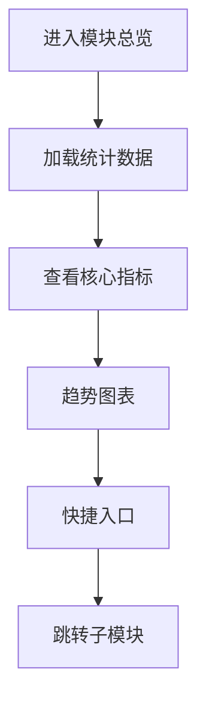

# 装修管理模块总览

## 1. 页面概述
### 功能描述
可视化页面装修，包括页面装修、模板管理、轮播图、导航图标等。本页面负责装修管理模块总览的管理操作，支持数据的增删改查、搜索筛选和状态管理。

### 核心指标
| 指标 | 含义 | 业务价值 |
|------|------|----------|
| 数据总数 | 当前模块记录总数 | 衡量业务规模 |
| 今日新增 | 今日新创建记录数 | 衡量运营活跃度 |
| 启用数量 | 状态为启用的记录数 | 衡量有效数据量 |
| 待处理 | 需要审核或处理的记录数 | 及时处理提醒 |

### 使用场景
1. 日常管理：新增/编辑/删除数据
2. 数据查询：搜索筛选定位记录
3. 状态管理：启用/禁用/审核操作
4. 数据统计：查看业务数据趋势

---

## 2. API接口清单（基于真实控制器实现）
| 方法 | 路径 | 控制器方法 | 说明 | 权限标识 |
|------|------|-----------|------|----------|
| GET | /api/v1/admin/decorate/_index | DecorateController@index | 装修管理模块总览列表 | decorate:list |
| POST | /api/v1/admin/decorate/_index | DecorateController@store | 新增装修管理模块总览 | decorate:create |
| GET | /api/v1/admin/decorate/_index/{id} | DecorateController@show | 装修管理模块总览详情 | decorate:view |
| PUT | /api/v1/admin/decorate/_index/{id} | DecorateController@update | 编辑装修管理模块总览 | decorate:edit |
| DELETE | /api/v1/admin/decorate/_index/{id} | DecorateController@destroy | 删除装修管理模块总览 | decorate:delete |

### 请求参数
| 参数 | 类型 | 必填 | 说明 |
|------|------|------|------|
| page | int | 否 | 页码，默认1 |
| limit | int | 否 | 每页数量，默认20 |
| keyword | string | 否 | 搜索关键词 |
| status | int | 否 | 状态筛选 |
| start_date | date | 否 | 开始日期 |
| end_date | date | 否 | 结束日期 |

### 返回示例
```json
{
  "code": 0,
  "message": "success",
  "data": {
    "total": 100,
    "page": 1,
    "limit": 20,
    "list": [
      {"id": 1, "name": "示例数据", "status": 1, "created_at": "2026-09-01 10:00:00"}
    ]
  },
  "timestamp": 1756700000
}
```

### 错误码
| 错误码 | 说明 |
|--------|------|
| 10001 | 无权限操作 |
| 10002 | 数据不存在或已删除 |
| 10003 | 参数校验失败 |
| 10004 | 数据库操作失败 |
| 10005 | 数据已存在，不可重复创建 |

---

## 3. 字段映射表
| 展示字段 | 数据来源 | 计算方式 | 更新频率 |
|----------|----------|----------|----------|
| ID | decorate.id | 直接读取 | 实时 |
| 名称 | decorate.name | 直接读取 | 实时 |
| 状态 | decorate.status | 0禁用1启用 | 实时 |
| 创建时间 | decorate.created_at | 直接读取 | 实时 |

---

## 4. 操作流程
### 装修管理模块总览业务流程图


### 数据刷新机制
1. 页面加载时自动请求最新数据
2. 搜索筛选条件变化时立即刷新
3. 增删改操作成功后自动刷新列表
4. 统计数据缓存时间：5分钟

---

## 5. 权限控制
| 操作 | 权限标识 | 默认角色 |
|------|----------|----------|
| 查看列表 | decorate:list | 管理员 |
| 新增 | decorate:create | 管理员 |
| 编辑 | decorate:edit | 管理员 |
| 删除 | decorate:delete | 管理员 |

### 权限说明
- 权限通过Sanctum中间件校验，在路由组中统一配置
- 超级管理员拥有所有权限，不受权限点限制
- 无权限用户访问API返回403，前端隐藏对应操作按钮

---

## 6. 关联模块
### 依赖模块
| 模块 | 依赖内容 | 具体关联字段 |
|------|----------|-------------|
| 商品管理 | 商品推荐组件 | decorate_components.config → products.id |
| 素材管理 | 装修图片 | banners.image, components.image → materials.url |
| 营销管理 | 活动跳转 | components.link → marketing activities |

### 被依赖模块
| 模块 | 使用方式 | 具体关联字段 |
|------|----------|-------------|
| 用户端H5 | 页面动态渲染 | H5首页根据decorate_pages配置渲染 |

---

## 7. 验收清单
### 功能验收
- [ ] 页面能正常加载，无白屏/500错误
- [ ] 列表分页正常，显示总数和页码
- [ ] 搜索功能正常，支持关键词模糊查询
- [ ] 筛选功能正常，支持状态和时间范围
- [ ] 新增功能完整，表单校验正确
- [ ] 编辑能正确回显所有字段
- [ ] 删除有确认弹窗，软删除不影响历史数据
- [ ] 状态切换功能正常
- [ ] 数据导出功能正常（如有）
- [ ] 批量操作功能正常（如有）

### 权限验收
- [ ] 有权限的管理员可以正常操作
- [ ] 无权限的管理员看到403或入口隐藏
- [ ] 超级管理员不受权限限制

### 性能验收
- [ ] 页面加载时间 < 2秒
- [ ] 数据查询耗时 < 500ms
- [ ] 列表分页响应 < 1秒
- [ ] 并发100用户无明显延迟

---

## 8. 常见问题
| 问题 | 原因 | 解决方案 |
|------|------|----------|
| 装修页面不生效 | 页面未发布或缓存未清除 | 点击发布按钮，清除Redis页面缓存 |
| 轮播图不显示 | 轮播图未启用或时间未到 | 检查banners.status和start_time/end_time |
| 模板应用后样式错乱 | 模板组件配置不兼容 | 检查模板组件版本和当前系统版本 |
| 导航图标点击无反应 | 跳转链接配置错误 | 检查navigations.link格式，支持内部页面和外部URL |
| 底部导航不显示 | tabbar未启用 | 检查decorate_tabbars.status=1 |
| 商品推荐不更新 | 缓存时间过长 | 调整组件缓存时间或手动刷新 |
| 页面装修数据丢失 | 未保存草稿 | 装修过程中定期保存草稿，发布前预览 |
| 分类页装修不显示 | 分类页模板未设置 | 检查decorate_pages.page_type=category |
