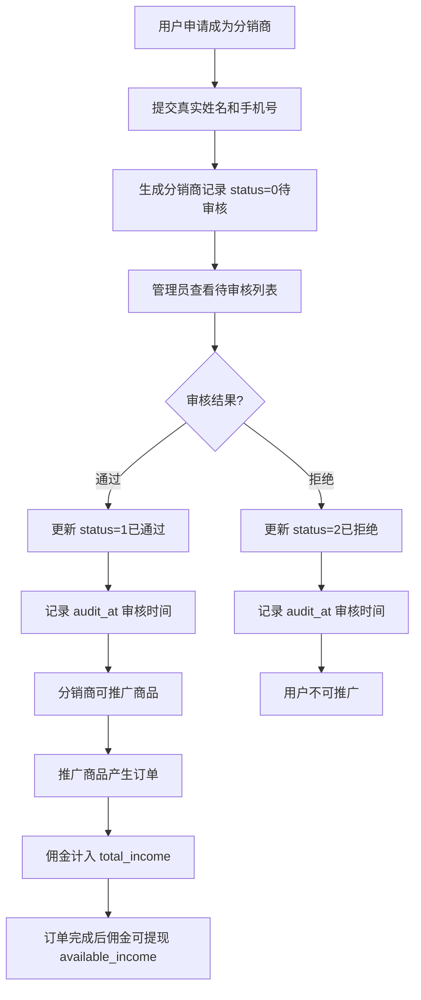

# 分销商管理

## 1. 页面概述
分销商管理是分销体系的核心模块，管理分销商的申请审核、等级体系、上下级关系、佣金数据和团队规模。管理员可查看分销商列表、审核入驻申请、管理分销商状态。

### 分销商状态
| status | 状态 | 说明 |
|--------|------|------|
| 0 | 待审核 | 用户提交申请，等待管理员审核 |
| 1 | 已通过 | 审核通过，可正常推广商品 |
| 2 | 已拒绝 | 审核拒绝，不可推广 |
| 3 | 已禁用 | 管理员禁用，暂停推广权限 |

### 分销商数据概览
| 分销商 | 等级 | 上级 | 状态 | 总收入 | 可用余额 | 订单数 | 团队数 |
|--------|------|------|------|--------|----------|--------|--------|
| 张三 | 一级分销商 | 无 | 已通过 | 1280.50 | 580.50 | 15 | 3 |
| 李四 | 二级分销商 | 张三 | 已通过 | 850.00 | 350.00 | 8 | 1 |
| 王五 | 一级分销商 | 无 | 待审核 | 0.00 | 0.00 | 0 | 0 |

### 使用场景
1. 入驻审核：审核用户提交的分销商申请
2. 分销商管理：查看分销商列表、等级、佣金数据
3. 团队管理：查看上下级关系和团队规模
4. 状态管理：启用/禁用分销商

## 2. API接口清单

| 方法 | 路径 | 控制器方法 | 说明 |
|------|------|-----------|------|
| GET | /api/v1/admin/distribute/agents | DistributeController@agents | 分销商列表（分页+搜索+筛选+5项统计+关联查询） |
| POST | /api/v1/admin/distribute/agents/{id}/audit | DistributeController@agentAudit | 审核分销商（通过/拒绝，含重复审核保护） |

## 3. 请求参数

### 分销商列表
| 参数 | 类型 | 必填 | 说明 |
|------|------|------|------|
| page | int | 否 | 页码默认1 |
| limit | int | 否 | 每页数量默认20 |
| keyword | string | 否 | 搜索关键词（用户昵称/手机号/真实姓名） |
| level_id | int | 否 | 按等级筛选 |
| status | int | 否 | 按状态筛选（0待审核1已通过2已拒绝3已禁用） |
| parent_id | int | 否 | 按上级分销商筛选 |

### 审核分销商
| 参数 | 类型 | 必填 | 说明 |
|------|------|------|------|
| id | int | 是 | 分销商ID（URL路径参数） |
| status | int | 是 | 审核结果（1通过2拒绝） |
| remark | string | 否 | 审核备注（最大255字符） |

## 4. 返回示例

### 分销商列表
```json
{
  "code": 200,
  "data": {
    "list": [
      {
        "id": 1,
        "user_id": 2,
        "level_id": 1,
        "parent_id": null,
        "real_name": "张三",
        "mobile": "133001330001",
        "status": 1,
        "total_income": "1280.50",
        "available_income": "580.50",
        "total_orders": 15,
        "total_members": 3,
        "apply_at": "2026-08-01 10:00:00",
        "audit_at": "2026-08-01 11:00:00",
        "nickname": "测试用户1",
        "avatar": null,
        "level_name": "一级分销商",
        "parent_name": null
      }
    ],
    "total": 3,
    "page": 1,
    "limit": 20,
    "stats": {
      "total": 3,
      "pending": 1,
      "approved": 2,
      "rejected": 0,
      "disabled": 0
    }
  }
}
```

### 审核通过
```json
{"code":200,"message":"审核通过","data":null}
```

### 审核拒绝
```json
{"code":200,"message":"已拒绝","data":null}
```

### 重复审核报错
```json
{"code":400,"message":"该分销商已审核，不能重复审核","data":null}
```

## 5. 字段映射表

### distribute_agents表（16字段）
| 字段 | 类型 | 说明 |
|------|------|------|
| id | bigint | 主键 |
| user_id | bigint | 关联用户ID |
| level_id | bigint | 分销等级ID |
| parent_id | bigint | 上级分销商ID（null表示顶级） |
| real_name | varchar(50) | 真实姓名 |
| mobile | varchar(20) | 手机号 |
| status | tinyint | 状态（0待审核1已通过2已拒绝3已禁用） |
| total_income | decimal(12,2) | 累计佣金收入 |
| available_income | decimal(12,2) | 可用余额（可提现） |
| total_orders | int | 累计分销订单数 |
| total_members | int | 团队成员数（下级分销商） |
| apply_at | timestamp | 申请时间 |
| audit_at | timestamp | 审核时间 |
| created_at | timestamp | 创建时间 |
| updated_at | timestamp | 更新时间 |

### 关联查询字段
| 字段 | 来源 | 说明 |
|------|------|------|
| nickname | users.nickname | 用户昵称 |
| avatar | users.avatar | 用户头像 |
| level_name | distribute_levels.name | 等级名称 |
| parent_name | distribute_agents.real_name | 上级分销商真实姓名 |

### 统计字段
| 统计项 | 数据来源 | 计算方式 |
|--------|----------|----------|
| total | distribute_agents | COUNT(*) |
| pending | distribute_agents | WHERE status=0 COUNT(*) |
| approved | distribute_agents | WHERE status=1 COUNT(*) |
| rejected | distribute_agents | WHERE status=2 COUNT(*) |
| disabled | distribute_agents | WHERE status=3 COUNT(*) |

## 6. 操作流程

### 分销商入驻审核流程


### 上下级关系
1. 用户通过邀请码注册时，自动关联上级分销商（parent_id）
2. 顶级分销商parent_id为null
3. 下级分销商产生订单时，上级可获得团队佣金（多级分销）
4. total_members统计该分销商的下级团队规模

### 审核保护机制
1. 只有status=0（待审核）的分销商可被审核
2. 已审核的分销商重复审核会报错"该分销商已审核，不能重复审核"
3. 审核通过后记录audit_at时间
4. 审核拒绝后用户可重新提交申请（status重置为0）

## 7. 权限控制
- 认证：Sanctum Token
- 中间件：auth:sanctum
- 当前权限模型：登录管理员可查看和审核分销商
- 无细粒度权限点（permissions表不存在）
- 审核为写操作，需管理员权限

## 8. 关联模块

### 依赖模块
| 模块 | 依赖内容 | 具体关联字段 |
|------|----------|-------------|
| 用户管理 | 用户信息 | distribute_agents.user_id → users.id |
| 分销等级 | 等级名称和佣金比例 | distribute_agents.level_id → distribute_levels.id |
| 分销订单 | 佣金数据 | distribute_orders.agent_id → distribute_agents.id |
| 分销概览 | 分销商统计 | distribute_agents COUNT |

### 被依赖模块
| 模块 | 使用方式 |
|------|----------|
| 分销订单 | 按分销商等级佣金比例计算佣金 |
| 分销商端 | 展示当前等级、佣金余额、团队数据 |
| 分销设置 | 分销开关控制分销商是否可推广 |

## 9. 验收清单
- [x] 分销商列表正常加载（分页+搜索+筛选）
- [x] 按用户昵称搜索正常（关联users表）
- [x] 按手机号搜索正常
- [x] 按真实姓名搜索正常
- [x] 按等级筛选正常（level_id）
- [x] 按状态筛选正常（0待审核1已通过2已拒绝3已禁用）
- [x] 按上级分销商筛选正常（parent_id）
- [x] 5项统计正常（total/pending/approved/rejected/disabled）
- [x] 关联查询用户昵称正常（nickname）
- [x] 关联查询等级名称正常（level_name）
- [x] 关联查询上级分销商名称正常（parent_name）
- [x] 审核通过正常（status 0→1，记录audit_at）
- [x] 审核拒绝正常（status 0→2，记录audit_at）
- [x] 重复审核保护正常（已审核的分销商报错）
- [x] 修复了nickname搜索bug（原代码搜索distribute_agents.nickname，表中不存在该字段）
- [x] 修复了audit_at不记录bug（原代码审核时不记录审核时间）
- [x] 分销商数据真实存在（3个：张三/李四/王五）

## 10. 常见问题
| 问题 | 原因 | 解决方案 |
|------|------|----------|
| 搜索nickname报错 | 原代码搜索distribute_agents.nickname，表中不存在该字段 | 已修复，关联users表搜索u.nickname |
| 审核后audit_at为空 | 原代码审核时不记录审核时间 | 已修复，审核通过/拒绝时记录audit_at |
| 重复审核不报错 | 原代码没有重复审核保护 | 已修复，已审核的分销商重复审核会报错 |
| 分销商列表无等级名称 | 原代码不关联distribute_levels表 | 已修复，关联查询level_name |
| 分销商列表无上级名称 | 原代码不关联上级分销商 | 已修复，自关联查询parent_name |
| 佣金余额不正确 | available_income未及时更新 | 订单完成后应将佣金从total_income转入available_income |
| 团队成员数不正确 | total_members未及时更新 | 下级分销商注册/审核通过后应更新上级的total_members |
