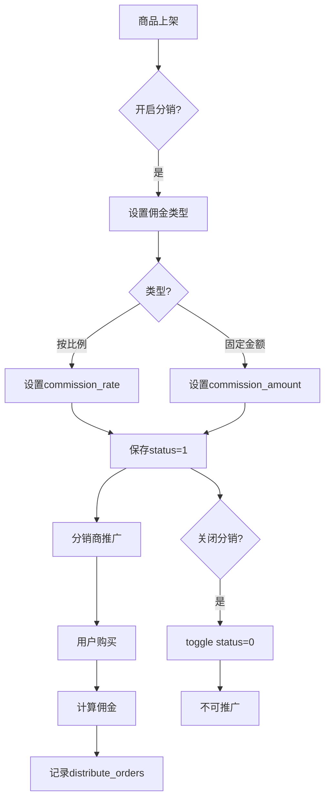

# 分销商品

## 1. 页面概述
分销商品管理开启分销的商品列表，支持商品搜索、状态筛选、佣金类型筛选、分销开关操作。每个分销商品可设置佣金比例或固定佣金金额，分销商推广该商品可获得对应佣金。

### 佣金类型
| 类型 | 值 | 说明 |
|------|-----|------|
| 按比例 | 1 | 按商品价格的百分比计算佣金（commission_rate字段） |
| 固定金额 | 2 | 每单固定佣金金额（commission_amount字段） |

### 商品状态
| 状态 | 值 | 说明 |
|------|-----|------|
| 开启分销 | 1 | 商品可被分销商推广，产生分销订单 |
| 关闭分销 | 0 | 商品不可被推广，不产生佣金 |

## 2. API接口清单
| 方法 | 路径 | 控制器方法 | 说明 |
|------|------|-----------|------|
| GET | /api/v1/admin/distribute/goods | DistributeController@goods | 分销商品列表（分页+搜索+筛选+5项统计+商品关联） |
| POST | /api/v1/admin/distribute/goods/{id}/toggle | DistributeController@goodsToggle | 分销商品开关（status 0/1切换） |

## 3. 请求参数
| 参数 | 类型 | 必填 | 说明 |
|------|------|------|------|
| page | int | 否 | 页码默认1 |
| limit | int | 否 | 每页数量默认20 |
| keyword | string | 否 | 按商品名称搜索 |
| status | int | 否 | 按分销状态筛选（1开启0关闭） |
| commission_type | int | 否 | 按佣金类型筛选（1按比例2固定金额） |

## 4. 返回示例
```json
{
  "code": 200,
  "data": {
    "list": [{"id":1,"product_id":1,"product_name":"iPhone 15 Pro Max","commission_type":1,"commission_rate":"10.00","status":1,"sales":1983,"price":"9999.00","stock":100}],
    "total": 1,
    "stats": {"total":1,"active":1,"inactive":0,"rate_type":1,"amount_type":0}
  }
}
```

## 5. 字段映射表
### distribute_goods表（12字段）
| 字段 | 类型 | 说明 |
|------|------|------|
| id | bigint | 主键 |
| product_id | bigint | 商品ID（唯一） |
| product_name | varchar(200) | 商品名称 |
| commission_type | tinyint | 佣金类型（1按比例2固定金额） |
| commission_rate | decimal(5,2) | 佣金比例（%） |
| commission_amount | decimal(12,2) | 固定佣金金额 |
| is_distribute | tinyint | 是否分销 |
| status | tinyint | 分销状态（1开启0关闭） |
| sort | int | 排序 |
| created_at | timestamp | 创建时间 |
| updated_at | timestamp | 更新时间 |

### 关联商品字段（products表）
| 字段 | 说明 |
|------|------|
| sales | 商品销量 |
| price | 商品价格 |
| stock | 商品库存 |
| product_status | 商品上架状态 |

## 6. 操作流程


## 7. 权限控制
- 认证：Sanctum Token，中间件auth:sanctum
- 登录管理员可查看和操作分销商品，无细粒度权限点
- 开关操作记录updated_at时间

## 8. 关联模块
| 模块 | 关联内容 | 字段 |
|------|----------|------|
| 商品管理 | 商品信息 | products.id → distribute_goods.product_id |
| 分销订单 | 佣金计算 | distribute_goods.commission → distribute_orders.commission |
| 分销概览 | 商品统计 | distribute_goods COUNT |

## 9. 验收清单
- [x] 列表正常加载（分页+搜索+筛选）
- [x] 按商品名称搜索正常
- [x] 按分销状态筛选正常
- [x] 按佣金类型筛选正常
- [x] 5项统计正常（total/active/inactive/rate_type/amount_type）
- [x] 关联商品信息正常（sales/price/stock）
- [x] 按sort升序+id降序排序
- [x] 开关正常（status 1→0返回"已关闭"）
- [x] 再次开关正常（status 0→1返回"已开启"）
- [x] 不存在商品开关返回错误
- [x] product_id唯一约束

## 10. 常见问题
| 问题 | 原因 | 解决方案 |
|------|------|----------|
| 商品不显示 | 未开启分销或status=0 | 检查分销记录和status |
| 佣金计算不正确 | commission_type与字段不匹配 | type=1用rate，type=2用amount |
| 销量不显示 | products关联失败 | 检查product_id是否存在 |
| 关闭后已有订单佣金消失 | 误删distribute_orders | 关闭不影响已产生订单 |