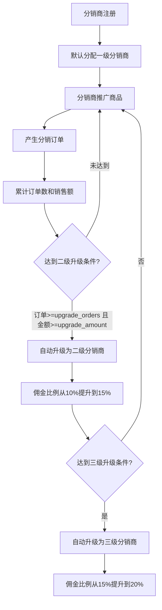

# 分销等级

## 1. 页面概述
分销等级管理分销商的等级体系，支持等级名称、佣金比例、多级分销佣金率（自购/一级/二级/三级）、升级条件（订单数/销售额）、等级排序和状态管理。等级越高，佣金比例越高，分销商达到升级条件后可自动升级。

### 等级体系
| 等级 | 名称 | 佣金比例 | 升级条件 | 分销商数 |
|------|------|----------|----------|----------|
| 1 | 一级分销商 | 10% | 默认等级 | 2 |
| 2 | 二级分销商 | 15% | 订单>=0, 金额>=0 | 1 |
| 3 | 三级分销商 | 20% | 订单>=0, 金额>=0 | 0 |

### 多级分销佣金率
| 字段 | 说明 |
|------|------|
| commission_rate | 直推佣金比例（分销商直接推广获得） |
| self_rate | 自购佣金比例（分销商自己购买获得） |
| first_rate | 一级下级佣金比例（下级分销商推广，上级获得） |
| second_rate | 二级下级佣金比例 |
| third_rate | 三级下级佣金比例 |

### 使用场景
1. 等级配置：设置不同等级的佣金比例和升级条件
2. 佣金管理：配置多级分销佣金率（自购/一级/二级/三级）
3. 等级排序：按level升序展示等级体系
4. 状态管理：启用/禁用等级

## 2. API接口清单

| 方法 | 路径 | 控制器方法 | 说明 |
|------|------|-----------|------|
| GET | /api/v1/admin/distribute/levels | DistributeController@levels | 等级列表（分页+搜索+筛选+3项统计+分销商数量） |
| POST | /api/v1/admin/distribute/levels | DistributeController@levelStore | 新增等级 |
| PUT | /api/v1/admin/distribute/levels/{id} | DistributeController@levelUpdate | 编辑等级 |

## 3. 请求参数

### 等级列表
| 参数 | 类型 | 必填 | 说明 |
|------|------|------|------|
| page | int | 否 | 页码默认1 |
| limit | int | 否 | 每页数量默认20 |
| keyword | string | 否 | 按等级名称搜索 |
| status | int | 否 | 按状态筛选（1启用0禁用） |

### 新增等级
| 参数 | 类型 | 必填 | 说明 |
|------|------|------|------|
| name | string | 是 | 等级名称（最大50字符） |
| level | int | 是 | 等级序号（最小1） |
| commission_rate | decimal | 是 | 直推佣金比例（0-100） |
| self_rate | decimal | 否 | 自购佣金比例 |
| first_rate | decimal | 否 | 一级下级佣金比例 |
| second_rate | decimal | 否 | 二级下级佣金比例 |
| third_rate | decimal | 否 | 三级下级佣金比例 |
| upgrade_orders | int | 否 | 升级所需订单数 |
| upgrade_amount | decimal | 否 | 升级所需累计销售额 |
| sort | int | 否 | 排序 |
| status | int | 否 | 状态（1启用0禁用） |

### 编辑等级
所有参数均为可选（sometimes），只更新传入的字段。

## 4. 返回示例

### 等级列表
```json
{
  "code": 200,
  "data": {
    "list": [
      {"id":1,"name":"一级分销商","level":1,"commission_rate":"10.00","self_rate":"0.00","first_rate":"0.00","second_rate":"0.00","third_rate":"0.00","upgrade_orders":0,"upgrade_amount":"0.00","status":1,"sort":1,"agent_count":2},
      {"id":2,"name":"二级分销商","level":2,"commission_rate":"15.00","upgrade_orders":0,"upgrade_amount":"0.00","status":1,"sort":2,"agent_count":1},
      {"id":3,"name":"三级分销商","level":3,"commission_rate":"20.00","upgrade_orders":0,"upgrade_amount":"0.00","status":1,"sort":3,"agent_count":0}
    ],
    "total": 3,
    "page": 1,
    "limit": 20,
    "stats": {"total":3,"active":3,"inactive":0}
  }
}
```

### 新增等级
```json
{"code":200,"message":"创建成功","data":{"id":4}}
```

### 编辑等级
```json
{"code":200,"message":"更新成功","data":null}
```

## 5. 字段映射表

### distribute_levels表（14字段）
| 字段 | 类型 | 说明 |
|------|------|------|
| id | bigint | 主键 |
| name | varchar(50) | 等级名称 |
| level | int | 等级序号（升序） |
| commission_rate | decimal(5,2) | 直推佣金比例（%） |
| self_rate | decimal(5,2) | 自购佣金比例（%） |
| first_rate | decimal(5,2) | 一级下级佣金比例（%） |
| second_rate | decimal(5,2) | 二级下级佣金比例（%） |
| third_rate | decimal(5,2) | 三级下级佣金比例（%） |
| upgrade_orders | int | 升级所需累计订单数 |
| upgrade_amount | decimal(12,2) | 升级所需累计销售额 |
| status | tinyint | 状态（1启用0禁用） |
| sort | int | 排序 |
| created_at | timestamp | 创建时间 |
| updated_at | timestamp | 更新时间 |

### 关联统计字段
| 字段 | 来源 | 说明 |
|------|------|------|
| agent_count | distribute_agents COUNT | 该等级的分销商数量 |

### 统计字段
| 统计项 | 数据来源 | 计算方式 |
|--------|----------|----------|
| total | distribute_levels | COUNT(*) |
| active | distribute_levels | WHERE status=1 COUNT(*) |
| inactive | distribute_levels | WHERE status=0 COUNT(*) |

## 6. 操作流程

### 分销商等级升级流程


### 等级管理流程
1. 管理员新增等级，设置名称、佣金比例、升级条件
2. 等级按level升序展示
3. 管理员可编辑等级的佣金比例和升级条件
4. 管理员可启用/禁用等级
5. 分销商达到升级条件后自动升级

## 7. 权限控制
- 认证：Sanctum Token
- 中间件：auth:sanctum
- 当前权限模型：登录管理员可查看和管理分销等级
- 无细粒度权限点（permissions表不存在）
- 等级管理为写操作（新增/编辑），需管理员权限

## 8. 关联模块

### 依赖模块
| 模块 | 依赖内容 | 具体关联字段 |
|------|----------|-------------|
| 分销商管理 | 分销商等级 | distribute_agents.level_id → distribute_levels.id |
| 分销订单 | 佣金计算 | distribute_orders.level_id → distribute_levels.id（订单产生时的等级快照） |
| 分销概览 | 等级统计 | distribute_levels COUNT |

### 被依赖模块
| 模块 | 使用方式 |
|------|----------|
| 分销商端 | 展示当前等级和升级进度 |
| 分销订单 | 按等级佣金比例计算佣金 |

## 9. 验收清单
- [x] 等级列表正常加载（分页+搜索+筛选）
- [x] 按等级名称搜索正常
- [x] 按状态筛选正常（1启用0禁用）
- [x] 3项统计正常（total/active/inactive）
- [x] 每个等级的分销商数量正常（agent_count）
- [x] 按level升序排序正常
- [x] 新增等级正常（name/level/commission_rate必填）
- [x] 新增等级支持多级佣金率（self/first/second/third_rate）
- [x] 新增等级支持升级条件（upgrade_orders/upgrade_amount）
- [x] 编辑等级正常（sometimes验证，只更新传入字段）
- [x] 佣金比例范围校验正常（0-100）
- [x] 等级序号最小值校验正常（min:1）
- [x] 修复了description字段验证错误（表中不存在该字段）
- [x] 等级数据真实存在（3个等级：一级10%/二级15%/三级20%）

## 10. 常见问题
| 问题 | 原因 | 解决方案 |
|------|------|----------|
| 新增等级报错description字段 | 控制器验证了表中不存在的description字段 | 已修复，移除description验证，添加真实字段验证 |
| 分销商不升级 | 升级条件设置过高或定时任务未执行 | 检查upgrade_orders/upgrade_amount设置，确认升级定时任务运行 |
| 佣金计算不正确 | 订单产生时的等级快照与当前等级不同 | 分销订单记录level_id快照，佣金按订单产生时的等级计算 |
| 等级列表无分销商数量 | agent_count字段未统计 | 已修复，levels方法中统计每个等级的分销商数量 |
| 多级佣金率不生效 | self/first/second/third_rate为0 | 检查等级配置中的多级佣金率，当前默认均为0（仅直推佣金生效） |
| 删除等级后分销商异常 | 等级被删除但分销商仍引用该等级 | 建议禁用等级而非删除，删除前需将分销商迁移到其他等级 |