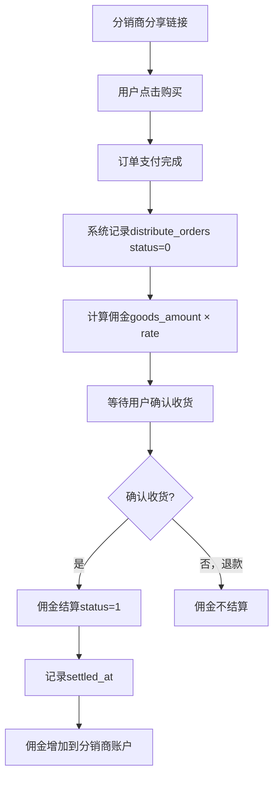

# 分销订单

## 1. 页面概述
分销订单管理通过分销链接产生的订单列表，支持订单号搜索、分销商筛选、佣金状态筛选、时间范围筛选，展示订单信息、用户信息、分销商信息、等级信息、佣金金额和结算状态。分销订单为只读列表，不存在新增/编辑/删除操作。

### 佣金状态枚举
| 值 | 状态 | 说明 |
|----|------|------|
| 0 | 待结算 | 订单已产生佣金，等待结算（订单确认收货后结算） |
| 1 | 已结算 | 佣金已结算到分销商账户 |

## 2. API接口清单
| 方法 | 路径 | 控制器方法 | 说明 |
|------|------|-----------|------|
| GET | /api/v1/admin/distribute/orders | DistributeController@orders | 分销订单列表（分页+搜索+筛选+6项统计+用户/分销商/等级关联） |

## 3. 请求参数
| 参数 | 类型 | 必填 | 说明 |
|------|------|------|------|
| page | int | 否 | 页码默认1 |
| limit | int | 否 | 每页数量默认20 |
| keyword | string | 否 | 关键词搜索（订单号/分销商姓名/用户昵称） |
| status | int | 否 | 按佣金状态筛选（0待结算1已结算） |
| agent_id | int | 否 | 按分销商ID筛选 |
| start_time | string | 否 | 开始时间 |
| end_time | string | 否 | 结束时间 |

## 4. 返回示例
```json
{
  "code": 200,
  "data": {
    "list": [{"id":5,"order_no":"ORD20260902001","user_id":9,"agent_id":2,"level_id":2,"goods_amount":"399.00","commission_rate":"12.00","commission":"47.88","status":0,"settled_at":null,"created_at":"2026-09-02 11:35:30","user_name":"测试用户8","agent_name":"李四","level_name":"二级分销商"}],
    "total": 5,
    "stats": {"total":5,"pending":3,"settled":2,"commission_total":251.46,"commission_pending":161.66,"commission_settled":89.80}
  }
}
```

## 5. 字段映射表
### distribute_orders表（15字段）
| 字段 | 类型 | 说明 |
|------|------|------|
| id | bigint | 主键 |
| order_id | bigint | 订单ID |
| order_no | varchar(50) | 订单号 |
| user_id | bigint | 下单用户ID |
| agent_id | bigint | 分销商ID |
| level_id | bigint | 分销商等级ID（快照） |
| goods_amount | decimal(12,2) | 商品金额 |
| commission_rate | decimal(5,2) | 佣金比例（%） |
| commission_amount | decimal(12,2) | 佣金金额 |
| commission | decimal(12,2) | 实际佣金 |
| status | tinyint | 佣金状态（0待结算1已结算） |
| settled_at | timestamp | 结算时间 |
| created_at | timestamp | 创建时间 |
| updated_at | timestamp | 更新时间 |

### 关联字段
| 字段 | 来源表 | 说明 |
|------|--------|------|
| user_name | users.nickname | 下单用户昵称 |
| user_mobile | users.mobile | 下单用户手机号 |
| agent_name | distribute_agents.real_name | 分销商姓名 |
| level_name | distribute_levels.name | 等级名称 |

## 6. 操作流程


### 佣金计算规则
1. 按比例：commission = goods_amount × commission_rate / 100
2. 订单产生时的佣金比例和等级快照记录，后续变更不影响已产生订单

## 7. 权限控制
- 认证：Sanctum Token，中间件auth:sanctum
- 登录管理员可查看分销订单，无细粒度权限点
- 分销订单为只读列表，无写操作
- 不支持新增/编辑/删除（订单由系统自动产生）

## 8. 关联模块
| 模块 | 关联内容 | 字段 |
|------|----------|------|
| 订单管理 | 订单信息 | orders.id → distribute_orders.order_id |
| 用户管理 | 用户信息 | users.id → distribute_orders.user_id |
| 分销商管理 | 分销商信息 | distribute_agents.id → distribute_orders.agent_id |
| 分销等级 | 等级名称 | distribute_levels.id → distribute_orders.level_id |
| 分销概览 | 订单统计 | distribute_orders COUNT/SUM |

## 9. 验收清单
- [x] 列表正常加载（分页+搜索+筛选）
- [x] 按订单号搜索正常
- [x] 按分销商姓名搜索正常
- [x] 按用户昵称搜索正常
- [x] 按佣金状态筛选正常（0待结算1已结算）
- [x] 按分销商ID筛选正常
- [x] 按时间范围筛选正常
- [x] 6项统计正常（total/pending/settled/commission_total/pending/settled）
- [x] 关联用户信息正常（user_name/user_mobile）
- [x] 关联分销商信息正常（agent_name）
- [x] 关联等级信息正常（level_name）
- [x] 按id降序排序
- [x] 佣金金额正确（goods_amount × rate / 100）
- [x] 待结算订单settled_at为null
- [x] 已结算订单settled_at有值
- [x] 只读列表，无新增/编辑/删除接口

## 10. 常见问题
| 问题 | 原因 | 解决方案 |
|------|------|----------|
| 订单不显示 | 未通过分销链接产生 | 检查订单是否关联agent_id |
| 佣金为0 | 商品未设置佣金 | 检查distribute_goods佣金配置 |
| 已完成但未结算 | 结算逻辑未触发 | 检查订单确认收货后是否更新settled_at |
| 分销商姓名不显示 | agents关联失败 | 检查agent_id是否存在 |
| 统计与列表不一致 | 筛选条件不同 | 统计基于全表，列表受筛选影响 |