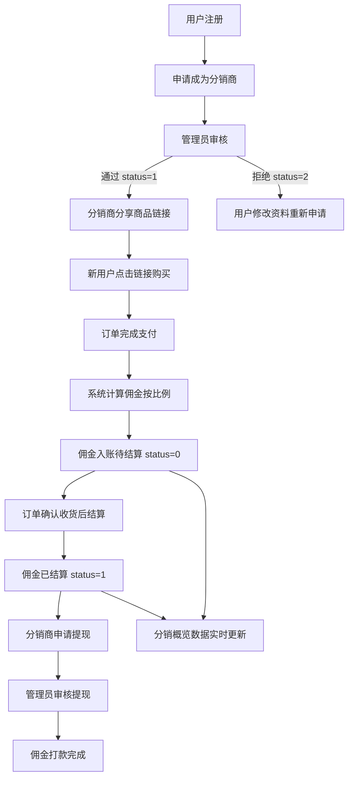

# 分销概览

## 1. 页面概述
分销概览是分销体系的数据总看板，帮助管理员快速了解整个分销网络的运营状况，包括分销商统计、分销订单统计、佣金统计、近7天趋势、分销商排行、分销商品排行。

### 核心指标
| 指标 | 含义 | 业务价值 |
|------|------|----------|
| 分销商总数 | 已申请成为分销商的用户数量 | 衡量分销网络规模 |
| 活跃分销商 | 审核通过的分销商数量 | 衡量有效分销能力 |
| 待审核分销商 | 等待管理员审核的申请数 | 及时处理提醒 |
| 今日新增分销商 | 今日新申请的分销商数 | 衡量增长趋势 |
| 分销订单总数 | 通过分销链接产生的订单总数 | 衡量分销转化效果 |
| 近7天分销订单 | 近7天的分销订单数 | 衡量短期活跃度 |
| 佣金总额 | 所有分销订单产生的佣金总和 | 衡量分销成本 |
| 已结算佣金 | 已完成结算的佣金 | 衡量实际支出 |
| 待结算佣金 | 已产生但未结算的佣金 | 衡量待支付负债 |
| 分销商品总数 | 开启分销的商品数量 | 衡量分销商品丰富度 |

### 使用场景
1. 日常监控：管理员每天查看分销数据，发现异常及时处理
2. 运营决策：根据分销商增长和订单数据，调整分销政策
3. 财务对账：核对佣金结算数据
4. 排行激励：查看分销商排行，激励优秀分销商

## 2. API接口清单

| 方法 | 路径 | 控制器方法 | 说明 |
|------|------|-----------|------|
| GET | /api/v1/admin/distribute/overview | DistributeController@overview | 分销概览数据（11项统计+近7天趋势+最近订单+分销商排行+商品排行） |

## 3. 请求参数
无参数，直接获取当前统计数据。

## 4. 返回示例

```json
{
  "code": 200,
  "message": "success",
  "data": {
    "stats": {
      "total_agents": 3,
      "active_agents": 2,
      "pending_agents": 1,
      "today_new_agents": 1,
      "total_orders": 5,
      "week_orders": 5,
      "total_commission": 251.46,
      "settled_commission": 89.80,
      "pending_commission": 161.66,
      "total_goods": 1
    },
    "trend": {
      "labels": ["08-27","08-28","08-29","08-30","08-31","09-01","09-02"],
      "orders": [0,1,1,0,1,1,1],
      "commission": [0,29.90,59.90,0,23.88,89.90,47.88]
    },
    "recent_orders": [
      {"id":5,"order_no":"ORD20260902001","user_name":"测试用户8","agent_name":"李四","goods_amount":"399.00","commission":"47.88","status":0,"created_at":"2026-09-02 11:35:30"}
    ],
    "top_agents": [
      {"id":1,"real_name":"张三","mobile":"133001330001","total_income":"1280.50","available_income":"580.50","total_orders":15,"total_members":3}
    ],
    "top_goods": [
      {"id":1,"product_id":1,"product_name":"iPhone 15 Pro Max","commission_rate":"10.00","sales":1983}
    ]
  }
}
```

## 5. HTTP状态码
| 状态码 | 说明 |
|--------|------|
| 200 | 请求成功 |
| 401 | 未登录 |
| 500 | 服务器错误 |

## 6. 字段映射表

### 统计字段数据来源
| 展示字段 | 数据来源 | 计算方式 | 更新频率 |
|----------|----------|----------|----------|
| total_agents | distribute_agents 表 | COUNT(*) | 实时 |
| active_agents | distribute_agents 表 | WHERE status=1 COUNT(*) | 实时 |
| pending_agents | distribute_agents 表 | WHERE status=0 COUNT(*) | 实时 |
| today_new_agents | distribute_agents 表 | WHERE DATE(created_at)=CURDATE() COUNT(*) | 实时 |
| total_orders | distribute_orders 表 | COUNT(*) | 实时 |
| week_orders | distribute_orders 表 | WHERE created_at >= DATE_SUB(NOW(), INTERVAL 7 DAY) COUNT(*) | 实时 |
| total_commission | distribute_orders 表 | SUM(commission) | 实时 |
| settled_commission | distribute_orders 表 | WHERE status=1 SUM(commission) | 实时 |
| pending_commission | distribute_orders 表 | WHERE status=0 SUM(commission) | 实时 |
| total_goods | distribute_goods 表 | WHERE status=1 COUNT(*) | 实时 |

### 趋势字段
| 字段 | 说明 |
|------|------|
| trend.labels | 近7天日期标签（MM-DD格式） |
| trend.orders | 每天分销订单数 |
| trend.commission | 每天分销佣金金额 |

### 排行字段
| 排行类型 | 排序字段 | 关联表 |
|----------|----------|--------|
| top_agents | total_income DESC | distribute_agents LEFT JOIN users |
| top_goods | products.sales DESC | distribute_goods LEFT JOIN products |

## 7. 操作流程

### 分销业务完整流程


### 数据刷新机制
1. 页面加载时自动请求最新数据
2. 统计数据实时计算，无缓存
3. 关键操作（新增分销商/订单完成/佣金结算）后数据自动更新

## 8. 权限控制
- 认证：Sanctum Token
- 中间件：auth:sanctum
- 当前权限模型：登录管理员可查看分销概览
- 无细粒度权限点（permissions表不存在）
- 概览为只读数据看板，无写操作

## 9. 关联模块

### 依赖模块（概览数据来源）
| 模块 | 依赖内容 | 具体关联字段 |
|------|----------|-------------|
| 分销商管理 | 分销商统计数据 | distribute_agents 表 |
| 分销订单 | 订单统计+佣金统计 | distribute_orders 表 |
| 分销商品 | 分销商品统计 | distribute_goods 表 |
| 用户管理 | 用户昵称/手机号 | users.id → distribute_agents.user_id |
| 商品管理 | 商品销量 | products.id → distribute_goods.product_id |

### 被依赖模块
| 模块 | 使用方式 |
|------|----------|
| 工作台 | 汇总展示分销核心指标 |
| 报表系统 | 导出分销数据报表 |

## 10. 验收清单
- [x] 页面能正常加载，无白屏/500错误
- [x] 分销商总数显示正确
- [x] 活跃分销商显示正确（status=1）
- [x] 待审核分销商显示正确（status=0）
- [x] 今日新增分销商显示正确
- [x] 分销订单总数显示正确
- [x] 近7天分销订单显示正确
- [x] 佣金总额显示正确
- [x] 已结算佣金显示正确（status=1）
- [x] 待结算佣金显示正确（status=0）
- [x] 分销商品总数显示正确
- [x] 近7天趋势图正常显示（订单数+佣金金额）
- [x] 最近分销订单列表显示正确（含用户昵称+分销商姓名）
- [x] 分销商排行Top5显示正确（按总收入排序）
- [x] 分销商品排行Top5显示正确（按销量排序）
- [x] 数据实时刷新（无缓存）

## 11. 常见问题
| 问题 | 原因 | 解决方案 |
|------|------|----------|
| 概览数据为0 | 分销商/订单数据为空 | 正常情况，引入测试数据 |
| 佣金金额异常 | 佣金比例配置错误 | 检查分销设置中的佣金比例 |
| 趋势图空白 | 近7天无分销订单 | 创建测试分销订单或调整时间范围 |
| 分销商排行不显示 | 分销商total_income为0 | 分销商产生订单后自动更新总收入 |
| 待结算佣金不更新 | 订单未确认收货 | 订单确认收货后佣金状态从0变为1（已结算） |
| 数据不实时 | 缓存未清除 | 当前无缓存，数据实时计算，刷新页面即可 |