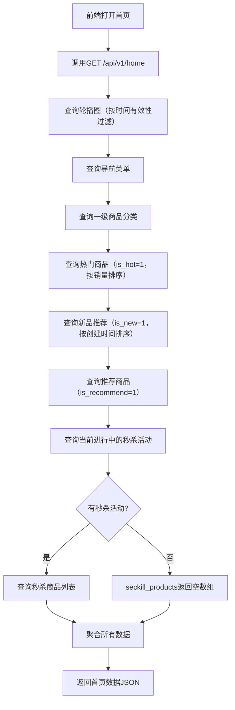

# 首页数据

## 1. 页面概述

首页数据模块提供商城首页所需的全部数据聚合接口，包括轮播图、导航菜单、商品分类、热门商品、新品推荐、推荐商品、秒杀活动等。前端首页一次性调用本接口获取所有数据，减少请求次数。

### 核心功能
- 首页数据聚合（一次性返回所有首页模块数据）
- 系统配置获取（基础配置、交易配置、用户配置）
- 轮播图按时间有效性过滤
- 商品按标签筛选（热门/新品/推荐）
- 秒杀活动实时状态判断

### 首页数据模块
| 模块 | 数据来源 | 说明 |
|------|---------|------|
| banners | banners表 | 首页轮播图，按时间有效性过滤 |
| navigations | navigations表 | 首页图标导航，最多10个 |
| categories | product_categories表 | 一级商品分类，最多8个 |
| hot_products | products表 | 热门商品（is_hot=1），按销量排序，最多6个 |
| new_products | products表 | 新品推荐（is_new=1），按创建时间排序，最多6个 |
| recommend_products | products表 | 推荐商品（is_recommend=1），最多10个 |
| seckill | seckills表 | 当前进行中的秒杀活动 |
| seckill_products | seckill_products+products | 秒杀活动商品列表 |

### 使用场景
1. PC端首页加载
2. H5端首页加载
3. 小程序首页加载
4. APP首页加载

## 2. API接口清单

| 方法 | 路径 | 控制器方法 | 说明 |
|------|------|-----------|------|
| GET | /api/v1/home | HomeController@index | 首页数据聚合（公开接口，无需登录） |
| GET | /api/v1/config | HomeController@config | 系统配置（公开接口，无需登录） |

## 3. 请求参数

### 首页数据
无请求参数。

### 系统配置
无请求参数。

## 4. 返回示例

### 首页数据
```json
{
  "code": 200,
  "message": "success",
  "data": {
    "banners": [
      {
        "id": 1,
        "title": "夏季大促",
        "image": "https://picsum.photos/seed/banner1/1200/400.jpg",
        "link_type": "url",
        "link_value": "/pages/product/list?tag=sale"
      }
    ],
    "navigations": [
      {
        "id": 1,
        "name": "数码电器",
        "icon": "https://picsum.photos/seed/nav1/100/100.jpg",
        "link_type": "url",
        "link_value": "/pages/category/index?id=1"
      }
    ],
    "categories": [
      {
        "id": 1,
        "name": "手机数码",
        "icon": null,
        "image": null
      }
    ],
    "hot_products": [
      {
        "id": 2,
        "name": "iPhone 15 Pro Max",
        "main_image": "https://...",
        "price": "9999.00",
        "market_price": "10999.00",
        "sales": 156
      }
    ],
    "new_products": [],
    "recommend_products": [],
    "seckill": {
      "id": 1,
      "title": "限时秒杀",
      "start_time": "2026-09-02 10:00:00",
      "end_time": "2026-09-02 22:00:00"
    },
    "seckill_products": [
      {
        "id": 2,
        "name": "iPhone 15 Pro Max",
        "main_image": "https://...",
        "seckill_price": "8999.00",
        "original_price": "9999.00",
        "seckill_stock": 100,
        "sold_count": 45
      }
    ]
  },
  "timestamp": 1788341013
}
```

### 系统配置
```json
{
  "code": 200,
  "message": "success",
  "data": {
    "site_name": "TLLOS商城",
    "site_logo": "https://...",
    "customer_service_phone": "400-123-4567",
    "default_shipping_fee": "10.00",
    "free_shipping_amount": "99.00",
    "order_auto_cancel_minutes": 30,
    "order_auto_confirm_days": 7
  },
  "timestamp": 1788341013
}
```

## 5. HTTP状态码

| 状态码 | 说明 |
|--------|------|
| 200 | 请求成功 |

## 6. 字段映射表

### 首页数据字段
| 展示字段 | 数据来源 | 类型 | 说明 |
|---------|---------|------|------|
| banners | banners表 | array | 轮播图列表 |
| banners[].id | banners.id | int | 轮播图ID |
| banners[].title | banners.title | string | 轮播图标题 |
| banners[].image | banners.image | string | 轮播图图片 |
| banners[].link_type | banners.link_type | string | 链接类型：url/page/category/product |
| banners[].link_value | banners.link_value | string | 链接值 |
| navigations | navigations表 | array | 导航列表 |
| navigations[].id | navigations.id | int | 导航ID |
| navigations[].name | navigations.name | string | 导航名称 |
| navigations[].icon | navigations.icon | string | 导航图标 |
| categories | product_categories表 | array | 一级分类列表 |
| categories[].id | product_categories.id | int | 分类ID |
| categories[].name | product_categories.name | string | 分类名称 |
| hot_products | products表 | array | 热门商品列表 |
| hot_products[].id | products.id | int | 商品ID |
| hot_products[].name | products.name | string | 商品名称 |
| hot_products[].main_image | products.main_image | string | 商品主图 |
| hot_products[].price | products.price | decimal | 商品售价 |
| hot_products[].market_price | products.market_price | decimal | 市场价 |
| hot_products[].sales | products.sales | int | 销量 |
| new_products | products表 | array | 新品列表（字段同hot_products） |
| recommend_products | products表 | array | 推荐商品列表（字段同hot_products） |
| seckill | seckills表 | object/null | 当前秒杀活动 |
| seckill_products | seckill_products+products | array | 秒杀商品列表 |

### 系统配置字段
| 配置键 | 数据来源 | 说明 |
|--------|---------|------|
| 基础配置 | system_configs表 group=basic | 站点名称、Logo、客服电话等 |
| 交易配置 | system_configs表 group=trade | 运费、免邮金额、订单自动取消时间等 |
| 用户配置 | system_configs表 group=user | 用户注册、积分、等级等配置 |

## 7. 操作流程

### 首页数据加载流程


## 8. 权限控制

- 认证方式：无需认证（公开接口）
- 路由中间件：无
- 所有用户（包括未登录用户）均可访问首页数据和系统配置

## 9. 关联模块

### 依赖模块
| 模块 | 依赖内容 | 关联字段 |
|------|---------|---------|
| 装修管理 | 轮播图、导航菜单 | banners/navigations表 |
| 商品管理 | 商品分类、商品信息 | product_categories/products表 |
| 营销管理 | 秒杀活动 | seckills/seckill_products表 |
| 系统配置 | 系统配置项 | system_configs表 |

### 被依赖模块
| 模块 | 使用方式 |
|------|---------|
| PC端首页 | 调用/home接口获取首页数据 |
| 全局配置 | 调用/config接口获取系统配置 |

## 10. 验收清单

### 功能验收
- [x] 首页数据接口正常（GET /home）
- [x] 系统配置接口正常（GET /config）
- [x] 轮播图按时间有效性过滤（start_time/end_time）
- [x] 轮播图按sort排序
- [x] 导航菜单最多返回10个
- [x] 一级分类最多返回8个
- [x] 热门商品按销量降序排序
- [x] 新品按创建时间降序排序
- [x] 推荐商品最多返回10个
- [x] 秒杀活动只返回进行中的（start_time<=now<=end_time）
- [x] 秒杀商品关联商品表获取商品信息
- [x] 无秒杀活动时seckill返回null，seckill_products返回空数组
- [x] 系统配置只返回status=1的配置项
- [x] 系统配置按group筛选（basic/trade/user）

### 性能验收
- [x] 首页数据一次性返回，减少前端请求次数
- [x] 各查询使用索引（status/position/is_hot/is_new/is_recommend）
- [x] 商品查询只select必要字段，避免大字段传输

### 安全验收
- [x] 公开接口无需认证
- [x] 只返回上架商品（status=1）
- [x] 轮播图只返回启用且在有效期内的
- [x] 不返回敏感信息（如商品成本价、库存预警值）

## 11. 常见问题

| 问题 | 原因 | 解决方案 |
|------|------|----------|
| 首页数据返回空 | 数据库中没有对应数据 | 检查banners/navigations/products等表是否有数据 |
| 轮播图不显示 | 轮播图已过期或未启用 | 检查banners表的status/start_time/end_time字段 |
| 热门商品为空 | 没有is_hot=1的商品 | 在商品管理中设置热门商品标签 |
| 秒杀活动不显示 | 没有进行中的秒杀活动 | 检查seckills表的start_time/end_time/status |
| 系统配置返回空 | system_configs表没有数据 | 在系统配置管理中添加配置项 |
| 商品图片不显示 | 商品main_image字段为空或URL错误 | 检查products表的main_image字段 |
| 首页加载慢 | 数据量大或缺少索引 | 检查各表索引，必要时添加缓存 |
| 秒杀商品价格不正确 | seckill_products表的seckill_price未设置 | 检查秒杀商品配置 |
