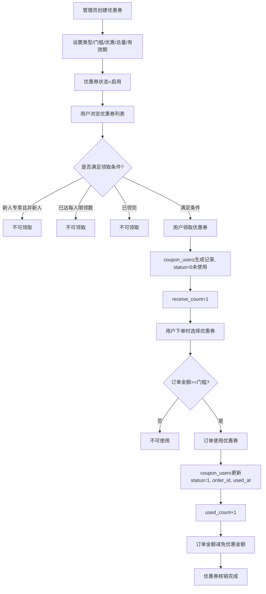

# 优惠券

## 1. 页面概述
优惠券是营销模块的核心功能，支持多种优惠类型（满减券/折扣券）、使用门槛、发放总量、每人限领、有效期管理、新人专享等复杂维度。管理员可创建、编辑、启用/禁用、删除优惠券，并查看用户领取记录。

### 优惠券类型
| type | 类型 | 说明 | 使用字段 |
|------|------|------|----------|
| 1 | 满减券 | 满足最低消费金额后减免固定金额 | min_amount + discount_amount |
| 2 | 折扣券 | 满足最低消费金额后按折扣率打折 | min_amount + discount_rate |
| 3 | 无门槛券 | 无最低消费限制，直接减免 | discount_amount |

### 有效期类型
| validity_type | 类型 | 说明 |
|---------------|------|------|
| 1 | 固定时间段 | 指定start_time和end_time |
| 2 | 领取后N天有效 | 指定valid_days，领取后N天内有效 |

### 优惠券数据概览
| 优惠券 | 类型 | 门槛 | 优惠 | 总量 | 已领 | 已用 | 状态 |
|--------|------|------|------|------|------|------|------|
| 新人专享100元券 | 满减券 | 500.00 | 100.00 | 1000 | 0 | 0 | 启用 |

### 使用场景
1. 促销活动：创建满减券/折扣券刺激消费
2. 新用户引流：创建新人专享券
3. 库存清理：创建无门槛券促进滞销商品销售
4. 会员关怀：定向发放优惠券给特定用户

## 2. API接口清单

| 方法 | 路径 | 控制器方法 | 说明 |
|------|------|-----------|------|
| GET | /api/v1/admin/coupons | CouponController@index | 优惠券列表（分页+搜索+筛选+5项统计） |
| GET | /api/v1/admin/coupons/records | CouponController@records | 领取记录列表（关联优惠券和用户） |
| GET | /api/v1/admin/coupons/{id} | CouponController@show | 优惠券详情 |
| POST | /api/v1/admin/coupons | CouponController@store | 新增优惠券 |
| PUT | /api/v1/admin/coupons/{id} | CouponController@update | 编辑优惠券 |
| POST | /api/v1/admin/coupons/{id}/toggle-status | CouponController@toggleStatus | 启用/禁用优惠券 |
| DELETE | /api/v1/admin/coupons/{id} | CouponController@destroy | 删除优惠券（有领取记录时禁止删除） |

## 3. 请求参数

### 优惠券列表
| 参数 | 类型 | 必填 | 说明 |
|------|------|------|------|
| page | int | 否 | 页码默认1 |
| limit | int | 否 | 每页数量默认20 |
| keyword | string | 否 | 按优惠券名称搜索 |
| type | int | 否 | 按类型筛选（1满减2折扣3无门槛） |
| status | int | 否 | 按状态筛选（0停用1启用） |

### 新增优惠券
| 参数 | 类型 | 必填 | 说明 |
|------|------|------|------|
| name | string | 是 | 优惠券名称（最大100字符） |
| type | int | 是 | 类型（1满减2折扣3无门槛） |
| min_amount | decimal | 否 | 使用门槛金额（0表示无门槛） |
| discount_amount | decimal | 否 | 满减金额（type=1或3时使用） |
| discount_rate | decimal | 否 | 折扣率%（type=2时使用，0-100） |
| total_count | int | 否 | 发放总量 |
| limit_per_user | int | 否 | 每人限领数量（最小1） |
| validity_type | int | 否 | 有效期类型（1固定时间段2领取后N天） |
| start_time | datetime | 否 | 有效期开始（validity_type=1时必填） |
| end_time | datetime | 否 | 有效期结束（validity_type=1时必填） |
| valid_days | int | 否 | 领取后有效天数（validity_type=2时使用） |
| is_new_user | int | 否 | 是否新人专享（0否1是，默认0） |
| status | int | 否 | 状态（0停用1启用，默认1） |
| sort | int | 否 | 排序（默认0，升序） |

### 编辑优惠券
所有参数均为可选（sometimes），只更新传入的字段。

### 领取记录列表
| 参数 | 类型 | 必填 | 说明 |
|------|------|------|------|
| page | int | 否 | 页码默认1 |
| limit | int | 否 | 每页数量默认20 |
| coupon_id | int | 否 | 按优惠券筛选 |
| status | int | 否 | 按使用状态筛选（0未使用1已使用） |
| keyword | string | 否 | 搜索（优惠券名称/用户昵称/用户手机号） |

## 4. 返回示例

### 优惠券列表
```json
{
  "code": 200,
  "message": "success",
  "data": {
    "list": [
      {
        "id": 1,
        "name": "新人专享100元券",
        "type": 1,
        "min_amount": "500.00",
        "discount_amount": "0.00",
        "discount_rate": null,
        "total_count": 1000,
        "used_count": 0,
        "receive_count": 0,
        "limit_per_user": 1,
        "validity_type": 1,
        "start_time": null,
        "end_time": null,
        "valid_days": 0,
        "is_new_user": 0,
        "status": 1,
        "sort": 1,
        "value": "100.00",
        "description": null,
        "created_at": "2026-09-01 11:58:57",
        "updated_at": null
      }
    ],
    "total": 1,
    "page": 1,
    "limit": 20,
    "stats": {
      "total": 1,
      "active": 1,
      "inactive": 0,
      "total_received": 1,
      "total_used": 0
    }
  }
}
```

### 新增优惠券
```json
{"code":200,"message":"创建成功","data":{"id":2}}
```

### 开关优惠券
```json
{"code":200,"message":"已关闭","data":{"status":0}}
```

### 删除优惠券（有领取记录时）
```json
{"code":400,"message":"该优惠券已有用户领取，无法删除","data":null}
```

## 5. 字段映射表

### coupons表（24字段）
| 字段 | 类型 | 说明 |
|------|------|------|
| id | bigint | 主键 |
| name | varchar(100) | 优惠券名称 |
| type | tinyint | 类型（1满减2折扣3无门槛） |
| min_amount | decimal(10,2) | 使用门槛金额 |
| discount_amount | decimal(10,2) | 满减金额 |
| discount_rate | decimal(5,2) | 折扣率（%） |
| total_count | int | 发放总量 |
| used_count | int | 已使用数量 |
| receive_count | int | 已领取数量 |
| limit_per_user | int | 每人限领数量 |
| validity_type | tinyint | 有效期类型（1固定时间段2领取后N天） |
| start_time | timestamp | 有效期开始 |
| end_time | timestamp | 有效期结束 |
| valid_days | int | 领取后有效天数 |
| 适用范围 | longtext | 适用范围（JSON格式，指定商品/分类） |
| is_new_user | tinyint | 是否新人专享（0否1是） |
| status | tinyint | 状态（0停用1启用） |
| sort | int | 排序（升序） |
| value | decimal(10,2) | 券面值 |
| description | varchar(255) | 优惠券描述 |
| created_at | timestamp | 创建时间 |
| updated_at | timestamp | 更新时间 |

### coupon_users表（领取记录表，9字段）
| 字段 | 类型 | 说明 |
|------|------|------|
| id | bigint | 主键 |
| coupon_id | bigint | 优惠券ID |
| user_id | bigint | 用户ID |
| order_id | bigint | 使用订单ID（未使用时为null） |
| status | tinyint | 状态（0未使用1已使用） |
| used_at | timestamp | 使用时间 |
| expire_at | timestamp | 过期时间 |
| created_at | timestamp | 领取时间 |
| updated_at | timestamp | 更新时间 |

### 统计字段
| 统计项 | 数据来源 | 计算方式 |
|--------|----------|----------|
| total | coupons | COUNT(*) |
| active | coupons | WHERE status=1 COUNT(*) |
| inactive | coupons | WHERE status=0 COUNT(*) |
| total_received | coupon_users | COUNT(*) |
| total_used | coupon_users | WHERE status=1 COUNT(*) |

## 6. 操作流程

### 优惠券完整生命周期


### 删除保护机制
1. 删除前检查coupon_users表是否有该优惠券的领取记录
2. 有领取记录时返回错误"该优惠券已有用户领取，无法删除"
3. 无领取记录时允许删除
4. 建议使用启用/禁用代替删除，保留历史数据

## 7. 权限控制
- 认证：Sanctum Token
- 中间件：auth:sanctum
- 当前权限模型：登录管理员可查看和管理优惠券
- 无细粒度权限点（permissions表不存在）
- 新增/编辑/删除为写操作，需管理员权限

## 8. 关联模块

### 依赖模块
| 模块 | 依赖内容 | 具体关联字段 |
|------|----------|-------------|
| 用户管理 | 领取用户信息 | coupon_users.user_id → users.id |
| 订单管理 | 使用订单 | coupon_users.order_id → orders.id |
| 商品管理 | 适用商品 | coupons.适用范围（JSON存储商品ID） |

### 被依赖模块
| 模块 | 使用方式 |
|------|----------|
| 用户端H5 | 展示优惠券列表、领取优惠券、下单时选择使用 |
| 商家端 | 查看订单使用的优惠券信息 |
| 订单结算 | 计算优惠金额，扣减订单应付金额 |

## 9. 验收清单
- [x] 优惠券列表正常加载（分页+搜索+筛选）
- [x] 按名称搜索正常（keyword）
- [x] 按类型筛选正常（type 1/2/3）
- [x] 按状态筛选正常（status 0/1）
- [x] 5项统计正常（total/active/inactive/total_received/total_used）
- [x] 按sort升序+id降序排序正常
- [x] 优惠券详情正常（show方法）
- [x] 新增优惠券正常（store方法，返回新ID）
- [x] 新增优惠券默认值正常（status默认1，is_new_user默认0，sort默认0）
- [x] 编辑优惠券正常（update方法，sometimes验证）
- [x] 开关优惠券正常（toggleStatus，1→0或0→1）
- [x] 删除优惠券正常（无领取记录时可删除）
- [x] 删除保护正常（有领取记录时返回错误）
- [x] 领取记录列表正常（关联coupons和users表）
- [x] 领取记录按优惠券筛选正常（coupon_id）
- [x] 领取记录搜索正常（优惠券名称/用户昵称/手机号）
- [x] 修复了default验证规则bug（Laravel无default验证规则）
- [x] 优惠券类型验证正常（in:1,2,3）
- [x] 折扣率范围验证正常（min:0,max:100）
- [x] 每人限领最小值验证正常（min:1）
- [x] 表结构正确（24字段，含中文字段名"适用范围"）
- [x] 领取记录表正确（coupon_users，9字段）
- [x] 优惠券数据真实存在（1条：新人专享100元券）

## 10. 常见问题
| 问题 | 原因 | 解决方案 |
|------|------|----------|
| 新增优惠券报500错误 | 验证规则中使用了不存在的default规则 | 已修复，移除default规则，改为验证后手动设置默认值 |
| 优惠券无法删除 | 该优惠券已有用户领取记录 | 设计如此，有领取记录时禁止删除，建议使用禁用代替 |
| 用户无法领取优惠券 | 不满足领取条件（新人专享/已达限领数/已领完） | 检查优惠券的is_new_user、limit_per_user、total_count设置 |
| 下单时优惠券不可用 | 订单金额未达到使用门槛 | 检查min_amount设置，确保订单金额>=门槛金额 |
| 折扣券优惠金额计算错误 | discount_rate单位是%，如80表示8折 | 优惠金额=订单金额×(100-discount_rate)/100 |
| 领取后优惠券已过期 | validity_type=2时，valid_days设置过短 | 检查valid_days设置，领取后N天内有效 |
| 适用范围不生效 | 适用范围字段是中文字段名，JSON存储商品ID | 检查前端是否正确传递适用范围参数，后端JSON解析 |
| 统计数据不准确 | total_received/total_used统计的是coupon_users表 | 确认coupon_users表数据是否正确，已删除的优惠券领取记录仍保留 |
