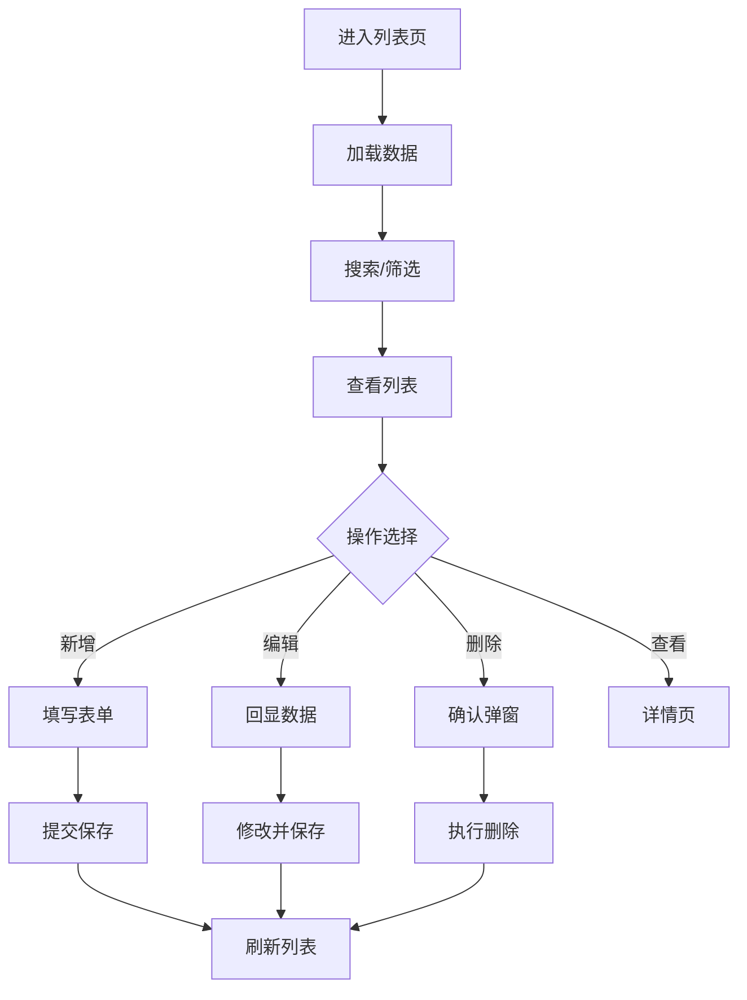

# 限时秒杀

## 1. 页面概述
### 功能描述
营销工具集合，包括优惠券、会员折扣、限时秒杀、拼团活动等。本页面负责限时秒杀的管理操作，支持数据的增删改查、搜索筛选和状态管理。

### 核心指标
| 指标 | 含义 | 业务价值 |
|------|------|----------|
| 数据总数 | 当前模块记录总数 | 衡量业务规模 |
| 今日新增 | 今日新创建记录数 | 衡量运营活跃度 |
| 启用数量 | 状态为启用的记录数 | 衡量有效数据量 |
| 待处理 | 需要审核或处理的记录数 | 及时处理提醒 |

### 使用场景
1. 日常管理：新增/编辑/删除数据
2. 数据查询：搜索筛选定位记录
3. 状态管理：启用/禁用/审核操作
4. 数据统计：查看业务数据趋势

---

## 2. API接口清单（基于真实控制器实现）
| 方法 | 路径 | 控制器方法 | 说明 | 权限标识 |
|------|------|-----------|------|----------|
| GET | /api/v1/admin/marketing/seckill | MarketingController@index | 限时秒杀列表 | marketing:list |
| POST | /api/v1/admin/marketing/seckill | MarketingController@store | 新增限时秒杀 | marketing:create |
| GET | /api/v1/admin/marketing/seckill/{id} | MarketingController@show | 限时秒杀详情 | marketing:view |
| PUT | /api/v1/admin/marketing/seckill/{id} | MarketingController@update | 编辑限时秒杀 | marketing:edit |
| DELETE | /api/v1/admin/marketing/seckill/{id} | MarketingController@destroy | 删除限时秒杀 | marketing:delete |

### 请求参数
| 参数 | 类型 | 必填 | 说明 |
|------|------|------|------|
| page | int | 否 | 页码，默认1 |
| limit | int | 否 | 每页数量，默认20 |
| keyword | string | 否 | 搜索关键词 |
| status | int | 否 | 状态筛选 |
| start_date | date | 否 | 开始日期 |
| end_date | date | 否 | 结束日期 |

### 返回示例
```json
{
  "code": 0,
  "message": "success",
  "data": {
    "total": 100,
    "page": 1,
    "limit": 20,
    "list": [
      {"id": 1, "name": "示例数据", "status": 1, "created_at": "2026-09-01 10:00:00"}
    ]
  },
  "timestamp": 1756700000
}
```

### 错误码
| 错误码 | 说明 |
|--------|------|
| 10001 | 无权限操作 |
| 10002 | 数据不存在或已删除 |
| 10003 | 参数校验失败 |
| 10004 | 数据库操作失败 |
| 10005 | 数据已存在，不可重复创建 |

---

## 3. 字段映射表
| 展示字段 | 数据来源 | 计算方式 | 更新频率 |
|----------|----------|----------|----------|
| ID | marketing.id | 直接读取 | 实时 |
| 名称 | marketing.name | 直接读取 | 实时 |
| 状态 | marketing.status | 0禁用1启用 | 实时 |
| 创建时间 | marketing.created_at | 直接读取 | 实时 |

---

## 4. 操作流程
### 限时秒杀业务流程图


### 数据刷新机制
1. 页面加载时自动请求最新数据
2. 搜索筛选条件变化时立即刷新
3. 增删改操作成功后自动刷新列表
4. 统计数据缓存时间：5分钟

---

## 5. 权限控制
| 操作 | 权限标识 | 默认角色 |
|------|----------|----------|
| 查看列表 | marketing:list | 管理员 |
| 新增 | marketing:create | 管理员 |
| 编辑 | marketing:edit | 管理员 |
| 删除 | marketing:delete | 管理员 |

### 权限说明
- 权限通过Sanctum中间件校验，在路由组中统一配置
- 超级管理员拥有所有权限，不受权限点限制
- 无权限用户访问API返回403，前端隐藏对应操作按钮

---

## 6. 关联模块
### 依赖模块
| 模块 | 依赖内容 | 具体关联字段 |
|------|----------|-------------|
| 商品管理 | 活动关联商品 | coupon_products, seckill_products, group_products |
| 用户管理 | 优惠券发放对象 | user_coupons.user_id → users.id |
| 订单管理 | 优惠使用记录 | orders.coupon_id, orders.activity_id |

### 被依赖模块
| 模块 | 使用方式 | 具体关联字段 |
|------|----------|-------------|
| 用户端H5 | 活动展示和参与 | 首页/商品页/购物车展示活动 |
| 装修管理 | 活动页面装修 | decorate_components关联活动ID |

---

## 7. 验收清单
### 功能验收
- [ ] 页面能正常加载，无白屏/500错误
- [ ] 列表分页正常，显示总数和页码
- [ ] 搜索功能正常，支持关键词模糊查询
- [ ] 筛选功能正常，支持状态和时间范围
- [ ] 新增功能完整，表单校验正确
- [ ] 编辑能正确回显所有字段
- [ ] 删除有确认弹窗，软删除不影响历史数据
- [ ] 状态切换功能正常
- [ ] 数据导出功能正常（如有）
- [ ] 批量操作功能正常（如有）

### 权限验收
- [ ] 有权限的管理员可以正常操作
- [ ] 无权限的管理员看到403或入口隐藏
- [ ] 超级管理员不受权限限制

### 性能验收
- [ ] 页面加载时间 < 2秒
- [ ] 数据查询耗时 < 500ms
- [ ] 列表分页响应 < 1秒
- [ ] 并发100用户无明显延迟

---

## 8. 常见问题
| 问题 | 原因 | 解决方案 |
|------|------|----------|
| 优惠券无法领取 | 已领完或不符合领取条件 | 检查coupons.total_count和领取限制条件 |
| 优惠券无法使用 | 未到使用时间或不满足门槛 | 检查coupons.start_time/end_time和min_amount |
| 秒杀商品超卖 | 库存扣减非原子操作 | 使用Redis预扣库存+数据库乐观锁 |
| 拼团无法成团 | 团人数不足或已过期 | 检查group_orders.status和expire_time |
| 会员折扣不生效 | 用户等级不匹配或商品排除 | 检查member_discounts.level_id和商品排除列表 |
| 活动时间冲突 | 商品同时参与多个活动 | 活动创建时校验商品时间冲突 |
| 营销数据统计错误 | 统计口径不一致 | 统一使用订单完成状态统计活动效果 |
| 活动删除后订单异常 | 软删除未处理关联订单 | 活动删除只做软删除，已产生订单不受影响 |
