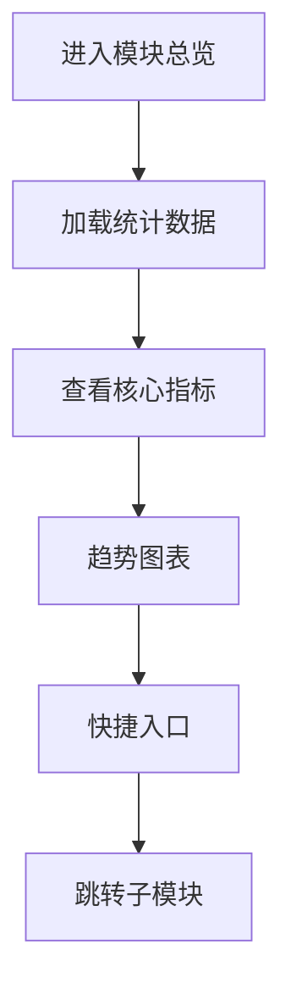

# 商家管理模块总览

## 1. 页面概述
### 功能描述
多商户商城核心，管理商家入驻、审核、信息、商品等。本页面负责商家管理模块总览的管理操作，支持数据的增删改查、搜索筛选和状态管理。

### 核心指标
| 指标 | 含义 | 业务价值 |
|------|------|----------|
| 数据总数 | 当前模块记录总数 | 衡量业务规模 |
| 今日新增 | 今日新创建记录数 | 衡量运营活跃度 |
| 启用数量 | 状态为启用的记录数 | 衡量有效数据量 |
| 待处理 | 需要审核或处理的记录数 | 及时处理提醒 |

### 使用场景
1. 日常管理：新增/编辑/删除数据
2. 数据查询：搜索筛选定位记录
3. 状态管理：启用/禁用/审核操作
4. 数据统计：查看业务数据趋势

---

## 2. API接口清单（基于真实控制器实现）
| 方法 | 路径 | 控制器方法 | 说明 | 权限标识 |
|------|------|-----------|------|----------|
| GET | /api/v1/admin/merchant/_index | MerchantController@index | 商家管理模块总览列表 | merchant:list |
| POST | /api/v1/admin/merchant/_index | MerchantController@store | 新增商家管理模块总览 | merchant:create |
| GET | /api/v1/admin/merchant/_index/{id} | MerchantController@show | 商家管理模块总览详情 | merchant:view |
| PUT | /api/v1/admin/merchant/_index/{id} | MerchantController@update | 编辑商家管理模块总览 | merchant:edit |
| DELETE | /api/v1/admin/merchant/_index/{id} | MerchantController@destroy | 删除商家管理模块总览 | merchant:delete |

### 请求参数
| 参数 | 类型 | 必填 | 说明 |
|------|------|------|------|
| page | int | 否 | 页码，默认1 |
| limit | int | 否 | 每页数量，默认20 |
| keyword | string | 否 | 搜索关键词 |
| status | int | 否 | 状态筛选 |
| start_date | date | 否 | 开始日期 |
| end_date | date | 否 | 结束日期 |

### 返回示例
```json
{
  "code": 0,
  "message": "success",
  "data": {
    "total": 100,
    "page": 1,
    "limit": 20,
    "list": [
      {"id": 1, "name": "示例数据", "status": 1, "created_at": "2026-09-01 10:00:00"}
    ]
  },
  "timestamp": 1756700000
}
```

### 错误码
| 错误码 | 说明 |
|--------|------|
| 10001 | 无权限操作 |
| 10002 | 数据不存在或已删除 |
| 10003 | 参数校验失败 |
| 10004 | 数据库操作失败 |
| 10005 | 数据已存在，不可重复创建 |

---

## 3. 字段映射表
| 展示字段 | 数据来源 | 计算方式 | 更新频率 |
|----------|----------|----------|----------|
| ID | merchant.id | 直接读取 | 实时 |
| 名称 | merchant.name | 直接读取 | 实时 |
| 状态 | merchant.status | 0禁用1启用 | 实时 |
| 创建时间 | merchant.created_at | 直接读取 | 实时 |

---

## 4. 操作流程
### 商家管理模块总览业务流程图


### 数据刷新机制
1. 页面加载时自动请求最新数据
2. 搜索筛选条件变化时立即刷新
3. 增删改操作成功后自动刷新列表
4. 统计数据缓存时间：5分钟

---

## 5. 权限控制
| 操作 | 权限标识 | 默认角色 |
|------|----------|----------|
| 查看列表 | merchant:list | 管理员 |
| 新增 | merchant:create | 管理员 |
| 编辑 | merchant:edit | 管理员 |
| 删除 | merchant:delete | 管理员 |

### 权限说明
- 权限通过Sanctum中间件校验，在路由组中统一配置
- 超级管理员拥有所有权限，不受权限点限制
- 无权限用户访问API返回403，前端隐藏对应操作按钮

---

## 6. 关联模块
### 依赖模块
| 模块 | 依赖内容 | 具体关联字段 |
|------|----------|-------------|
| 用户管理 | 商家关联用户 | merchants.user_id → users.id |
| 商品分类 | 商家经营类目 | merchants.category_id → product_categories.id |

### 被依赖模块
| 模块 | 使用方式 | 具体关联字段 |
|------|----------|-------------|
| 商品管理 | 商品归属商家 | products.merchant_id → merchants.id |
| 订单管理 | 订单归属商家 | orders.merchant_id → merchants.id |
| 财务管理 | 商家结算 | merchant_settlements.merchant_id → merchants.id |

---

## 7. 验收清单
### 功能验收
- [ ] 页面能正常加载，无白屏/500错误
- [ ] 列表分页正常，显示总数和页码
- [ ] 搜索功能正常，支持关键词模糊查询
- [ ] 筛选功能正常，支持状态和时间范围
- [ ] 新增功能完整，表单校验正确
- [ ] 编辑能正确回显所有字段
- [ ] 删除有确认弹窗，软删除不影响历史数据
- [ ] 状态切换功能正常
- [ ] 数据导出功能正常（如有）
- [ ] 批量操作功能正常（如有）

### 权限验收
- [ ] 有权限的管理员可以正常操作
- [ ] 无权限的管理员看到403或入口隐藏
- [ ] 超级管理员不受权限限制

### 性能验收
- [ ] 页面加载时间 < 2秒
- [ ] 数据查询耗时 < 500ms
- [ ] 列表分页响应 < 1秒
- [ ] 并发100用户无明显延迟

---

## 8. 常见问题
| 问题 | 原因 | 解决方案 |
|------|------|----------|
| 商家入驻审核不通过 | 资质材料不全或不符合要求 | 检查营业执照、法人身份证、经营类目等材料 |
| 商家无法登录 | 账号未审核通过或被禁用 | 确认merchants.status=1且merchant_users状态正常 |
| 商家结算金额错误 | 佣金比例配置或订单统计问题 | 检查merchant_settlements计算逻辑，含平台佣金/退款 |
| 商家商品审核不显示 | 商品审核流程未配置 | 检查系统设置中的商品审核开关 |
| 商家分类无法删除 | 分类下有商家 | 先转移商家到其他分类 |
| 商家账户日志缺失 | 日志记录未开启 | 检查merchant_logs记录逻辑，关键操作必须记录 |
| 商家等级不生效 | 等级规则未配置或未达到条件 | 检查merchant_levels配置和升级条件 |
| 商家提现失败 | 账户余额不足或提现信息错误 | 检查merchants.balance和提现银行卡信息 |
