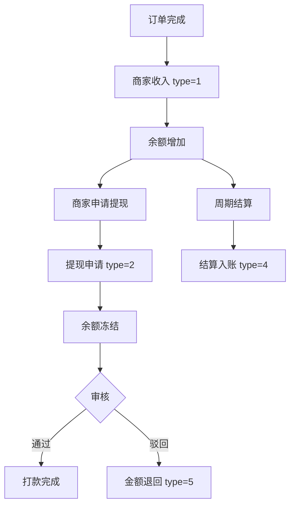

# 账户日志

## 1. 页面概述
账户日志记录商家资金账户的所有变动明细，包括订单收入、提现申请、佣金扣除、结算入账等。管理员可在此查看所有商家的资金流水，支持按商家和类型筛选。

### 资金类型枚举
| type | 类型 | 说明 |
|------|------|------|
| 1 | 订单收入 | 订单完成后商家收入 |
| 2 | 提现申请 | 商家申请提现 |
| 3 | 佣金扣除 | 平台佣金扣除 |
| 4 | 结算入账 | 周期结算入账 |
| 5 | 提现驳回 | 提现申请被驳回退回 |

## 2. API接口清单
| 方法 | 路径 | 控制器方法 | 说明 |
|------|------|-----------|------|
| GET | /api/v1/admin/merchant-account-logs | MerchantAccountLogController@index | 账户日志列表（分页+筛选） |

## 3. 请求参数
| 参数 | 类型 | 必填 | 说明 |
|------|------|------|------|
| page | int | 否 | 页码 |
| limit | int | 否 | 每页数量 |
| merchant_id | int | 否 | 按商家筛选 |
| type | int | 否 | 按类型筛选（1-5） |

## 4. 字段映射表（merchant_account_logs表，9字段）
| 字段 | 类型 | 说明 |
|------|------|------|
| id | bigint | 主键 |
| merchant_id | bigint | 商家ID |
| type | tinyint | 资金类型（1-5） |
| amount | decimal(10,2) | 变动金额 |
| balance | decimal(10,2) | 变动后余额 |
| order_no | varchar(50) | 关联订单号 |
| remark | varchar(255) | 备注说明 |
| created_at | timestamp | 发生时间 |
| updated_at | timestamp | 更新时间 |

> 关联字段：通过merchant_id关联merchants表，返回商家名称（shop_name）。

## 5. 操作流程

## 6. 权限控制
- 认证：Sanctum Token
- 中间件：auth:sanctum

## 7. 关联模块
- 依赖：商家管理（merchant_id）、订单管理（order_no）
- 被依赖：财务管理（提现管理、商家结算）

## 8. 验收清单
- [x] 账户日志列表正常加载
- [x] 按商家筛选正常
- [x] 按类型筛选正常
- [x] 分页功能正常
- [x] 关联商家名称正常显示
- [x] 金额和余额字段正确

## 9. 常见问题
| 问题 | 原因 | 解决方案 |
|------|------|----------|
| 商家名称显示为空 | merchant_id关联失败 | 检查merchants表是否有对应商家 |
| 余额与实际不符 | 日志记录不完整 | 检查所有资金变动是否都记录日志 |
