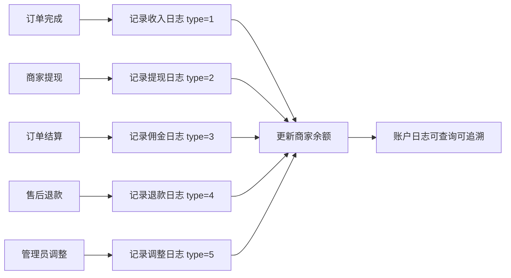

# 账户日志

## 1. 页面概述
账户日志记录商家资金的每一笔变动，包括订单收入、提现申请、平台佣金扣除、退款、人工调整等。每条日志记录变动前余额、变动后余额、操作人和关联订单号，确保资金流向可追溯。

### 账户类型枚举
| type | 含义 | 方向 |
|------|------|------|
| 1 | 订单收入 | +收入 |
| 2 | 提现申请 | -支出 |
| 3 | 平台佣金 | -支出 |
| 4 | 退款 | -支出 |
| 5 | 人工调整 | +/- |

## 2. API接口清单
| 方法 | 路径 | 控制器方法 | 说明 |
|------|------|-----------|------|
| GET | /api/v1/admin/merchant-account-logs | MerchantAccountLogController@index | 日志列表（分页+筛选+按类型统计） |
| GET | /api/v1/admin/merchant-account-logs/stats | MerchantAccountLogController@stats | 资金统计汇总 |
| GET | /api/v1/admin/merchant-account-logs/{id} | MerchantAccountLogController@show | 日志详情 |

## 3. 请求参数
### 列表筛选
| 参数 | 类型 | 说明 |
|------|------|------|
| merchant_id | int | 按商家筛选 |
| type | int | 按类型筛选（1-5） |
| keyword | string | 按订单号/备注/商家名搜索 |
| start_time/end_time | string | 按时间范围筛选 |
| page/limit | int | 分页 |

## 4. 字段映射表（merchant_account_logs表，13字段）
| 字段 | 类型 | 说明 |
|------|------|------|
| id | bigint | 主键 |
| merchant_id | bigint | 商家ID |
| type | tinyint | 类型（1收入/2提现/3佣金/4退款/5调整） |
| amount | decimal(10,2) | 变动金额 |
| before_balance | decimal(12,2) | 变动前余额 |
| after_balance | decimal(12,2) | 变动后余额 |
| balance | decimal(10,2) | 当前余额（兼容字段） |
| order_no | varchar(50) | 关联订单号 |
| remark | varchar(255) | 备注 |
| operator_id | bigint | 操作人ID |
| operator_type | varchar(20) | 操作人类型（admin/merchant/system） |
| created_at | timestamp | 创建时间 |
| updated_at | timestamp | 更新时间 |

## 5. 操作流程

## 6. 权限控制
- 认证：Sanctum Token，中间件auth:sanctum

## 7. 关联模块
- 依赖：商家管理（merchant_id）、订单管理（order_no）、财务管理（提现/结算）
- 被依赖：商家端（商家查看自己的账户日志）

## 8. 验收清单
- [x] 日志列表正常加载（3条测试数据）
- [x] 按商家/类型/关键词/时间筛选正常
- [x] 按类型统计正常（stats接口）
- [x] 日志详情正常（含商家名称）
- [x] 资金统计汇总正常（收入/提现/佣金/净收入）
- [x] 变动前后余额字段完整
- [x] 操作人字段完整

## 9. 常见问题
| 问题 | 原因 | 解决方案 |
|------|------|----------|
| 余额对不上 | before_balance/after_balance未正确计算 | 记录日志时先查当前余额作为before，计算after |
| 统计金额不准 | 类型筛选遗漏 | 确认type枚举完整覆盖所有资金变动场景 |
