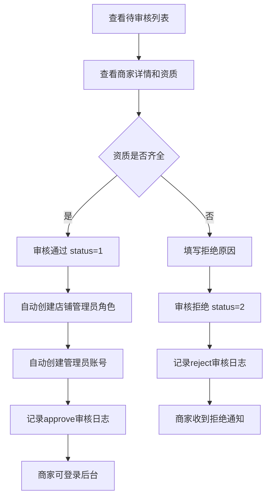

# 入驻审核

## 1. 页面概述
入驻审核管理商家入驻申请，管理员在此审核待审核商家，通过或拒绝申请。审核通过后自动创建店铺管理员账号，商家可使用联系电话+admin123登录商家后台。

### 审核要点
- 商家资质（营业执照、法人身份证、银行账户）
- 联系人信息真实性
- 商家分类合理性
- 经营地址完整性
- 入驻协议签署状态

## 2. API接口清单
| 方法 | 路径 | 控制器方法 | 说明 |
|------|------|-----------|------|
| GET | /api/v1/admin/merchants | MerchantController@index | 商家列表（筛选status=0待审核） |
| GET | /api/v1/admin/merchants/{id} | MerchantController@show | 商家详情（含资质信息+审核日志） |
| POST | /api/v1/admin/merchants/{id}/audit | MerchantController@audit | 审核商家（通过/拒绝） |

## 3. 请求参数
### 审核商家
| 参数 | 类型 | 必填 | 说明 |
|------|------|------|------|
| status | int | 是 | 1=通过，2=拒绝 |
| reject_reason | string | 否 | 拒绝原因（拒绝时建议填写） |

> 前置条件：商家status必须为0（待审核）。
> 审核通过后：status→1，记录approved_at，自动创建shop_roles超级管理员角色+shop_admins管理员账号（username=contact_mobile, password=admin123），记录approve审核日志。
> 审核拒绝后：status→2，记录reject_reason，记录reject审核日志。

## 4. 字段映射表
审核时关注的商家字段：
| 字段 | 说明 |
|------|------|
| name | 商家名称 |
| username | 商家登录账号（=contact_mobile） |
| company_name | 公司名称 |
| business_license | 营业执照号 |
| legal_person | 法人姓名 |
| id_card | 法人身份证号 |
| id_card_front/id_card_back | 身份证正反面 |
| bank_name | 开户行 |
| bank_account | 银行账户 |
| bank_account_name | 开户人 |
| qualification_images | 资质图片（JSON） |
| agreement_version | 协议版本 |
| agreement_signed_at | 协议签署时间 |
| contact_name | 联系人 |
| contact_mobile | 联系电话 |
| category_id | 经营分类 |
| address | 经营地址 |
| reject_reason | 拒绝原因 |
| approved_at | 审核通过时间 |

### 审核日志表（merchant_audit_logs，7字段）
| 字段 | 类型 | 说明 |
|------|------|------|
| id | bigint | 主键 |
| merchant_id | bigint | 商家ID |
| admin_id | bigint | 操作管理员ID |
| action | varchar(50) | submit/approve/reject/disable/enable |
| before_status | tinyint | 操作前状态 |
| after_status | tinyint | 操作后状态 |
| remark | varchar(255) | 备注 |
| created_at | timestamp | 操作时间 |

## 5. 操作流程

## 6. 权限控制
- 认证：Sanctum Token
- 中间件：auth:sanctum

## 7. 验收清单
- [x] 待审核商家列表正常显示
- [x] 商家详情展示资质信息（营业执照/身份证/银行账户）
- [x] 商家详情展示审核日志历史
- [x] 审核通过功能正常（status 0→1，记录approved_at）
- [x] 审核通过自动创建店铺管理员角色（shop_roles）
- [x] 审核通过自动创建管理员账号（shop_admins，password=admin123）
- [x] 审核拒绝功能正常（status 0→2，记录reject_reason）
- [x] 审核操作记录审核日志（merchant_audit_logs）
- [x] 已审核商家不能重复审核
- [x] 拒绝时可填写拒绝原因

## 8. 常见问题
| 问题 | 原因 | 解决方案 |
|------|------|----------|
| 审核提示"该商家已审核" | status不是0 | 只有待审核商家可审核 |
| 审核后商家无法登录 | 账号密码错误 | 默认账号=contact_mobile，密码=admin123 |
| 拒绝后商家无法重新申请 | 需联系平台 | 商家可修改资料后重新提交 |
| 审核日志不显示 | admin_id为null | 已修复，记录操作管理员ID |
