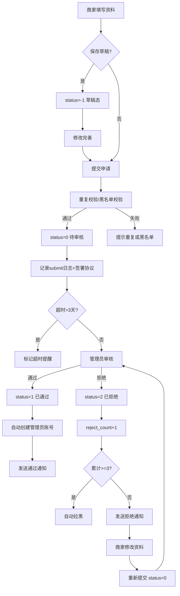

# 入驻审核

## 1. 页面概述
入驻审核管理商家入驻全生命周期，支持草稿保存、提交申请、资质审核、拒绝重提、黑名单风控、超时提醒、通知推送等完整工作流。审核通过后自动创建店铺管理员账号，商家可使用联系电话+admin123登录商家后台。

### 审核工作台统计（6项）
| 指标 | 说明 |
|------|------|
| pending | 待审核数量 |
| today_submitted | 今日提交 |
| today_approved | 今日通过 |
| today_rejected | 今日拒绝 |
| overdue | 超时未审（>3天） |
| avg_audit_hours | 平均审核时长（小时） |

### 商家状态枚举
| status | 状态 | 说明 |
|--------|------|------|
| -1 | 草稿 | 资料暂存，未提交 |
| 0 | 待审核 | 已提交，等待审核 |
| 1 | 已通过 | 审核通过，正常经营 |
| 2 | 已拒绝 | 审核拒绝，可重新提交 |
| 3 | 已禁用 | 平台禁用 |

## 2. API接口清单
| 方法 | 路径 | 控制器方法 | 说明 |
|------|------|-----------|------|
| GET | /api/v1/admin/merchants/audit-stats | MerchantController@auditStats | 审核工作台统计 |
| GET | /api/v1/admin/merchants/reject-templates | MerchantController@rejectTemplates | 拒绝原因模板列表 |
| POST | /api/v1/admin/merchants/draft | MerchantController@draft | 保存入驻草稿 |
| POST | /api/v1/admin/merchants | MerchantController@store | 提交入驻申请 |
| GET | /api/v1/admin/merchants/{id} | MerchantController@show | 商家详情（含审核日志+通知） |
| POST | /api/v1/admin/merchants/{id}/audit | MerchantController@audit | 审核商家（通过/拒绝） |
| POST | /api/v1/admin/merchants/{id}/resubmit | MerchantController@resubmit | 拒绝后重新提交 |
| POST | /api/v1/admin/merchants/{id}/blacklist | MerchantController@blacklist | 加入/解除黑名单 |

## 3. 请求参数
### 提交入驻申请
| 参数 | 类型 | 必填 | 说明 |
|------|------|------|------|
| user_id | int | 是 | 关联用户ID |
| name | string | 是 | 商家名称（唯一） |
| contact_name | string | 是 | 联系人 |
| contact_mobile | string | 是 | 联系电话（同时作为登录账号） |
| category_id | int | 是 | 商家分类ID |
| company_name | string | 否 | 公司名称 |
| business_license | string | 否 | 营业执照号 |
| legal_person | string | 否 | 法人姓名 |
| id_card | string | 否 | 法人身份证号 |
| id_card_front/back | string | 否 | 身份证正反面 |
| bank_name | string | 否 | 开户行 |
| bank_account | string | 否 | 银行账户 |
| bank_account_name | string | 否 | 开户人 |
| qualification_images | string | 否 | 资质图片（JSON） |
| agreement_version | string | 否 | 协议版本 |
| source | string | 否 | 入驻来源（admin/h5/pc/invite） |
| province_id/city_id/district_id | int | 否 | 地区ID |
| address | string | 否 | 详细地址 |

> 入驻时自动创建登录账号：username=contact_mobile，password=admin123。
> 重复校验：同一contact_mobile或business_license已有status=0/1记录时阻止提交。
> 黑名单校验：contact_mobile在黑名单中时阻止提交。
> 协议签署：提交时自动记录agreement_signed_at和agreement_signed_ip。

### 审核商家
| 参数 | 类型 | 必填 | 说明 |
|------|------|------|------|
| status | int | 是 | 1=通过，2=拒绝 |
| reject_reason | string | 否 | 拒绝原因（可从模板选择） |

> 审核通过：status→1，自动创建shop_roles超级管理员角色+shop_admins管理员账号，发送approve通知。
> 审核拒绝：status→2，reject_count+1，发送reject通知。累计拒绝3次自动拉黑。

### 重新提交
| 参数 | 类型 | 必填 | 说明 |
|------|------|------|------|
| name/contact_name/contact_mobile | string | 否 | 更新的字段 |
| company_name/business_license | string | 否 | 更新的资质 |
| bank_name/bank_account | string | 否 | 更新的银行信息 |

> 前置条件：status必须为2（已拒绝）。重新提交后status→0，清除reject_reason。

### 黑名单操作
| 参数 | 类型 | 必填 | 说明 |
|------|------|------|------|
| reason | string | 否 | 拉黑原因（拉黑时必填） |

> 拉黑：is_blacklisted=1，status→3，记录blacklist_reason和blacklist_at。
> 解除：is_blacklisted=0，清除拉黑原因。

## 4. 字段映射表
### merchants表（P0新增7字段，共54字段）
| 字段 | 类型 | 说明 |
|------|------|------|
| draft_data | text | 入驻草稿数据（JSON） |
| agreement_signed_ip | varchar(50) | 协议签署IP |
| is_blacklisted | tinyint | 是否黑名单（0否1是） |
| blacklist_reason | varchar(255) | 拉黑原因 |
| blacklist_at | timestamp | 拉黑时间 |
| source | varchar(50) | 入驻来源 |
| reject_count | int | 累计拒绝次数 |

### merchant_audit_logs表（审核日志，7字段）
| 字段 | 类型 | 说明 |
|------|------|------|
| id | bigint | 主键 |
| merchant_id | bigint | 商家ID |
| admin_id | bigint | 操作管理员 |
| action | varchar(50) | submit/approve/reject/resubmit/disable/enable/blacklist/unblacklist |
| before_status | tinyint | 操作前状态 |
| after_status | tinyint | 操作后状态 |
| remark | varchar(255) | 备注 |
| created_at | timestamp | 操作时间 |

### merchant_notifications表（商家通知，6字段）
| 字段 | 类型 | 说明 |
|------|------|------|
| id | bigint | 主键 |
| merchant_id | bigint | 商家ID |
| type | varchar(50) | approve/reject/system |
| title | varchar(255) | 通知标题 |
| content | text | 通知内容 |
| is_read | tinyint | 是否已读 |
| created_at | timestamp | 创建时间 |

### merchant_reject_templates表（拒绝模板，5字段）
| 字段 | 类型 | 说明 |
|------|------|------|
| id | int | 主键 |
| title | varchar(100) | 模板标题 |
| content | varchar(255) | 模板内容 |
| sort | int | 排序 |
| status | tinyint | 状态 |

> 预设5条模板：资料不全、资质不符、重复入驻、信息不实、经营类目受限。

## 5. 操作流程

## 6. 权限控制
- 认证：Sanctum Token
- 中间件：auth:sanctum
- 当前无细粒度权限

## 7. 关联模块
- 依赖：用户管理（user_id）、商家分类（category_id）、商家等级（level）
- 被依赖：商家端（登录账号）、商家权限（shop_admins.shop_id）、财务管理（商家结算）、通知系统（merchant_notifications）

## 8. 验收清单
- [x] 入驻申请正常提交（含资质/银行/协议字段）
- [x] 重复提交校验（同手机号/营业执照阻止）
- [x] 黑名单校验（黑名单手机号阻止入驻）
- [x] 草稿保存功能（status=-1）
- [x] 审核通过正常（status 0→1，记录approved_at）
- [x] 审核通过自动创建店铺管理员角色+账号
- [x] 审核拒绝正常（status 0→2，reject_count+1）
- [x] 累计拒绝3次自动拉黑
- [x] 拒绝后重新提交（status 2→0，清除拒绝原因）
- [x] 黑名单加入/解除正常
- [x] 审核操作记录完整日志（8种action类型）
- [x] 审核通过/拒绝发送站内通知
- [x] 商家详情返回审核日志+通知列表
- [x] 待审核超3天标记is_overdue
- [x] 列表返回7项统计（含超时/黑名单）
- [x] 审核工作台6项统计（含平均审核时长）
- [x] 拒绝原因模板5条预设
- [x] 协议签署记录时间+IP

## 9. 常见问题
| 问题 | 原因 | 解决方案 |
|------|------|----------|
| 入驻提示重复提交 | 同手机号/营业执照已有审核中或通过记录 | 使用不同手机号或联系平台处理 |
| 入驻提示黑名单 | 该手机号累计拒绝3次或被手动拉黑 | 联系平台申诉解除黑名单 |
| 审核提示未签署协议 | agreement_signed_at为空 | 重新提交入驻申请自动签署 |
| 拒绝后无法重新提交 | status不是2 | 只有已拒绝商家可重新提交 |
| 审核统计avg_audit_hours为0 | 无审核通过的商家 | 有通过记录后自动计算 |
| 商家收不到通知 | 仅实现站内信通知 | 短信/邮件通知需后续对接短信/邮件服务 |
