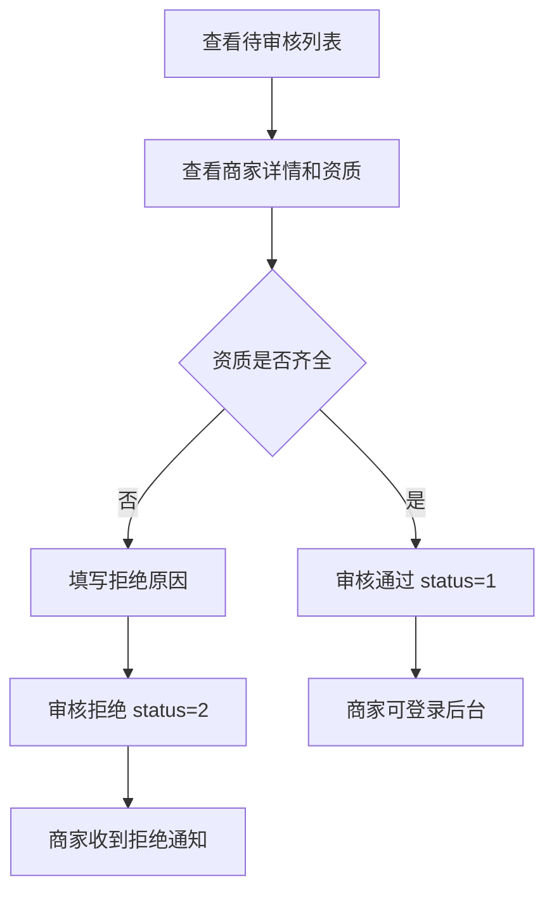

# 入驻审核

## 1. 页面概述
入驻审核管理商家入驻申请，管理员在此审核待审核商家，通过或拒绝申请。审核通过后商家可登录商家后台发布商品、处理订单。

### 审核要点
- 商家资质（营业执照、法人信息）
- 联系人信息真实性
- 商家分类合理性
- 经营地址完整性

## 2. API接口清单
| 方法 | 路径 | 控制器方法 | 说明 |
|------|------|-----------|------|
| GET | /api/v1/admin/merchants | MerchantController@index | 商家列表（筛选status=0） |
| GET | /api/v1/admin/merchants/{id} | MerchantController@show | 商家详情（含资质信息） |
| POST | /api/v1/admin/merchants/{id}/audit | MerchantController@audit | 审核商家 |

## 3. 请求参数
### 审核商家
| 参数 | 类型 | 必填 | 说明 |
|------|------|------|------|
| status | int | 是 | 1=通过，2=拒绝 |
| reject_reason | string | 否 | 拒绝原因（拒绝时必填） |

> 前置条件：商家status必须为0（待审核）。审核通过后status→1，记录approved_at；拒绝后status→2，记录reject_reason。

## 4. 字段映射表
审核时关注的商家字段：
| 字段 | 说明 |
|------|------|
| name | 商家名称 |
| company_name | 公司名称 |
| business_license | 营业执照图片 |
| legal_person | 法人姓名 |
| id_card | 法人身份证号 |
| id_card_front/id_card_back | 身份证正反面 |
| contact_name | 联系人 |
| contact_mobile | 联系电话 |
| category_id | 经营分类 |
| address | 经营地址 |
| reject_reason | 拒绝原因 |
| approved_at | 审核通过时间 |

## 5. 操作流程

## 6. 权限控制
- 认证：Sanctum Token
- 中间件：auth:sanctum

## 7. 验收清单
- [x] 待审核商家列表正常显示
- [x] 商家详情展示资质信息
- [x] 审核通过功能正常（status 0→1，记录approved_at）
- [x] 审核拒绝功能正常（status 0→2，记录reject_reason）
- [x] 已审核商家不能重复审核
- [x] 拒绝时必须填写拒绝原因

## 8. 常见问题
| 问题 | 原因 | 解决方案 |
|------|------|----------|
| 审核提示"该商家已审核" | status不是0 | 只有待审核商家可审核 |
| 拒绝后商家无法重新申请 | 需联系平台 | 商家可修改资料后重新提交 |
