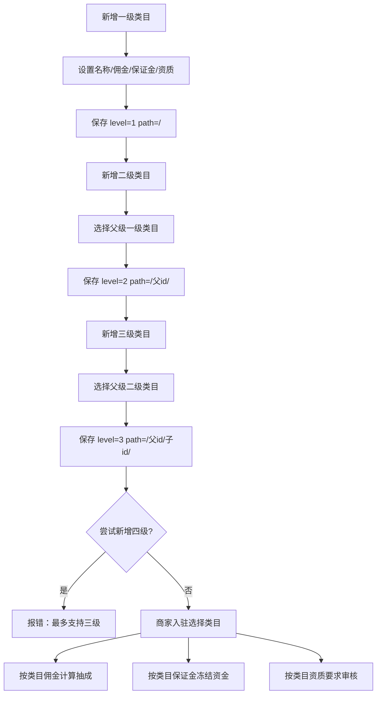

# 商家分类

## 1. 页面概述
商家分类是多商户商城的类目体系，支持三级层级结构（一级行业→二级细分→三级叶子类目）。每个类目可独立设置佣金比例、保证金、所需资质。商家入驻时选择所属类目，平台按类目费率计算抽成，按类目保证金要求冻结资金，按类目资质要求审核商家。

### 类目层级体系
| 层级 | 说明 | 示例 |
|------|------|------|
| 一级（level=1） | 行业大类 | 服装鞋帽、数码电器、食品生鲜 |
| 二级（level=2） | 细分品类 | 男装、女装、手机数码 |
| 三级（level=3） | 叶子类目 | T恤、衬衫、智能手机 |

### 核心规则
- 最多支持三级类目，超过三级返回错误
- 子类目继承父类目的path路径（如/1/5/12/）
- 删除有子分类的类目时阻止删除，提示先删子分类
- 删除有商家使用的类目时阻止删除，提示先迁移商家
- 每个类目可独立设置佣金比例、保证金、资质要求

## 2. API接口清单
| 方法 | 路径 | 控制器方法 | 说明 |
|------|------|-----------|------|
| GET | /api/v1/admin/merchant-categories/tree | CategoryController@tree | 类目树形结构（含children） |
| GET | /api/v1/admin/merchant-categories | CategoryController@index | 分类列表（平铺+筛选） |
| POST | /api/v1/admin/merchant-categories | CategoryController@store | 新增分类（自动计算层级） |
| PUT | /api/v1/admin/merchant-categories/{id} | CategoryController@update | 编辑分类 |
| DELETE | /api/v1/admin/merchant-categories/{id} | CategoryController@destroy | 删除分类（含子分类/商家检查） |

## 3. 请求参数
### 新增分类
| 参数 | 类型 | 必填 | 说明 |
|------|------|------|------|
| name | string | 是 | 分类名称（唯一） |
| parent_id | int | 否 | 父级分类ID，0=顶级（默认0） |
| icon | string | 否 | 分类图标 |
| commission_rate | decimal | 否 | 佣金比例（%），0-100 |
| deposit | decimal | 否 | 保证金金额 |
| qualifications | array | 否 | 所需资质列表（JSON数组） |
| sort | int | 否 | 排序（升序） |
| status | int | 否 | 1=启用，0=禁用 |

> 系统自动计算：level（父级level+1）、path（父级path+父级id）。
> 限制：level最大为3，超过返回"最多支持三级类目"。

### 列表筛选
| 参数 | 类型 | 说明 |
|------|------|------|
| keyword | string | 按名称搜索 |
| status | int | 按状态筛选 |
| parent_id | int | 按父级筛选 |
| level | int | 按层级筛选 |

## 4. 字段映射表（merchant_categories表，13字段）
| 字段 | 类型 | 说明 |
|------|------|------|
| id | bigint | 主键 |
| parent_id | bigint | 父级分类ID（0=顶级） |
| level | tinyint | 层级（1/2/3） |
| path | varchar(255) | 层级路径（如/1/5/12/） |
| name | varchar(50) | 分类名称（唯一） |
| icon | varchar(255) | 分类图标 |
| commission_rate | decimal(5,2) | 佣金比例（%） |
| deposit | decimal(10,2) | 保证金金额 |
| qualifications | text | 所需资质（JSON数组） |
| sort | int | 排序（升序） |
| status | tinyint | 1=启用，0=禁用 |
| created_at | timestamp | 创建时间 |
| updated_at | timestamp | 更新时间 |

### 资质示例
| 类目 | 佣金 | 保证金 | 所需资质 |
|------|------|--------|----------|
| 服装鞋帽 | 5% | 5000 | 营业执照、税务登记证 |
| 数码电器 | 3% | 20000 | 营业执照、3C认证、产品质检报告 |
| 食品生鲜 | 8% | 10000 | 营业执照、食品经营许可证、卫生许可证 |
| 智能手机 | 5% | 30000 | 营业执照、3C认证、品牌授权书、进网许可证 |

## 5. 操作流程

## 6. 权限控制
- 认证：Sanctum Token
- 中间件：auth:sanctum
- 当前无细粒度权限

## 7. 关联模块
- 被依赖：商家管理（merchants.category_id）、商品管理（商品类目）、财务管理（按类目佣金结算）、入驻审核（按类目资质审核）

## 8. 验收清单
- [x] 类目树形结构API正常（返回children嵌套）
- [x] 新增一级类目正常（level=1, path=/）
- [x] 新增二级类目正常（自动计算level=2, path=/父id/）
- [x] 新增三级类目正常（自动计算level=3, path=/父id/子id/）
- [x] 新增四级类目被阻止（返回"最多支持三级类目"）
- [x] 佣金比例字段正常保存
- [x] 保证金字段正常保存
- [x] 资质要求（JSON数组）正常保存和解析
- [x] 分类名称唯一约束
- [x] 按level/parent_id/keyword/status筛选正常
- [x] 按sort排序显示
- [x] 删除有子分类的类目被阻止（提示子分类数量）
- [x] 删除有商家的类目被阻止（提示商家数量）
- [x] 编辑类目正常（含修改父级后重新计算层级）
- [x] 15条测试数据（4一级+7二级+4三级）正常展示

## 9. 常见问题
| 问题 | 原因 | 解决方案 |
|------|------|----------|
| 新增类目报500 | 验证规则使用了default:0 | 已修复，使用nullable+代码默认值 |
| 树形结构子分类为空 | parent_id引用了不存在的id | TRUNCATE表后重新插入，确保id连续 |
| 删除类目失败 | 有子分类或商家使用 | 先删除子分类或迁移商家 |
| 佣金比例不生效 | 订单结算未读取类目佣金 | 结算逻辑应关联category_id读取commission_rate |
| 保证金未冻结 | 入驻流程未处理deposit字段 | 商家入驻通过后按类目deposit冻结保证金 |
