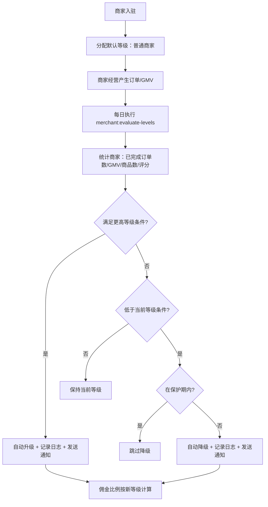

# 商家等级

## 1. 页面概述
商家等级体系通过GMV、订单量、商品数、评分等维度评估商家，自动或手动升降级。不同等级对应不同佣金比例、权益（免运费/专属客服/优先曝光等）和升级门槛。新入驻商家自动分配默认等级，满足条件后自动升级，升级后有保护期防止频繁降级。

### 等级体系示例
| 等级 | 佣金 | GMV要求 | 订单要求 | 商品要求 | 评分要求 | 权益 |
|------|------|---------|----------|----------|----------|------|
| 普通商家 | 5% | 0 | 0 | 0 | 0 | 基础功能 |
| 优质商家 | 3% | 1万 | 50 | 20 | 4.5 | 免运费+优先客服 |
| 旗舰商家 | 1% | 10万 | 500 | 100 | 4.8 | 全部权益+专属客服 |

## 2. API接口清单
| 方法 | 路径 | 控制器方法 | 说明 |
|------|------|-----------|------|
| GET | /api/v1/admin/merchant-levels | MerchantLevelController@index | 等级列表（含各等级商家数统计） |
| GET | /api/v1/admin/merchant-levels/{id} | MerchantLevelController@show | 等级详情（含该等级商家数） |
| POST | /api/v1/admin/merchant-levels | MerchantLevelController@store | 新增等级 |
| PUT | /api/v1/admin/merchant-levels/{id} | MerchantLevelController@update | 编辑等级 |
| DELETE | /api/v1/admin/merchant-levels/{id} | MerchantLevelController@destroy | 删除等级（有商家时阻止） |

### Artisan命令
| 命令 | 说明 |
|------|------|
| php artisan merchant:evaluate-levels | 评估所有商家等级，自动升降级（可配置定时任务每日执行） |

## 3. 请求参数
### 新增/编辑等级
| 参数 | 类型 | 必填 | 说明 |
|------|------|------|------|
| name | string | 是 | 等级名称 |
| description | string | 否 | 等级描述 |
| commission_rate | decimal | 否 | 佣金比例（%） |
| benefits | string(JSON) | 否 | 等级权益（JSON） |
| upgrade_conditions | string(JSON) | 否 | 升级条件（JSON） |
| min_gmv | decimal | 否 | 最低GMV要求 |
| min_orders | int | 否 | 最低订单量要求 |
| min_products | int | 否 | 最低商品数要求 |
| min_rating | decimal | 否 | 最低评分要求 |
| protection_period_days | int | 否 | 升级保护期天数（默认30） |
| is_default | tinyint | 否 | 是否默认等级（新入驻自动分配） |
| sort | int | 否 | 排序 |
| status | tinyint | 否 | 1=启用，0=禁用 |

## 4. 字段映射表
### merchant_levels（13字段）
| 字段 | 类型 | 说明 |
|------|------|------|
| id | int | 主键 |
| name | varchar(100) | 等级名称 |
| description | text | 描述 |
| commission_rate | decimal(5,2) | 佣金比例（%） |
| benefits | text | 等级权益（JSON：免运费/专属客服/优先曝光/自定义页面） |
| upgrade_conditions | text | 升级条件（JSON：自动升级/审核升级） |
| min_gmv | decimal(12,2) | 最低GMV要求 |
| min_orders | int | 最低订单量要求 |
| min_products | int | 最低商品数要求 |
| min_rating | decimal(3,2) | 最低评分要求 |
| protection_period_days | int | 升级保护期天数 |
| is_default | tinyint | 是否默认等级 |
| sort/status/created_at/updated_at | - | 排序/状态/时间戳 |

### merchant_level_logs（7字段）
| 字段 | 类型 | 说明 |
|------|------|------|
| id | bigint | 主键 |
| merchant_id | bigint | 商家ID |
| old_level_id | int | 旧等级ID |
| new_level_id | int | 新等级ID |
| reason | varchar(50) | 变动原因（manual/auto_upgrade/auto_downgrade） |
| remark | varchar(255) | 备注（含评估数据：订单/GMV/商品数） |
| operator_id | bigint | 操作人ID（自动升级为null） |
| created_at | timestamp | 变动时间 |

## 5. 操作流程

## 6. 权限控制
- 认证：Sanctum Token，中间件auth:sanctum
- 等级变更：自动评估通过Artisan命令执行，手动变更需管理员权限

## 7. 关联模块
- 依赖：商家管理（merchants.level字段）、订单管理（GMV/订单数统计）、商品管理（商品数统计）
- 被依赖：财务管理（按等级佣金比例结算）、商家端（展示等级和升级进度）、通知系统（升降级通知）

## 8. 验收清单
- [x] 等级列表正常（3个等级，含各等级商家数统计）
- [x] 等级详情正常（含商家数、权益、升级条件、保护期）
- [x] 新增等级正常（含权益/升级条件/门槛配置）
- [x] 编辑等级正常
- [x] 删除有商家的等级被阻止
- [x] 默认等级配置正常（普通商家is_default=1）
- [x] 升级评估Command正常运行（php artisan merchant:evaluate-levels）
- [x] 等级变更日志表正常（merchant_level_logs）
- [x] 升降级自动发送站内通知
- [x] 升级保护期机制正常（保护期内不降级）
- [x] 动态佣金：结算时读取商家等级对应的commission_rate

## 9. 常见问题
| 问题 | 原因 | 解决方案 |
|------|------|----------|
| 等级不自动变化 | 未配置定时任务执行evaluate-levels | 在crontab中配置每日执行php artisan merchant:evaluate-levels |
| 升级后又降级 | 保护期太短或数据波动 | 调整protection_period_days或升级门槛 |
| 佣金比例不生效 | 结算逻辑未关联等级 | 结算时读取merchants.level→merchant_levels.commission_rate |
| 删除等级失败 | 该等级下有商家 | 先将商家迁移到其他等级 |
