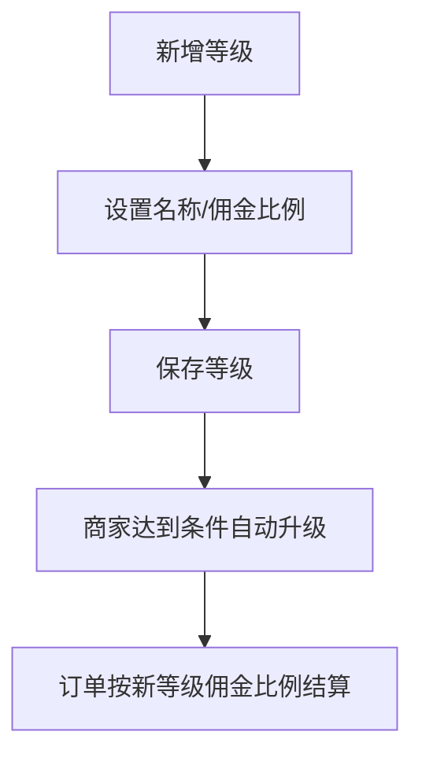

# 商家等级

## 1. 页面概述
商家等级用于对商家进行分级管理，不同等级对应不同的平台佣金比例。等级越高，佣金比例越低，激励商家提升经营表现。

### 等级体系示例
| 等级 | 佣金比例 | 说明 |
|------|----------|------|
| 普通商家 | 5% | 初始等级 |
| 优质商家 | 3% | 经营达标 |
| 旗舰商家 | 1% | 核心商家 |

## 2. API接口清单
| 方法 | 路径 | 控制器方法 | 说明 |
|------|------|-----------|------|
| GET | /api/v1/admin/merchant-levels | MerchantLevelController@index | 等级列表 |
| POST | /api/v1/admin/merchant-levels | MerchantLevelController@store | 新增等级 |
| PUT | /api/v1/admin/merchant-levels/{id} | MerchantLevelController@update | 编辑等级 |
| DELETE | /api/v1/admin/merchant-levels/{id} | MerchantLevelController@destroy | 删除等级 |

## 3. 请求参数
| 参数 | 类型 | 必填 | 说明 |
|------|------|------|------|
| name | string | 是 | 等级名称 |
| description | string | 否 | 等级描述 |
| commission_rate | decimal | 否 | 佣金比例（%） |
| sort | int | 否 | 排序 |
| status | int | 否 | 1=启用，0=禁用 |

## 4. 字段映射表（merchant_levels表，8字段）
| 字段 | 类型 | 说明 |
|------|------|------|
| id | int | 主键 |
| name | varchar(100) | 等级名称 |
| description | text | 等级描述 |
| commission_rate | decimal(5,2) | 佣金比例（%） |
| sort | int | 排序 |
| status | tinyint | 1=启用，0=禁用 |
| created_at | timestamp | 创建时间 |
| updated_at | timestamp | 更新时间 |

## 5. 操作流程

## 6. 权限控制
- 认证：Sanctum Token
- 中间件：auth:sanctum

## 7. 关联模块
- 被依赖：商家管理（merchants.level字段）、财务管理（结算时按等级佣金比例）

## 8. 验收清单
- [x] 等级列表正常加载（按sort排序）
- [x] 新增等级正常
- [x] 编辑等级正常
- [x] 删除等级正常
- [x] 佣金比例字段正确
- [x] 状态切换正常

## 9. 常见问题
| 问题 | 原因 | 解决方案 |
|------|------|----------|
| 修改佣金比例后订单未生效 | 已完成订单按原比例结算 | 新订单按新比例结算 |
| 删除等级后商家异常 | 有商家使用该等级 | 先将商家迁移到其他等级 |
