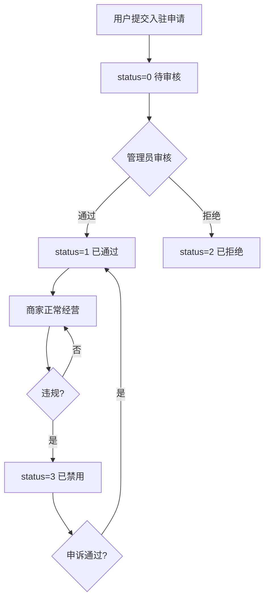

# 商家列表

## 1. 页面概述
商家列表管理平台所有入驻商家，支持查看商家信息、审核状态、账户余额、商品/订单统计，以及启用/禁用商家。商家是多商户商城的核心主体，每个商家拥有独立的商品、订单、财务体系。

### 核心指标
| 指标 | 数据来源 | 含义 |
|------|----------|------|
| 全部 | merchants COUNT(*) | 商家总数 |
| 待审核 | status=0 | 等待入驻审核 |
| 已通过 | status=1 | 正常经营 |
| 已拒绝 | status=2 | 审核拒绝 |
| 已禁用 | status=3 | 平台禁用 |

### 商家状态枚举
| status | 状态 | 说明 |
|--------|------|------|
| 0 | 待审核 | 提交入驻申请，等待审核 |
| 1 | 已通过 | 审核通过，正常经营 |
| 2 | 已拒绝 | 审核拒绝 |
| 3 | 已禁用 | 平台禁用 |

## 2. API接口清单
| 方法 | 路径 | 控制器方法 | 说明 |
|------|------|-----------|------|
| GET | /api/v1/admin/merchants | MerchantController@index | 商家列表（分页+筛选+统计） |
| GET | /api/v1/admin/merchants/{id} | MerchantController@show | 商家详情 |
| PUT | /api/v1/admin/merchants/{id} | MerchantController@update | 编辑商家信息 |
| DELETE | /api/v1/admin/merchants/{id} | MerchantController@destroy | 删除商家（软删除） |
| POST | /api/v1/admin/merchants/{id}/toggle-status | MerchantController@toggleStatus | 启用/禁用商家 |

## 3. 请求参数
### 商家列表
| 参数 | 类型 | 必填 | 说明 |
|------|------|------|------|
| page | int | 否 | 页码 |
| limit | int | 否 | 每页数量 |
| keyword | string | 否 | 按商家名/联系人搜索 |
| status | int | 否 | 按状态筛选（0-3） |
| category_id | int | 否 | 按分类筛选 |

### 编辑商家
| 参数 | 类型 | 必填 | 说明 |
|------|------|------|------|
| name | string | 否 | 商家名称 |
| logo | string | 否 | 商家Logo |
| contact_name | string | 否 | 联系人 |
| contact_mobile | string | 否 | 联系电话 |
| category_id | int | 否 | 分类ID |
| address | string | 否 | 地址 |

## 4. 字段映射表（merchants表，39字段）
| 字段 | 类型 | 说明 |
|------|------|------|
| id | bigint | 主键 |
| user_id | bigint | 关联用户ID |
| name | varchar(100) | 商家名称（唯一） |
| logo | varchar(255) | 商家Logo |
| banner | varchar(255) | 店铺Banner |
| description | text | 店铺描述 |
| category_id | bigint | 商家分类 |
| contact_name | varchar(50) | 联系人 |
| contact_mobile | varchar(20) | 联系电话 |
| contact_email | varchar(100) | 联系邮箱 |
| company_name | varchar(100) | 公司名称 |
| business_license | varchar(255) | 营业执照 |
| legal_person | varchar(50) | 法人 |
| id_card | varchar(30) | 身份证号 |
| province_id/city_id/district_id | bigint | 地区ID |
| address | varchar(255) | 详细地址 |
| balance | decimal(12,2) | 可用余额 |
| frozen | decimal(12,2) | 冻结金额 |
| total_income | decimal(12,2) | 累计收入 |
| total_settlement | decimal(12,2) | 累计结算 |
| product_count | int | 商品数量 |
| order_count | int | 订单数量 |
| rating | decimal(3,2) | 评分 |
| level | tinyint | 商家等级 |
| status | tinyint | 0待审核/1已通过/2已拒绝/3已禁用 |
| reject_reason | varchar(255) | 拒绝原因 |
| approved_at | timestamp | 审核通过时间 |
| created_at | timestamp | 创建时间 |
| deleted_at | timestamp | 软删除 |

## 5. 操作流程

## 6. 权限控制
- 认证：Sanctum Token
- 中间件：auth:sanctum
- 当前无细粒度权限

## 7. 关联模块
- 依赖：用户管理（user_id）、商家分类（category_id）、商家等级（level）
- 被依赖：商品管理（merchant_id）、订单管理（merchant_id）、财务管理（商家结算）、商家端（商家登录）

## 8. 验收清单
- [x] 商家列表正常加载，返回4项状态统计
- [x] 商家详情返回完整信息
- [x] 商家状态切换正常（启用/禁用）
- [x] 编辑商家信息正常
- [x] 删除商家（软删除）正常
- [x] 按状态/关键词/分类筛选正常
- [x] 分页功能正常

## 9. 常见问题
| 问题 | 原因 | 解决方案 |
|------|------|----------|
| 商家名称重复 | name字段唯一约束 | 修改商家名称 |
| 禁用后商家无法登录 | status=3时商家端拒绝登录 | 启用商家后恢复 |
| 商家余额为0 | 无订单收入或已结算 | 查看账户日志确认资金流向 |
