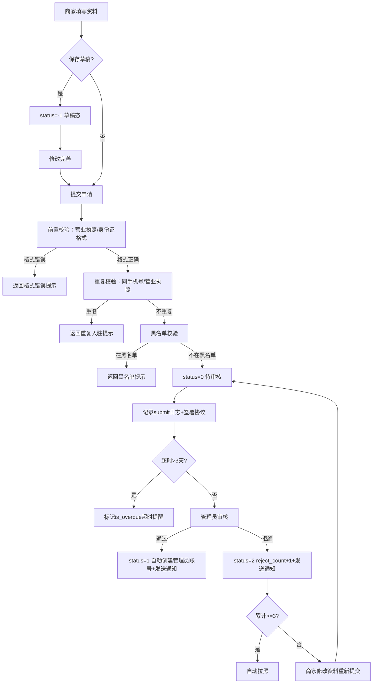

# 商家列表

## 1. 页面概述
商家列表管理平台所有入驻商家的全生命周期，支持入驻申请、草稿保存、资质审核、状态管理、黑名单风控、通知推送等完整工作流。商家是多商户商城的核心主体，每个商家拥有独立的商品、订单、财务体系和登录账号。

### 核心指标（7项统计）
| 指标 | 数据来源 | 含义 |
|------|----------|------|
| 全部 | merchants COUNT(*) | 商家总数 |
| 待审核 | status=0 | 等待入驻审核 |
| 已通过 | status=1 | 正常经营 |
| 已拒绝 | status=2 | 审核拒绝 |
| 已禁用 | status=3 | 平台禁用 |
| 超时未审 | status=0且created_at>3天 | 超时提醒 |
| 黑名单 | is_blacklisted=1 | 风控黑名单 |

### 商家状态枚举
| status | 状态 | 说明 |
|--------|------|------|
| -1 | 草稿 | 资料暂存，未提交 |
| 0 | 待审核 | 已提交，等待审核 |
| 1 | 已通过 | 审核通过，正常经营 |
| 2 | 已拒绝 | 审核拒绝，可重新提交 |
| 3 | 已禁用 | 平台禁用 |

## 2. API接口清单
| 方法 | 路径 | 控制器方法 | 说明 |
|------|------|-----------|------|
| GET | /api/v1/admin/merchants | MerchantController@index | 商家列表（分页+筛选+7项统计+超时标记） |
| POST | /api/v1/admin/merchants/draft | MerchantController@draft | 保存入驻草稿 |
| POST | /api/v1/admin/merchants | MerchantController@store | 提交入驻申请（含前置校验） |
| GET | /api/v1/admin/merchants/audit-stats | MerchantController@auditStats | 审核工作台统计 |
| GET | /api/v1/admin/merchants/reject-templates | MerchantController@rejectTemplates | 拒绝原因模板 |
| GET | /api/v1/admin/merchants/{id} | MerchantController@show | 商家详情（含审核日志+通知） |
| PUT | /api/v1/admin/merchants/{id} | MerchantController@update | 编辑商家信息 |
| DELETE | /api/v1/admin/merchants/{id} | MerchantController@destroy | 删除商家（软删除） |
| POST | /api/v1/admin/merchants/{id}/audit | MerchantController@audit | 审核商家（通过/拒绝） |
| POST | /api/v1/admin/merchants/{id}/resubmit | MerchantController@resubmit | 拒绝后重新提交 |
| POST | /api/v1/admin/merchants/{id}/blacklist | MerchantController@blacklist | 加入/解除黑名单 |
| POST | /api/v1/admin/merchants/{id}/toggle-status | MerchantController@toggleStatus | 启用/禁用商家 |

## 3. 请求参数
### 入驻申请（含前置校验）
| 参数 | 类型 | 必填 | 校验规则 |
|------|------|------|----------|
| user_id | int | 是 | 必须存在于users表 |
| name | string | 是 | 唯一，最长100字符 |
| contact_name | string | 是 | 联系人 |
| contact_mobile | string | 是 | 联系电话（同时作为登录账号） |
| category_id | int | 是 | 必须存在于merchant_categories |
| business_license | string | 否 | 18位统一社会信用代码格式校验 |
| id_card | string | 否 | 18位身份证格式校验 |
| legal_person | string | 否 | 法人姓名 |
| bank_name | string | 否 | 开户行 |
| bank_account | string | 否 | 银行账户 |
| bank_account_name | string | 否 | 开户人 |
| qualification_images | string | 否 | 资质图片（JSON） |
| agreement_version | string | 否 | 协议版本 |
| source | string | 否 | 入驻来源（admin/h5/pc/invite） |
| province_id/city_id/district_id | int | 否 | 地区ID |
| address | string | 否 | 详细地址 |

> 前置校验：营业执照号必须为18位统一社会信用代码格式；身份证号必须为18位标准格式。
> 重复校验：同一contact_mobile或business_license已有status=0/1记录时阻止提交。
> 黑名单校验：contact_mobile在黑名单中时阻止提交。
> 入驻时自动创建登录账号：username=contact_mobile，password=Hash::make('admin123')。
> 协议签署：提交时自动记录agreement_signed_at和agreement_signed_ip。

### 审核商家
| 参数 | 类型 | 必填 | 说明 |
|------|------|------|------|
| status | int | 是 | 1=通过，2=拒绝 |
| reject_reason | string | 否 | 拒绝原因（可从模板选择） |

> 审核通过：status→1，自动创建shop_roles超级管理员角色+shop_admins管理员账号，发送approve站内通知。
> 审核拒绝：status→2，reject_count+1，发送reject站内通知。累计拒绝3次自动拉黑。

### 列表筛选
| 参数 | 类型 | 说明 |
|------|------|------|
| keyword | string | 按商家名/联系人/电话/公司搜索 |
| status | int | 按状态筛选（-1/0/1/2/3） |
| category_id | int | 按分类筛选 |
| level | int | 按等级筛选 |
| is_blacklisted | int | 按黑名单筛选 |
| start_time/end_time | string | 按入驻时间筛选 |

## 4. 字段映射表（merchants表，54字段）
### 基础信息
| 字段 | 类型 | 说明 |
|------|------|------|
| id | bigint | 主键 |
| user_id | bigint | 关联用户ID |
| username | varchar(50) | 商家登录账号（=contact_mobile） |
| password | varchar(255) | 登录密码（Hash::make加密，默认admin123） |
| nickname | varchar(50) | 昵称 |
| name | varchar(100) | 商家名称（唯一） |
| logo | varchar(255) | 商家Logo |
| banner | varchar(255) | 店铺Banner |
| description | text | 店铺描述 |
| category_id | bigint | 商家分类 |
| level | tinyint | 商家等级 |

### 联系信息
| 字段 | 类型 | 说明 |
|------|------|------|
| contact_name | varchar(50) | 联系人 |
| contact_mobile | varchar(20) | 联系电话 |
| contact_email | varchar(100) | 联系邮箱 |
| province_id/city_id/district_id | bigint | 地区ID |
| address | varchar(255) | 详细地址 |

### 资质信息
| 字段 | 类型 | 说明 |
|------|------|------|
| company_name | varchar(100) | 公司名称 |
| business_license | varchar(255) | 营业执照号（18位格式校验） |
| legal_person | varchar(50) | 法人姓名 |
| id_card | varchar(30) | 法人身份证（18位格式校验） |
| id_card_front/back | varchar(255) | 身份证正反面 |
| bank_name | varchar(100) | 开户行 |
| bank_account | varchar(50) | 银行账户 |
| bank_account_name | varchar(50) | 开户人 |
| qualification_images | text | 资质图片（JSON） |

### 协议与来源
| 字段 | 类型 | 说明 |
|------|------|------|
| agreement_version | varchar(20) | 协议版本 |
| agreement_signed_at | timestamp | 协议签署时间 |
| agreement_signed_ip | varchar(50) | 协议签署IP |
| source | varchar(50) | 入驻来源（admin/h5/pc/invite） |
| draft_data | text | 入驻草稿数据（JSON） |

### 财务信息
| 字段 | 类型 | 说明 |
|------|------|------|
| balance | decimal(12,2) | 可用余额 |
| frozen | decimal(12,2) | 冻结金额 |
| total_income | decimal(12,2) | 累计收入 |
| total_settlement | decimal(12,2) | 累计结算 |
| deposit | decimal(10,2) | 保证金 |
| deposit_status | tinyint | 保证金状态（0未缴1已缴） |

### 状态与风控
| 字段 | 类型 | 说明 |
|------|------|------|
| status | tinyint | -1草稿/0待审核/1已通过/2已拒绝/3已禁用 |
| reject_reason | varchar(255) | 拒绝原因 |
| reject_count | int | 累计拒绝次数（>=3自动拉黑） |
| approved_at | timestamp | 审核通过时间 |
| is_blacklisted | tinyint | 是否黑名单 |
| blacklist_reason | varchar(255) | 拉黑原因 |
| blacklist_at | timestamp | 拉黑时间 |
| product_count | int | 商品数量 |
| order_count | int | 订单数量 |
| rating | decimal(3,2) | 评分 |
| created_at | timestamp | 创建时间 |
| deleted_at | timestamp | 软删除 |

### 审核日志表（merchant_audit_logs，7字段）
| 字段 | 类型 | 说明 |
|------|------|------|
| id | bigint | 主键 |
| merchant_id | bigint | 商家ID |
| admin_id | bigint | 操作管理员ID |
| action | varchar(50) | submit/approve/reject/resubmit/disable/enable/blacklist/unblacklist |
| before_status | tinyint | 操作前状态 |
| after_status | tinyint | 操作后状态 |
| remark | varchar(255) | 备注 |
| created_at | timestamp | 操作时间 |

### 商家通知表（merchant_notifications，6字段）
| 字段 | 类型 | 说明 |
|------|------|------|
| id | bigint | 主键 |
| merchant_id | bigint | 商家ID |
| type | varchar(50) | approve/reject/system |
| title | varchar(255) | 通知标题 |
| content | text | 通知内容 |
| is_read | tinyint | 是否已读 |
| created_at | timestamp | 创建时间 |

## 5. 操作流程

## 6. 权限控制
- 认证：Sanctum Token
- 中间件：auth:sanctum
- 当前无细粒度权限

## 7. 关联模块
- 依赖：用户管理（user_id）、商家分类（category_id，三级树形类目）、商家等级（level）
- 被依赖：商品管理（merchant_id）、订单管理（merchant_id）、财务管理（商家结算/提现）、商家端（商家登录）、商家权限（shop_admins.shop_id）、通知系统（merchant_notifications）

## 8. 验收清单
### 入驻申请
- [x] 入驻申请正常提交（含资质/银行/协议字段）
- [x] 营业执照号格式校验（18位统一社会信用代码）
- [x] 身份证号格式校验（18位标准格式）
- [x] 重复提交校验（同手机号/营业执照阻止）
- [x] 黑名单校验（黑名单手机号阻止入驻）
- [x] 入驻时自动创建登录账号（username=手机号，password=Hash加密）
- [x] 协议签署记录时间+IP
- [x] 入驻来源记录（source字段）
- [x] 草稿保存功能（status=-1）

### 审核流程
- [x] 审核通过正常（status 0→1，记录approved_at）
- [x] 审核通过自动创建店铺管理员角色+账号
- [x] 审核拒绝正常（status 0→2，reject_count+1）
- [x] 累计拒绝3次自动拉黑
- [x] 拒绝后重新提交（status 2→0，清除拒绝原因）
- [x] 审核操作记录完整日志（admin_id/action/before/after/remark）
- [x] 审核通过/拒绝发送站内通知

### 列表与统计
- [x] 商家列表正常加载，返回7项状态统计
- [x] 待审核超3天标记is_overdue和overdue_days
- [x] 商家详情返回审核日志+通知列表
- [x] 按状态/关键词/分类/等级/黑名单/时间筛选
- [x] 审核工作台6项统计（待审/今日提交/今日通过/今日拒绝/超时/平均审核时长）
- [x] 拒绝原因模板5条预设

### 状态管理
- [x] 商家状态切换正常（启用/禁用，记录日志）
- [x] 黑名单加入/解除正常
- [x] 编辑商家信息正常（含银行账户）
- [x] 删除商家（软删除）正常

## 9. 常见问题
| 问题 | 原因 | 解决方案 |
|------|------|----------|
| 入驻提示营业执照格式错误 | 不是18位统一社会信用代码 | 检查营业执照号格式，应为18位字母数字组合 |
| 入驻提示身份证格式错误 | 不是18位标准身份证号 | 检查身份证号，支持最后一位X |
| 入驻提示重复提交 | 同手机号/营业执照已有审核中或通过记录 | 使用不同手机号或联系平台处理 |
| 入驻提示黑名单 | 该手机号累计拒绝3次或被手动拉黑 | 联系平台申诉解除黑名单 |
| 审核提示未签署协议 | agreement_signed_at为空 | 重新提交入驻申请自动签署 |
| 拒绝后无法重新提交 | status不是2 | 只有已拒绝商家可重新提交 |
| 商家收不到短信/邮件通知 | 仅实现站内信通知 | 短信/邮件通知需后续对接短信/邮件服务 |
| 审核统计avg_audit_hours为0 | 无审核通过的商家 | 有通过记录后自动计算 |
