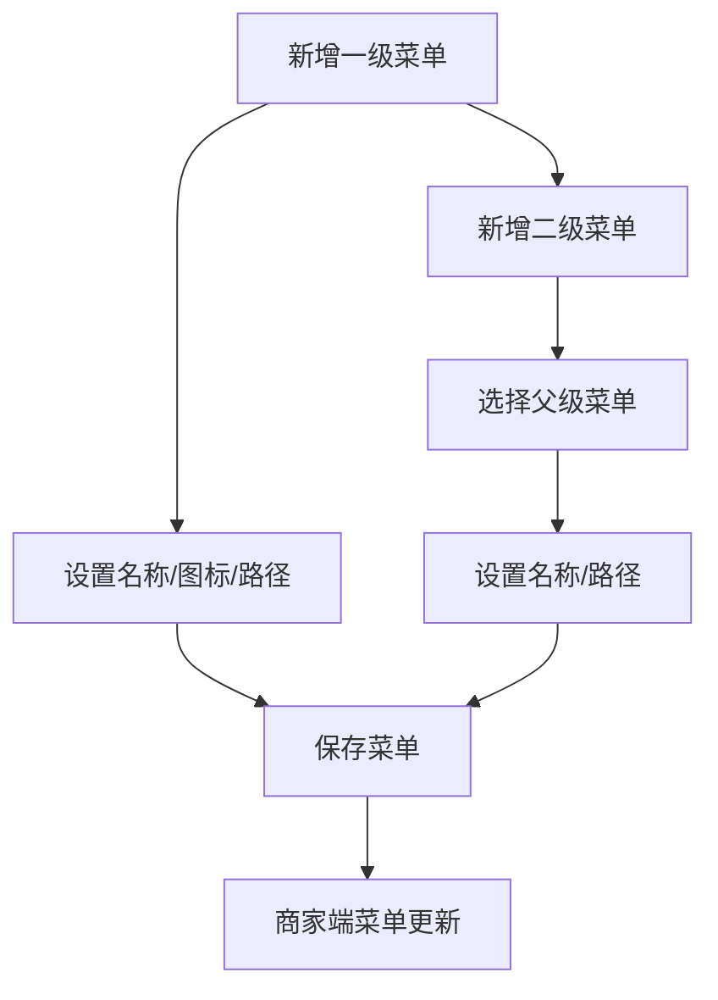

# 商家菜单

## 1. 页面概述
商家菜单管理商家后台的左侧导航菜单结构，支持树形层级菜单。管理员可在此配置商家端可见的菜单，控制商家端的功能入口。

### 菜单层级
- 一级菜单：模块入口（工作台、商品管理、订单管理等）
- 二级菜单：具体功能页面（商品列表、商品分类等）

## 2. API接口清单
| 方法 | 路径 | 控制器方法 | 说明 |
|------|------|-----------|------|
| GET | /api/v1/admin/shop-menu | ShopMenuController@index | 菜单列表 |
| POST | /api/v1/admin/shop-menu | ShopMenuController@store | 新增菜单 |
| PUT | /api/v1/admin/shop-menu/{id} | ShopMenuController@update | 编辑菜单 |
| DELETE | /api/v1/admin/shop-menu/{id} | ShopMenuController@destroy | 删除菜单 |

## 3. 请求参数
| 参数 | 类型 | 必填 | 说明 |
|------|------|------|------|
| name | string | 是 | 菜单名称 |
| path | string | 否 | 路由路径 |
| icon | string | 否 | 菜单图标 |
| parent_id | int | 否 | 父级菜单ID（0为一级） |
| sort | int | 否 | 排序 |
| status | int | 否 | 1=显示，0=隐藏 |

## 4. 字段映射表（shop_menus表，9字段）
| 字段 | 类型 | 说明 |
|------|------|------|
| id | bigint | 主键 |
| parent_id | bigint | 父级菜单ID |
| name | varchar(100) | 菜单名称 |
| path | varchar(255) | 路由路径 |
| icon | varchar(100) | 图标 |
| sort | int | 排序 |
| status | tinyint | 1=显示，0=隐藏 |
| created_at | timestamp | 创建时间 |
| updated_at | timestamp | 更新时间 |

## 5. 操作流程

## 6. 权限控制
- 认证：Sanctum Token
- 中间件：auth:sanctum

## 7. 验收清单
- [x] 菜单列表正常加载（按sort排序）
- [x] 新增菜单正常
- [x] 编辑菜单正常
- [x] 删除菜单正常
- [x] 父子层级关系正常
- [x] 状态切换正常（显示/隐藏）

## 8. 常见问题
| 问题 | 原因 | 解决方案 |
|------|------|----------|
| 商家端菜单不更新 | 缓存未清除 | 清除商家端缓存或重新登录 |
| 删除父级菜单后子菜单异常 | 未级联删除子菜单 | 删除前检查是否有子菜单 |
