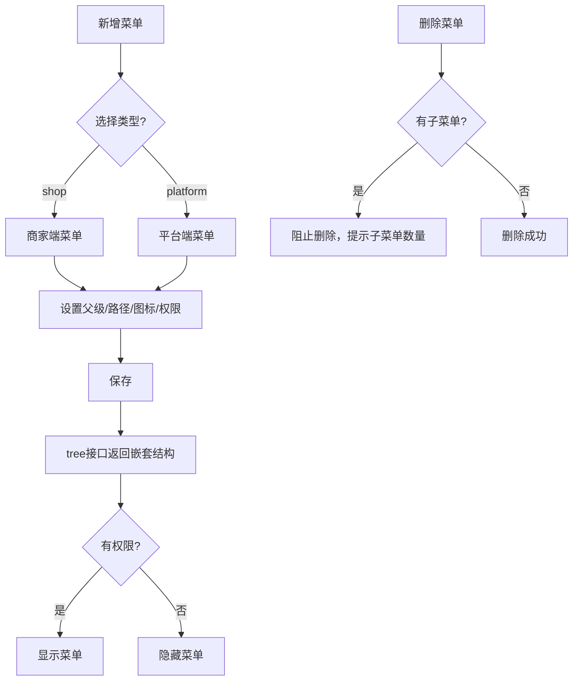

# 商家菜单

## 1. 页面概述
商家菜单管理平台端和商家端两套独立的导航菜单体系，支持树形层级结构、权限绑定、多端分离。每个菜单项可配置路径、图标、排序、状态和权限标识，无权限的用户看不到对应菜单。

### 菜单类型
| type | 说明 | 使用端 |
|------|------|--------|
| shop | 商家端菜单 | 商家后台（/merchant/） |
| platform | 平台端菜单 | 管理后台（/admin/） |

### 核心规则
- 支持多级父子层级（parent_id=0为顶级）
- 每个菜单可绑定permission权限标识
- 平台端和商家端菜单独立管理，通过type字段区分
- 删除有子菜单的父级时阻止删除，提示子菜单数量
- 按sort升序排列，status=1显示，status=0隐藏

## 2. API接口清单
| 方法 | 路径 | 控制器方法 | 说明 |
|------|------|-----------|------|
| GET | /api/v1/admin/shop-menu/tree | ShopMenuController@tree | 菜单树形结构（按type筛选，含children嵌套） |
| GET | /api/v1/admin/shop-menu | ShopMenuController@index | 菜单列表（平铺+筛选） |
| POST | /api/v1/admin/shop-menu | ShopMenuController@store | 新增菜单 |
| PUT | /api/v1/admin/shop-menu/{id} | ShopMenuController@update | 编辑菜单 |
| DELETE | /api/v1/admin/shop-menu/{id} | ShopMenuController@destroy | 删除菜单（含子菜单检查） |

## 3. 请求参数
### 新增/编辑菜单
| 参数 | 类型 | 必填 | 说明 |
|------|------|------|------|
| name | string | 是 | 菜单名称（最长100字符） |
| path | string | 否 | 菜单路径（如/merchant/goods/list） |
| icon | string | 否 | 图标标识 |
| parent_id | int | 否 | 父级菜单ID（0=顶级，默认0） |
| sort | int | 否 | 排序（升序，默认0） |
| status | int | 否 | 1=显示，0=隐藏（默认1） |
| type | string | 否 | shop=商家端，platform=平台端（默认shop） |
| permission | string | 否 | 权限标识（如product:list，无权限时隐藏） |

### tree接口
| 参数 | 类型 | 必填 | 说明 |
|------|------|------|------|
| type | string | 否 | 菜单类型（shop/platform，默认shop） |

> tree接口只返回status=1的菜单，自动构建children嵌套结构。

### 列表筛选
| 参数 | 类型 | 说明 |
|------|------|------|
| type | string | 按类型筛选 |
| keyword | string | 按名称搜索 |
| status | int | 按状态筛选 |

## 4. 字段映射表（shop_menus表，11字段）
| 字段 | 类型 | 说明 |
|------|------|------|
| id | bigint | 主键 |
| parent_id | bigint | 父级菜单ID（0=顶级） |
| name | varchar(100) | 菜单名称 |
| path | varchar(255) | 菜单路径 |
| icon | varchar(100) | 图标标识 |
| sort | int | 排序（升序） |
| status | tinyint | 1=显示，0=隐藏 |
| type | varchar(20) | shop=商家端，platform=平台端 |
| permission | varchar(100) | 权限标识 |
| created_at | timestamp | 创建时间 |
| updated_at | timestamp | 更新时间 |

### 商家端菜单示例（11条）
| 一级菜单 | 子菜单 | 路径 |
|----------|--------|------|
| 工作台 | - | /merchant/dashboard |
| 商品管理 | 商品列表 | /merchant/goods/list |
| 商品管理 | 商品分类 | /merchant/goods/category |
| 订单管理 | 订单列表 | /merchant/order/list |
| 财务管理 | 资金明细 | /merchant/finance/list |
| 财务管理 | 提现管理 | /merchant/finance/withdraw |
| 店铺设置 | 基本信息 | /merchant/setting/info |

### 平台端菜单示例（5条）
| 菜单 | 路径 | 权限标识 |
|------|------|----------|
| 平台工作台 | /admin/dashboard | dashboard:view |
| 平台商品 | - | product:list |
| 平台订单 | - | order:list |
| 平台用户 | /admin/user/list | user:list |
| 平台财务 | - | finance:view |

## 5. 操作流程

## 6. 权限控制
- 认证：Sanctum Token
- 中间件：auth:sanctum
- 菜单级权限：通过permission字段绑定，前端根据当前用户权限过滤菜单
- 当前无细粒度权限点配置，permission字段为预留扩展

## 7. 关联模块
- 被依赖：商家端布局（读取shop类型菜单渲染侧边栏）、管理端布局（读取platform类型菜单）、商家权限（角色与菜单权限关联）

## 8. 验收清单
- [x] 菜单列表正常加载（16条数据）
- [x] 商家端tree接口正常（5个一级菜单，正确嵌套子菜单）
- [x] 平台端tree接口正常（5个一级菜单，含权限标识）
- [x] 新增菜单正常（含type和permission字段）
- [x] 编辑菜单正常
- [x] 删除有子菜单的菜单被阻止（返回"该菜单下有X个子菜单"）
- [x] 删除无子菜单的菜单正常
- [x] 按type筛选正常
- [x] 按keyword搜索正常
- [x] 按status筛选正常
- [x] 按sort升序排列
- [x] tree接口只返回status=1的菜单
- [x] 多端菜单独立（shop和platform互不干扰）

## 9. 常见问题
| 问题 | 原因 | 解决方案 |
|------|------|----------|
| 所有菜单API返回500 | 控制器继承了Controller而非BaseController | 继承App\Core\Controllers\BaseController |
| tree路由404 | 路由用了短类名无use导入 | 使用完整类名App\Modules\...\ShopMenuController |
| 子菜单不显示 | parent_id指向错误的父级ID | 检查parent_id是否对应正确的父菜单id |
| 平台端菜单出现在商家端 | type字段设置错误 | 确认type=shop或platform |
| 删除菜单失败 | 该菜单下有子菜单 | 先删除子菜单再删父菜单 |
