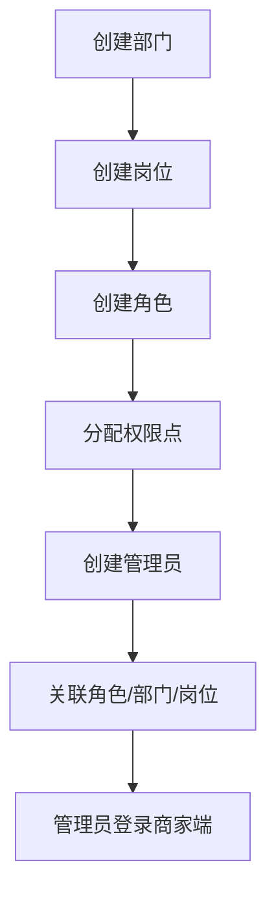

# 商家权限

## 1. 页面概述
商家权限管理商家端的组织架构和权限体系，包括商家管理员、角色、部门、岗位四个维度。通过角色分配权限，管理员关联角色，实现商家端的细粒度权限控制。

### 四个维度
| 维度 | 说明 | 表名 |
|------|------|------|
| 商家管理员 | 商家端登录账号 | shop_admins |
| 商家角色 | 权限集合（超级管理员/运营/财务） | shop_roles |
| 商家部门 | 组织架构（总经办/运营部/财务部） | shop_depts |
| 商家岗位 | 岗位职责（店长/运营专员/财务专员） | shop_jobs |

## 2. API接口清单
| 方法 | 路径 | 控制器方法 | 说明 |
|------|------|-----------|------|
| GET | /api/v1/admin/shop-permission/admins | ShopPermissionController@adminList | 商家管理员列表 |
| GET | /api/v1/admin/shop-permission/roles | ShopPermissionController@roleList | 商家角色列表 |
| GET | /api/v1/admin/shop-permission/depts | ShopPermissionController@deptList | 商家部门列表 |
| GET | /api/v1/admin/shop-permission/jobs | ShopPermissionController@jobList | 商家岗位列表 |

## 3. 请求参数
### 通用筛选
| 参数 | 类型 | 必填 | 说明 |
|------|------|------|------|
| shop_id | int | 否 | 按商家筛选 |
| page | int | 否 | 页码（管理员列表） |
| limit | int | 否 | 每页数量 |

## 4. 字段映射表
### shop_admins（商家管理员，12字段）
| 字段 | 类型 | 说明 |
|------|------|------|
| id | bigint | 主键 |
| shop_id | bigint | 商家ID |
| username | varchar(50) | 登录用户名 |
| password | varchar(255) | 密码（加密） |
| nickname | varchar(50) | 昵称 |
| role_id | bigint | 关联角色 |
| dept_id | bigint | 关联部门 |
| job_id | bigint | 关联岗位 |
| mobile | varchar(20) | 手机号 |
| status | tinyint | 1=启用，0=禁用 |
| last_login_at | timestamp | 最后登录时间 |
| created_at | timestamp | 创建时间 |

### shop_roles（商家角色，7字段）
| 字段 | 类型 | 说明 |
|------|------|------|
| id | bigint | 主键 |
| shop_id | bigint | 商家ID |
| name | varchar(100) | 角色名称 |
| description | varchar(255) | 角色描述 |
| permissions | text | 权限点（JSON） |
| status | tinyint | 状态 |
| created_at | timestamp | 创建时间 |

### shop_depts（商家部门，7字段）
| 字段 | 类型 | 说明 |
|------|------|------|
| id | bigint | 主键 |
| shop_id | bigint | 商家ID |
| parent_id | bigint | 父级部门 |
| name | varchar(100) | 部门名称 |
| sort | int | 排序 |
| status | tinyint | 状态 |
| created_at | timestamp | 创建时间 |

### shop_jobs（商家岗位，6字段）
| 字段 | 类型 | 说明 |
|------|------|------|
| id | bigint | 主键 |
| shop_id | bigint | 商家ID |
| name | varchar(100) | 岗位名称 |
| sort | int | 排序 |
| status | tinyint | 状态 |
| created_at | timestamp | 创建时间 |

## 5. 操作流程

## 6. 权限控制
- 认证：Sanctum Token
- 中间件：auth:sanctum

## 7. 验收清单
- [x] 商家管理员列表正常加载（关联角色名称）
- [x] 商家角色列表正常加载
- [x] 商家部门列表正常加载
- [x] 商家岗位列表正常加载
- [x] 按shop_id筛选正常
- [x] 管理员关联角色显示正常

## 8. 常见问题
| 问题 | 原因 | 解决方案 |
|------|------|----------|
| 管理员列表角色名称为空 | role_id关联失败 | 检查shop_roles表是否有对应角色 |
| 商家端登录无权限 | 角色未分配权限点 | 检查角色permissions字段 |
