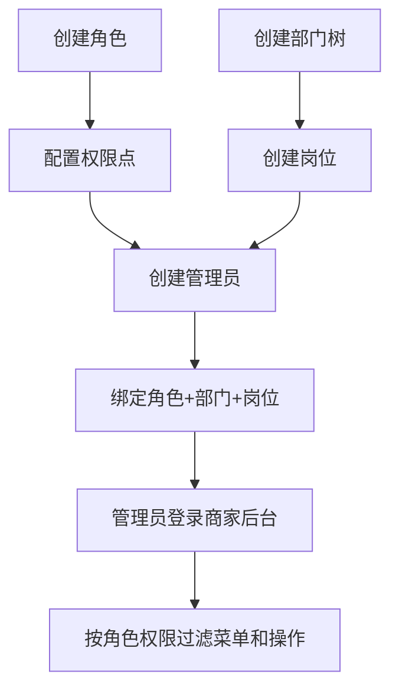

# 商家权限

## 1. 页面概述
商家权限管理商家端后台的组织架构和访问控制，包含管理员、角色、部门、岗位四个维度。每个商家拥有独立的权限体系，管理员绑定角色/部门/岗位，角色配置权限点，部门支持树形层级。

### 四维度关系
```
商家(shop_id)
├── 管理员(shop_admins) → 绑定角色+部门+岗位
├── 角色(shop_roles) → 配置权限点(permissions JSON)
├── 部门(shop_depts) → 树形层级(parent_id)
└── 岗位(shop_jobs) → 扁平列表
```

## 2. API接口清单（16个）
### 管理员管理
| 方法 | 路径 | 说明 |
|------|------|------|
| GET | /api/v1/admin/shop-permission/admins | 管理员列表（含角色/部门/岗位名称） |
| POST | /api/v1/admin/shop-permission/admins | 新增管理员（密码Hash加密） |
| PUT | /api/v1/admin/shop-permission/admins/{id} | 编辑管理员（含重置密码） |
| DELETE | /api/v1/admin/shop-permission/admins/{id} | 删除管理员 |

### 角色管理
| 方法 | 路径 | 说明 |
|------|------|------|
| GET | /api/v1/admin/shop-permission/roles | 角色列表 |
| POST | /api/v1/admin/shop-permission/roles | 新增角色（含权限配置） |
| PUT | /api/v1/admin/shop-permission/roles/{id} | 编辑角色 |
| DELETE | /api/v1/admin/shop-permission/roles/{id} | 删除角色（有管理员时阻止） |

### 部门管理
| 方法 | 路径 | 说明 |
|------|------|------|
| GET | /api/v1/admin/shop-permission/depts | 部门列表+树形结构 |
| POST | /api/v1/admin/shop-permission/depts | 新增部门 |
| PUT | /api/v1/admin/shop-permission/depts/{id} | 编辑部门 |
| DELETE | /api/v1/admin/shop-permission/depts/{id} | 删除部门（有子部门/管理员时阻止） |

### 岗位管理
| 方法 | 路径 | 说明 |
|------|------|------|
| GET | /api/v1/admin/shop-permission/jobs | 岗位列表 |
| POST | /api/v1/admin/shop-permission/jobs | 新增岗位 |
| PUT | /api/v1/admin/shop-permission/jobs/{id} | 编辑岗位 |
| DELETE | /api/v1/admin/shop-permission/jobs/{id} | 删除岗位（有管理员时阻止） |

## 3. 字段映射表
### shop_admins（12字段）
| 字段 | 类型 | 说明 |
|------|------|------|
| id | bigint | 主键 |
| shop_id | bigint | 商家ID |
| username | varchar(50) | 登录账号（唯一） |
| password | varchar(255) | 密码（Hash::make加密） |
| nickname | varchar(50) | 昵称 |
| role_id | bigint | 角色ID |
| dept_id | bigint | 部门ID |
| job_id | bigint | 岗位ID |
| mobile | varchar(20) | 手机号 |
| status | tinyint | 1=正常，0=禁用 |
| last_login_at | timestamp | 最后登录时间 |
| created_at/updated_at | timestamp | 时间戳 |

### shop_roles（7字段）
| 字段 | 类型 | 说明 |
|------|------|------|
| id | bigint | 主键 |
| shop_id | bigint | 商家ID |
| name | varchar(100) | 角色名称 |
| description | varchar(255) | 描述 |
| permissions | text | 权限点（JSON数组） |
| status | tinyint | 状态 |
| created_at/updated_at | timestamp | 时间戳 |

### shop_depts（7字段）
| 字段 | 类型 | 说明 |
|------|------|------|
| id | bigint | 主键 |
| shop_id | bigint | 商家ID |
| parent_id | bigint | 父级部门ID（0=顶级） |
| name | varchar(100) | 部门名称 |
| sort | int | 排序 |
| status | tinyint | 状态 |
| created_at/updated_at | timestamp | 时间戳 |

### shop_jobs（6字段）
| 字段 | 类型 | 说明 |
|------|------|------|
| id | bigint | 主键 |
| shop_id | bigint | 商家ID |
| name | varchar(100) | 岗位名称 |
| sort | int | 排序 |
| status | tinyint | 状态 |
| created_at/updated_at | timestamp | 时间戳 |

## 4. 操作流程


## 5. 权限控制
- 认证：Sanctum Token，中间件auth:sanctum
- 角色权限：permissions字段存储JSON数组，前端按权限过滤菜单和按钮
- 删除保护：角色/部门/岗位下有管理员时阻止删除

## 6. 关联模块
- 依赖：商家管理（shop_id）、商家菜单（权限点与菜单绑定）
- 被依赖：商家端登录（shop_admins账号认证）

## 7. 验收清单
- [x] 管理员列表正常（含角色/部门/岗位名称关联）
- [x] 新增管理员正常（密码Hash加密）
- [x] 编辑管理员正常（含重置密码）
- [x] 删除管理员正常
- [x] 角色CRUD正常（含权限配置）
- [x] 删除有管理员的角色被阻止
- [x] 部门树形结构正常
- [x] 删除有子部门的部门被阻止
- [x] 删除有管理员的部门被阻止
- [x] 岗位CRUD正常
- [x] 删除有管理员的岗位被阻止
- [x] 按shop_id隔离各商家权限体系

## 8. 常见问题
| 问题 | 原因 | 解决方案 |
|------|------|----------|
| 管理员登录失败 | 密码未Hash加密 | 新增/重置密码时使用Hash::make() |
| 部门树不显示 | parent_id指向错误 | 检查parent_id是否正确 |
| 删除角色失败 | 该角色下有管理员 | 先调整管理员角色再删除 |
