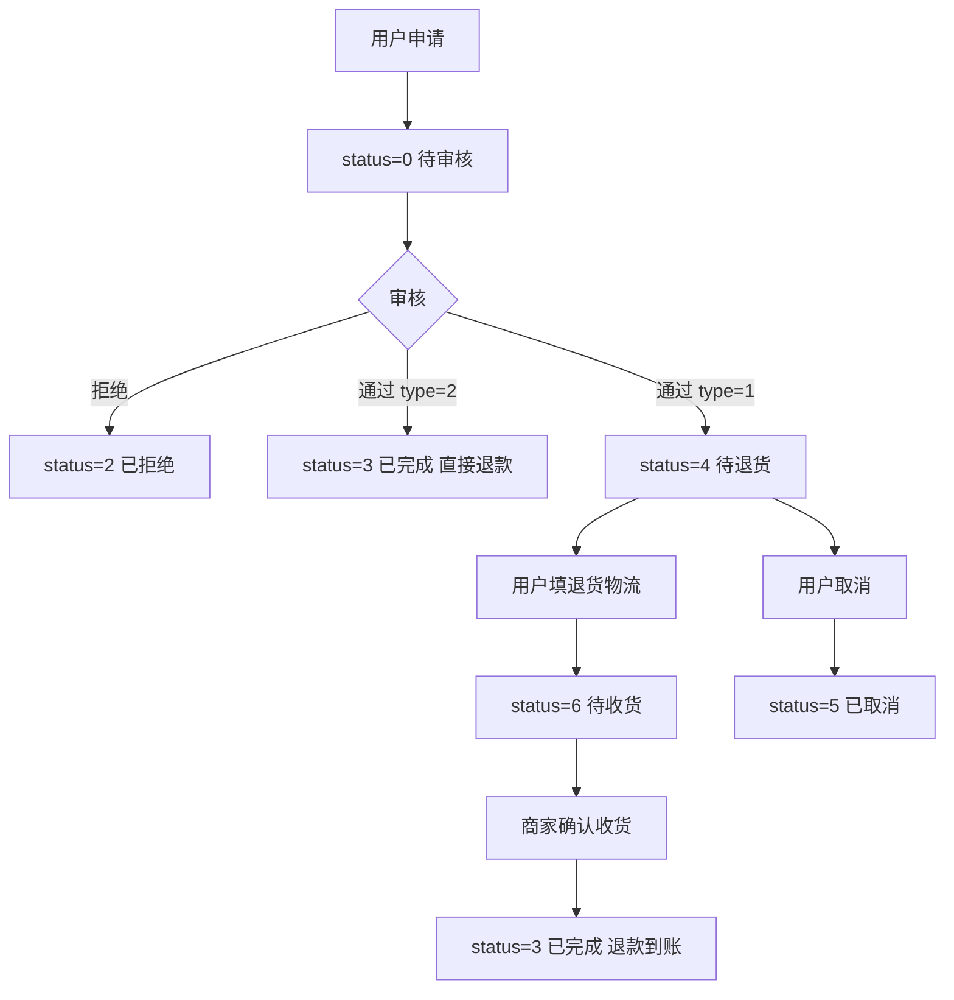

# 售后管理

## 1. 页面概述
售后管理是商城交易闭环的关键模块，处理用户的退货退款、仅退款、换货、补发等售后申请。管理员在此审核售后申请、确认退货收货、完成退款，并追踪完整的售后操作日志。售后由用户端发起，管理员不能新增或编辑售后内容，只能查看、审核、确认收货、完成。

### 核心指标
| 指标 | 数据来源 | 含义 |
|------|----------|------|
| 全部 | order_after_sales COUNT(*) | 售后单总量 |
| 待审核 | status=0 | 等待管理员审核 |
| 待退货 | status=4 | 审核通过，等待用户寄回 |
| 待收货 | status=6 | 用户已寄回，等待商家确认 |
| 已完成 | status=3 | 退款完成 |
| 已拒绝 | status=2 | 审核拒绝 |

### 售后类型
| type | 类型 | 说明 |
|------|------|------|
| 1 | 退货退款 | 用户寄回商品，商家确认收货后退款 |
| 2 | 仅退款 | 不退货，审核通过后直接退款 |
| 3 | 换货 | 寄回商品，商家重新发货 |
| 4 | 补发 | 商品漏发/损坏，商家补发 |

## 2. API接口清单
### 管理端
| 方法 | 路径 | 控制器方法 | 说明 |
|------|------|-----------|------|
| GET | /api/v1/admin/after-sale | AfterSaleController@index | 售后列表（分页+筛选+各状态统计） |
| GET | /api/v1/admin/after-sale/{id} | AfterSaleController@show | 售后详情（含关联订单+商品项+操作日志） |
| POST | /api/v1/admin/after-sale/{id}/audit | AfterSaleController@audit | 售后审核（通过/拒绝） |
| POST | /api/v1/admin/after-sale/{id}/receive | AfterSaleController@receive | 确认收货（待收货→已完成，触发退款） |
| POST | /api/v1/admin/after-sale/{id}/complete | AfterSaleController@complete | 强制完成（兼容旧流程） |

### 用户端
| 方法 | 路径 | 控制器方法 | 说明 |
|------|------|-----------|------|
| GET | /api/v1/user/after-sale | UserAfterSaleController@lists | 用户售后列表 |
| POST | /api/v1/user/after-sale | UserAfterSaleController@add | 申请售后 |
| GET | /api/v1/user/after-sale/reasons/list | UserAfterSaleController@reasons | 售后原因列表 |
| GET | /api/v1/user/after-sale/{id} | UserAfterSaleController@detail | 售后详情 |
| POST | /api/v1/user/after-sale/{id}/return-ship | UserAfterSaleController@returnShip | 填写退货物流 |
| POST | /api/v1/user/after-sale/{id}/cancel | UserAfterSaleController@cancel | 取消售后 |

## 3. 请求参数
### 售后列表
| 参数 | 类型 | 必填 | 说明 |
|------|------|------|------|
| page | int | 否 | 页码 |
| limit | int | 否 | 每页数量 |
| keyword | string | 否 | 按订单号或原因模糊搜索 |
| type | int | 否 | 按类型筛选（1-4） |
| status | int | 否 | 按状态筛选（0-6） |

### 售后审核
| 参数 | 类型 | 必填 | 说明 |
|------|------|------|------|
| status | int | 是 | 1=通过，2=拒绝 |
| audit_remark | string | 否 | 审核备注 |

> 审核通过分支：type=2仅退款直接完成（status→3）；type=1退货退款进入待退货（status→4）。

### 确认收货
无参数。前置条件：status=6（待收货）。操作后status→3，关联订单status→6（已退款）。

### 用户申请售后
| 参数 | 类型 | 必填 | 说明 |
|------|------|------|------|
| order_id | int | 是 | 订单ID |
| order_item_id | int | 否 | 商品项ID |
| type | int | 是 | 1退货退款/2仅退款/3换货/4补发 |
| reason | string | 是 | 售后原因 |
| description | string | 否 | 详细描述 |
| images | string | 否 | 凭证图片 |
| refund_amount | decimal | 否 | 退款金额 |

### 用户填写退货物流
| 参数 | 类型 | 必填 | 说明 |
|------|------|------|------|
| return_express_company | string | 是 | 退货快递公司 |
| return_express_no | string | 是 | 退货快递单号 |

## 4. 售后状态机
| status | 状态 | 说明 |
|--------|------|------|
| 0 | 待审核 | 用户申请后初始状态 |
| 1 | 审核通过 | 管理员审核通过 |
| 2 | 审核拒绝 | 管理员审核拒绝，终态 |
| 3 | 已完成 | 退款完成，终态 |
| 4 | 待退货 | 退货退款审核通过，等待用户寄回 |
| 5 | 已取消 | 用户主动取消，终态 |
| 6 | 待收货 | 用户已寄回，等待商家确认 |

## 5. 字段映射表（order_after_sales表，22字段）
| 字段 | 类型 | 说明 |
|------|------|------|
| id | bigint | 主键 |
| order_id | bigint | 关联订单 |
| order_no | varchar(50) | 冗余订单号 |
| order_item_id | bigint | 关联商品项 |
| user_id | bigint | 申请人 |
| merchant_id | bigint | 商家ID |
| type | tinyint | 1退货退款/2仅退款/3换货/4补发 |
| reason | varchar(255) | 售后原因 |
| description | text | 详细描述 |
| images | text | 凭证图片 |
| refund_amount | decimal(12,2) | 退款金额 |
| status | tinyint | 0-6状态枚举 |
| audit_remark | varchar(255) | 审核备注 |
| audit_at | timestamp | 审核时间 |
| return_express_company | varchar(50) | 退货快递公司 |
| return_express_no | varchar(50) | 退货快递单号 |
| return_ship_time | timestamp | 退货发货时间 |
| receive_time | timestamp | 确认收货时间 |
| refund_time | timestamp | 退款时间 |
| completed_at | timestamp | 完成时间 |
| created_at | timestamp | 创建时间 |
| updated_at | timestamp | 更新时间 |

## 6. 权限控制
- 认证方式：Laravel Sanctum Token
- 路由中间件：auth:sanctum
- 当前无细粒度权限控制

## 7. 关联模块
- 依赖：订单管理（order_id）、订单商品（order_item_id）、用户管理（user_id）、商家管理（merchant_id）
- 被依赖：订单管理（完成后更新订单status=6）、财务管理（退款统计）、工作台（待审核统计）

## 8. 验收清单
- [x] 售后列表正常加载，返回6项状态统计
- [x] 按keyword/type/status筛选正常
- [x] 售后详情返回info+order+order_items+logs
- [x] 审核通过（退货退款）：status 0→4，生成审核日志+等待退货日志
- [x] 审核通过（仅退款）：status 0→3，直接完成退款
- [x] 审核拒绝：status 0→2，记录备注和时间
- [x] 用户填写退货物流：status 4→6，记录快递公司/单号/时间
- [x] 商家确认收货：status 6→3，记录收货/退款/完成时间
- [x] 确认收货后关联订单status→6
- [x] 用户取消售后：status 0/4→5
- [x] 售后原因列表返回8种标准原因
- [x] 每次操作生成对应售后日志

## 9. 常见问题
| 问题 | 原因 | 解决方案 |
|------|------|----------|
| 审核提示"当前状态不能审核" | status不是0 | 只有待审核状态可审核 |
| 确认收货提示"当前状态不能确认" | status不是6 | 只有用户填写物流后才能确认收货 |
| 仅退款审核后直接完成 | type=2设计逻辑 | 仅退款不需要退货 |
| 申请售后提示"订单状态不能申请" | 订单status不是2或3 | 只有待收货或已完成订单可申请 |
