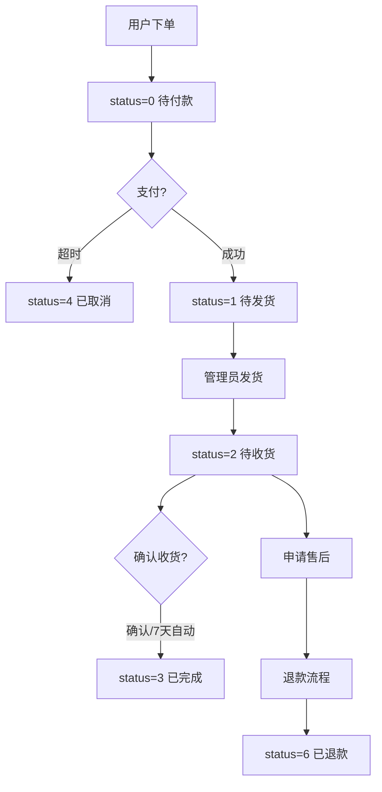

# 订单列表

## 1. 页面概述
订单列表是商城交易管理的核心页面，管理员可在此查看所有订单、筛选搜索、处理发货、添加备注，并实时查看各状态订单统计。订单由用户端下单创建，管理员只能发货和备注，不能新增或删除订单。

### 核心指标
| 指标 | 数据来源 | 含义 |
|------|----------|------|
| 订单总数 | orders COUNT(*) | 历史订单总量 |
| 待付款 | status=0 | 未支付订单 |
| 待发货 | status=1 | 已支付待发货 |
| 待收货 | status=2 | 已发货待确认 |
| 已完成 | status=3 | 交易完成 |
| 退款中 | status IN (5,6) | 退款流程中 |
| 交易总额 | status>=1 SUM(pay_amount) | 已支付订单金额总和 |

## 2. API接口清单
| 方法 | 路径 | 控制器方法 | 说明 |
|------|------|-----------|------|
| GET | /api/v1/admin/orders | AdminOrderController@index | 订单列表（分页+筛选+统计） |
| GET | /api/v1/admin/orders/{id} | AdminOrderController@show | 订单详情（含商品项+操作日志+用户信息） |
| POST | /api/v1/admin/orders/{id}/ship | AdminOrderController@ship | 订单发货（仅待发货状态） |
| POST | /api/v1/admin/orders/{id}/remark | AdminOrderController@remark | 订单备注 |

## 3. 请求参数
### 订单列表
| 参数 | 类型 | 必填 | 说明 |
|------|------|------|------|
| page | int | 否 | 页码，默认1 |
| limit | int | 否 | 每页数量，默认20 |
| order_no | string | 否 | 按订单号模糊搜索 |
| status | int | 否 | 按状态筛选（0-6） |
| user_mobile | string | 否 | 按用户手机号模糊搜索 |
| start_time | string | 否 | 下单开始时间 |
| end_time | string | 否 | 下单结束时间 |

### 订单发货
| 参数 | 类型 | 必填 | 说明 |
|------|------|------|------|
| express_company | string | 是 | 快递公司名称 |
| express_no | string | 是 | 快递单号 |

> 前置条件：订单status必须为1（待发货）。发货后status→2，设置ship_time和auto_confirm_at（7天后），生成发货日志。

## 4. 返回示例
```json
{
  "code": 200,
  "message": "success",
  "data": {
    "list": [{"id":9,"order_no":"ORD20260901004","status":6,"pay_amount":"14999.00","items":[{"product_name":"MacBook Pro 14"}],"user":{"nickname":"测试用户4"}}],
    "total": 4,
    "stats": {"total":4,"wait_pay":1,"wait_ship":0,"wait_confirm":1,"completed":0,"refund":2,"total_amount":"28507.00"}
  }
}
```

## 5. 订单状态枚举
| status | 状态 | 说明 |
|--------|------|------|
| 0 | 待付款 | 用户下单未支付 |
| 1 | 待发货 | 已支付，等待商家发货 |
| 2 | 待收货 | 已发货，等待用户确认 |
| 3 | 已完成 | 用户确认收货，交易完成 |
| 4 | 已取消 | 超时未付或用户取消 |
| 5 | 退款中 | 售后审核中 |
| 6 | 已退款 | 退款完成 |

## 6. 字段映射表（orders表，42字段）
| 展示字段 | 数据来源 | 类型 | 说明 |
|----------|----------|------|------|
| 订单ID | orders.id | bigint | 主键 |
| 订单号 | orders.order_no | varchar(50) | 唯一 |
| 用户ID | orders.user_id | bigint | 关联users.id |
| 商家ID | orders.merchant_id | bigint | 关联merchants.id |
| 商品总额 | orders.total_amount | decimal(12,2) | 商品原价总和 |
| 运费 | orders.shipping_fee | decimal(10,2) | 运费 |
| 实付金额 | orders.pay_amount | decimal(12,2) | 用户实际支付 |
| 支付方式 | orders.pay_type | tinyint | 0未支付/1微信/2支付宝 |
| 订单状态 | orders.status | tinyint | 0-6状态枚举 |
| 收货人 | orders.receiver_name | varchar(50) | 收货姓名 |
| 收货电话 | orders.receiver_mobile | varchar(20) | 收货手机号 |
| 省市区 | orders.province_name等 | varchar(50) | 收货地区 |
| 详细地址 | orders.receiver_address | varchar(255) | 收货详细地址 |
| 快递公司 | orders.express_company | varchar(50) | 发货快递公司 |
| 快递单号 | orders.express_no | varchar(50) | 发货快递单号 |
| 发货时间 | orders.ship_time | timestamp | 发货操作时间 |
| 确认时间 | orders.confirm_time | timestamp | 用户确认收货时间 |
| 管理员备注 | orders.admin_remark | varchar(255) | 管理员备注 |
| 自动取消 | orders.auto_cancel_at | timestamp | 待付款超时取消 |
| 自动确认 | orders.auto_confirm_at | timestamp | 发货后7天自动确认 |
| 创建时间 | orders.created_at | timestamp | 下单时间 |
| 软删除 | orders.deleted_at | timestamp | Laravel SoftDeletes |

## 7. 操作流程


## 8. 权限控制
- 认证方式：Laravel Sanctum Token
- 路由中间件：auth:sanctum
- 当前无细粒度权限控制，所有登录管理员可操作全部订单

## 9. 关联模块
- 依赖：用户管理（user_id）、商家管理（merchant_id）、商品管理（order_items快照）
- 被依赖：售后管理、财务管理、分销管理、工作台、用户端H5、商家端

## 10. 验收清单
- [x] 订单列表正常加载，返回订单数据和7项统计
- [x] 订单详情返回商品项、用户信息、操作日志
- [x] 订单发货功能正常（status 1→2，记录物流信息）
- [x] 发货后自动设置7天自动确认时间
- [x] 发货生成操作日志
- [x] 订单备注功能正常
- [x] 按订单号/状态/用户手机号/时间筛选正常
- [x] 分页功能正常
- [x] 退款审核通过后订单状态变为6
- [x] 退款审核通过后库存回滚（事务保证）

## 11. 常见问题
| 问题 | 原因 | 解决方案 |
|------|------|----------|
| 发货提示"当前状态不能发货" | 订单状态不是1 | 只有待发货订单可发货 |
| 订单列表统计退款数为0 | 没有status=5或6的订单 | 退款审核通过后状态变为6 |
| 发货后7天未自动确认 | 定时任务未运行 | 需配置定时任务扫描auto_confirm_at |
| 删除订单后列表仍显示 | 软删除机制 | deleted_at不为空，查询自动过滤 |
