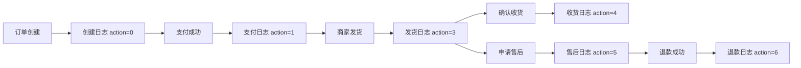

# 订单日志

## 1. 页面概述
订单日志记录订单生命周期中的所有操作事件，用于追踪订单状态变更、操作人、操作时间和备注。管理员可在此查看所有订单的操作历史，支持按订单号筛选，便于问题排查和审计。

### 操作类型枚举
| action | action_name | 说明 | 操作人 |
|--------|-------------|------|--------|
| 0 | 创建订单 | 用户下单 | user |
| 1 | 支付 | 用户支付成功 | user/system |
| 2 | 取消订单 | 用户取消或超时自动取消 | user/system |
| 3 | 发货 | 商家/管理员发货 | admin |
| 4 | 确认收货 | 用户确认收货 | user |
| 5 | 申请售后 | 用户申请售后 | user |
| 6 | 退款成功 | 退款审核通过 | admin/system |

## 2. API接口清单
| 方法 | 路径 | 控制器方法 | 说明 |
|------|------|-----------|------|
| GET | /api/v1/admin/order-log | OrderLogController@index | 订单操作日志列表（分页+筛选） |

## 3. 请求参数
| 参数 | 类型 | 必填 | 说明 |
|------|------|------|------|
| page | int | 否 | 页码 |
| limit | int | 否 | 每页数量，默认20 |
| order_id | int | 否 | 按订单ID筛选 |
| order_no | string | 否 | 按订单号模糊搜索 |

## 4. 返回示例
```json
{
  "code": 200,
  "message": "success",
  "data": {
    "list": [
      {"id":1,"order_id":7,"order_no":"ORD20260901002","action":3,"action_name":"发货","operator_type":"admin","operator_id":1,"remark":"圆通速递 单号：YT1234567890","created_at":"2026-09-01 12:30:00"}
    ],
    "total": 12
  }
}
```

## 5. 字段映射表（order_logs表，9字段）
| 字段 | 类型 | 说明 |
|------|------|------|
| id | bigint | 主键 |
| order_id | bigint | 关联订单ID |
| order_no | varchar(50) | 冗余订单号 |
| action | tinyint | 操作类型（0-6） |
| action_name | varchar(50) | 操作可读名称 |
| operator_type | varchar(20) | 操作人类型（user/admin/system） |
| operator_id | bigint | 操作人ID |
| remark | varchar(500) | 操作详情（如快递单号） |
| created_at | timestamp | 操作时间 |

## 6. 操作流程


## 7. 权限控制
- 认证方式：Laravel Sanctum Token
- 路由中间件：auth:sanctum
- 当前无细粒度权限控制，所有登录管理员可查看全部日志

## 8. 关联模块
- 依赖：订单管理（order_id关联）
- 被依赖：订单详情（展示该订单的操作日志）

## 9. 验收清单
- [x] 日志列表正常加载，返回分页数据
- [x] 按order_id筛选正常
- [x] 按order_no模糊搜索正常
- [x] 发货操作自动生成日志（action=3）
- [x] 退款审核通过自动生成日志（action=6）
- [x] 日志记录操作人类型和ID
- [x] 日志记录操作详情（如快递单号）

## 10. 常见问题
| 问题 | 原因 | 解决方案 |
|------|------|----------|
| 某订单无日志 | 订单创建时未触发日志写入 | 检查订单创建逻辑是否调用OrderLog::create |
| 日志操作人显示为0 | operator_id未正确传递 | 检查操作时是否传入当前用户ID |
| 按订单号搜索无结果 | order_no模糊匹配问题 | 确认使用LIKE %keyword%查询 |
