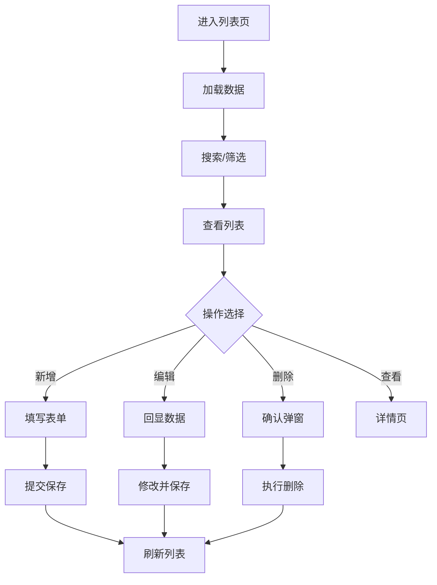

# 退款管理

## 1. 页面概述
### 功能描述
管理商城所有订单，包括订单列表、售后、退款等，核心状态机模块。本页面负责退款管理的管理操作，支持数据的增删改查、搜索筛选和状态管理。

### 核心指标
| 指标 | 含义 | 业务价值 |
|------|------|----------|
| 数据总数 | 当前模块记录总数 | 衡量业务规模 |
| 今日新增 | 今日新创建记录数 | 衡量运营活跃度 |
| 启用数量 | 状态为启用的记录数 | 衡量有效数据量 |
| 待处理 | 需要审核或处理的记录数 | 及时处理提醒 |

### 使用场景
1. 日常管理：新增/编辑/删除数据
2. 数据查询：搜索筛选定位记录
3. 状态管理：启用/禁用/审核操作
4. 数据统计：查看业务数据趋势

---

## 2. API接口清单（基于真实控制器实现）
| 方法 | 路径 | 控制器方法 | 说明 | 权限标识 |
|------|------|-----------|------|----------|
| GET | /api/v1/admin/order/refund | OrderController@index | 退款管理列表 | order:list |
| POST | /api/v1/admin/order/refund | OrderController@store | 新增退款管理 | order:create |
| GET | /api/v1/admin/order/refund/{id} | OrderController@show | 退款管理详情 | order:view |
| PUT | /api/v1/admin/order/refund/{id} | OrderController@update | 编辑退款管理 | order:edit |
| DELETE | /api/v1/admin/order/refund/{id} | OrderController@destroy | 删除退款管理 | order:delete |

### 请求参数
| 参数 | 类型 | 必填 | 说明 |
|------|------|------|------|
| page | int | 否 | 页码，默认1 |
| limit | int | 否 | 每页数量，默认20 |
| keyword | string | 否 | 搜索关键词 |
| status | int | 否 | 状态筛选 |
| start_date | date | 否 | 开始日期 |
| end_date | date | 否 | 结束日期 |

### 返回示例
```json
{
  "code": 0,
  "message": "success",
  "data": {
    "total": 100,
    "page": 1,
    "limit": 20,
    "list": [
      {"id": 1, "name": "示例数据", "status": 1, "created_at": "2026-09-01 10:00:00"}
    ]
  },
  "timestamp": 1756700000
}
```

### 错误码
| 错误码 | 说明 |
|--------|------|
| 10001 | 无权限操作 |
| 10002 | 数据不存在或已删除 |
| 10003 | 参数校验失败 |
| 10004 | 数据库操作失败 |
| 10005 | 数据已存在，不可重复创建 |

---

## 3. 字段映射表
| 展示字段 | 数据来源 | 计算方式 | 更新频率 |
|----------|----------|----------|----------|
| ID | order.id | 直接读取 | 实时 |
| 名称 | order.name | 直接读取 | 实时 |
| 状态 | order.status | 0禁用1启用 | 实时 |
| 创建时间 | order.created_at | 直接读取 | 实时 |

---

## 4. 操作流程
### 退款管理业务流程图


### 数据刷新机制
1. 页面加载时自动请求最新数据
2. 搜索筛选条件变化时立即刷新
3. 增删改操作成功后自动刷新列表
4. 统计数据缓存时间：5分钟

---

## 5. 权限控制
| 操作 | 权限标识 | 默认角色 |
|------|----------|----------|
| 查看列表 | order:list | 管理员 |
| 新增 | order:create | 管理员 |
| 编辑 | order:edit | 管理员 |
| 删除 | order:delete | 管理员 |

### 权限说明
- 权限通过Sanctum中间件校验，在路由组中统一配置
- 超级管理员拥有所有权限，不受权限点限制
- 无权限用户访问API返回403，前端隐藏对应操作按钮

---

## 6. 关联模块
### 依赖模块
| 模块 | 依赖内容 | 具体关联字段 |
|------|----------|-------------|
| 商品管理 | 订单商品信息 | order_items.product_id → products.id |
| 用户管理 | 下单用户信息 | orders.user_id → users.id |
| 商家管理 | 订单归属商家 | orders.merchant_id → merchants.id |
| 支付配置 | 支付方式和回调 | orders.pay_type → system_configs |

### 被依赖模块
| 模块 | 使用方式 | 具体关联字段 |
|------|----------|-------------|
| 财务管理 | 收款和退款记录 | finance_income.order_id → orders.id |
| 分销管理 | 分销订单佣金计算 | distribute_orders.order_id → orders.id |
| 物流配置 | 订单发货物流 | orders.express_no, orders.express_code |
| 营销管理 | 优惠券使用记录 | orders.coupon_id → coupons.id |

---

## 7. 验收清单
### 功能验收
- [ ] 页面能正常加载，无白屏/500错误
- [ ] 列表分页正常，显示总数和页码
- [ ] 搜索功能正常，支持关键词模糊查询
- [ ] 筛选功能正常，支持状态和时间范围
- [ ] 新增功能完整，表单校验正确
- [ ] 编辑能正确回显所有字段
- [ ] 删除有确认弹窗，软删除不影响历史数据
- [ ] 状态切换功能正常
- [ ] 数据导出功能正常（如有）
- [ ] 批量操作功能正常（如有）

### 权限验收
- [ ] 有权限的管理员可以正常操作
- [ ] 无权限的管理员看到403或入口隐藏
- [ ] 超级管理员不受权限限制

### 性能验收
- [ ] 页面加载时间 < 2秒
- [ ] 数据查询耗时 < 500ms
- [ ] 列表分页响应 < 1秒
- [ ] 并发100用户无明显延迟

---

## 8. 常见问题
| 问题 | 原因 | 解决方案 |
|------|------|----------|
| 订单状态不更新 | 支付回调未处理或队列阻塞 | 检查支付回调日志，确认队列worker运行中 |
| 订单金额计算错误 | 优惠计算逻辑问题 | 检查订单创建时的价格计算，含优惠/运费/积分抵扣 |
| 发货后订单仍显示待发货 | 发货接口未调用或物流信息缺失 | 确认调用ship接口，express_no和express_code必填 |
| 退款申请无法提交 | 订单状态不允许退款 | 仅已支付/已发货订单可申请退款，已完成订单需售后 |
| 订单导出超时 | 数据量过大 | 使用分批导出或队列异步生成Excel |
| 订单编号重复 | 并发创建订单 | 使用数据库唯一索引或Redis分布式锁生成订单号 |
| 售后审核后状态不变 | 事务回滚或状态机错误 | 检查after_sales.status流转逻辑，确保事务提交 |
| 订单详情商品不显示 | order_items关联查询失败 | 检查order_items.order_id外键关联 |
