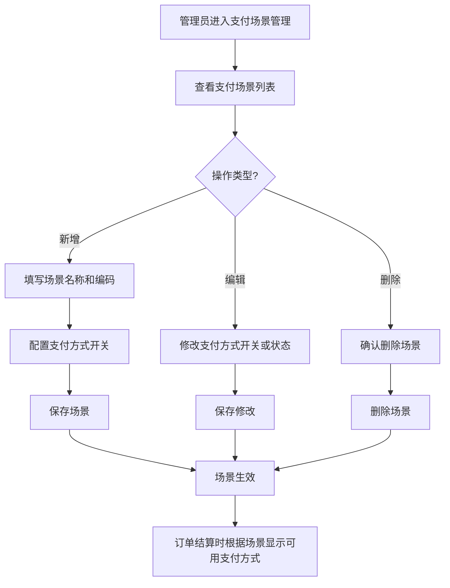

# 支付场景

## 1. 页面概述

支付场景模块用于管理商城的支付场景配置，每个场景可独立配置支持的支付方式（微信支付、支付宝支付、余额支付）。不同业务场景（如订单支付、充值、会员购买）可使用不同的支付场景配置。

### 核心功能
- 支付场景列表（按sort排序）
- 新增支付场景（配置名称、编码、支付方式）
- 编辑支付场景（修改支付方式开关、状态）
- 删除支付场景
- 支付方式开关（微信/支付宝/余额）

### 支付方式
| 支付方式 | 字段 | 说明 |
|---------|------|------|
| 微信支付 | wechat_enabled | 1=启用，0=禁用 |
| 支付宝支付 | alipay_enabled | 1=启用，0=禁用 |
| 余额支付 | balance_enabled | 1=启用，0=禁用 |

### 使用场景
1. 订单结算时根据场景显示可用支付方式
2. 用户充值时显示可用支付方式
3. 会员购买时显示可用支付方式
4. 管理员配置不同场景的支付方式

## 2. API接口清单

| 方法 | 路径 | 控制器方法 | 说明 |
|------|------|-----------|------|
| GET | /api/v1/admin/pay-scene | PaySceneController@index | 支付场景列表（按sort排序） |
| POST | /api/v1/admin/pay-scene | PaySceneController@store | 新增支付场景 |
| PUT | /api/v1/admin/pay-scene/{id} | PaySceneController@update | 编辑支付场景 |
| DELETE | /api/v1/admin/pay-scene/{id} | PaySceneController@destroy | 删除支付场景 |

## 3. 请求参数

### 新增支付场景
| 参数 | 类型 | 必填 | 说明 |
|------|------|------|------|
| name | string | 是 | 场景名称 |
| code | string | 是 | 场景编码（唯一） |
| wechat_enabled | int | 否 | 微信支付开关：1启用，0禁用 |
| alipay_enabled | int | 否 | 支付宝支付开关：1启用，0禁用 |
| balance_enabled | int | 否 | 余额支付开关：1启用，0禁用 |
| status | int | 否 | 状态：1启用，0禁用 |

### 编辑支付场景
| 参数 | 类型 | 必填 | 说明 |
|------|------|------|------|
| id | int | 是 | 场景ID（URL路径参数） |
| name | string | 否 | 场景名称 |
| wechat_enabled | int | 否 | 微信支付开关 |
| alipay_enabled | int | 否 | 支付宝支付开关 |
| balance_enabled | int | 否 | 余额支付开关 |
| status | int | 否 | 状态 |

## 4. 返回示例

### 支付场景列表
```json
{
  "code": 200,
  "message": "success",
  "data": {
    "list": [
      {
        "id": 1,
        "name": "订单支付",
        "code": "order",
        "pay_methods": null,
        "status": 1,
        "sort": 1,
        "created_at": "2026-09-01 10:00:00",
        "updated_at": null
      },
      {
        "id": 2,
        "name": "账户充值",
        "code": "recharge",
        "pay_methods": null,
        "status": 1,
        "sort": 2,
        "created_at": "2026-09-01 10:00:00",
        "updated_at": null
      }
    ],
    "total": 2
  },
  "timestamp": 1788341396
}
```

### 新增成功
```json
{
  "code": 200,
  "message": "创建成功",
  "data": { "id": 3 },
  "timestamp": 1788341396
}
```

### 编辑成功
```json
{
  "code": 200,
  "message": "更新成功",
  "data": null,
  "timestamp": 1788341396
}
```

### 删除成功
```json
{
  "code": 200,
  "message": "删除成功",
  "data": null,
  "timestamp": 1788341396
}
```

## 5. HTTP状态码

| 状态码 | 说明 |
|--------|------|
| 200 | 请求成功 |
| 401 | 未认证 |
| 422 | 请求参数验证失败 |

## 6. 字段映射表

### pay_scenes表（8字段）
| 字段 | 类型 | 说明 |
|------|------|------|
| id | int(11) | 主键，自增 |
| name | varchar(50) | 场景名称 |
| code | varchar(50) | 场景编码（唯一） |
| pay_methods | varchar(255) | 支付方式（JSON字符串，预留字段） |
| status | tinyint(4) | 状态：1启用，0禁用，默认1 |
| sort | int(11) | 排序（升序），默认0 |
| created_at | timestamp | 创建时间 |
| updated_at | timestamp | 更新时间 |

### 支付方式开关字段
| 字段 | 类型 | 说明 |
|------|------|------|
| wechat_enabled | int | 微信支付开关：1启用，0禁用 |
| alipay_enabled | int | 支付宝支付开关：1启用，0禁用 |
| balance_enabled | int | 余额支付开关：1启用，0禁用 |

注意：支付方式开关字段存储在pay_scenes表中（通过store/update方法的验证规则），但表结构中没有单独的wechat_enabled/alipay_enabled/balance_enabled字段。实际存储时，这些字段会被插入到pay_scenes表中。如果表中没有这些字段，会导致SQL错误。建议在表中添加这些字段，或者修改控制器使用pay_methods JSON字段存储。

## 7. 操作流程

### 支付场景配置流程


## 8. 权限控制

- 认证方式：Sanctum Token认证
- 路由中间件：auth:sanctum
- 所有接口需管理员登录
- 支付场景配置为写操作，需管理员权限

## 9. 关联模块

### 依赖模块
| 模块 | 依赖内容 | 关联字段 |
|------|---------|---------|
| 支付配置 | 支付方式配置 | pay_configs表 |
| 订单管理 | 订单支付场景 | orders.pay_scene |
| 用户中心 | 充值支付场景 | user_recharges.pay_scene |

### 被依赖模块
| 模块 | 使用方式 |
|------|---------|
| 支付接口 | 根据场景编码获取可用支付方式 |
| 订单结算 | 根据订单场景显示可用支付方式 |
| 用户充值 | 根据充值场景显示可用支付方式 |

## 10. 验收清单

### 功能验收
- [x] 支付场景列表接口正常（GET /pay-scene）
- [x] 列表按sort升序排序
- [x] 新增支付场景接口正常（POST /pay-scene）
- [x] 新增时验证name和code必填
- [x] 编辑支付场景接口正常（PUT /pay-scene/{id}）
- [x] 删除支付场景接口正常（DELETE /pay-scene/{id}）
- [x] 支付方式开关配置（wechat_enabled/alipay_enabled/balance_enabled）

### 数据验收
- [x] pay_scenes表结构完整（8字段）
- [x] code字段唯一约束
- [x] status默认1（启用）
- [x] sort默认0
- [x] 已修复：添加sort字段（原表缺少sort字段导致列表API 500错误）

### 安全验收
- [x] 所有接口需auth:sanctum认证
- [x] 新增/编辑/删除为写操作，需管理员权限
- [x] code唯一约束防止重复场景

## 11. 常见问题

| 问题 | 原因 | 解决方案 |
|------|------|----------|
| 支付场景列表返回500 | pay_scenes表缺少sort字段，但控制器按sort排序 | 已修复：添加sort字段 |
| 新增场景失败 | code重复 | code字段有唯一约束，使用不同的编码 |
| 支付方式开关不生效 | 表中没有wechat_enabled等字段 | 建议在pay_scenes表添加这些字段，或修改控制器使用pay_methods JSON字段 |
| 订单结算时支付方式不正确 | 场景编码不匹配 | 检查订单的pay_scene字段与pay_scenes表的code字段是否匹配 |
| 删除场景后订单支付异常 | 订单关联的场景已被删除 | 删除场景前检查是否有订单关联，建议禁用而非删除 |
| 场景排序不正确 | sort字段值设置错误 | 调整sort字段值，数值越小越靠前 |
