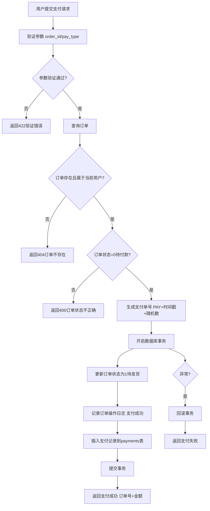

# 支付接口

## 1. 页面概述

支付接口模块提供用户端订单支付能力，支持微信支付、支付宝支付、余额支付三种支付方式。当前为模拟支付模式，调用支付接口后直接更新订单状态为"待发货"，并记录支付日志和支付记录。

### 核心功能
- 订单支付（支持微信/支付宝/余额三种方式）
- 支付状态查询
- 支付单号自动生成
- 订单状态自动更新（待付款→待发货）
- 支付日志记录
- 支付记录存储

### 支付方式
| pay_type | 支付方式 | 说明 |
|----------|---------|------|
| 1 | 微信支付 | 模拟支付，直接成功 |
| 2 | 支付宝 | 模拟支付，直接成功 |
| 3 | 余额支付 | 模拟支付，直接成功 |

### 支付流程
1. 用户提交订单（订单状态=0待付款）
2. 用户选择支付方式，调用支付接口
3. 系统生成支付单号（PAY+时间戳+随机数）
4. 更新订单状态为1（待发货），记录支付方式、支付单号、支付时间
5. 记录订单操作日志（支付成功）
6. 插入支付记录到payments表
7. 返回支付成功结果

### 使用场景
1. 用户订单结算后支付
2. 用户查询订单支付状态
3. 订单支付回调（当前为模拟，无真实回调）

## 2. API接口清单

| 方法 | 路径 | 控制器方法 | 说明 |
|------|------|-----------|------|
| POST | /api/v1/payment/pay | PaymentController@pay | 订单支付（需登录） |
| GET | /api/v1/payment/status/{orderId} | PaymentController@status | 支付状态查询（需登录） |

## 3. 请求参数

### 订单支付
| 参数 | 类型 | 必填 | 说明 |
|------|------|------|------|
| order_id | int | 是 | 订单ID |
| pay_type | int | 是 | 支付方式：1微信支付，2支付宝，3余额支付 |

### 支付状态查询
| 参数 | 类型 | 必填 | 说明 |
|------|------|------|------|
| orderId | int | 是 | 订单ID（URL路径参数） |

## 4. 返回示例

### 支付成功
```json
{
  "code": 200,
  "message": "支付成功",
  "data": {
    "order_no": "ORD20260901001",
    "pay_amount": "9999.00"
  },
  "timestamp": 1788341595
}
```

### 支付失败（订单不存在）
```json
{
  "code": 404,
  "message": "订单不存在",
  "data": null,
  "timestamp": 1788341595
}
```

### 支付失败（订单状态不正确）
```json
{
  "code": 400,
  "message": "订单状态不正确",
  "data": null,
  "timestamp": 1788341595
}
```

### 支付状态查询
```json
{
  "code": 200,
  "message": "success",
  "data": {
    "status": 1,
    "pay_type": 1,
    "pay_time": "2026-09-01 10:00:00"
  },
  "timestamp": 1788341595
}
```

## 5. HTTP状态码

| 状态码 | 说明 |
|--------|------|
| 200 | 支付成功/查询成功 |
| 400 | 业务错误（订单状态不正确、支付失败） |
| 401 | 未认证 |
| 404 | 订单不存在 |
| 422 | 请求参数验证失败 |

## 6. 字段映射表

### payments表（12字段）
| 字段 | 类型 | 说明 |
|------|------|------|
| id | bigint | 主键，自增 |
| payment_no | varchar(50) | 支付单号（PAY+时间戳+随机数） |
| order_no | varchar(50) | 订单号 |
| user_id | bigint | 用户ID |
| type | tinyint | 支付类型：1订单支付 |
| pay_type | tinyint | 支付方式：1微信，2支付宝，3余额 |
| amount | decimal(12,2) | 支付金额 |
| third_payment_no | varchar(100) | 第三方支付单号（当前为模拟，与payment_no相同） |
| status | tinyint | 支付状态：1成功，0失败 |
| pay_time | timestamp | 支付时间 |
| created_at | timestamp | 创建时间 |
| updated_at | timestamp | 更新时间 |

### 订单更新字段
| 字段 | 说明 |
|------|------|
| status | 订单状态：0待付款→1待发货 |
| pay_type | 支付方式 |
| pay_no | 支付单号 |
| pay_time | 支付时间 |

### 订单日志字段
| 字段 | 说明 |
|------|------|
| order_id | 订单ID |
| order_no | 订单号 |
| action | 操作类型：2支付 |
| action_name | 操作名称：支付成功 |
| operator_type | 操作人类型：user |
| operator_id | 操作人ID |
| remark | 备注：支付方式+金额 |

## 7. 操作流程

### 订单支付流程


## 8. 权限控制

- 认证方式：Sanctum Token认证
- 路由中间件：auth:sanctum
- 所有接口需用户登录
- 用户只能操作自己的订单（通过user_id过滤）
- 支付为写操作，需用户权限

## 9. 关联模块

### 依赖模块
| 模块 | 依赖内容 | 关联字段 |
|------|---------|---------|
| 订单管理 | 订单信息 | payments.order_no → orders.order_no |
| 用户认证 | 用户登录 | payments.user_id → users.id |
| 订单日志 | 操作日志 | order_logs.order_id → orders.id |

### 被依赖模块
| 模块 | 使用方式 |
|------|---------|
| 订单管理 | 支付成功后更新订单状态 |
| 用户中心 | 展示订单支付状态 |
| 财务统计 | 统计支付金额和支付方式 |

## 10. 验收清单

### 功能验收
- [x] 支付接口正常（POST /payment/pay）
- [x] 支持三种支付方式（微信/支付宝/余额）
- [x] 支付单号自动生成（PAY+时间戳+随机数）
- [x] 支付成功后订单状态更新为1（待发货）
- [x] 支付成功后记录订单操作日志
- [x] 支付成功后插入支付记录到payments表
- [x] 支付状态查询接口正常（GET /payment/status/{orderId}）
- [x] 用户只能支付自己的订单
- [x] 只有待付款状态（status=0）的订单可支付
- [x] 数据库事务保护（支付失败时回滚）

### 数据验收
- [x] payments表结构完整（12字段）
- [x] payment_no唯一
- [x] amount与订单pay_amount一致
- [x] status=1表示支付成功
- [x] pay_time记录支付时间

### 安全验收
- [x] 所有接口需auth:sanctum认证
- [x] 用户只能操作自己的订单（通过user_id过滤）
- [x] 订单状态校验（防止重复支付）
- [x] 数据库事务（防止部分更新）
- [x] 参数验证（pay_type只能是1/2/3）

## 11. 常见问题

| 问题 | 原因 | 解决方案 |
|------|------|----------|
| 支付返回"订单不存在" | 订单ID错误或不属于当前用户 | 检查order_id是否正确，确保用户已登录 |
| 支付返回"订单状态不正确" | 订单不是待付款状态 | 只有status=0的订单可支付，已支付的订单不能重复支付 |
| 支付返回422验证错误 | pay_type参数错误 | pay_type只能是1（微信）、2（支付宝）、3（余额） |
| 支付成功但订单状态未更新 | 数据库事务回滚 | 检查payments表插入是否失败，查看错误日志 |
| 支付单号重复 | 随机数碰撞 | 支付单号格式为PAY+时间戳+4位随机数，概率极低，如遇重复可增加随机数位数 |
| 余额支付未扣减余额 | 当前为模拟支付，未实现真实余额扣减 | 如需真实余额支付，需在支付逻辑中添加余额扣减代码 |
| 微信/支付宝支付未跳转第三方 | 当前为模拟支付，直接成功 | 如需真实支付，需对接微信支付/支付宝SDK，生成支付链接或二维码 |
| 支付记录查询不到 | payments表没有数据 | 检查支付是否成功，只有支付成功才会插入payments表 |
