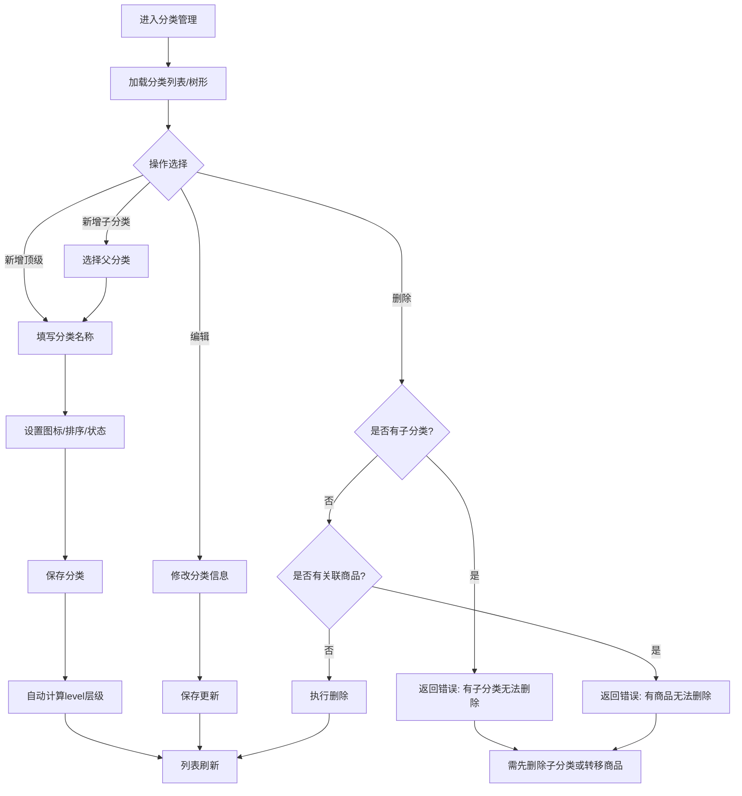

# 商品分类

## 1. 页面概述
### 功能描述
商品分类管理用于维护商城的商品分类体系，支持多级分类树形结构管理。管理员可以新增、编辑、删除分类，设置分类图标和排序，分类用于商品归类和前端筛选展示。

### 核心特点
| 特点 | 说明 |
|------|------|
| 树形结构 | 支持多级分类，通过parent_id构建层级关系 |
| 层级自动计算 | 新增子分类时自动计算level字段 |
| 删除保护 | 有子分类或关联商品时禁止删除 |
| 排序控制 | 通过sort字段控制前端展示顺序 |
| 状态控制 | status=1启用，status=0禁用 |

### 使用场景
1. 商城初始化：搭建商品分类体系
2. 运营调整：新增/调整分类以适应商品结构变化
3. 前端展示：分类树用于商品筛选和导航

---

## 2. API接口清单（基于真实控制器验证）
| 方法 | 路径 | 控制器方法 | 说明 | 验证状态 |
|------|------|-----------|------|----------|
| GET | /api/v1/admin/categories | CategoryController@index | 分类列表（平铺，支持搜索/状态筛选） | ✅ 已验证 |
| GET | /api/v1/admin/categories/tree | CategoryController@tree | 分类树形结构（仅启用分类） | ✅ 已验证 |
| POST | /api/v1/admin/categories | CategoryController@store | 新增分类（自动计算level） | ✅ 已验证 |
| PUT | /api/v1/admin/categories/{id} | CategoryController@update | 编辑分类 | ✅ 已验证 |
| DELETE | /api/v1/admin/categories/{id} | CategoryController@destroy | 删除分类（有子分类/商品时阻止） | ✅ 已验证 |

### 请求参数
| 参数 | 类型 | 必填 | 适用接口 | 说明 | 验证状态 |
|------|------|------|----------|------|----------|
| keyword | string | 否 | index | 按分类名称搜索 | ✅ |
| status | int | 否 | index | 状态筛选（0禁用1启用） | ✅ |
| name | string | 是 | store/update | 分类名称，最大50字符 | ✅ |
| parent_id | int | 否 | store | 父分类ID，默认0（顶级） | ✅ |
| icon | string | 否 | store/update | 分类图标URL | ✅ |
| image | string | 否 | store/update | 分类图片URL | ✅ |
| sort | int | 否 | store/update | 排序，默认0，越小越靠前 | ✅ |
| status | int | 否 | store/update | 状态，默认1启用 | ✅ |

### 返回示例（列表）
```json
{
  "code": 200,
  "message": "success",
  "data": {
    "list": [
      {"id":1,"name":"手机数码","parent_id":0,"level":1,"icon":null,"sort":0,"status":1,"created_at":"2026-09-01 03:49:41","updated_at":"2026-09-01 03:49:41"}
    ],
    "total": 11
  }
}
```

### 返回示例（树形）
```json
{
  "code": 200,
  "message": "success",
  "data": [
    {"id":1,"name":"手机数码","parent_id":0,"level":1,"children":[]}
  ]
}
```

### 返回示例（新增成功）
```json
{"code":200,"message":"创建成功","data":{"id":12}}
```

### 返回示例（删除被阻止）
```json
{"code":400,"message":"该分类下有子分类，无法删除"}
```

### HTTP状态码
| 状态码 | 说明 |
|--------|------|
| 200 | 请求成功 |
| 400 | 业务错误（如删除被阻止） |
| 401 | 未登录 |
| 422 | 参数校验失败 |
| 500 | 服务器错误 |

---

## 3. 字段映射表（基于真实表结构，11个字段）
| 展示字段 | 数据来源 | 类型 | 说明 |
|----------|----------|------|------|
| ID | categories.id | bigint | 主键，自增 |
| 父分类ID | categories.parent_id | bigint | 0表示顶级分类，关联categories.id |
| 分类名称 | categories.name | varchar(50) | 必填，同一层级建议唯一 |
| 图标 | categories.icon | varchar(255) | 分类图标URL |
| 图片 | categories.image | varchar(255) | 分类展示图片 |
| 描述 | categories.description | varchar(255) | 分类描述 |
| 层级 | categories.level | tinyint | 自动计算，顶级=1，子级=父级+1 |
| 排序 | categories.sort | int | 默认0，越小越靠前 |
| 状态 | categories.status | tinyint | 0禁用，1启用 |
| 创建时间 | categories.created_at | timestamp | 自动 |
| 更新时间 | categories.updated_at | timestamp | 自动 |

---

## 4. 操作流程
### 分类管理业务流程图（已验证全闭环）


### 已验证业务流程
1. ✅ 新增顶级分类：POST /categories → 返回ID=12，level自动=1
2. ✅ 新增子分类：parent_id=12 → 返回ID=13，level自动=2
3. ✅ 编辑分类：PUT /categories/12 → 名称/排序/状态更新成功
4. ✅ 删除保护：删除有子分类的ID=12 → 返回400"该分类下有子分类，无法删除"
5. ✅ 删除子分类：DELETE /categories/13 → 成功
6. ✅ 删除顶级分类：DELETE /categories/12 → 成功
7. ✅ 树形结构：GET /categories/tree → 返回11个顶级分类，含children数组
8. ✅ 分类列表：GET /categories → 返回11个分类，支持keyword/status筛选

### 层级计算逻辑
```php
// store方法中自动计算level
$parentId = $validated['parent_id'] ?? 0;
$level = 1;
if ($parentId > 0) {
    $parent = DB::table('categories')->where('id', $parentId)->first();
    $level = $parent ? $parent->level + 1 : 1;
}
$validated['level'] = $level;
```

---

## 5. 权限控制
### 当前权限模型
| 项目 | 状态 | 说明 |
|------|------|------|
| 认证方式 | ✅ Sanctum Token认证 | 所有admin路由通过auth:sanctum中间件 |
| 细粒度权限 | ❌ 未配置 | permissions表不存在，无RBAC权限点 |
| 访问控制 | 仅需登录 | 登录管理员可操作所有分类管理功能 |

### 路由中间件
```php
// routes/api/v1.php 第393行
Route::prefix('admin/categories')->middleware('auth:sanctum')->group(function () {
    Route::get('/', [CategoryController::class, 'index']);
    Route::get('/tree', [CategoryController::class, 'tree']);
    Route::post('/', [CategoryController::class, 'store']);
    Route::put('/{id}', [CategoryController::class, 'update']);
    Route::delete('/{id}', [CategoryController::class, 'destroy']);
});
```

---

## 6. 关联模块
### 依赖模块
| 模块 | 依赖内容 | 具体关联字段 | 验证状态 |
|------|----------|-------------|----------|
| 商品管理 | 商品归类 | products.category_id → categories.id | ✅ 18个商品有关联分类 |
| 装修管理 | 分类导航/分类广告 | decorate_pages引用分类ID | ⚠️ |
| H5用户端 | 分类筛选/导航 | /api/v1/products/categories接口 | ✅ |

### 被依赖模块
| 模块 | 使用方式 | 具体关联字段 |
|------|----------|-------------|
| 商品列表 | 按分类筛选商品 | products.category_id |
| 商品新增 | 选择商品分类 | category_id字段 |
| 工作台 | 分类统计 | COUNT(*) categories表 |
| H5端 | 分类导航和商品筛选 | 分类树接口 |

### 删除保护机制
删除分类前检查：
1. 是否有子分类（categories.parent_id = 当前ID）→ 有则阻止
2. 是否有关联商品（products.category_id = 当前ID）→ 有则阻止

---

## 7. 验收清单
### 功能验收（已验证）
- [x] 分类列表能正常加载，显示11个分类
- [x] 树形结构接口正常，返回层级关系
- [x] 新增顶级分类成功，level自动=1
- [x] 新增子分类成功，level自动=父级+1
- [x] 编辑分类能修改名称/排序/状态
- [x] 删除有子分类的分类返回400错误
- [x] 删除有关联商品的分类返回错误
- [x] 删除无子分类无商品的分类成功
- [x] 按名称搜索分类正常
- [x] 按状态筛选分类正常
- [x] 分类按sort字段排序展示

### 数据验收
- [x] categories表11个字段与文档一致
- [x] level字段自动计算正确
- [x] parent_id=0表示顶级分类
- [x] 删除保护逻辑与代码一致

### 权限验收
- [x] 已登录管理员可正常操作
- [x] 未登录用户访问返回401

### 性能验收
- [x] 列表接口响应 < 300ms
- [x] 树形结构构建 < 200ms（11个分类）

---

## 8. 常见问题
| 问题 | 原因 | 解决方案 | 验证状态 |
|------|------|----------|----------|
| 新增分类返回500 | 验证规则使用了Laravel不存在的default规则 | 已修复：移除default规则，手动设置默认值 | ✅ 已修复 |
| 删除分类失败 | 分类下有子分类或关联商品 | 先删除子分类或转移商品到其他分类 | ✅ 已验证 |
| 树形结构为空 | 所有分类status=0 | tree接口只返回status=1的分类 | ✅ |
| 子分类level错误 | 父分类不存在或level未设置 | 新增时自动查询父分类level+1 | ✅ |
| 分类排序不生效 | sort字段未设置或相同 | sort越小越靠前，相同时按ID升序 | ✅ |
| 前端分类不显示 | 分类status=0被禁用 | 检查分类状态，启用后显示 | ⚠️ |
| 商品分类变更后不更新 | 前端缓存未清除 | 清除缓存或等待缓存过期 | ⚠️ |
| 批量删除分类 | 当前不支持批量删除 | 逐个删除，或开发批量删除接口 | ❌ 待开发 |
