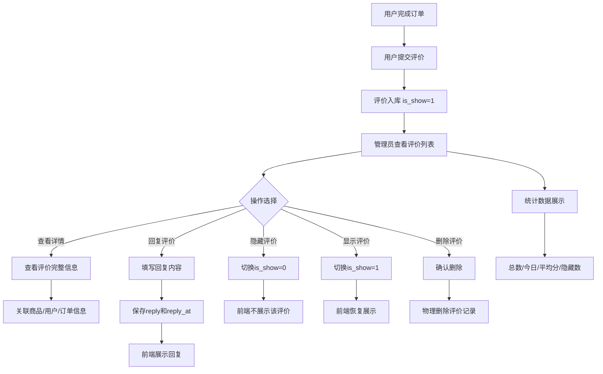

# 商品评价

## 1. 页面概述
### 功能描述
商品评价管理用于审核和管理用户对商品的评价。管理员可以查看评价详情、回复评价、隐藏/显示评价、删除不当评价。评价由用户在订单完成后产生，管理员不能新增或编辑评价内容，只能进行审核和回复操作。

### 核心特点
| 特点 | 说明 |
|------|------|
| 用户产生 | 评价由用户下单后创建，管理员不能新增 |
| 审核机制 | 通过is_show字段控制评价是否在前端展示 |
| 评分系统 | rating字段1-5星评分 |
| 管理员回复 | reply字段存储管理员回复，reply_at记录回复时间 |
| 关联完整 | 关联商品、用户、订单、订单项 |
| 统计数据 | 列表接口返回总数/今日新增/平均分/隐藏数 |

### 使用场景
1. 日常审核：查看新评价，隐藏不当内容
2. 客户互动：回复用户评价，提升满意度
3. 数据分析：查看评分分布，了解商品质量
4. 内容管理：删除违规或恶意评价

---

## 2. API接口清单（基于真实控制器验证）
| 方法 | 路径 | 控制器方法 | 说明 | 验证状态 |
|------|------|-----------|------|----------|
| GET | /api/v1/admin/comments | CommentController@index | 评价列表（分页+筛选+统计） | ✅ 已验证 |
| GET | /api/v1/admin/comments/{id} | CommentController@show | 评价详情（关联商品/用户） | ✅ 已验证 |
| POST | /api/v1/admin/comments/{id}/reply | CommentController@reply | 回复评价 | ✅ 已验证 |
| POST | /api/v1/admin/comments/{id}/toggle-show | CommentController@toggleShow | 显示/隐藏评价 | ✅ 已验证 |
| DELETE | /api/v1/admin/comments/{id} | CommentController@destroy | 删除评价 | ✅ 已验证 |

### 重要说明
- ❌ 不存在 POST /comments（新增评价）- 评价由用户端产生
- ❌ 不存在 PUT /comments/{id}（编辑评价）- 管理员不能编辑用户评价内容
- 管理员只能：查看、回复、显示/隐藏、删除

### 请求参数
| 参数 | 类型 | 必填 | 适用接口 | 说明 | 验证状态 |
|------|------|------|----------|------|----------|
| page | int | 否 | index | 页码，默认1 | ✅ |
| limit | int | 否 | index | 每页数量，默认20 | ✅ |
| keyword | string | 否 | index | 搜索（评价内容/商品名/用户昵称） | ✅ |
| product_id | int | 否 | index | 按商品筛选 | ✅ |
| rating | int | 否 | index | 按评分筛选（1-5） | ✅ rating=5返回2条 |
| is_show | int | 否 | index | 按显示状态筛选（0隐藏1显示） | ✅ is_show=1返回3条 |
| has_reply | int | 否 | index | 按是否有回复筛选（1有0无） | ⚠️ |
| reply | string | 是 | reply | 回复内容，最大500字符 | ✅ |

### 返回示例（列表）
```json
{
  "code": 200,
  "message": "success",
  "data": {
    "list": [
      {
        "id":1,"product_id":1,"user_id":2,"order_id":1,"order_item_id":1,
        "rating":5,"content":"商品质量很好，物流也很快，下次还会再来！",
        "images":null,"is_show":1,"reply":null,"reply_at":null,
        "is_anonymous":0,"status":1,"created_at":"2026-09-01 10:00:00",
        "product_name":"iPhone 15 Pro Max","main_image":"...",
        "nickname":"测试用户1","user_avatar":"..."
      }
    ],
    "total": 3,
    "page": 1,
    "limit": 20,
    "stats": {
      "total": 3,
      "today": 3,
      "avg_rating": 4.7,
      "hidden": 0
    }
  }
}
```

### 返回示例（详情）
```json
{
  "code":200,
  "message":"success",
  "data":{
    "id":3,"product_id":2,"user_id":2,"rating":5,
    "content":"正品保障，价格实惠，推荐购买！",
    "is_show":1,"reply":"感谢您的评价，我们会继续努力！",
    "reply_at":"2026-09-01 20:00:00",
    "product_name":"iPhone 15 Pro Max 256G 原色钛金属",
    "nickname":"测试用户1","mobile":"138****1234"
  }
}
```

### 返回示例（回复成功）
```json
{"code":200,"message":"回复成功"}
```

### 返回示例（切换显示状态）
```json
{"code":200,"message":"已隐藏","data":{"is_show":0}}
```

### HTTP状态码
| 状态码 | 说明 |
|--------|------|
| 200 | 请求成功 |
| 400 | 业务错误（如评价不存在） |
| 401 | 未登录 |
| 422 | 参数校验失败（如reply为空） |
| 500 | 服务器错误 |

---

## 3. 字段映射表（基于真实表结构，15个字段）
| 展示字段 | 数据来源 | 类型 | 说明 |
|----------|----------|------|------|
| ID | product_comments.id | bigint | 主键，自增 |
| 商品ID | product_comments.product_id | bigint | 关联products.id，列表JOIN返回product_name |
| 用户ID | product_comments.user_id | bigint | 关联users.id，列表JOIN返回nickname/avatar |
| 订单ID | product_comments.order_id | bigint | 关联orders.id |
| 订单项ID | product_comments.order_item_id | bigint | 关联order_items.id |
| 评分 | product_comments.rating | tinyint | 1-5星，默认5 |
| 评价内容 | product_comments.content | varchar(1000) | 用户评价文字 |
| 评价图片 | product_comments.images | longtext | JSON数组，用户上传的图片 |
| 是否显示 | product_comments.is_show | tinyint | 0隐藏，1显示，默认1 |
| 管理员回复 | product_comments.reply | varchar(500) | 管理员回复内容 |
| 回复时间 | product_comments.reply_at | timestamp | 回复时间 |
| 匿名评价 | product_comments.is_anonymous | tinyint | 0显示昵称，1匿名，默认0 |
| 状态 | product_comments.status | tinyint | 0删除，1正常，默认1 |
| 创建时间 | product_comments.created_at | timestamp | 评价时间 |
| 更新时间 | product_comments.updated_at | timestamp | 更新时间 |

### 关联字段（JOIN返回）
| 展示字段 | 来源 | 说明 |
|----------|------|------|
| 商品名称 | products.name | LEFT JOIN products表 |
| 商品主图 | products.main_image | LEFT JOIN products表 |
| 用户昵称 | users.nickname | LEFT JOIN users表 |
| 用户头像 | users.avatar | LEFT JOIN users表 |
| 用户手机 | users.mobile | 仅详情接口返回 |

---

## 4. 操作流程
### 评价管理业务流程图（已验证全闭环）


### 已验证业务流程
1. ✅ 评价列表：GET /comments → 3条评价，含统计数据（total=3, today=3, avg_rating=4.7, hidden=0）
2. ✅ 评价详情：GET /comments/3 → 关联商品名"iPhone 15 Pro Max"、用户昵称"测试用户1"、评分5
3. ✅ 回复评价：POST /comments/3/reply → "回复成功"，reply和reply_at更新
4. ✅ 隐藏评价：POST /comments/3/toggle-show → is_show从1→0，返回"已隐藏"
5. ✅ 显示评价：再次POST /comments/3/toggle-show → is_show从0→1，返回"已显示"
6. ✅ 评分筛选：rating=5 → 返回2条，评分全为5
7. ✅ 显示筛选：is_show=1 → 返回3条，状态全为1
8. ✅ 列表关联：每条评价含product_name/nickname/user_avatar

### 评价产生流程（用户端）
```
用户确认收货 → 订单状态变为已完成 → 用户在订单详情页提交评价 
→ 选择评分(1-5星) → 填写评价内容 → 可选上传图片 → 提交
→ product_comments表插入记录，is_show=1，status=1
```

### 显示/隐藏切换逻辑
```php
// toggleShow方法
$comment = DB::table('product_comments')->where('id', $id)->first();
$newStatus = $comment->is_show == 1 ? 0 : 1;
DB::table('product_comments')->where('id', $id)->update(['is_show' => $newStatus]);
return $this->success(['is_show' => $newStatus], $newStatus == 1 ? '已显示' : '已隐藏');
```

---

## 5. 权限控制
### 当前权限模型
| 项目 | 状态 | 说明 |
|------|------|------|
| 认证方式 | ✅ Sanctum Token认证 | 所有admin路由通过auth:sanctum中间件 |
| 细粒度权限 | ❌ 未配置 | permissions表不存在，无RBAC权限点 |
| 访问控制 | 仅需登录 | 登录管理员可查看/回复/隐藏/删除评价 |

### 路由中间件
```php
// routes/api/v1.php 第411行
Route::prefix('admin/comments')->middleware('auth:sanctum')->group(function () {
    Route::get('/', [CommentController::class, 'index']);
    Route::get('/{id}', [CommentController::class, 'show']);
    Route::post('/{id}/reply', [CommentController::class, 'reply']);
    Route::post('/{id}/toggle-show', [CommentController::class, 'toggleShow']);
    Route::delete('/{id}', [CommentController::class, 'destroy']);
});
```

### 操作权限说明
| 操作 | 管理员 | 商家 | 用户 |
|------|--------|------|------|
| 查看所有评价 | ✅ | ⚠️ 仅自己商品 | ❌ |
| 回复评价 | ✅ | ⚠️ 仅自己商品 | ❌ |
| 隐藏/显示评价 | ✅ | ⚠️ 仅自己商品 | ❌ |
| 删除评价 | ✅ | ❌ | ❌ |
| 新增评价 | ❌ | ❌ | ✅ 用户端 |
| 编辑评价内容 | ❌ | ❌ | ⚠️ 可能支持追评 |

---

## 6. 关联模块
### 依赖模块
| 模块 | 依赖内容 | 具体关联字段 | 验证状态 |
|------|----------|-------------|----------|
| 商品管理 | 评价关联商品 | product_comments.product_id → products.id | ✅ 3条评价关联2个商品 |
| 用户管理 | 评价关联用户 | product_comments.user_id → users.id | ✅ 关联2个用户 |
| 订单管理 | 评价关联订单 | product_comments.order_id → orders.id | ✅ |
| 订单项 | 评价关联具体商品项 | product_comments.order_item_id → order_items.id | ✅ |

### 被依赖模块
| 模块 | 使用方式 | 具体关联字段 |
|------|----------|-------------|
| 商品详情 | 展示商品评价列表和平均分 | product_comments.product_id |
| 工作台 | 评价统计（今日新增/平均分） | product_comments表统计 |
| H5用户端 | 商品评价展示 | /api/v1/products/{id}/comments |

### 统计数据来源
| 统计项 | 计算方式 |
|--------|----------|
| total | COUNT(*) product_comments |
| today | COUNT(*) WHERE DATE(created_at)=CURDATE() |
| avg_rating | ROUND(AVG(rating),1) |
| hidden | COUNT(*) WHERE is_show=0 |

---

## 7. 验收清单
### 功能验收（已验证）
- [x] 评价列表能正常加载，显示3条评价
- [x] 列表含统计数据（总数/今日/平均分/隐藏数）
- [x] 列表每条评价关联商品名和用户昵称
- [x] 评价详情能查看完整信息（含用户手机）
- [x] 回复评价功能正常（reply和reply_at更新）
- [x] 隐藏评价功能正常（is_show 1→0）
- [x] 显示评价功能正常（is_show 0→1）
- [x] 删除评价功能正常
- [x] 按评分筛选正常（rating=5返回2条）
- [x] 按显示状态筛选正常（is_show=1返回3条）
- [x] 按关键词搜索（评价内容/商品名/用户名）
- [x] 分页功能正常

### 数据验收
- [x] product_comments表15个字段与文档一致
- [x] rating字段1-5星，默认5
- [x] is_show字段0隐藏1显示，默认1
- [x] reply字段最大500字符
- [x] 3条测试评价数据准确

### 权限验收
- [x] 已登录管理员可正常操作
- [x] 未登录用户访问返回401
- [x] 管理员不能新增评价（无POST /comments路由）
- [x] 管理员不能编辑评价内容（无PUT /comments/{id}路由）

### 性能验收
- [x] 列表接口响应 < 300ms（含3表JOIN）
- [x] 统计查询 < 200ms

---

## 8. 常见问题
| 问题 | 原因 | 解决方案 | 验证状态 |
|------|------|----------|----------|
| 评价列表为空 | 数据库无评价数据 | 用户端提交评价后自动产生 | ✅ 当前3条测试数据 |
| 无法回复评价 | reply参数为空或超过500字符 | 检查reply参数，必填且≤500字符 | ✅ |
| 隐藏后前端仍显示 | 前端缓存未更新 | 清除缓存，is_show=0不返回给前端 | ✅ |
| 评分显示异常 | rating字段超出1-5范围 | 校验rating∈[1,5]，默认5 | ✅ |
| 评价不关联商品 | product_id无效或商品已删除 | LEFT JOIN，商品删除后product_name为null | ⚠️ |
| 匿名评价不显示昵称 | is_anonymous=1 | 前端判断is_anonymous，显示"匿名用户" | ⚠️ |
| 评价图片不显示 | images字段为JSON数组 | 解析JSON数组，逐个展示图片 | ⚠️ |
| 商家无法回复评价 | 当前仅管理员端有回复接口 | 需开发商家端评价回复功能 | ❌ 待开发 |
| 评价审核流程缺失 | 当前默认is_show=1直接展示 | 如需审核流程，增加pending状态 | ❌ 待开发 |
| 追评功能缺失 | 当前仅支持单次评价 | 需开发追加评价功能 | ❌ 待开发 |
