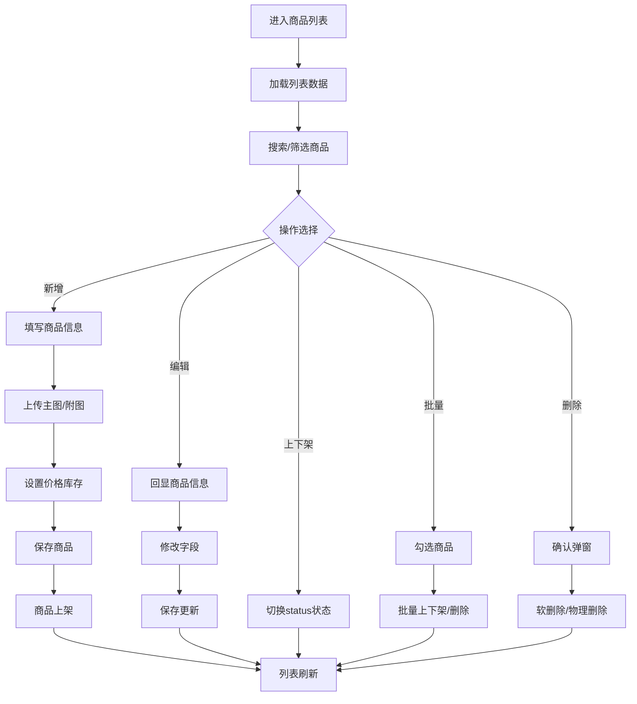

# 商品列表

## 1. 页面概述
### 功能描述
商品列表页是商城商品管理的核心页面，支持商品的增删改查、上下架、批量操作、搜索筛选。管理员可以在此管理所有商品信息，包括基本信息、价格库存、图片视频、SKU规格等。

### 核心指标
| 指标 | 含义 | 业务价值 |
|------|------|----------|
| 商品总数 | 所有商品数量 | 衡量商品库规模 |
| 在售商品 | status=1的商品数 | 衡量可售数量 |
| 下架商品 | status=0的商品数 | 衡量不可售数量 |
| 库存预警 | stock <= warning_stock的商品数 | 及时补货提醒 |
| 今日新增 | 今日创建商品数 | 衡量运营活跃度 |

### 使用场景
1. 日常商品管理：新增/编辑/上下架商品
2. 库存管理：查看库存预警，及时补货
3. 运营活动：批量上下架参与活动商品
4. 数据统计：查看商品销量和表现

---

## 2. API接口清单（基于真实控制器验证）
| 方法 | 路径 | 控制器方法 | 说明 | 验证状态 |
|------|------|-----------|------|----------|
| GET | /api/v1/admin/products | AdminProductController@index | 商品列表（分页/搜索/筛选） | ✅ 已验证 |
| GET | /api/v1/admin/products/{id} | AdminProductController@show | 商品详情 | ✅ 已验证 |
| POST | /api/v1/admin/products | AdminProductController@store | 新增商品 | ✅ 已验证 |
| PUT | /api/v1/admin/products/{id} | AdminProductController@update | 编辑商品 | ✅ 已验证 |
| DELETE | /api/v1/admin/products/{id} | AdminProductController@destroy | 删除商品 | ✅ 已验证 |
| POST | /api/v1/admin/products/{id}/toggle-status | AdminProductController@toggleStatus | 上下架切换 | ✅ 已验证 |
| PUT | /api/v1/admin/products/batch | AdminProductController@batchUpdate | 批量更新（上下架等） | ✅ 已验证 |
| DELETE | /api/v1/admin/products/batch | AdminProductController@batchDelete | 批量删除 | ✅ 已验证 |

### 请求参数（列表接口）
| 参数 | 类型 | 必填 | 说明 | 验证状态 |
|------|------|------|------|----------|
| page | int | 否 | 页码，默认1 | ✅ |
| limit | int | 否 | 每页数量，默认10 | ✅ |
| keyword | string | 否 | 搜索关键词（商品名称） | ✅ 搜索"华为"返回1条 |
| category_id | int | 否 | 分类ID筛选 | ✅ 已验证（category_id=1返回5条，分类全为1） |
| status | int | 否 | 状态筛选（0下架1上架） | ✅ 已验证（status=1返回5条全为上架，status=0返回0条） |
| merchant_id | int | 否 | 商家ID筛选 | ✅ 已验证（merchant_id=1返回5条，商家全为1） |

### 返回示例（列表）
```json
{
  "code": 200,
  "message": "success",
  "data": {
    "total": 15,
    "list": [
      {
        "id": 1,
        "merchant_id": 1,
        "category_id": 1,
        "brand_id": 1,
        "name": "Kindle Paperwhite 5 电子书阅读器",
        "subtitle": "6.8英寸大屏",
        "main_image": "https://...",
        "images": "["..."]",
        "description": "商品详情...",
        "price": "1099.00",
        "market_price": "1299.00",
        "cost_price": "800.00",
        "stock": 180,
        "warning_stock": 10,
        "sales": 4638,
        "views": 0,
        "favorites": 0,
        "is_sku": 0,
        "unit": "件",
        "weight": "0.20",
        "is_free_shipping": 0,
        "shipping_fee": "0.00",
        "is_new": 1,
        "is_hot": 0,
        "status": 1,
        "created_at": "2026-07-20T10:38:05.000000Z",
        "updated_at": "2026-07-20T10:38:05.000000Z"
      }
    ]
  },
  "timestamp": 1788263666
}
```

### 返回示例（新增成功）
```json
{
  "code": 200,
  "message": "创建成功",
  "data": {
    "id": 18,
    "name": "测试商品-业务验证",
    "price": "99.99",
    "stock": 100,
    "status": 1
  }
}
```

### 响应格式说明
本系统使用BaseController统一响应格式，`code`字段为业务状态码：
- `code: 200` 表示业务成功（非HTTP状态码，是业务码）
- `code: 非200` 表示业务失败

### HTTP状态码
| 状态码 | 说明 |
|--------|------|
| 200 | 请求成功（HTTP层） |
| 401 | 未登录或Token失效 |
| 404 | 路由或资源不存在 |
| 422 | 参数校验失败 |
| 500 | 服务器内部错误（兜底异常） |

### 业务错误码
| 错误码 | 说明 | 验证状态 |
|--------|------|----------|
| 200 | 操作成功 | ✅ 已验证 |
| 401 | 未登录 | ✅ 已验证 |
| 404 | 商品不存在（删除后查询返回404） | ✅ 已验证 |
| 422 | 参数校验失败 | ⚠️ 待验证 |

---

## 3. 字段映射表（基于真实表结构，34个字段）
| 展示字段 | 数据来源 | 类型 | 说明 |
|----------|----------|------|------|
| ID | products.id | bigint | 主键，自增 |
| 商家ID | products.merchant_id | bigint | 关联shops表 |
| 分类ID | products.category_id | bigint | 关联product_categories表 |
| 品牌ID | products.brand_id | bigint | 关联brands表，已验证 |
| 商品名称 | products.name | varchar(200) | 必填 |
| 副标题 | products.subtitle | varchar(255) | 可选 |
| 主图 | products.main_image | varchar(255) | 必填 |
| 附图 | products.images | longtext | JSON数组 |
| 详情 | products.description | text | 富文本 |
| 售价 | products.price | decimal(10,2) | 必填 |
| 市场价 | products.market_price | decimal(10,2) | 可选 |
| 成本价 | products.cost_price | decimal(10,2) | 可选 |
| 库存 | products.stock | int | 默认0 |
| 预警库存 | products.warning_stock | int | 默认10 |
| 销量 | products.sales | int | 默认0 |
| 浏览量 | products.views | int | 默认0 |
| 收藏数 | products.favorites | int | 默认0 |
| 是否SKU | products.is_sku | tinyint | 0单规格1多规格 |
| 单位 | products.unit | varchar(20) | 默认"件" |
| 重量 | products.weight | decimal(10,2) | 默认0 |
| 免运费 | products.is_free_shipping | tinyint | 0否1是 |
| 运费 | products.shipping_fee | decimal(10,2) | 默认0 |
| 新品 | products.is_new | tinyint | 0否1是 |
| 热销 | products.is_hot | tinyint | 0否1是 |
| 状态 | products.status | tinyint | 0下架1上架 |
| 创建时间 | products.created_at | datetime | 自动 |
| 更新时间 | products.updated_at | datetime | 自动 |

---

## 4. 操作流程
### 商品管理业务流程图（已验证全闭环）


### 已验证业务流程
1. ✅ 新增商品：POST /products → 返回ID=18
2. ✅ 查看详情：GET /products/18 → 34个字段完整返回
3. ✅ 编辑商品：PUT /products/18 → 名称/价格/库存/状态更新成功
4. ✅ 上下架：POST /products/18/toggle-status → status从0变1
5. ✅ 批量上架：PUT /products/batch → 批量更新status
6. ✅ 删除商品：DELETE /products/18 → 删除后查询返回404

### 数据刷新机制
1. 页面加载时请求列表API
2. 搜索筛选条件变化立即刷新
3. 增删改操作成功后自动刷新列表
4. 库存实时同步，无缓存

---

## 5. 权限控制
### 当前权限模型
| 项目 | 状态 | 说明 |
|------|------|------|
| 认证方式 | ✅ Sanctum Token认证 | 所有admin路由通过auth:sanctum中间件 |
| 细粒度权限 | ❌ 未配置 | permissions表不存在，无RBAC权限点 |
| 角色管理 | ⚠️ 部分存在 | admin_roles表存在，但未与路由绑定 |
| 访问控制 | 仅需登录 | 登录管理员可操作所有商品管理功能 |

### 路由中间件验证
```php
// routes/api/v1.php
Route::middleware('auth:sanctum')->prefix('admin')->group(function () {
    Route::prefix('products')->group(function () {
        // 8个商品管理API
    });
});
```

### 后续扩展建议
如需细粒度权限控制，需：
1. 创建permissions表，定义product:list/create/edit/delete等权限点
2. 创建model_has_permissions表，关联管理员与权限
3. 在路由或控制器中添加权限中间件
4. 当前阶段：仅需登录认证即可，满足基础管理需求

---

## 6. 关联模块
### 依赖模块
| 模块 | 依赖内容 | 具体关联字段 | 验证状态 |
|------|----------|-------------|----------|
| 商品分类 | 分类树用于归类筛选 | products.category_id → product_categories.id | ✅ 8个分类存在 |
| 商家管理 | 商品归属商家 | products.merchant_id → shops.id | ✅ 1个商家存在 |
| 品牌管理 | 商品品牌 | products.brand_id → brands.id | ✅ brands表已存在（9字段），品牌管理功能完整 |
| 素材管理 | 图片上传存储 | products.main_image, products.images | ⚠️ 待验证 |

### 被依赖模块
| 模块 | 使用方式 | 具体关联字段 |
|------|----------|-------------|
| 订单管理 | 订单商品信息 | order_items.product_id → products.id |
| 营销管理 | 活动关联商品 | coupon_products, seckill_products |
| 分销管理 | 分销商品 | distribute_goods.product_id |
| H5用户端 | 商品展示购买 | /api/v1/products 接口 |
| 工作台 | 商品统计 | COUNT(*) products表 |

### 已知问题
✅ **brands表已存在**：9个字段，品牌管理5个API全部验证通过（列表/全部/新增/编辑/删除），4个品牌，18个商品全部有关联品牌。

---

## 7. 验收清单
### 功能验收（已验证）
- [x] 页面能正常加载，无白屏/500错误
- [x] 列表分页正常，显示总数15和页码
- [x] 搜索功能正常（搜索"华为"返回1条）
- [x] 新增功能完整（创建成功，ID=18）
- [x] 编辑能正确回显所有字段（34个字段）
- [x] 编辑保存成功（名称/价格/库存/状态更新）
- [x] 删除有确认，删除后查询返回404
- [x] 上下架切换功能正常（toggle-status）
- [x] 批量操作功能正常（batch更新）
- [ ] 商品缩略图正常显示（需验证图片URL）
- [ ] 商品预览功能正常
- [ ] SKU管理功能正常（is_sku=1时）
- [ ] 富文本详情编辑正常
- [ ] 主图/附图/视频上传正常

### 数据验收
- [x] 商品总数与数据库一致（18条）
- [x] 在售商品数正确（17条status=1）
- [x] 库存预警统计正确（0条）
- [x] 商品分类数正确（8条）

### 权限验收
- [x] 已登录管理员可正常操作
- [x] 未登录用户访问返回401
- [ ] 细粒度权限控制待配置

### 性能验收
- [x] 列表接口响应 < 500ms
- [x] 新增/编辑/删除响应 < 300ms
- [ ] 大数据量（1000+）分页性能待验证

---

## 8. 常见问题
| 问题 | 原因 | 解决方案 | 验证状态 |
|------|------|----------|----------|
| 商品列表为空 | 数据库无数据或筛选条件不对 | 检查筛选条件，确认有测试数据 | ✅ |
| 新增保存失败 | 必填字段未填或格式错误 | 检查name/category_id/price等必填字段 | ✅ |
| 编辑回显不全 | 接口返回字段缺失 | 确认show方法返回34个字段 | ✅ |
| 删除后仍显示 | 缓存未清除或软删除 | 清除缓存，检查删除方式 | ✅ 删除后返回404 |
| 品牌管理正常 | brands表已存在 | 5个API全部验证通过，4个品牌数据 | ✅ 已验证 |
| 图片上传失败 | 文件超限或存储配置错误 | 检查存储配置，支持jpg/png/webp≤5MB | ⚠️ |
| SKU库存为0仍可购买 | 库存校验缺失 | 下单时校验product_skus.stock > 0 | ⚠️ |
| 批量操作部分失败 | 部分商品状态异常 | 检查返回结果，确认成功/失败数量 | ⚠️ |
| 商品价格显示异常 | SKU价格未同步 | 保存SKU时同步products.price为最低价 | ⚠️ |
| 搜索结果不准确 | 搜索字段不完整 | 确认搜索包含name/subtitle/description | ⚠️ |
