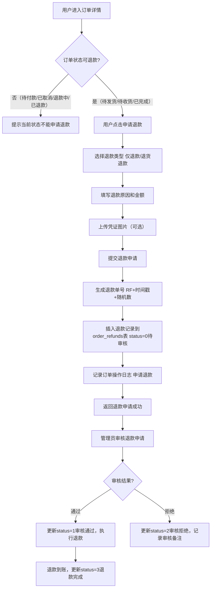
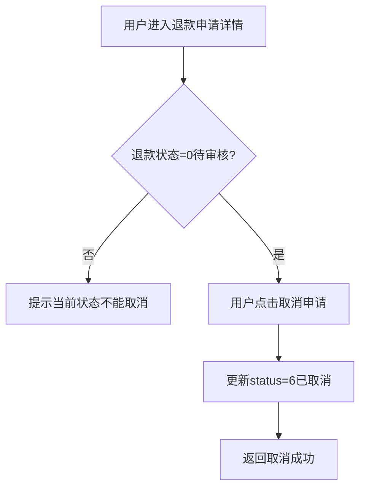

# 退款申请

## 1. 页面概述

退款申请模块提供用户端订单退款申请能力，用户可对已发货/待收货/已完成的订单申请退款。支持仅退款和退货退款两种类型，用户可填写退款原因、退款金额、问题描述和凭证图片。退款申请提交后需管理员审核。

### 核心功能
- 退款申请列表（用户查看自己的退款申请）
- 退款申请详情
- 提交退款申请（仅退款/退货退款）
- 取消退款申请（仅待审核状态可取消）
- 退款单号自动生成
- 订单操作日志记录

### 退款类型
| type | 类型 | 说明 |
|------|------|------|
| 1 | 仅退款 | 不退货，仅退款 |
| 2 | 退货退款 | 需退货，退款 |

### 退款状态
| status | 状态 | 说明 |
|--------|------|------|
| 0 | 待审核 | 用户提交申请，等待管理员审核 |
| 1 | 审核通过 | 管理员审核通过 |
| 2 | 审核拒绝 | 管理员审核拒绝 |
| 3 | 退款完成 | 退款已到账 |
| 6 | 已取消 | 用户取消申请 |

### 可申请退款的订单状态
| 订单状态 | 说明 | 可申请退款 |
|---------|------|-----------|
| 1 | 待发货 | ✅ |
| 2 | 待收货 | ✅ |
| 3 | 已完成 | ✅ |
| 0 | 待付款 | ❌ |
| 4 | 已取消 | ❌ |
| 5 | 退款中 | ❌ |
| 6 | 已退款 | ❌ |

### 使用场景
1. 用户收到商品后申请退款
2. 用户未收到商品申请仅退款
3. 用户查看退款申请进度
4. 用户取消待审核的退款申请

## 2. API接口清单

| 方法 | 路径 | 控制器方法 | 说明 |
|------|------|-----------|------|
| GET | /api/v1/refunds | RefundController@index | 退款申请列表（需登录） |
| GET | /api/v1/refunds/{id} | RefundController@show | 退款申请详情（需登录） |
| POST | /api/v1/refunds | RefundController@store | 提交退款申请（需登录） |
| POST | /api/v1/refunds/{id}/cancel | RefundController@cancel | 取消退款申请（需登录） |

## 3. 请求参数

### 退款申请列表
| 参数 | 类型 | 必填 | 说明 |
|------|------|------|------|
| limit | int | 否 | 每页数量，默认10 |

### 退款申请详情
| 参数 | 类型 | 必填 | 说明 |
|------|------|------|------|
| id | int | 是 | 退款申请ID（URL路径参数） |

### 提交退款申请
| 参数 | 类型 | 必填 | 说明 |
|------|------|------|------|
| order_id | int | 是 | 订单ID |
| order_item_id | int | 否 | 订单商品项ID，0表示整单退款 |
| type | int | 是 | 退款类型：1仅退款，2退货退款 |
| reason | string | 是 | 退款原因 |
| refund_amount | decimal | 是 | 退款金额，最小0.01 |
| description | string | 否 | 问题描述 |
| images | array | 否 | 凭证图片URL数组 |

### 取消退款申请
| 参数 | 类型 | 必填 | 说明 |
|------|------|------|------|
| id | int | 是 | 退款申请ID（URL路径参数） |

## 4. 返回示例

### 退款申请列表
```json
{
  "code": 200,
  "message": "success",
  "data": {
    "list": [
      {
        "id": 1,
        "refund_no": "RF202609011000001234",
        "order_id": 5,
        "order_item_id": 0,
        "user_id": 2,
        "merchant_id": 1,
        "type": 1,
        "refund_amount": "9999.00",
        "reason": "商品质量问题",
        "description": "收到商品后发现有划痕",
        "images": "[\"https://...\"]",
        "status": 0,
        "audit_remark": null,
        "audit_at": null,
        "created_at": "2026-09-01 10:00:00",
        "updated_at": "2026-09-01 10:00:00"
      }
    ],
    "total": 1
  },
  "timestamp": 1788341855
}
```

### 提交退款申请成功
```json
{
  "code": 200,
  "message": "退款申请已提交",
  "data": { "refund_no": "RF202609011000001234" },
  "timestamp": 1788341855
}
```

### 取消退款申请成功
```json
{
  "code": 200,
  "message": "已取消退款申请",
  "data": null,
  "timestamp": 1788341855
}
```

### 退款申请不存在
```json
{
  "code": 404,
  "message": "退款单不存在",
  "data": null,
  "timestamp": 1788341855
}
```

## 5. HTTP状态码

| 状态码 | 说明 |
|--------|------|
| 200 | 请求成功 |
| 400 | 业务错误（订单状态不能退款、当前状态不能取消） |
| 401 | 未认证 |
| 404 | 退款单/订单不存在 |
| 422 | 请求参数验证失败 |

## 6. 字段映射表

### order_refunds表（15字段）
| 字段 | 类型 | 说明 |
|------|------|------|
| id | bigint(20) unsigned | 主键，自增 |
| refund_no | varchar(50) | 退款单号（RF+时间戳+随机数） |
| order_id | bigint(20) unsigned | 订单ID |
| order_item_id | bigint(20) unsigned | 订单商品项ID，0表示整单退款 |
| user_id | bigint(20) unsigned | 用户ID |
| merchant_id | bigint(20) unsigned | 商家ID |
| type | tinyint(4) | 退款类型：1仅退款，2退货退款 |
| refund_amount | decimal(12,2) | 退款金额 |
| reason | varchar(255) | 退款原因 |
| description | text | 问题描述 |
| images | text | 凭证图片（JSON数组） |
| status | tinyint(4) | 状态：0待审核，1审核通过，2审核拒绝，3退款完成，6已取消 |
| audit_remark | varchar(255) | 审核备注 |
| audit_at | timestamp | 审核时间 |
| created_at | timestamp | 创建时间 |
| updated_at | timestamp | 更新时间 |

### 订单日志字段
| 字段 | 说明 |
|------|------|
| order_id | 订单ID |
| order_no | 订单号 |
| action | 操作类型：6申请退款 |
| action_name | 操作名称：申请退款 |
| operator_type | 操作人类型：user |
| operator_id | 操作人ID |
| remark | 备注：退款金额+原因 |

## 7. 操作流程

### 退款申请流程


### 取消退款申请流程


## 8. 权限控制

- 认证方式：Sanctum Token认证
- 路由中间件：auth:sanctum
- 所有接口需用户登录
- 用户只能操作自己的退款申请（通过user_id过滤）
- 提交退款申请为写操作，需用户权限

## 9. 关联模块

### 依赖模块
| 模块 | 依赖内容 | 关联字段 |
|------|---------|---------|
| 订单管理 | 订单信息 | order_refunds.order_id → orders.id |
| 订单商品 | 商品项信息 | order_refunds.order_item_id → order_items.id |
| 用户认证 | 用户登录 | order_refunds.user_id → users.id |
| 订单日志 | 操作日志 | order_logs.order_id → orders.id |

### 被依赖模块
| 模块 | 使用方式 |
|------|---------|
| 订单管理 | 管理员审核退款申请 |
| 财务管理 | 退款金额统计 |
| 用户中心 | 展示退款申请列表和进度 |

## 10. 验收清单

### 功能验收
- [x] 退款申请列表接口正常（GET /refunds）
- [x] 列表只返回当前用户的退款申请
- [x] 列表按ID倒序排序
- [x] 退款申请详情接口正常（GET /refunds/{id}）
- [x] 提交退款申请接口正常（POST /refunds）
- [x] 支持两种退款类型（仅退款/退货退款）
- [x] 退款单号自动生成（RF+时间戳+随机数）
- [x] 只有待发货/待收货/已完成状态的订单可申请退款
- [x] 提交退款申请后记录订单操作日志
- [x] 取消退款申请接口正常（POST /refunds/{id}/cancel）
- [x] 只有待审核状态（status=0）的退款申请可取消
- [x] 数据库事务保护（申请失败时回滚）

### 数据验收
- [x] order_refunds表结构完整（15字段）
- [x] refund_no唯一
- [x] refund_amount最小0.01
- [x] status默认0（待审核）
- [x] images字段存储JSON数组

### 安全验收
- [x] 所有接口需auth:sanctum认证
- [x] 用户只能操作自己的退款申请（通过user_id过滤）
- [x] 订单状态校验（防止对不可退款的订单申请）
- [x] 退款状态校验（防止取消已审核的申请）
- [x] 参数验证（type只能是1/2，refund_amount最小0.01）
- [x] 数据库事务（防止部分更新）

## 11. 常见问题

| 问题 | 原因 | 解决方案 |
|------|------|----------|
| 提交退款返回"订单不存在" | 订单ID错误或不属于当前用户 | 检查order_id是否正确，确保用户已登录 |
| 提交退款返回"当前状态不能申请退款" | 订单不是待发货/待收货/已完成状态 | 只有status=1/2/3的订单可申请退款 |
| 取消退款返回"当前状态不能取消" | 退款申请不是待审核状态 | 只有status=0的退款申请可取消 |
| 退款申请详情返回404 | 退款申请ID错误或不属于当前用户 | 检查退款申请ID是否正确 |
| 退款金额不正确 | 用户填写的退款金额超过订单金额 | 前端应限制退款金额不超过订单实付金额 |
| 凭证图片上传失败 | 图片上传接口问题 | 先调用文件上传接口获取图片URL，再提交退款申请 |
| 退款申请提交后订单状态未变 | 退款申请不改变订单状态，需管理员审核通过后才改变 | 正常行为，退款申请status=0待审核，订单状态不变 |
| 退款单号重复 | 随机数碰撞 | 退款单号格式为RF+时间戳+4位随机数，概率极低，如遇重复可增加随机数位数 |
| 管理员审核退款申请的接口在哪里 | 管理员审核接口在Order模块（/admin/refunds/{id}/audit） | Refund模块只提供用户端接口，管理员端接口在Order模块 |
