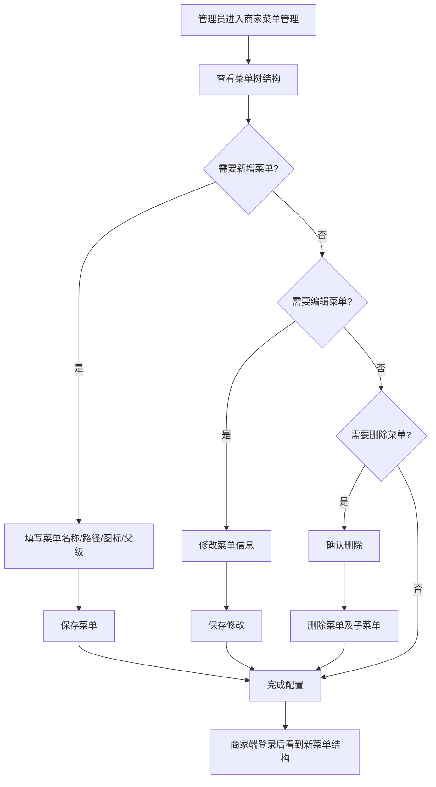
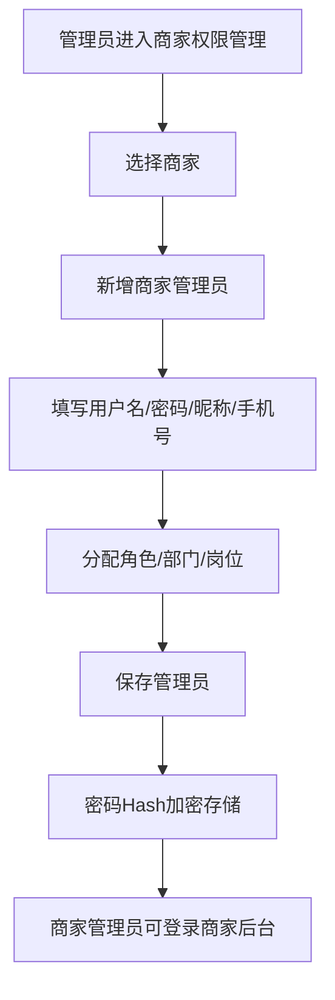

# 商家中心

## 1. 页面概述

商家中心模块提供商家后台的基础配置能力，包括商家分类管理、商家菜单管理、商家权限管理（管理员/角色/部门/岗位）和商家账户日志。管理员可配置商家端的菜单结构、权限体系和组织架构。

### 核心功能
- 商家分类管理：商家行业分类，支持树形结构
- 商家菜单管理：商家后台导航菜单配置，支持树形结构
- 商家权限管理：商家管理员、角色、部门、岗位的CRUD
- 商家账户日志：商家账户资金变动记录

### 子模块
| 子模块 | 控制器 | 说明 |
|--------|--------|------|
| 商家分类 | CategoryController | 商家行业分类管理 |
| 商家菜单 | ShopMenuController | 商家后台导航菜单配置 |
| 商家权限 | ShopPermissionController | 商家管理员/角色/部门/岗位管理 |
| 商家中心 | ShopCenterController | 商家分类和账户日志 |

### 使用场景
1. 配置商家端导航菜单结构
2. 管理商家后台管理员账号和角色权限
3. 配置商家组织架构（部门/岗位）
4. 查看商家账户资金变动日志

## 2. API接口清单

### 商家分类
| 方法 | 路径 | 控制器方法 | 说明 |
|------|------|-----------|------|
| GET | /api/v1/admin/shop-center/categories | CategoryController@index | 商家分类列表 |
| GET | /api/v1/admin/merchant-categories/tree | CategoryController@tree | 商家分类树 |
| POST | /api/v1/admin/shop-center/categories | CategoryController@store | 新增商家分类 |
| PUT | /api/v1/admin/shop-center/categories/{id} | CategoryController@update | 编辑商家分类 |
| DELETE | /api/v1/admin/shop-center/categories/{id} | CategoryController@destroy | 删除商家分类 |

### 商家菜单
| 方法 | 路径 | 控制器方法 | 说明 |
|------|------|-----------|------|
| GET | /api/v1/admin/shop-menu | ShopMenuController@index | 商家菜单列表 |
| GET | /api/v1/admin/shop-menu/tree | ShopMenuController@tree | 商家菜单树 |
| POST | /api/v1/admin/shop-menu | ShopMenuController@store | 新增商家菜单 |
| PUT | /api/v1/admin/shop-menu/{id} | ShopMenuController@update | 编辑商家菜单 |
| DELETE | /api/v1/admin/shop-menu/{id} | ShopMenuController@destroy | 删除商家菜单 |

### 商家权限-管理员
| 方法 | 路径 | 控制器方法 | 说明 |
|------|------|-----------|------|
| GET | /api/v1/admin/shop-permission/admins | ShopPermissionController@adminList | 商家管理员列表 |
| POST | /api/v1/admin/shop-permission/admins | ShopPermissionController@adminStore | 新增商家管理员 |
| PUT | /api/v1/admin/shop-permission/admins/{id} | ShopPermissionController@adminUpdate | 编辑商家管理员 |
| DELETE | /api/v1/admin/shop-permission/admins/{id} | ShopPermissionController@adminDestroy | 删除商家管理员 |

### 商家权限-角色
| 方法 | 路径 | 控制器方法 | 说明 |
|------|------|-----------|------|
| GET | /api/v1/admin/shop-permission/roles | ShopPermissionController@roleList | 商家角色列表 |
| POST | /api/v1/admin/shop-permission/roles | ShopPermissionController@roleStore | 新增商家角色 |
| PUT | /api/v1/admin/shop-permission/roles/{id} | ShopPermissionController@roleUpdate | 编辑商家角色 |
| DELETE | /api/v1/admin/shop-permission/roles/{id} | ShopPermissionController@roleDestroy | 删除商家角色 |

### 商家权限-部门
| 方法 | 路径 | 控制器方法 | 说明 |
|------|------|-----------|------|
| GET | /api/v1/admin/shop-permission/depts | ShopPermissionController@deptList | 商家部门列表 |
| POST | /api/v1/admin/shop-permission/depts | ShopPermissionController@deptStore | 新增商家部门 |
| PUT | /api/v1/admin/shop-permission/depts/{id} | ShopPermissionController@deptUpdate | 编辑商家部门 |
| DELETE | /api/v1/admin/shop-permission/depts/{id} | ShopPermissionController@deptDestroy | 删除商家部门 |

### 商家权限-岗位
| 方法 | 路径 | 控制器方法 | 说明 |
|------|------|-----------|------|
| GET | /api/v1/admin/shop-permission/jobs | ShopPermissionController@jobList | 商家岗位列表 |
| POST | /api/v1/admin/shop-permission/jobs | ShopPermissionController@jobStore | 新增商家岗位 |
| PUT | /api/v1/admin/shop-permission/jobs/{id} | ShopPermissionController@jobUpdate | 编辑商家岗位 |
| DELETE | /api/v1/admin/shop-permission/jobs/{id} | ShopPermissionController@jobDestroy | 删除商家岗位 |

### 商家账户日志
| 方法 | 路径 | 控制器方法 | 说明 |
|------|------|-----------|------|
| GET | /api/v1/admin/shop-center/account-logs | ShopCenterController@accountLogs | 商家账户日志列表 |

## 3. 请求参数

### 商家分类列表
| 参数 | 类型 | 必填 | 说明 |
|------|------|------|------|
| page | int | 否 | 页码 |
| limit | int | 否 | 每页数量 |

### 新增商家分类
| 参数 | 类型 | 必填 | 说明 |
|------|------|------|------|
| name | string | 是 | 分类名称 |
| parent_id | int | 否 | 父级分类ID，0表示顶级 |
| icon | string | 否 | 分类图标 |
| commission_rate | decimal | 否 | 佣金比例（%） |
| deposit | decimal | 否 | 保证金金额 |
| qualifications | array | 否 | 所需资质证件列表 |
| sort | int | 否 | 排序 |
| status | int | 否 | 1启用，0禁用 |

### 商家菜单列表
| 参数 | 类型 | 必填 | 说明 |
|------|------|------|------|
| page | int | 否 | 页码 |
| limit | int | 否 | 每页数量 |

### 新增商家菜单
| 参数 | 类型 | 必填 | 说明 |
|------|------|------|------|
| name | string | 是 | 菜单名称 |
| parent_id | int | 否 | 父级菜单ID，0表示顶级 |
| path | string | 是 | 菜单路由路径 |
| icon | string | 否 | 菜单图标 |
| permission | string | 否 | 权限标识 |
| type | string | 否 | 菜单类型：shop商家端 |
| sort | int | 否 | 排序 |
| status | int | 否 | 1显示，0隐藏 |

### 商家管理员列表
| 参数 | 类型 | 必填 | 说明 |
|------|------|------|------|
| shop_id | int | 否 | 按商家筛选 |
| keyword | string | 否 | 搜索关键词（用户名/昵称/手机号） |
| status | int | 否 | 按状态筛选 |

### 新增商家管理员
| 参数 | 类型 | 必填 | 说明 |
|------|------|------|------|
| shop_id | int | 是 | 商家ID |
| username | string | 是 | 登录用户名 |
| password | string | 是 | 登录密码 |
| nickname | string | 否 | 昵称 |
| mobile | string | 否 | 手机号 |
| role_id | int | 否 | 角色ID |
| dept_id | int | 否 | 部门ID |
| job_id | int | 否 | 岗位ID |
| status | int | 否 | 1启用，0禁用 |

### 商家账户日志列表
| 参数 | 类型 | 必填 | 说明 |
|------|------|------|------|
| shop_id | int | 否 | 按商家筛选 |
| type | int | 否 | 按类型筛选 |
| page | int | 否 | 页码 |
| limit | int | 否 | 每页数量 |

## 4. 返回示例

### 商家分类树
```json
{
  "code": 200,
  "message": "success",
  "data": [
    {
      "id": 1,
      "name": "服装鞋帽",
      "icon": "clothing",
      "level": 1,
      "path": "/",
      "commission_rate": "5.00",
      "deposit": "5000.00",
      "qualifications": ["营业执照"],
      "children": []
    }
  ],
  "timestamp": 1788342117
}
```

### 商家菜单树
```json
{
  "code": 200,
  "message": "success",
  "data": [
    {
      "id": 1,
      "parent_id": 0,
      "name": "工作台",
      "path": "/merchant/dashboard",
      "icon": "dashboard",
      "sort": 1,
      "status": 1,
      "type": "shop",
      "permission": null,
      "children": []
    }
  ],
  "timestamp": 1788342117
}
```

### 商家管理员列表
```json
{
  "code": 200,
  "message": "success",
  "data": {
    "list": [
      {
        "id": 3,
        "shop_id": 6,
        "username": "13688273101",
        "nickname": "李经理",
        "mobile": "13688273101",
        "role_id": 5,
        "dept_id": null,
        "job_id": null,
        "status": 1,
        "last_login_at": null,
        "created_at": "2026-09-01 14:31:43",
        "updated_at": "2026-09-01 14:31:43",
        "role_name": "运营经理",
        "dept_name": null,
        "job_name": null
      }
    ],
    "total": 1
  },
  "timestamp": 1788342117
}
```

### 商家账户日志列表
```json
{
  "code": 200,
  "message": "success",
  "data": {
    "list": [
      {
        "id": 3,
        "merchant_id": 2,
        "type": 3,
        "amount": "100.00",
        "before_balance": "0.00",
        "after_balance": "0.00",
        "balance": "16399.00",
        "order_no": null,
        "remark": "平台佣金扣除",
        "operator_id": null,
        "operator_type": "system",
        "created_at": "2026-09-01 10:00:00"
      }
    ],
    "total": 1,
    "page": 1,
    "limit": 20
  },
  "timestamp": 1788342117
}
```

## 5. HTTP状态码

| 状态码 | 说明 |
|--------|------|
| 200 | 请求成功 |
| 400 | 业务错误 |
| 401 | 未认证 |
| 404 | 资源不存在 |
| 422 | 请求参数验证失败 |

## 6. 字段映射表

### shop_categories表（商家分类）
| 字段 | 类型 | 说明 |
|------|------|------|
| id | bigint | 主键 |
| name | varchar(50) | 分类名称 |
| parent_id | bigint | 父级分类ID，0表示顶级 |
| level | tinyint | 层级（1/2/3） |
| path | varchar(255) | 层级路径（如/1/5/） |
| icon | varchar(100) | 分类图标 |
| commission_rate | decimal(5,2) | 佣金比例（%） |
| deposit | decimal(12,2) | 保证金金额 |
| qualifications | text | 所需资质证件（JSON数组） |
| sort | int | 排序 |
| status | tinyint | 1启用，0禁用 |
| created_at | timestamp | 创建时间 |
| updated_at | timestamp | 更新时间 |

### shop_menus表（商家菜单）
| 字段 | 类型 | 说明 |
|------|------|------|
| id | bigint | 主键 |
| parent_id | bigint | 父级菜单ID，0表示顶级 |
| name | varchar(50) | 菜单名称 |
| path | varchar(255) | 菜单路由路径 |
| icon | varchar(100) | 菜单图标 |
| permission | varchar(100) | 权限标识 |
| type | varchar(20) | 菜单类型：shop商家端 |
| sort | int | 排序 |
| status | tinyint | 1显示，0隐藏 |
| created_at | timestamp | 创建时间 |
| updated_at | timestamp | 更新时间 |

### shop_admins表（商家管理员，14字段）
| 字段 | 类型 | 说明 |
|------|------|------|
| id | bigint | 主键 |
| shop_id | bigint | 商家ID |
| username | varchar(50) | 登录用户名 |
| password | varchar(255) | 登录密码（Hash加密，API不返回） |
| nickname | varchar(50) | 昵称 |
| role_id | bigint | 角色ID |
| dept_id | bigint | 部门ID |
| job_id | bigint | 岗位ID |
| mobile | varchar(20) | 手机号 |
| status | tinyint | 1启用，0禁用 |
| last_login_at | timestamp | 最后登录时间 |
| created_at | timestamp | 创建时间 |
| updated_at | timestamp | 更新时间 |

### shop_roles表（商家角色）
| 字段 | 类型 | 说明 |
|------|------|------|
| id | bigint | 主键 |
| shop_id | bigint | 商家ID |
| name | varchar(50) | 角色名称 |
| description | varchar(255) | 角色描述 |
| permissions | text | 权限列表（JSON） |
| status | tinyint | 1启用，0禁用 |
| created_at | timestamp | 创建时间 |
| updated_at | timestamp | 更新时间 |

### shop_depts表（商家部门）
| 字段 | 类型 | 说明 |
|------|------|------|
| id | bigint | 主键 |
| shop_id | bigint | 商家ID |
| parent_id | bigint | 父级部门ID |
| name | varchar(50) | 部门名称 |
| leader | varchar(50) | 负责人 |
| phone | varchar(20) | 联系电话 |
| sort | int | 排序 |
| status | tinyint | 1启用，0禁用 |
| created_at | timestamp | 创建时间 |
| updated_at | timestamp | 更新时间 |

### shop_jobs表（商家岗位）
| 字段 | 类型 | 说明 |
|------|------|------|
| id | bigint | 主键 |
| shop_id | bigint | 商家ID |
| name | varchar(50) | 岗位名称 |
| description | varchar(255) | 岗位描述 |
| sort | int | 排序 |
| status | tinyint | 1启用，0禁用 |
| created_at | timestamp | 创建时间 |
| updated_at | timestamp | 更新时间 |

### merchant_account_logs表（商家账户日志）
| 字段 | 类型 | 说明 |
|------|------|------|
| id | bigint | 主键 |
| merchant_id | bigint | 商家ID |
| type | tinyint | 类型：1充值，2消费，3佣金扣除，4退款，5提现 |
| amount | decimal(12,2) | 变动金额 |
| before_balance | decimal(12,2) | 变动前余额 |
| after_balance | decimal(12,2) | 变动后余额 |
| balance | decimal(12,2) | 当前余额 |
| order_no | varchar(50) | 关联订单号 |
| remark | varchar(255) | 备注 |
| operator_id | bigint | 操作人ID |
| operator_type | varchar(20) | 操作人类型：user/admin/system |
| created_at | timestamp | 创建时间 |

## 7. 操作流程

### 商家菜单配置流程


### 商家管理员创建流程


## 8. 权限控制

- 认证方式：Sanctum Token认证
- 路由中间件：auth:sanctum
- 当前权限模型：登录管理员可操作商家中心所有配置
- 无细粒度权限点（permissions表不存在）
- 商家管理员密码使用Hash加密存储，API不返回password字段
- 所有写操作（新增/编辑/删除）需管理员权限

## 9. 关联模块

### 依赖模块
| 模块 | 依赖内容 | 关联字段 |
|------|---------|---------|
| 商家管理 | 商家信息 | shop_admins.shop_id → merchants.id |
| 财务管理 | 商家账户 | merchant_account_logs.merchant_id → merchants.id |
| 商家端 | 菜单和权限 | shop_menus/shop_roles/shop_admins |

### 被依赖模块
| 模块 | 使用方式 |
|------|---------|
| 商家端 | 登录认证使用shop_admins表，菜单展示使用shop_menus表，权限控制使用shop_roles表 |
| 财务管理 | 商家账户资金变动记录到merchant_account_logs表 |

## 10. 验收清单

### 功能验收
- [x] 商家分类列表接口正常（GET /shop-center/categories）
- [x] 商家分类树接口正常（GET /merchant-categories/tree）
- [x] 商家菜单列表接口正常（GET /shop-menu）
- [x] 商家菜单树接口正常（GET /shop-menu/tree）
- [x] 商家管理员列表接口正常（GET /shop-permission/admins）
- [x] 商家角色列表接口正常（GET /shop-permission/roles）
- [x] 商家账户日志接口正常（GET /shop-center/account-logs）
- [x] 商家管理员列表不返回password字段（敏感信息保护）
- [x] 商家管理员列表关联查询角色/部门/岗位名称

### 数据验收
- [x] shop_categories表结构完整（树形结构字段）
- [x] shop_menus表结构完整（树形结构字段）
- [x] shop_admins表结构完整（14字段，password Hash加密）
- [x] shop_roles/shop_depts/shop_jobs表结构完整
- [x] merchant_account_logs表结构完整（变动前后余额记录）

### 安全验收
- [x] 所有接口需auth:sanctum认证
- [x] 商家管理员列表不返回password字段
- [x] 商家管理员密码使用Hash加密存储
- [x] 参数验证（必填字段/类型校验）

### 修复记录
- [x] 修复商家账户日志API 500错误（添加accountLogs方法）
- [x] 修复商家管理员列表password字段泄露（修改select明确列出字段）
- [x] 修复商家管理员列表select语句中不存在的avatar字段（移除avatar字段）

## 11. 常见问题

| 问题 | 原因 | 解决方案 |
|------|------|----------|
| 商家账户日志API返回500 | ShopCenterController缺少accountLogs方法 | 已修复，添加accountLogs方法查询merchant_account_logs表 |
| 商家管理员列表返回password字段 | 查询使用a.*返回所有字段 | 已修复，修改select明确列出字段排除password |
| 商家管理员列表返回500 | select语句中包含不存在的avatar字段 | 已修复，移除avatar字段 |
| 商家端登录失败 | 商家管理员账号未创建或密码错误 | 检查shop_admins表，确认账号和密码（Hash加密） |
| 商家端菜单不显示 | 菜单status=0（隐藏）或未配置 | 检查shop_menus表，确认菜单status=1且path正确 |
| 商家管理员无权限 | 角色未分配或角色permissions为空 | 检查shop_roles表，确认角色已分配且permissions配置正确 |
| 删除商家分类失败 | 有商家使用该分类 | 先将商家迁移到其他分类，再删除 |
| 删除商家菜单失败 | 有子菜单 | 先删除子菜单，再删除父菜单 |
| 商家账户日志余额不正确 | before_balance/after_balance未正确记录 | 检查账户变动逻辑，确保变动前后余额正确记录 |
