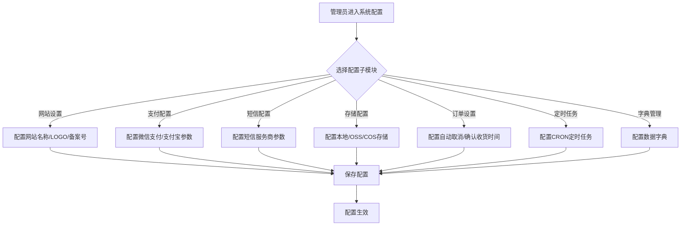
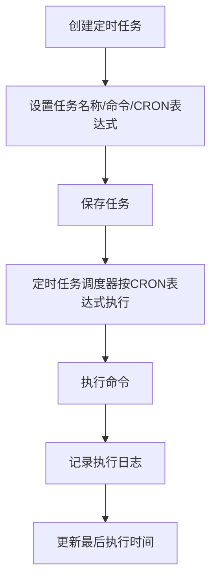

# 系统配置

## 1. 页面概述

系统配置模块提供商城后台的全局配置能力，包括网站设置、订单设置、用户设置、交易设置、通知设置、支付配置、短信配置、存储配置、定时任务、热门搜索、配送方式、物流配置、字典管理、文件管理、系统信息、缓存清理、系统升级等22个子模块。管理员可在此配置商城的各项基础参数。

### 核心功能
- 网站配置：网站名称、LOGO、备案号、版权信息、用户协议
- 订单配置：订单自动取消时间、自动确认收货时间、订单设置
- 用户配置：注册设置、用户等级、积分规则
- 交易配置：交易设置、退款设置
- 通知配置：短信通知、邮件通知、站内信通知
- 支付配置：微信支付、支付宝等支付渠道配置
- 短信配置：短信服务商配置（阿里云/腾讯云）
- 存储配置：本地存储、阿里云OSS、腾讯云COS
- 定时任务：定时任务管理（CRON）
- 热门搜索：搜索热词管理
- 配送方式：快递配送、自提、同城配送
- 物流配置：物流公司、快递模板
- 字典管理：数据字典类型和数据
- 文件管理：上传文件管理
- 系统信息：PHP版本、MySQL版本、服务器信息
- 缓存清理：清除系统缓存
- 系统升级：在线升级系统

### 子模块清单
| 子模块 | 控制器 | 说明 |
|--------|--------|------|
| 系统信息 | SystemInfoController | 服务器环境信息 |
| 网站设置 | WebSettingController | 网站基础配置 |
| 订单设置 | OrderSettingController | 订单相关配置 |
| 用户设置 | UserSettingController | 用户注册和等级配置 |
| 交易设置 | TransactionSettingController | 交易和退款配置 |
| 通知设置 | NoticeSettingController | 通知渠道配置 |
| 支付配置 | PayConfigController | 支付渠道配置 |
| 支付场景 | PaySceneController | 支付场景配置 |
| 短信配置 | SmsConfigController | 短信服务商配置 |
| 存储配置 | StorageConfigController | 存储方式配置 |
| 存储设置 | StorageController | 存储参数配置 |
| 定时任务 | CrontabController | 定时任务管理 |
| 热门搜索 | HotSearchController | 搜索热词管理 |
| 配送方式 | DeliveryTypeController | 配送方式管理 |
| 物流配置 | LogisticsConfigController | 物流公司配置 |
| 快递模板 | ExpressTemplateController | 运费模板管理 |
| 字典管理 | SystemConfigController | 数据字典类型和数据 |
| 文件管理 | FileManagerController | 上传文件管理 |
| 通用配置 | GenericConfigController | 通用键值对配置 |
| 缓存清理 | CacheController | 清除系统缓存 |
| 系统升级 | UpgradeController | 在线升级系统 |

### 使用场景
1. 商城上线前配置网站基础信息
2. 配置支付渠道和短信服务商
3. 设置订单自动取消和确认收货时间
4. 管理定时任务（自动取消订单、自动确认收货）
5. 配置热门搜索词
6. 管理数据字典
7. 查看系统信息和清理缓存

## 2. API接口清单

### 系统信息
| 方法 | 路径 | 控制器方法 | 说明 |
|------|------|-----------|------|
| GET | /api/v1/admin/system-info | SystemInfoController@index | 系统信息 |

### 网站设置
| 方法 | 路径 | 控制器方法 | 说明 |
|------|------|-----------|------|
| GET | /api/v1/admin/web-setting | WebSettingController@index | 网站设置列表 |
| POST | /api/v1/admin/web-setting | WebSettingController@save | 保存网站设置 |
| GET | /api/v1/admin/web-setting/website | WebSettingController@index | 网站基础设置 |
| POST | /api/v1/admin/web-setting/website | WebSettingController@save | 保存网站基础设置 |
| GET | /api/v1/admin/web-setting/agreement | WebSettingController@index | 用户协议设置 |
| POST | /api/v1/admin/web-setting/agreement | WebSettingController@save | 保存用户协议 |
| GET | /api/v1/admin/web-setting/copyright | WebSettingController@index | 版权信息设置 |
| POST | /api/v1/admin/web-setting/copyright | WebSettingController@save | 保存版权信息 |

### 订单设置
| 方法 | 路径 | 控制器方法 | 说明 |
|------|------|-----------|------|
| GET | /api/v1/admin/order-setting | OrderSettingController@index | 订单设置 |
| POST | /api/v1/admin/order-setting | OrderSettingController@save | 保存订单设置 |

### 用户设置
| 方法 | 路径 | 控制器方法 | 说明 |
|------|------|-----------|------|
| GET | /api/v1/admin/user-setting | UserSettingController@index | 用户设置 |
| POST | /api/v1/admin/user-setting | UserSettingController@save | 保存用户设置 |
| GET | /api/v1/admin/user-setting/register | UserSettingController@index | 注册设置 |
| POST | /api/v1/admin/user-setting/register | UserSettingController@save | 保存注册设置 |

### 交易设置
| 方法 | 路径 | 控制器方法 | 说明 |
|------|------|-----------|------|
| GET | /api/v1/admin/transaction-setting | TransactionSettingController@index | 交易设置 |
| POST | /api/v1/admin/transaction-setting | TransactionSettingController@saveConfig | 保存交易设置 |

### 通知设置
| 方法 | 路径 | 控制器方法 | 说明 |
|------|------|-----------|------|
| GET | /api/v1/admin/notice-setting | NoticeSettingController@index | 通知设置列表 |
| PUT | /api/v1/admin/notice-setting/{id} | NoticeSettingController@update | 更新通知设置 |

### 支付配置
| 方法 | 路径 | 控制器方法 | 说明 |
|------|------|-----------|------|
| GET | /api/v1/admin/pay-configs | PayConfigController@index | 支付配置列表 |
| POST | /api/v1/admin/pay-configs | PayConfigController@store | 新增支付配置 |
| PUT | /api/v1/admin/pay-configs/{id} | PayConfigController@update | 编辑支付配置 |
| DELETE | /api/v1/admin/pay-configs/{id} | PayConfigController@destroy | 删除支付配置 |

### 短信配置
| 方法 | 路径 | 控制器方法 | 说明 |
|------|------|-----------|------|
| GET | /api/v1/admin/sms-configs | SmsConfigController@index | 短信配置列表 |
| POST | /api/v1/admin/sms-configs | SmsConfigController@store | 新增短信配置 |
| PUT | /api/v1/admin/sms-configs/{id} | SmsConfigController@update | 编辑短信配置 |
| DELETE | /api/v1/admin/sms-configs/{id} | SmsConfigController@destroy | 删除短信配置 |

### 存储配置
| 方法 | 路径 | 控制器方法 | 说明 |
|------|------|-----------|------|
| GET | /api/v1/admin/storage-configs | StorageConfigController@index | 存储配置列表 |
| POST | /api/v1/admin/storage-configs | StorageConfigController@store | 新增存储配置 |
| PUT | /api/v1/admin/storage-configs/{id} | StorageConfigController@update | 编辑存储配置 |
| DELETE | /api/v1/admin/storage-configs/{id} | StorageConfigController@destroy | 删除存储配置 |
| GET | /api/v1/admin/storage | StorageController@lists | 存储设置列表 |
| POST | /api/v1/admin/storage | StorageController@setup | 保存存储设置 |
| POST | /api/v1/admin/storage/change | StorageController@change | 切换存储方式 |

### 定时任务
| 方法 | 路径 | 控制器方法 | 说明 |
|------|------|-----------|------|
| GET | /api/v1/admin/crontabs | CrontabController@index | 定时任务列表 |
| POST | /api/v1/admin/crontabs | CrontabController@store | 新增定时任务 |
| PUT | /api/v1/admin/crontabs/{id} | CrontabController@update | 编辑定时任务 |
| DELETE | /api/v1/admin/crontabs/{id} | CrontabController@destroy | 删除定时任务 |
| POST | /api/v1/admin/crontabs/{id}/run | CrontabController@run | 立即执行定时任务 |

### 热门搜索
| 方法 | 路径 | 控制器方法 | 说明 |
|------|------|-----------|------|
| GET | /api/v1/admin/hot-searches | HotSearchController@index | 热门搜索列表 |
| POST | /api/v1/admin/hot-searches | HotSearchController@store | 新增热门搜索 |
| PUT | /api/v1/admin/hot-searches/{id} | HotSearchController@update | 编辑热门搜索 |
| DELETE | /api/v1/admin/hot-searches/{id} | HotSearchController@destroy | 删除热门搜索 |

### 配送方式
| 方法 | 路径 | 控制器方法 | 说明 |
|------|------|-----------|------|
| GET | /api/v1/admin/delivery-type | DeliveryTypeController@index | 配送方式列表 |
| POST | /api/v1/admin/delivery-type | DeliveryTypeController@store | 新增配送方式 |
| PUT | /api/v1/admin/delivery-type/{id} | DeliveryTypeController@update | 编辑配送方式 |
| DELETE | /api/v1/admin/delivery-type/{id} | DeliveryTypeController@destroy | 删除配送方式 |

### 物流配置
| 方法 | 路径 | 控制器方法 | 说明 |
|------|------|-----------|------|
| GET | /api/v1/admin/logistics-configs | LogisticsConfigController@index | 物流配置列表 |
| POST | /api/v1/admin/logistics-configs | LogisticsConfigController@store | 新增物流配置 |

### 快递模板
| 方法 | 路径 | 控制器方法 | 说明 |
|------|------|-----------|------|
| GET | /api/v1/admin/express-templates | ExpressTemplateController@index | 快递模板列表 |
| POST | /api/v1/admin/express-templates | ExpressTemplateController@store | 新增快递模板 |
| PUT | /api/v1/admin/express-templates/{id} | ExpressTemplateController@update | 编辑快递模板 |
| DELETE | /api/v1/admin/express-templates/{id} | ExpressTemplateController@destroy | 删除快递模板 |

### 字典管理
| 方法 | 路径 | 控制器方法 | 说明 |
|------|------|-----------|------|
| GET | /api/v1/admin/system-config/dict-types | SystemConfigController@dictTypes | 字典类型列表 |
| POST | /api/v1/admin/system-config/dict-types | SystemConfigController@dictTypeStore | 新增字典类型 |
| PUT | /api/v1/admin/system-config/dict-types/{id} | SystemConfigController@dictTypeUpdate | 编辑字典类型 |
| DELETE | /api/v1/admin/system-config/dict-types/{id} | SystemConfigController@dictTypeDestroy | 删除字典类型 |
| GET | /api/v1/admin/system-config/dict-datas | SystemConfigController@dictDatas | 字典数据列表 |
| POST | /api/v1/admin/system-config/dict-datas | SystemConfigController@dictDataStore | 新增字典数据 |
| PUT | /api/v1/admin/system-config/dict-datas/{id} | SystemConfigController@dictDataUpdate | 编辑字典数据 |
| DELETE | /api/v1/admin/system-config/dict-datas/{id} | SystemConfigController@dictDataDestroy | 删除字典数据 |

### 文件管理
| 方法 | 路径 | 控制器方法 | 说明 |
|------|------|-----------|------|
| GET | /api/v1/admin/file-managers | FileManagerController@index | 文件列表 |
| DELETE | /api/v1/admin/file-managers/{id} | FileManagerController@destroy | 删除文件 |

### 缓存清理
| 方法 | 路径 | 控制器方法 | 说明 |
|------|------|-----------|------|
| POST | /api/v1/admin/cache/clear | CacheController@clear | 清除系统缓存 |

### 系统升级
| 方法 | 路径 | 控制器方法 | 说明 |
|------|------|-----------|------|
| GET | /api/v1/admin/upgrade | UpgradeController@lists | 升级包列表 |
| POST | /api/v1/admin/upgrade/download | UpgradeController@downloadPkg | 下载升级包 |
| POST | /api/v1/admin/upgrade/upgrade | UpgradeController@upgrade | 执行升级 |

## 3. 请求参数

### 保存网站设置
| 参数 | 类型 | 必填 | 说明 |
|------|------|------|------|
| site_name | string | 否 | 网站名称 |
| site_logo | string | 否 | 网站LOGO |
| icp_number | string | 否 | ICP备案号 |
| copyright | string | 否 | 版权信息 |
| contact_phone | string | 否 | 客服电话 |

### 保存订单设置
| 参数 | 类型 | 必填 | 说明 |
|------|------|------|------|
| auto_cancel_minutes | int | 否 | 订单自动取消时间（分钟） |
| auto_confirm_days | int | 否 | 自动确认收货时间（天） |
| auto_finish_days | int | 否 | 自动完成时间（天） |

### 新增支付配置
| 参数 | 类型 | 必填 | 说明 |
|------|------|------|------|
| name | string | 是 | 支付方式名称 |
| code | string | 是 | 支付方式编码（wechat/alipay） |
| config | object | 否 | 支付配置参数（JSON） |
| icon | string | 否 | 支付方式图标 |
| sort | int | 否 | 排序 |
| status | int | 否 | 1启用，0禁用 |

### 新增定时任务
| 参数 | 类型 | 必填 | 说明 |
|------|------|------|------|
| name | string | 是 | 任务名称 |
| command | string | 是 | 执行命令 |
| cron | string | 是 | CRON表达式 |
| description | string | 否 | 任务描述 |
| status | int | 否 | 1启用，0禁用 |

### 新增字典类型
| 参数 | 类型 | 必填 | 说明 |
|------|------|------|------|
| name | string | 是 | 字典名称 |
| code | string | 是 | 字典编码（唯一） |
| description | string | 否 | 字典描述 |
| sort | int | 否 | 排序 |
| status | int | 否 | 1启用，0禁用 |

### 新增字典数据
| 参数 | 类型 | 必填 | 说明 |
|------|------|------|------|
| type_id | int | 是 | 字典类型ID |
| label | string | 是 | 字典标签 |
| value | string | 是 | 字典值 |
| description | string | 否 | 字典描述 |
| sort | int | 否 | 排序 |
| status | int | 否 | 1启用，0禁用 |

## 4. 返回示例

### 系统信息
```json
{
  "code": 200,
  "message": "success",
  "data": {
    "info": {
      "id": 1,
      "version": "1.0.0",
      "php_version": "8.2.0",
      "mysql_version": "10.11.18-MariaDB",
      "server_software": "nginx/1.24.0",
      "os": "Linux",
      "updated_at": "2026-09-02 17:50:00"
    }
  },
  "timestamp": 1788342793
}
```

### 支付配置列表
```json
{
  "code": 200,
  "message": "success",
  "data": {
    "list": [
      {
        "id": 1,
        "name": "微信支付",
        "code": "wechat",
        "config": null,
        "icon": null,
        "sort": 1,
        "status": 1,
        "created_at": "2026-09-01 16:47:05",
        "updated_at": "2026-09-01 16:47:05"
      }
    ],
    "total": 2
  },
  "timestamp": 1788342793
}
```

### 配送方式列表
```json
{
  "code": 200,
  "message": "success",
  "data": {
    "list": [
      {
        "id": 1,
        "name": "快递配送",
        "type": 1,
        "fee": "10.00",
        "free_amount": "0.00",
        "icon": null,
        "sort": 1,
        "status": 1,
        "created_at": "2026-09-01 16:47:05",
        "updated_at": "2026-09-01 16:47:05"
      }
    ],
    "total": 1
  },
  "timestamp": 1788342793
}
```

### 字典类型列表
```json
{
  "code": 200,
  "message": "success",
  "data": {
    "list": [
      {
        "id": 1,
        "name": "订单状态",
        "code": "order_status",
        "description": "订单状态字典",
        "sort": 1,
        "status": 1,
        "created_at": "2026-09-02 17:53:48",
        "updated_at": "2026-09-02 17:53:48"
      }
    ],
    "total": 3
  },
  "timestamp": 1788342793
}
```

### 清除缓存成功
```json
{
  "code": 200,
  "message": "缓存清除成功",
  "data": null,
  "timestamp": 1788342793
}
```

## 5. HTTP状态码

| 状态码 | 说明 |
|--------|------|
| 200 | 请求成功 |
| 400 | 业务错误 |
| 401 | 未认证 |
| 404 | 资源不存在 |
| 422 | 请求参数验证失败 |

## 6. 字段映射表

### system_info表（系统信息）
| 字段 | 类型 | 说明 |
|------|------|------|
| id | bigint | 主键 |
| version | varchar(20) | 系统版本 |
| php_version | varchar(20) | PHP版本 |
| mysql_version | varchar(50) | MySQL版本 |
| server_software | varchar(100) | 服务器软件 |
| os | varchar(50) | 操作系统 |
| updated_at | timestamp | 更新时间 |

### pay_configs表（支付配置）
| 字段 | 类型 | 说明 |
|------|------|------|
| id | bigint | 主键 |
| name | varchar(50) | 支付方式名称 |
| code | varchar(50) | 支付方式编码 |
| config | text | 支付配置参数（JSON） |
| icon | varchar(255) | 支付方式图标 |
| sort | int | 排序 |
| status | tinyint | 1启用，0禁用 |
| created_at | timestamp | 创建时间 |
| updated_at | timestamp | 更新时间 |

### sms_configs表（短信配置）
| 字段 | 类型 | 说明 |
|------|------|------|
| id | bigint | 主键 |
| name | varchar(50) | 短信服务商名称 |
| code | varchar(50) | 短信服务商编码 |
| config | text | 短信配置参数（JSON） |
| sort | int | 排序 |
| status | tinyint | 1启用，0禁用 |
| created_at | timestamp | 创建时间 |
| updated_at | timestamp | 更新时间 |

### storage_configs表（存储配置）
| 字段 | 类型 | 说明 |
|------|------|------|
| id | bigint | 主键 |
| name | varchar(50) | 存储方式名称 |
| code | varchar(50) | 存储方式编码 |
| config | text | 存储配置参数（JSON） |
| sort | int | 排序 |
| status | tinyint | 1启用，0禁用 |
| created_at | timestamp | 创建时间 |
| updated_at | timestamp | 更新时间 |

### crontab_tasks表（定时任务）
| 字段 | 类型 | 说明 |
|------|------|------|
| id | bigint | 主键 |
| name | varchar(100) | 任务名称 |
| command | varchar(255) | 执行命令 |
| cron | varchar(100) | CRON表达式 |
| description | varchar(255) | 任务描述 |
| last_run_at | timestamp | 最后执行时间 |
| status | tinyint | 1启用，0禁用 |
| created_at | timestamp | 创建时间 |
| updated_at | timestamp | 更新时间 |

### hot_searches表（热门搜索）
| 字段 | 类型 | 说明 |
|------|------|------|
| id | bigint | 主键 |
| keyword | varchar(100) | 搜索关键词 |
| sort | int | 排序 |
| status | tinyint | 1启用，0禁用 |
| created_at | timestamp | 创建时间 |
| updated_at | timestamp | 更新时间 |

### delivery_types表（配送方式）
| 字段 | 类型 | 说明 |
|------|------|------|
| id | bigint | 主键 |
| name | varchar(50) | 配送方式名称 |
| type | tinyint | 配送类型：1快递，2自提，3同城 |
| fee | decimal(10,2) | 配送费 |
| free_amount | decimal(10,2) | 满额免运费 |
| icon | varchar(255) | 图标 |
| sort | int | 排序 |
| status | tinyint | 1启用，0禁用 |
| created_at | timestamp | 创建时间 |
| updated_at | timestamp | 更新时间 |

### dict_types表（字典类型）
| 字段 | 类型 | 说明 |
|------|------|------|
| id | bigint | 主键 |
| name | varchar(100) | 字典名称 |
| code | varchar(100) | 字典编码（唯一） |
| description | varchar(255) | 字典描述 |
| sort | int | 排序 |
| status | tinyint | 1启用，0禁用 |
| created_at | timestamp | 创建时间 |
| updated_at | timestamp | 更新时间 |

### dict_datas表（字典数据）
| 字段 | 类型 | 说明 |
|------|------|------|
| id | bigint | 主键 |
| type_id | bigint | 字典类型ID |
| label | varchar(100) | 字典标签 |
| value | varchar(100) | 字典值 |
| description | varchar(255) | 字典描述 |
| sort | int | 排序 |
| status | tinyint | 1启用，0禁用 |
| created_at | timestamp | 创建时间 |
| updated_at | timestamp | 更新时间 |

## 7. 操作流程

### 系统配置流程


### 定时任务执行流程


## 8. 权限控制

- 认证方式：Sanctum Token认证
- 路由中间件：auth:sanctum
- 当前权限模型：登录管理员可操作系统配置
- 无细粒度权限点（permissions表不存在）
- 所有写操作（新增/编辑/删除/保存配置）需管理员权限
- 清除缓存和系统升级为高权限操作，需超级管理员权限

## 9. 关联模块

### 依赖模块
| 模块 | 依赖内容 | 说明 |
|------|---------|------|
| 订单管理 | 订单设置 | 自动取消/确认收货时间 |
| 用户管理 | 用户设置 | 注册设置/等级配置 |
| 支付管理 | 支付配置 | 支付渠道参数 |
| 短信服务 | 短信配置 | 短信服务商参数 |
| 文件上传 | 存储配置 | 存储方式参数 |

### 被依赖模块
| 模块 | 使用方式 |
|------|---------|
| 所有模块 | 读取系统配置参数 |
| 订单模块 | 读取订单设置（自动取消时间等） |
| 用户模块 | 读取用户设置（注册配置等） |
| 支付模块 | 读取支付配置（微信/支付宝参数） |
| 短信模块 | 读取短信配置（服务商参数） |
| 存储模块 | 读取存储配置（本地/OSS/COS参数） |

## 10. 验收清单

### 功能验收
- [x] 系统信息接口正常（GET /system-info）
- [x] 网站设置接口正常（GET/POST /web-setting）
- [x] 订单设置接口正常（GET/POST /order-setting）
- [x] 用户设置接口正常（GET/POST /user-setting）
- [x] 交易设置接口正常（GET/POST /transaction-setting）
- [x] 通知设置接口正常（GET/PUT /notice-setting）
- [x] 支付配置CRUD接口正常（/pay-configs）
- [x] 短信配置CRUD接口正常（/sms-configs）
- [x] 存储配置CRUD接口正常（/storage-configs）
- [x] 存储设置接口正常（GET/POST /storage）
- [x] 存储方式切换接口正常（POST /storage/change）
- [x] 定时任务CRUD接口正常（/crontabs）
- [x] 定时任务立即执行接口正常（POST /crontabs/{id}/run）
- [x] 热门搜索CRUD接口正常（/hot-searches）
- [x] 配送方式CRUD接口正常（/delivery-type）
- [x] 物流配置接口正常（/logistics-configs）
- [x] 快递模板CRUD接口正常（/express-templates）
- [x] 字典类型CRUD接口正常（/system-config/dict-types）
- [x] 字典数据CRUD接口正常（/system-config/dict-datas）
- [x] 文件管理接口正常（GET/DELETE /file-managers）
- [x] 缓存清理接口正常（POST /cache/clear）
- [x] 系统升级接口正常（/upgrade）

### 数据验收
- [x] system_info表结构完整
- [x] pay_configs表结构完整（2条默认数据：微信支付/支付宝）
- [x] sms_configs表结构完整
- [x] storage_configs表结构完整
- [x] crontab_tasks表结构完整
- [x] hot_searches表结构完整
- [x] delivery_types表结构完整（1条默认数据：快递配送）
- [x] dict_types表结构完整（3条默认数据：订单状态/支付方式/商品状态）
- [x] dict_datas表结构完整（6条默认数据）

### 安全验收
- [x] 所有接口需auth:sanctum认证
- [x] 配置参数验证（必填字段/类型校验）
- [x] 字典编码唯一约束
- [x] 清除缓存和系统升级为高权限操作

### 修复记录
- [x] 修复字典类型列表API 500错误（创建dict_types表和dict_datas表）

## 11. 常见问题

| 问题 | 原因 | 解决方案 |
|------|------|----------|
| 字典类型列表返回500 | dict_types表不存在 | 已修复，创建dict_types表和dict_datas表 |
| 支付配置不生效 | 支付配置status=0（禁用） | 检查pay_configs表，确认支付方式status=1 |
| 短信发送失败 | 短信配置参数错误 | 检查sms_configs表，确认短信服务商参数正确 |
| 图片上传失败 | 存储配置错误 | 检查storage_configs表，确认存储方式参数正确 |
| 定时任务不执行 | CRON表达式错误或任务禁用 | 检查crontab_tasks表，确认CRON表达式正确且status=1 |
| 网站设置保存后不生效 | 缓存未清理 | 调用POST /cache/clear清除系统缓存 |
| 配送方式不显示 | 配送方式status=0（禁用） | 检查delivery_types表，确认配送方式status=1 |
| 热门搜索不显示 | 热门搜索status=0（禁用） | 检查hot_searches表，确认热门搜索status=1 |
| 字典数据不显示 | 字典数据status=0（禁用） | 检查dict_datas表，确认字典数据status=1 |
| 系统升级失败 | 升级包下载失败或权限不足 | 检查网络连接和文件权限，确保storage目录可写 |
