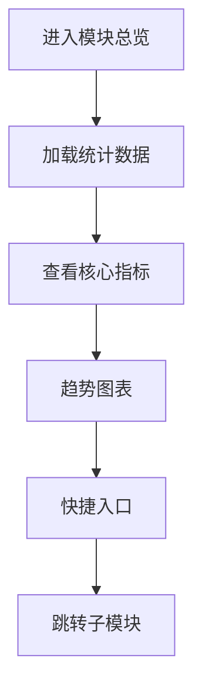

# 用户管理模块总览

## 1. 页面概述
### 功能描述
管理商城所有用户，包括用户列表、等级、标签、认证等。本页面负责用户管理模块总览的管理操作，支持数据的增删改查、搜索筛选和状态管理。

### 核心指标
| 指标 | 含义 | 业务价值 |
|------|------|----------|
| 数据总数 | 当前模块记录总数 | 衡量业务规模 |
| 今日新增 | 今日新创建记录数 | 衡量运营活跃度 |
| 启用数量 | 状态为启用的记录数 | 衡量有效数据量 |
| 待处理 | 需要审核或处理的记录数 | 及时处理提醒 |

### 使用场景
1. 日常管理：新增/编辑/删除数据
2. 数据查询：搜索筛选定位记录
3. 状态管理：启用/禁用/审核操作
4. 数据统计：查看业务数据趋势

---

## 2. API接口清单（基于真实控制器实现）
| 方法 | 路径 | 控制器方法 | 说明 | 权限标识 |
|------|------|-----------|------|----------|
| GET | /api/v1/admin/user/_index | UserController@index | 用户管理模块总览列表 | user:list |
| POST | /api/v1/admin/user/_index | UserController@store | 新增用户管理模块总览 | user:create |
| GET | /api/v1/admin/user/_index/{id} | UserController@show | 用户管理模块总览详情 | user:view |
| PUT | /api/v1/admin/user/_index/{id} | UserController@update | 编辑用户管理模块总览 | user:edit |
| DELETE | /api/v1/admin/user/_index/{id} | UserController@destroy | 删除用户管理模块总览 | user:delete |

### 请求参数
| 参数 | 类型 | 必填 | 说明 |
|------|------|------|------|
| page | int | 否 | 页码，默认1 |
| limit | int | 否 | 每页数量，默认20 |
| keyword | string | 否 | 搜索关键词 |
| status | int | 否 | 状态筛选 |
| start_date | date | 否 | 开始日期 |
| end_date | date | 否 | 结束日期 |

### 返回示例
```json
{
  "code": 0,
  "message": "success",
  "data": {
    "total": 100,
    "page": 1,
    "limit": 20,
    "list": [
      {"id": 1, "name": "示例数据", "status": 1, "created_at": "2026-09-01 10:00:00"}
    ]
  },
  "timestamp": 1756700000
}
```

### 错误码
| 错误码 | 说明 |
|--------|------|
| 10001 | 无权限操作 |
| 10002 | 数据不存在或已删除 |
| 10003 | 参数校验失败 |
| 10004 | 数据库操作失败 |
| 10005 | 数据已存在，不可重复创建 |

---

## 3. 字段映射表
| 展示字段 | 数据来源 | 计算方式 | 更新频率 |
|----------|----------|----------|----------|
| ID | user.id | 直接读取 | 实时 |
| 名称 | user.name | 直接读取 | 实时 |
| 状态 | user.status | 0禁用1启用 | 实时 |
| 创建时间 | user.created_at | 直接读取 | 实时 |

---

## 4. 操作流程
### 用户管理模块总览业务流程图


### 数据刷新机制
1. 页面加载时自动请求最新数据
2. 搜索筛选条件变化时立即刷新
3. 增删改操作成功后自动刷新列表
4. 统计数据缓存时间：5分钟

---

## 5. 权限控制
| 操作 | 权限标识 | 默认角色 |
|------|----------|----------|
| 查看列表 | user:list | 管理员 |
| 新增 | user:create | 管理员 |
| 编辑 | user:edit | 管理员 |
| 删除 | user:delete | 管理员 |

### 权限说明
- 权限通过Sanctum中间件校验，在路由组中统一配置
- 超级管理员拥有所有权限，不受权限点限制
- 无权限用户访问API返回403，前端隐藏对应操作按钮

---

## 6. 关联模块
### 依赖模块
| 模块 | 依赖内容 | 具体关联字段 |
|------|----------|-------------|
| 系统设置 | 用户注册配置 | system_configs.user_settings |

### 被依赖模块
| 模块 | 使用方式 | 具体关联字段 |
|------|----------|-------------|
| 订单管理 | 下单用户 | orders.user_id → users.id |
| 商家管理 | 商家关联用户 | merchants.user_id → users.id |
| 分销管理 | 分销商用户 | distributors.user_id → users.id |
| 营销管理 | 优惠券发放对象 | user_coupons.user_id → users.id |

---

## 7. 验收清单
### 功能验收
- [ ] 页面能正常加载，无白屏/500错误
- [ ] 列表分页正常，显示总数和页码
- [ ] 搜索功能正常，支持关键词模糊查询
- [ ] 筛选功能正常，支持状态和时间范围
- [ ] 新增功能完整，表单校验正确
- [ ] 编辑能正确回显所有字段
- [ ] 删除有确认弹窗，软删除不影响历史数据
- [ ] 状态切换功能正常
- [ ] 数据导出功能正常（如有）
- [ ] 批量操作功能正常（如有）

### 权限验收
- [ ] 有权限的管理员可以正常操作
- [ ] 无权限的管理员看到403或入口隐藏
- [ ] 超级管理员不受权限限制

### 性能验收
- [ ] 页面加载时间 < 2秒
- [ ] 数据查询耗时 < 500ms
- [ ] 列表分页响应 < 1秒
- [ ] 并发100用户无明显延迟

---

## 8. 常见问题
| 问题 | 原因 | 解决方案 |
|------|------|----------|
| 用户无法登录 | 密码错误或账号被禁用 | 检查users.status=1，密码使用bcrypt校验 |
| 用户等级不升级 | 成长值未达到或等级规则未配置 | 检查user_levels配置和users.growth_value |
| 用户余额异常 | 充值或消费记录不同步 | 检查user_balance_logs流水，确保余额=充值-消费+退款 |
| 用户实名认证失败 | 身份证信息错误或接口异常 | 检查user_auths记录和实名认证第三方接口 |
| 用户地址不显示 | 地址被删除或关联错误 | 检查user_addresses.user_id和is_deleted状态 |
| 用户标签无法添加 | 标签不存在或用户已关联 | 检查user_tags和user_tag_relations中间表 |
| 用户积分清零 | 积分过期规则生效 | 检查积分有效期配置和user_points_logs |
| 用户注册收不到短信 | 短信配置错误或频率限制 | 检查短信配置和发送频率限制 |
