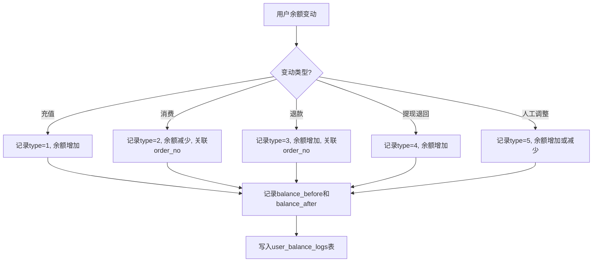

# 账户日志

## 1. 页面概述
账户日志记录用户余额变动的完整审计轨迹，支持按用户/类型/时间筛选、按类型汇总金额、日志导出CSV、关联订单号跳转。是用户财务管理的重要审计基础。

### 日志类型
| 值 | 类型 | 说明 |
|----|------|------|
| 1 | 充值 | 用户充值到账 |
| 2 | 消费 | 订单支付扣款 |
| 3 | 退款 | 售后退款到账 |
| 4 | 提现退回 | 提现审核拒绝退回 |
| 5 | 人工调整 | 管理员手动调整余额 |

### 使用场景
1. 财务对账：导出CSV用于财务对账
2. 异常排查：按用户/类型/时间筛选，定位异常变动
3. 审计追溯：变动前后余额完整记录，可追溯每笔变动
4. 订单关联：消费/退款日志可通过order_no跳转订单详情

## 2. API接口清单

### 管理端
| 方法 | 路径 | 控制器方法 | 说明 |
|------|------|-----------|------|
| GET | /api/v1/admin/user-center/account-logs | UserCenterController@accountLogs | 日志列表（分页+筛选+按类型统计） |
| GET | /api/v1/admin/user-center/account-logs/export | UserCenterController@accountLogsExport | 日志导出CSV（P1新增） |

## 3. 请求参数

### 日志列表
| 参数 | 类型 | 必填 | 说明 |
|------|------|------|------|
| page | int | 否 | 页码默认1 |
| limit | int | 否 | 每页数量默认20 |
| user_id | int | 否 | 按用户ID筛选 |
| type | int | 否 | 按类型筛选（1充值2消费3退款4提现退回5人工调整） |
| keyword | string | 否 | 关键词（用户昵称/订单号/备注） |
| start_time | string | 否 | 开始时间（P1新增，格式YYYY-MM-DD HH:mm:ss） |
| end_time | string | 否 | 结束时间（P1新增，格式YYYY-MM-DD HH:mm:ss） |

### 日志导出
| 参数 | 类型 | 必填 | 说明 |
|------|------|------|------|
| user_id | int | 否 | 按用户ID筛选 |
| type | int | 否 | 按类型筛选 |
| keyword | string | 否 | 关键词 |
| start_time | string | 否 | 开始时间 |
| end_time | string | 否 | 结束时间 |

## 4. 返回示例

### 日志列表
```json
{
  "code": 200,
  "data": {
    "list": [
      {"id":3,"user_id":2,"type":1,"amount":"55.00","balance_before":"0.00","balance_after":"55.00","order_no":null,"remark":"人工补单，充值单号ID:2...","created_at":"2026-09-02 03:09:07","nickname":"测试用户1","mobile":"133001330001"}
    ],
    "total": 3,
    "page": 1,
    "limit": 20,
    "stats": [
      {"type":1,"total_amount":"155.00","count":2},
      {"type":2,"total_amount":"50.00","count":1}
    ]
  }
}
```

### 日志导出
返回CSV文件下载，Content-Type: text/csv; charset=UTF-8，含BOM头确保Excel中文正常显示。

CSV列：ID,用户ID,用户昵称,手机号,类型,变动金额,变动前余额,变动后余额,订单号,备注,创建时间

## 5. 字段映射表

### user_balance_logs表（9字段）
| 字段 | 类型 | 说明 |
|------|------|------|
| id | bigint | 主键 |
| user_id | bigint | 用户ID |
| type | tinyint | 类型（1充值2消费3退款4提现退回5人工调整） |
| amount | decimal(12,2) | 变动金额（正数） |
| balance_before | decimal(12,2) | 变动前余额 |
| balance_after | decimal(12,2) | 变动后余额 |
| order_no | varchar(50) | 关联订单号（消费/退款时可跳转订单详情） |
| remark | varchar(255) | 备注 |
| created_at | timestamp | 创建时间 |

## 6. 操作流程

### 余额变动记录流程


### 日志导出流程


## 7. 权限控制
- 认证：Sanctum Token
- 中间件：auth:sanctum
- 管理端：登录管理员可查看和导出
- 日志为只读，不支持修改和删除（保证审计完整性）

## 8. 关联模块
| 模块 | 关联内容 | 字段 |
|------|----------|------|
| 用户管理 | 用户信息 | users.id → user_balance_logs.user_id |
| 订单管理 | 消费/退款关联订单 | user_balance_logs.order_no → orders.order_no |
| 充值记录 | 充值日志关联 | user_balance_logs.type=1 → user_recharges |
| 提现管理 | 提现退回日志 | user_balance_logs.type=4 → withdraws |

## 9. 验收清单
- [x] 日志列表正常加载（分页+筛选）
- [x] 按用户ID筛选正常
- [x] 按类型筛选正常（5种类型）
- [x] 关键词搜索正常（用户昵称/订单号/备注）
- [x] 时间范围筛选正常（start_time/end_time，P1新增）
- [x] 按类型汇总金额正常（stats字段）
- [x] 变动前后余额记录完整（balance_before/balance_after）
- [x] 日志导出CSV正常（streamDownload流式响应，P1新增）
- [x] 导出CSV含BOM头，Excel中文正常显示
- [x] 导出支持筛选条件（user_id/type/keyword/时间范围）
- [x] 关联订单号字段存在（order_no，可跳转订单详情）
- [x] 日志只读，不支持修改删除（保证审计完整性）

## 10. 常见问题
| 问题 | 原因 | 解决方案 |
|------|------|----------|
| 导出CSV下载为空 | 使用response()->download()在某些Nginx配置下输出为空 | 改用response()->streamDownload()流式响应 |
| Excel打开CSV中文乱码 | 缺少UTF-8 BOM头 | 在CSV文件开头写入chr(0xEF).chr(0xBB).chr(0xBF) |
| 时间范围筛选不生效 | 未在查询中添加where条件 | 确保start_time用>=，end_time用<=，字段为created_at |
| 导出数据量过大 | 未限制导出条数 | 限制最多导出10000条，避免内存溢出 |
| 变动前后余额不一致 | 未在同一事务中更新余额和记录日志 | 确保余额更新和日志写入在同一数据库事务中 |