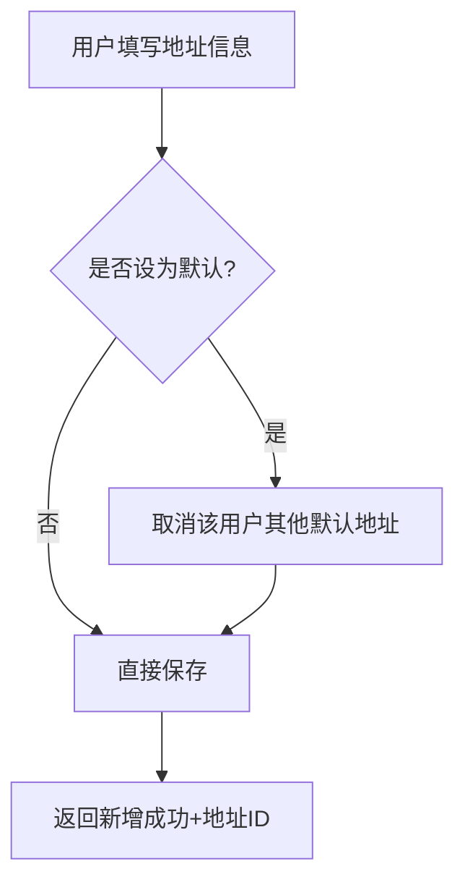
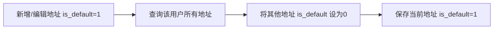

# 收货地址

## 1. 页面概述
收货地址管理用户配送地址，支持用户端增删改查、默认地址标记、地址标签（家/公司/学校/其他），管理端可查看所有用户地址。

### 核心功能
| 功能 | 说明 |
|------|------|
| 用户端CRUD | 新增/编辑/删除/查看地址 |
| 默认地址 | 每个用户只能有一个默认地址，新增默认时自动取消旧默认 |
| 地址标签 | 家/公司/学校/其他，便于用户快速选择 |
| 地区三级联动 | 省/市/区ID+名称冗余存储 |
| 管理端查看 | 分页+用户ID筛选+关键词搜索 |

### 使用场景
1. 订单结算：用户选择收货地址
2. 地址管理：用户维护多个收货地址
3. 后台查看：管理员查看用户地址信息

## 2. API接口清单

### 管理端
| 方法 | 路径 | 控制器方法 | 说明 |
|------|------|-----------|------|
| GET | /api/v1/admin/user-center/addresses | UserCenterController@addresses | 地址列表（分页+筛选） |

### 用户端
| 方法 | 路径 | 控制器方法 | 说明 |
|------|------|-----------|------|
| GET | /api/v1/user/addresses | AddressController@lists | 地址列表（默认地址优先） |
| POST | /api/v1/user/addresses | AddressController@add | 新增地址 |
| PUT | /api/v1/user/addresses/{id} | AddressController@edit | 编辑地址 |
| DELETE | /api/v1/user/addresses/{id} | AddressController@delete | 删除地址 |
| GET | /api/v1/user/addresses/{id} | AddressController@detail | 地址详情 |

## 3. 请求参数

### 管理端地址列表
| 参数 | 类型 | 必填 | 说明 |
|------|------|------|------|
| page | int | 否 | 页码默认1 |
| limit | int | 否 | 每页数量默认20 |
| user_id | int | 否 | 按用户ID筛选 |
| keyword | string | 否 | 关键词（收货人/手机号/详细地址） |

### 用户端新增/编辑地址
| 参数 | 类型 | 必填 | 说明 |
|------|------|------|------|
| name | string | 是 | 收货人姓名 |
| mobile | string | 是 | 收货人手机号 |
| province_id | bigint | 是 | 省份ID |
| province_name | string | 是 | 省份名称 |
| city_id | bigint | 是 | 城市ID |
| city_name | string | 是 | 城市名称 |
| district_id | bigint | 是 | 区县ID |
| district_name | string | 是 | 区县名称 |
| detail | string | 是 | 详细地址 |
| postal_code | string | 否 | 邮政编码 |
| is_default | tinyint | 否 | 是否默认地址（1是0否） |
| label | string | 否 | 地址标签（家/公司/学校/其他，P1新增） |

## 4. 返回示例

### 用户端地址列表
```json
{
  "code": 200,
  "data": [
    {"id":1,"user_id":2,"name":"张三","mobile":"13300133002","province_name":"广东省","city_name":"深圳市","district_name":"南山区","detail":"科技园路1号","is_default":1,"label":"家","created_at":"2026-09-01 12:00:00"}
  ]
}
```

### 新增地址成功
```json
{
  "code": 200,
  "message": "添加成功",
  "data": {"id": 3}
}
```

## 5. 字段映射表

### user_addresses表（15字段，P1新增label）
| 字段 | 类型 | 说明 |
|------|------|------|
| id | bigint | 主键 |
| user_id | bigint | 用户ID |
| name | varchar(50) | 收货人姓名 |
| mobile | varchar(20) | 收货人手机号 |
| province_id | bigint | 省份ID |
| city_id | bigint | 城市ID |
| district_id | bigint | 区县ID |
| province_name | varchar(50) | 省份名称（冗余） |
| city_name | varchar(50) | 城市名称（冗余） |
| district_name | varchar(50) | 区县名称（冗余） |
| detail | varchar(255) | 详细地址 |
| postal_code | varchar(10) | 邮政编码 |
| label | varchar(20) | 地址标签（家/公司/学校/其他，P1新增） |
| is_default | tinyint | 是否默认地址（1是0否） |
| created_at | timestamp | 创建时间 |
| updated_at | timestamp | 更新时间 |

## 6. 操作流程

### 地址新增流程


### 默认地址唯一性控制


## 7. 权限控制
- 管理端：Sanctum Token认证，登录管理员可查看
- 用户端：Sanctum Token认证，用户只能操作自己的地址
- 用户端所有操作均校验user_id与当前登录用户一致

## 8. 关联模块
| 模块 | 关联内容 | 字段 |
|------|----------|------|
| 用户管理 | 用户信息 | users.id → user_addresses.user_id |
| 订单管理 | 订单收货地址快照 | orders.receiver_name/mobile/address |

## 9. 验收清单
- [x] 管理端地址列表正常加载（分页+筛选）
- [x] 用户端地址列表正常（默认地址优先排序）
- [x] 用户端新增地址正常
- [x] 用户端编辑地址正常
- [x] 用户端删除地址正常
- [x] 用户端地址详情正常
- [x] 默认地址唯一性控制（新增默认时自动取消旧默认）
- [x] 地区三级联动字段完整（省/市/区ID+名称）
- [x] 地址标签功能正常（label字段，P1新增）
- [x] 用户端只能操作自己的地址（user_id校验）

## 10. 常见问题
| 问题 | 原因 | 解决方案 |
|------|------|----------|
| 默认地址不唯一 | 新增/编辑时未取消旧默认 | 确保is_default=1时先将该用户其他地址设为0 |
| 用户能操作他人地址 | 未校验user_id | 确保所有用户端操作都加where('user_id', $request->user()->id) |
| 地址标签不显示 | 前端未读取label字段 | 确保前端渲染时包含label字段展示 |
| 编辑地址时label丢失 | edit方法未包含label参数 | 确保$request->only()中包含'label' |