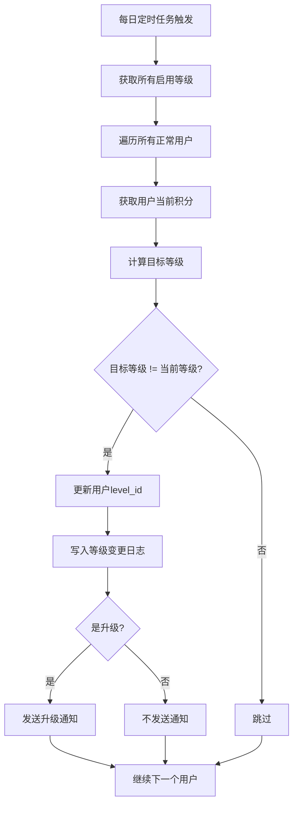

# 用户等级

## 1. 页面概述
用户等级体系是商城会员运营核心模块，通过积分驱动用户等级自动升降级，不同等级享受不同折扣和权益。

### 核心指标
| 指标 | 含义 |
|------|------|
| 等级总数 | 已配置的会员等级数量 |
| 各等级用户数 | 每个等级下的用户分布 |
| 今日升级人数 | 今日自动升级的用户数 |

### 使用场景
1. 等级配置：管理员新增/编辑/删除会员等级
2. 自动升降级：系统每日根据用户积分自动调整等级
3. 用户端展示：用户查看当前等级、升级进度和权益
4. 升级通知：用户升级时收到站内信通知

## 2. API接口清单

### 管理端
| 方法 | 路径 | 控制器方法 | 说明 |
|------|------|-----------|------|
| GET | /api/v1/admin/user-center/levels | UserCenterController@levels | 等级列表（含用户数统计） |
| POST | /api/v1/admin/user-center/levels | UserCenterController@levelStore | 新增等级 |
| PUT | /api/v1/admin/user-center/levels/{id} | UserCenterController@levelUpdate | 编辑等级 |
| DELETE | /api/v1/admin/user-center/levels/{id} | UserCenterController@levelDestroy | 删除等级（有用户时禁止） |

### 用户端
| 方法 | 路径 | 控制器方法 | 说明 |
|------|------|-----------|------|
| GET | /api/v1/user/levels | LevelController@index | 等级列表 |
| GET | /api/v1/user/level-progress | LevelController@progress | 升级进度（当前等级/下一级/进度百分比/还需积分/等级日志） |
| GET | /api/v1/user/notifications | LevelController@notifications | 通知列表（含未读数） |
| PUT | /api/v1/user/notifications/{id}/read | LevelController@readNotification | 标记单条已读 |
| POST | /api/v1/user/notifications/read-all | LevelController@readAllNotifications | 全部标记已读 |

### Artisan命令
| 命令 | 说明 |
|------|------|
| php8.2 artisan user:evaluate-levels | 评估所有用户等级，自动升降级，记录日志并发送升级通知 |

## 3. 请求参数

### 新增/编辑等级
| 参数 | 类型 | 必填 | 说明 |
|------|------|------|------|
| name | string | 是 | 等级名称 |
| level | int | 否 | 等级层级（0最低） |
| discount | decimal | 否 | 折扣比例（100=不打折） |
| upgrade_points | int | 否 | 升级所需积分门槛 |
| benefits | string | 否 | 权益JSON |
| is_default | int | 否 | 是否默认等级 |
| status | int | 否 | 状态（1启用0禁用） |

### 通知列表
| 参数 | 类型 | 必填 | 说明 |
|------|------|------|------|
| page | int | 否 | 页码默认1 |
| limit | int | 否 | 每页数量默认20 |
| type | string | 否 | 通知类型筛选 |
| is_read | int | 否 | 已读状态筛选 |

## 4. 返回示例

### 升级进度
```json
{
  "code": 200,
  "data": {
    "current_level": {"id":2,"name":"银卡会员","level":1,"discount":"95.00","upgrade_points":1000},
    "next_level": {"id":3,"name":"金卡会员","level":2,"discount":"90.00","upgrade_points":5000},
    "current_points": 2000,
    "progress_percent": 25,
    "points_needed": 3000,
    "level_logs": [{"id":1,"old_level_id":1,"new_level_id":2,"reason":"auto_upgrade","remark":"积分2000，自动从普通会员变更为银卡会员"}]
  }
}
```

## 5. 字段映射表

### user_levels表（11字段）
| 字段 | 类型 | 说明 |
|------|------|------|
| id | int | 主键 |
| name | varchar(100) | 等级名称 |
| level | int | 等级层级 |
| discount | decimal(5,2) | 折扣比例 |
| benefits | text | 权益JSON |
| upgrade_points | int | 升级积分门槛 |
| is_default | tinyint | 是否默认 |
| points | int | 等级积分（预留） |
| status | tinyint | 状态 |
| created_at | timestamp | 创建时间 |
| updated_at | timestamp | 更新时间 |

### user_level_logs表（10字段）
| 字段 | 类型 | 说明 |
|------|------|------|
| id | bigint | 主键 |
| user_id | bigint | 用户ID |
| old_level_id | int | 旧等级ID |
| new_level_id | int | 新等级ID |
| reason | varchar(50) | 变动原因（auto_upgrade/auto_downgrade/manual） |
| points_before | int | 变动前积分 |
| points_after | int | 变动后积分 |
| remark | varchar(255) | 备注 |
| created_at | timestamp | 创建时间 |
| updated_at | timestamp | 更新时间 |

### user_notifications表（11字段）
| 字段 | 类型 | 说明 |
|------|------|------|
| id | bigint | 主键 |
| user_id | bigint | 用户ID |
| title | varchar(200) | 通知标题 |
| content | text | 通知内容 |
| type | varchar(50) | 通知类型 |
| is_read | tinyint | 是否已读 |
| read_at | timestamp | 阅读时间 |
| created_at | timestamp | 创建时间 |
| updated_at | timestamp | 更新时间 |

## 6. 操作流程

### 自动升降级流程


## 7. 权限控制
- 认证：Sanctum Token
- 中间件：auth:sanctum
- 管理端：登录管理员可操作
- 用户端：只能查看自己的等级和通知

## 8. 关联模块
| 模块 | 关联内容 | 字段 |
|------|----------|------|
| 用户管理 | 用户积分和等级 | users.points, users.level_id |
| 用户积分 | 积分变动触发等级重评估 | user_point_logs |
| 订单管理 | 订单完成赠送积分 | orders.status |

## 9. 验收清单
- [x] 管理端等级列表正常（含用户数统计）
- [x] 新增/编辑/删除等级正常
- [x] 删除保护（有用户时禁止删除）
- [x] 自动升降级命令正常执行
- [x] 积分达标自动升级（已验证：用户2积分2000→银卡）
- [x] 等级变更日志正常记录
- [x] 升级通知正常发送
- [x] 用户端等级列表正常
- [x] 用户端升级进度正常（进度百分比/还需积分/等级日志）
- [x] 用户端通知列表正常（含未读数）
- [x] 标记已读/全部已读正常

## 10. 常见问题
| 问题 | 原因 | 解决方案 |
|------|------|----------|
| 积分达标但未升级 | 定时任务未执行 | 配置每日定时任务执行user:evaluate-levels |
| 删除等级提示有用户 | 等级下有关联用户 | 先迁移用户或禁用该等级 |
| 最高等级没有下一级 | 已是最高 | progress_percent=100，前端显示"已是最高等级" |
| 等级折扣不生效 | 结算未读取等级折扣 | 检查订单结算逻辑是否关联user_levels.discount |