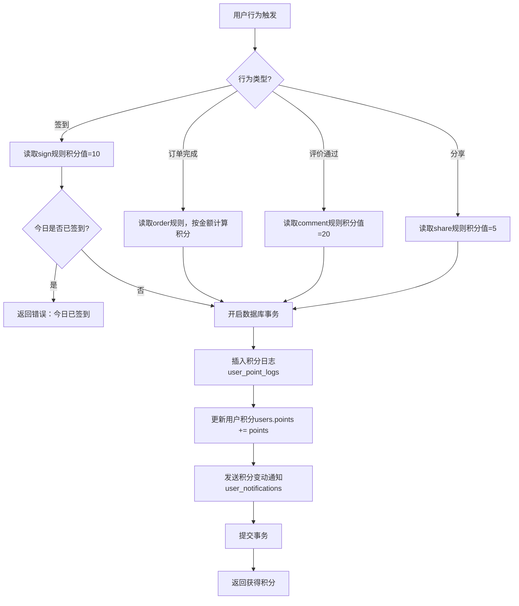

# 用户积分

## 1. 页面概述
用户积分管理用户积分体系，支持积分日志查看、手动调整积分、积分规则配置、自动发放机制（签到/订单/评价/分享）、积分变动通知、积分兑换比例配置。

### 积分规则（point_rules表）
| 类型 | 名称 | 积分值 | 说明 |
|------|------|--------|------|
| sign | 每日签到 | 10分 | 每日签到获得10积分 |
| order | 订单消费 | 1分/元 | 每消费1元获得1积分 |
| comment | 商品评价 | 20分 | 评价商品获得20积分 |
| share | 分享商品 | 5分 | 分享商品获得5积分 |

### 使用场景
1. 积分查询：管理员查看用户积分变动日志
2. 手动调整：管理员手动调整用户积分
3. 自动发放：用户签到/订单完成/评价/分享自动获得积分
4. 规则配置：配置各行为的积分值
5. 兑换比例：配置积分兑换现金的比例

## 2. API接口清单

### 管理端
| 方法 | 路径 | 控制器方法 | 说明 |
|------|------|-----------|------|
| GET | /api/v1/admin/user-points | PointLogController@index | 积分日志列表（分页+筛选+3项统计+规则列表） |
| POST | /api/v1/admin/user-points | PointLogController@store | 手动调整积分（同步更新用户积分） |
| GET | /api/v1/admin/user-points/rules | PointLogController@rules | 积分规则列表 |
| GET | /api/v1/admin/user-points/config | PointLogController@config | 读取积分兑换比例配置（P1新增） |
| PUT | /api/v1/admin/user-points/config | PointLogController@config | 更新积分兑换比例配置（P1新增） |

### 用户端
| 方法 | 路径 | 控制器方法 | 说明 |
|------|------|-----------|------|
| POST | /api/v1/user/points/sign | UserPointController@sign | 每日签到（自动发放10积分，P0新增） |
| POST | /api/v1/user/points/share | UserPointController@share | 分享商品（自动发放5积分，P0新增） |
| GET | /api/v1/user/points/my | UserPointController@myPoints | 我的积分（当前积分+今日签到状态+最近20条日志，P0新增） |

## 3. 请求参数

### 积分日志列表
| 参数 | 类型 | 必填 | 说明 |
|------|------|------|------|
| page | int | 否 | 页码默认1 |
| limit | int | 否 | 每页数量默认20 |
| user_id | int | 否 | 按用户ID筛选 |
| type | string | 否 | 按类型筛选（sign/order/comment/share/manual） |
| keyword | string | 否 | 关键词（用户昵称/描述） |

### 手动调整积分
| 参数 | 类型 | 必填 | 说明 |
|------|------|------|------|
| user_id | int | 是 | 用户ID |
| points | int | 是 | 积分数值（正数增加，负数减少） |
| type | string | 是 | 类型（manual） |
| description | string | 否 | 描述 |

### 签到/分享
| 参数 | 类型 | 必填 | 说明 |
|------|------|------|------|
| product_id | int | 否 | 分享的商品ID（仅分享接口） |

### 更新兑换比例
| 参数 | 类型 | 必填 | 说明 |
|------|------|------|------|
| points_to_money_ratio | int | 是 | 多少积分=1元（默认100） |

## 4. 返回示例

### 签到成功
```json
{"code":200,"message":"获得10积分","data":{"points":10,"total_points":2010}}
```

### 重复签到
```json
{"code":400,"message":"今日已签到","data":null}
```

### 我的积分
```json
{"code":200,"data":{"points":2015,"today_signed":true,"logs":[{"id":4,"points":5,"type":"share","description":"分享商品","created_at":"2026-09-02 03:29:17"}]}}
```

### 兑换比例配置
```json
{"code":200,"data":{"points_to_money_ratio":"100"}}
```

## 5. 字段映射表

### user_point_logs表（7字段）
| 字段 | 类型 | 说明 |
|------|------|------|
| id | int | 主键 |
| user_id | int | 用户ID |
| points | int | 变动积分数值 |
| type | varchar(50) | 类型（sign/order/comment/share/manual） |
| description | varchar(255) | 描述 |
| created_at | timestamp | 创建时间 |

### point_rules表（8字段）
| 字段 | 类型 | 说明 |
|------|------|------|
| id | int | 主键 |
| name | varchar(100) | 规则名称 |
| type | varchar(50) | 类型（唯一，sign/order/comment/share） |
| points | int | 积分值 |
| description | varchar(255) | 描述 |
| status | tinyint | 状态（1启用0禁用） |
| created_at | timestamp | 创建时间 |
| updated_at | timestamp | 更新时间 |

### users表积分字段
| 字段 | 类型 | 说明 |
|------|------|------|
| points | int | 用户当前积分总数 |

### 兑换比例配置（system_configs表，group=points）
| key | 说明 | 默认值 |
|-----|------|--------|
| points_to_money_ratio | 多少积分=1元 | 100 |

## 6. 操作流程

### 积分自动发放流程


### 签到防重复机制
- 每日只能签到一次
- 通过查询user_point_logs表中当日type=sign的记录判断
- 重复签到返回错误："今日已签到"

## 7. 权限控制
- 管理端：Sanctum Token认证，登录管理员可查看和调整积分
- 用户端：Sanctum Token认证，用户只能操作自己的积分
- 签到接口有防重复机制（每日一次）
- 积分变动通过数据库事务保证一致性

## 8. 关联模块
| 模块 | 关联内容 | 字段 |
|------|----------|------|
| 用户管理 | 用户积分 | users.points |
| 用户通知 | 积分变动通知 | user_notifications |
| 订单管理 | 订单消费积分 | orders → user_point_logs.type=order |
| 商品评价 | 评价积分 | comments → user_point_logs.type=comment |

## 9. 验收清单
- [x] 积分日志列表正常加载（分页+筛选+3项统计）
- [x] 手动调整积分正常（同步更新用户积分）
- [x] 积分规则列表正常（4条预设规则）
- [x] 用户签到接口正常（自动发放10积分，P0新增）
- [x] 签到防重复机制正常（今日已签到报错，P0新增）
- [x] 用户分享接口正常（自动发放5积分，P0新增）
- [x] 我的积分接口正常（当前积分+今日签到状态+最近20条日志，P0新增）
- [x] 积分变动通知正常（签到/分享后发送站内信，P1新增）
- [x] 兑换比例配置读取正常（points_to_money_ratio，P1新增）
- [x] 兑换比例配置更新正常（P1新增）
- [x] 数据库事务保证积分变动一致性
- [x] PointService服务类统一管理积分发放逻辑

## 10. 常见问题
| 问题 | 原因 | 解决方案 |
|------|------|----------|
| 签到后积分未增加 | 数据库事务回滚 | 检查user_point_logs和users表更新是否在同一事务中 |
| 重复签到成功 | 未查询当日签到记录 | 确保签到前查询user_point_logs表中当日type=sign的记录 |
| 积分变动通知未发送 | 未在事务中插入通知 | 确保PointService.grantPoints中包含通知插入逻辑 |
| 兑换比例配置不生效 | 业务逻辑未读取配置 | 确保积分兑换时读取system_configs表中的points_to_money_ratio |
| 订单完成未发放积分 | 订单确认接口未调用PointService | 在订单确认接口中调用PointService::grantPoints($userId, 'order', $orderId, $points) |
| 积分过期未实现 | 当前积分无过期概念 | 待实现：创建user_point_batches表记录每笔积分的过期时间，定时任务清理过期积分 |