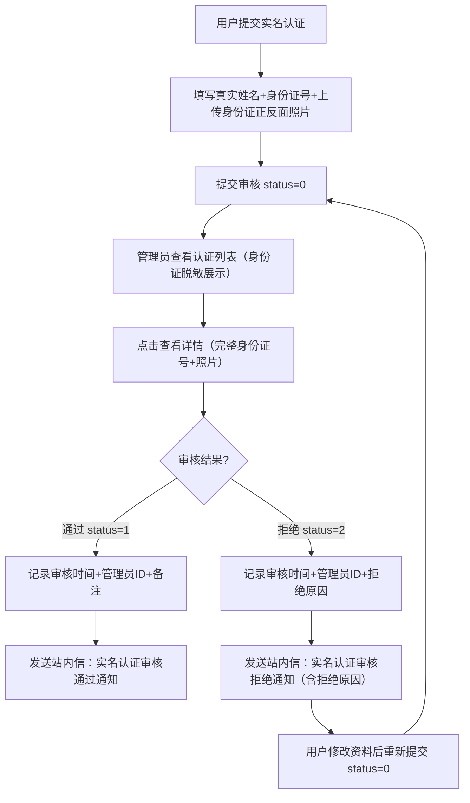

# 实名认证

## 1. 页面概述
实名认证管理用户身份信息审核，支持认证列表（含3项统计+身份证脱敏）、认证详情（含身份证照片）、审核通过/拒绝、审核后站内信通知、用户重新提交机制。

### 状态机
| 值 | 状态 | 说明 |
|----|------|------|
| 0 | 待审核 | 用户提交认证申请，等待管理员审核 |
| 1 | 审核通过 | 认证通过，用户可使用需要实名的功能 |
| 2 | 审核拒绝 | 认证拒绝，用户可修改资料后重新提交 |

### 使用场景
1. 身份核验：管理员审核用户提交的身份证信息和照片
2. 隐私保护：列表展示身份证号脱敏，详情页展示完整信息
3. 结果通知：审核通过/拒绝后自动发送站内信通知用户
4. 重新提交：审核拒绝后用户可修改资料重新提交

## 2. API接口清单

### 管理端
| 方法 | 路径 | 控制器方法 | 说明 |
|------|------|-----------|------|
| GET | /api/v1/admin/user-auth | UserAuthController@index | 认证列表（分页+筛选+3项统计+身份证脱敏） |
| GET | /api/v1/admin/user-auth/{id} | UserAuthController@show | 认证详情（含用户信息+实名信息+身份证照片） |
| POST | /api/v1/admin/user-auth/{id}/audit | UserAuthController@audit | 审核认证（1通过/2拒绝，审核后自动发送站内信通知） |

## 3. 请求参数

### 认证列表
| 参数 | 类型 | 必填 | 说明 |
|------|------|------|------|
| page | int | 否 | 页码默认1 |
| limit | int | 否 | 每页数量默认20 |
| status | int | 否 | 状态筛选（0待审核1通过2拒绝） |
| keyword | string | 否 | 关键词（真实姓名/身份证号/用户昵称/手机号） |

### 审核认证
| 参数 | 类型 | 必填 | 说明 |
|------|------|------|------|
| status | int | 是 | 审核结果（1通过/2拒绝） |
| audit_remark | string | 否 | 审核备注（拒绝时建议填写原因） |

## 4. 返回示例

### 认证列表（含身份证脱敏）
```json
{
  "code": 200,
  "data": {
    "list": [
      {"id":1,"user_id":2,"real_name":"张三","id_card":"110101199001011234","id_card_masked":"110***********1234","status":0,"audit_remark":null,"audit_at":null,"admin_id":null,"nickname":"测试用户1","mobile":"133001330001","created_at":"2026-09-01 12:00:00"}
    ],
    "total": 1,
    "page": 1,
    "limit": 20,
    "stats": {"pending":1,"approved":0,"rejected":0}
  }
}
```

### 审核通过
```json
{"code":200,"message":"审核通过","data":null}
```

### 审核拒绝
```json
{"code":200,"message":"审核拒绝","data":null}
```

## 5. 字段映射表

### user_real_names表（12字段）
| 字段 | 类型 | 说明 |
|------|------|------|
| id | bigint | 主键 |
| user_id | bigint | 用户ID（唯一，一个用户只能有一条认证记录） |
| real_name | varchar(50) | 真实姓名 |
| id_card | varchar(30) | 身份证号（完整，仅详情页展示） |
| id_card_front | varchar(255) | 身份证正面照片URL |
| id_card_back | varchar(255) | 身份证背面照片URL |
| status | tinyint | 状态（0待审核1通过2拒绝） |
| audit_remark | varchar(255) | 审核备注 |
| audit_at | timestamp | 审核时间 |
| admin_id | bigint | 审核管理员ID |
| created_at | timestamp | 创建时间 |
| updated_at | timestamp | 更新时间 |

### 身份证脱敏规则（P1新增）
- 字段名：`id_card_masked`（列表接口返回，详情接口不返回）
- 规则：前3位 + `*`（身份证长度-7个） + 后4位
- 示例：`110101199001011234` → `110***********1234`
- 目的：保护用户隐私，列表页不展示完整身份证号

## 6. 操作流程

### 实名认证审核流程


### 审核通知内容（P1新增）
| 审核结果 | 通知标题 | 通知内容 |
|----------|----------|----------|
| 通过 | 实名认证审核通过通知 | 恭喜您！您的实名认证申请已审核通过，您现在可以使用需要实名认证的功能。 |
| 拒绝 | 实名认证审核拒绝通知 | 很抱歉，您的实名认证申请未通过审核。拒绝原因：{audit_remark}。请修改资料后重新提交。 |

## 7. 权限控制
- 认证：Sanctum Token
- 中间件：auth:sanctum
- 管理端：登录管理员可查看和审核
- 列表接口返回身份证脱敏字段（id_card_masked），保护用户隐私
- 详情接口返回完整身份证号（仅授权管理员可查看）

## 8. 关联模块
| 模块 | 关联内容 | 字段 |
|------|----------|------|
| 用户管理 | 用户信息 | users.id → user_real_names.user_id |
| 用户通知 | 审核结果通知 | user_notifications.user_id → users.id |
| 订单管理 | 实名用户可购买特殊商品 | orders.user_id → users.id |

## 9. 验收清单
- [x] 认证列表正常加载（分页+筛选+3项统计）
- [x] 按状态筛选正常（0待审核1通过2拒绝）
- [x] 关键词搜索正常（真实姓名/身份证号/用户昵称/手机号）
- [x] 认证详情正常（含用户信息+实名信息+身份证照片）
- [x] 审核通过正常（status 0→1，记录审核时间+管理员ID）
- [x] 审核拒绝正常（status 0→2，记录审核时间+管理员ID+拒绝原因）
- [x] 重复审核防护（已审核记录报错提示）
- [x] 身份证脱敏正常（列表返回id_card_masked字段，前3位+*+后4位，P1新增）
- [x] 审核通过通知正常（发送站内信，P1新增）
- [x] 审核拒绝通知正常（发送站内信，含拒绝原因，P1新增）
- [x] 用户重新提交机制正常（拒绝后可修改资料重新提交）
- [x] 一个用户只能有一条认证记录（user_id唯一约束）

## 10. 常见问题
| 问题 | 原因 | 解决方案 |
|------|------|----------|
| 列表页身份证号完整展示 | 未使用id_card_masked字段 | 前端列表页使用id_card_masked字段展示，详情页使用id_card |
| 审核后用户未收到通知 | 未在audit方法中插入user_notifications | 确保审核完成后根据status插入对应通知内容 |
| 拒绝通知缺少拒绝原因 | audit_remark为空 | 审核拒绝时建议必填audit_remark，通知内容中包含拒绝原因 |
| 用户无法重新提交 | status未重置为0 | 用户重新提交时更新status=0，清除audit_remark/audit_at/admin_id |
| 身份证脱敏长度不对 | 未根据身份证长度动态计算*数量 | 使用str_repeat('*', strlen($idCard) - 7)动态计算 |