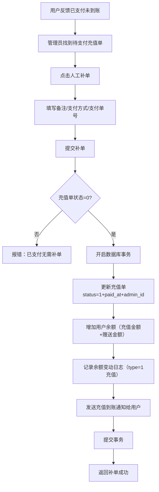

# 充值记录

## 1. 页面概述
充值记录管理用户充值订单，支持列表查看、统计、人工补单。当用户反馈"已支付未到账"时，管理员可手动确认充值到账。

### 核心指标
| 指标 | 含义 |
|------|------|
| 充值总金额 | 已支付充值单金额总和 |
| 充值总笔数 | 已支付充值单数量 |
| 待处理笔数 | 待支付状态充值单数量 |

### 使用场景
1. 日常查看：管理员查看用户充值记录和统计
2. 人工补单：用户反馈支付成功但余额未到账时，管理员手动确认
3. 异常排查：查看待支付订单，排查支付回调问题

## 2. API接口清单

### 管理端
| 方法 | 路径 | 控制器方法 | 说明 |
|------|------|-----------|------|
| GET | /api/v1/admin/user-center/recharges | UserCenterController@recharges | 充值列表（分页+筛选+3项统计） |
| POST | /api/v1/admin/user-center/recharges/{id}/confirm | UserCenterController@rechargeConfirm | 人工补单（确认充值到账） |

## 3. 请求参数

### 充值列表
| 参数 | 类型 | 必填 | 说明 |
|------|------|------|------|
| page | int | 否 | 页码默认1 |
| limit | int | 否 | 每页数量默认20 |
| status | int | 否 | 状态筛选（0待支付1已支付） |
| keyword | string | 否 | 关键词（用户昵称/手机号/支付单号） |

### 人工补单
| 参数 | 类型 | 必填 | 说明 |
|------|------|------|------|
| remark | string | 否 | 补单备注（最多255字） |
| pay_type | string | 否 | 支付方式（wechat/alipay等） |
| pay_no | string | 否 | 第三方支付单号 |

## 4. 返回示例

### 充值列表
```json
{
  "code": 200,
  "data": {
    "list": [
      {"id":1,"user_id":2,"amount":"100.00","give_amount":"10.00","status":1,"pay_type":null,"pay_no":null,"paid_at":null,"admin_id":null,"remark":null,"nickname":"测试用户1","mobile":"133001330001","created_at":"2026-09-01 11:58:57"}
    ],
    "total": 1,
    "page": 1,
    "limit": 20,
    "stats": {"total_amount":"100.00","total_count":1,"pending_count":0}
  }
}
```

### 人工补单
```json
{
  "code": 200,
  "message": "补单成功，用户余额已增加55元",
  "data": {"id": "2", "total_amount": 55}
}
```

## 5. 字段映射表

### user_recharges表（12字段）
| 字段 | 类型 | 说明 |
|------|------|------|
| id | bigint | 主键 |
| user_id | bigint | 用户ID |
| amount | decimal(12,2) | 充值金额 |
| give_amount | decimal(12,2) | 赠送金额 |
| pay_type | varchar(50) | 支付方式 |
| pay_no | varchar(100) | 第三方支付单号 |
| status | tinyint | 状态（0待支付1已支付） |
| paid_at | timestamp | 支付时间 |
| admin_id | bigint | 操作管理员ID（人工补单时记录） |
| remark | varchar(255) | 备注 |
| created_at | timestamp | 创建时间 |
| updated_at | timestamp | 更新时间 |

## 6. 操作流程

### 人工补单流程


## 7. 权限控制
- 认证：Sanctum Token
- 中间件：auth:sanctum
- 管理端：登录管理员可操作
- 人工补单记录admin_id，可追溯操作人

## 8. 关联模块
| 模块 | 关联内容 | 字段 |
|------|----------|------|
| 用户管理 | 用户余额 | users.balance |
| 账户日志 | 余额变动记录 | user_balance_logs |
| 用户通知 | 充值到账通知 | user_notifications |

## 9. 验收清单
- [x] 充值列表正常加载（分页+筛选+3项统计）
- [x] 状态筛选正常（0待支付1已支付）
- [x] 关键词搜索正常（用户昵称/手机号/支付单号）
- [x] 人工补单正常（更新充值单状态+增加用户余额+记录余额日志+发送通知）
- [x] 补单金额=充值金额+赠送金额
- [x] 补单记录admin_id（操作人可追溯）
- [x] 重复补单防护（已支付订单报错提示）
- [x] 数据库事务保证数据一致性
- [x] 补单后发送充值到账通知给用户

## 10. 常见问题
| 问题 | 原因 | 解决方案 |
|------|------|----------|
| 补单后余额未增加 | 数据库事务回滚 | 查看错误日志，排查字段名或约束问题 |
| 重复补单成功 | 缺少状态校验 | 确保补单前校验status=0 |
| 用户未收到通知 | 通知表写入失败 | 检查user_notifications表结构 |
| 补单金额不对 | 未计算赠送金额 | 确保totalAmount=amount+give_amount |
| 余额日志balance_before/after错误 | 未先查询变动前余额 | 确保先查balanceBefore，再increment，再计算balanceAfter |